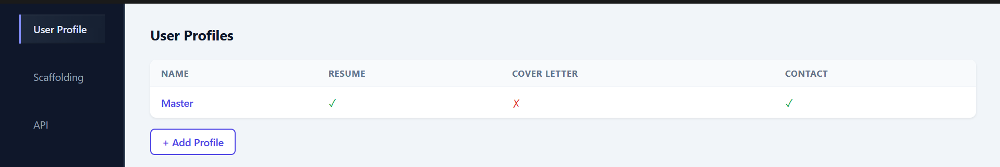
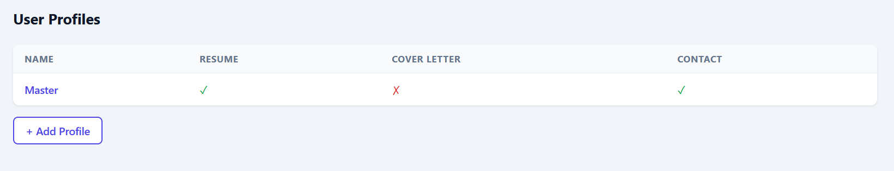
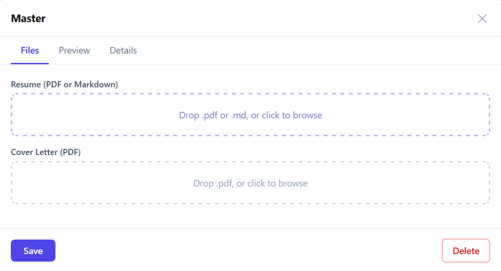
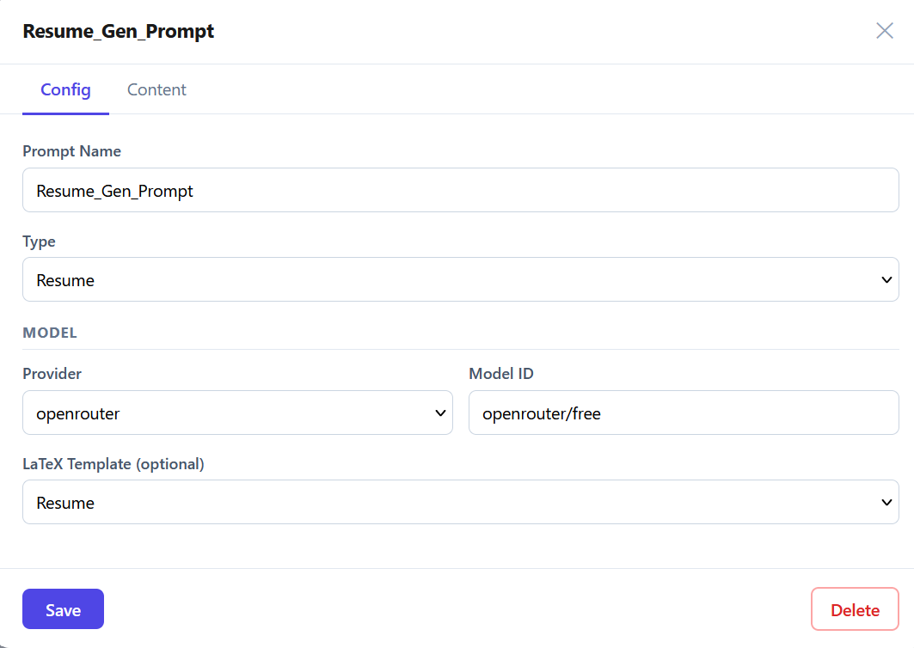
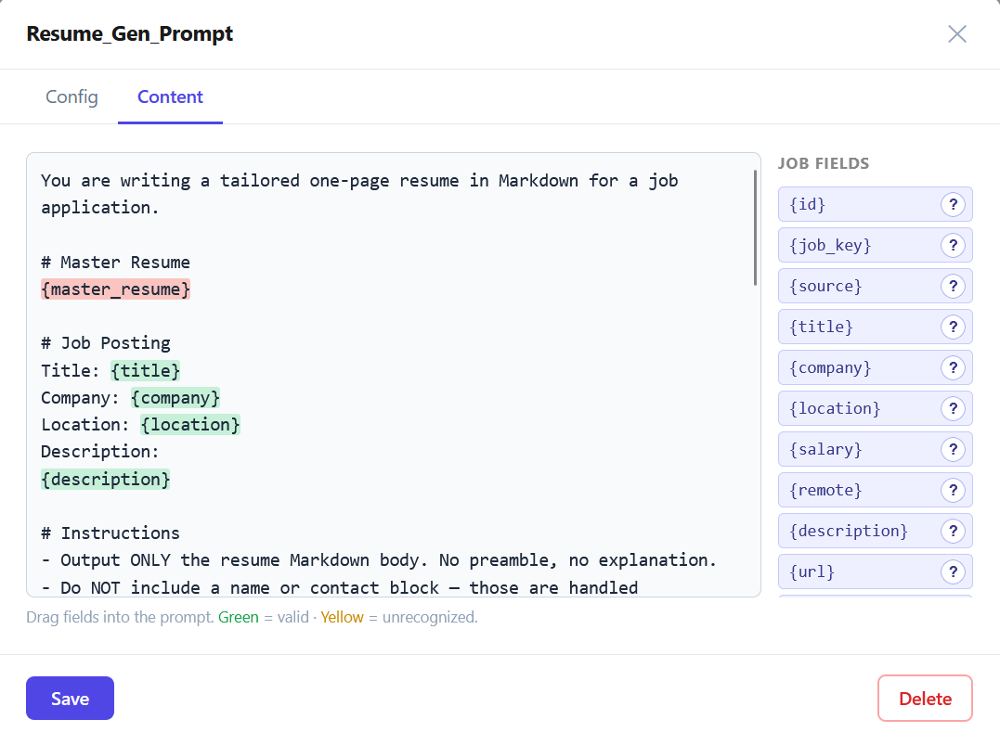

# Config
The config page is for setting up any information not pertaining to individual jobs. It is required to set up most fields before use of the product.

## User Profile
The User Profile Tab allows you to set up 1+ user profiles. The page indicates whether a profile has uploaded a amster resume, cover letter, and filled in their contact information with either a green checkmark or a red x.

Clicking a profile will open an edit modal to (re)upload files or edit parsed details.

## Scaffolding
Scaffolding holds 3 distinct items.
### Prompts
Create, edit, iterate prompts fed to a configured LLM provider. 
Name your prompt and select what kind of task it servers - resume generation, cover letter gen, etc...
Select one of your configured LLM providers and the model this prompt will use. 
All prompts return markdown, if you want it to be capable of converting to pdf you must attach a custom .tex file.

Edit your prompt to get your desired result. Context is king!
On the right hand side you will see all data fields available to you to inject into your prompt. Use these to insert user profile specific or job specific attributes into your prompt. These will have a large impact on the output. To insert an attribute simply drag and drop it into the text field on the left. 

### Latex Templates
Latex templates are used to convert markdown files into pdfs. 
Tutorial soon.

### LLM Providers
Connect any OpenAI compatible LLM provider along with an API key here.