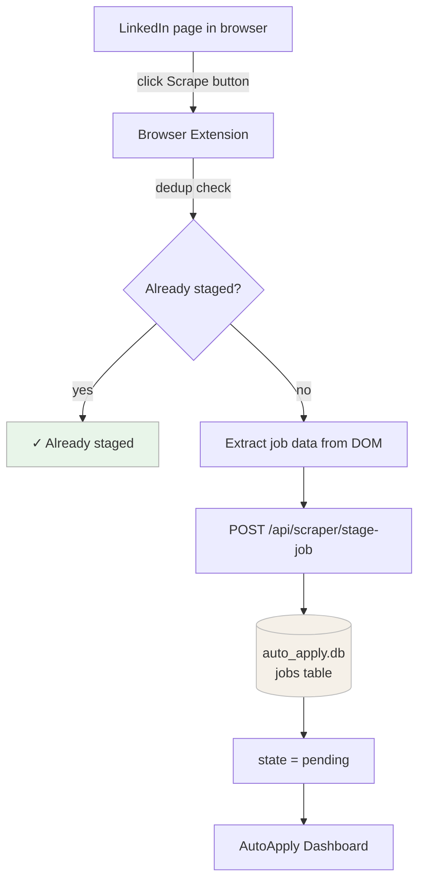

# LinkedIn Scrape to Dashboard

## Flow



---

## Artifacts

| Artifact | Location | Notes |
|---|---|---|
| Job record | `auto_apply.db` → `jobs` table | Created on scrape, updated through all subsequent stages |
| Dedup history | Chrome extension storage (`chrome.storage.local`) | Browser-side only, keyed by `job_key`. Cleared via the extension popup. |
| No files written | — | Scraping produces no files on disk. Files are only created during the Generate step. |

---

## Steps

### 1. LinkedIn page

The extension runs on two LinkedIn page types:

- **Search results** — `linkedin.com/jobs/search/*` — injects a Scrape button onto each job card in the left panel
- **Single job view** — `linkedin.com/jobs/view/*` — injects a fixed Scrape button in the top-right corner once the description loads

### 2. Browser extension

When you click Scrape, the content script:

1. Extracts job data from the page DOM: `title`, `company`, `location`, `url`, and `job_key` (e.g. `linkedin_4385093195`, derived from the LinkedIn job ID in the URL)
2. For search results, programmatically clicks the job card and waits up to 10 seconds for the description panel to load before extracting `description`
3. For view pages, the description is already on the page and is read immediately
4. Sends the data to the background service worker via `chrome.runtime.sendMessage`

### 3. Dedup check

Before hitting the server, the background service worker checks `chrome.storage.local` for the `job_key`. If it has been staged before in this browser, the button shows **✓ Already staged** and no request is made.

This is a browser-side cache. The server also performs its own dedup against the database (by `job_key` and `url` uniqueness constraints), so duplicates are caught even if the browser cache is cleared.

### 4. POST /api/scraper/stage-job

The background worker POSTs the payload to the AutoApply server:

```
POST http://localhost:8080/api/scraper/stage-job
```

Fields sent: `source`, `job_key`, `title`, `company`, `url`, `description`, `location`, `salary`, `remote`, `posted_at`, `scraped_at`.

The endpoint is defined in `web/routers/scraper.py`.

### 5. Database write

The server calls `save_jobs()` from `scraper/runner.py`, which inserts a row into the `jobs` table in `auto_apply.db`.

**Columns populated at scrape time:**

| Column | Value |
|---|---|
| `job_key` | e.g. `linkedin_4385093195` |
| `source` | `linkedin` |
| `title` | From DOM |
| `company` | From DOM |
| `location` | From DOM |
| `url` | Canonical URL (query string stripped) |
| `description` | Full job description text |
| `remote` | `true` if "remote" appears in location |
| `state` | `pending` |
| `scraped_at` | Timestamp from the extension |

**Columns populated later:**

| Column | Populated by |
|---|---|
| `desirability_score`, `fit_score`, `final_score`, `score_justification` | Score step |
| `resume_path`, `cover_path` | Generate step |
| `applied_at` | Apply step |
| `state` | Updated at each stage (`pending` → `approved` → `generated` → `applied`) |

If the `job_key` or `url` already exists in the database the insert is skipped and the server returns `{ "status": "duplicate" }`.

### 6. Dashboard

The AutoApply web dashboard (`http://localhost:8080`) reads from the `jobs` table and displays all jobs in `state=pending` in the review queue. From here you can score, generate documents, and track applications.
