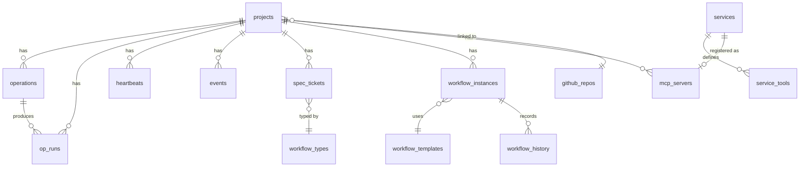

# Database

SQLite with WAL mode. Single file at `data/game.db`. All access goes through named helper functions in `db.py` — no module calls `sqlite3` directly outside that module. Running `python db.py` initializes a fresh database with schema and seed data.

## Entity Relationship Diagram

## projects

Stores one row per discovered project directory. Populated by the startup scanner from `METADATA.md` and filesystem flags.

| Column | Type |
|--------|------|
| id | INTEGER PK |
| name | TEXT UNIQUE |
| display_name | TEXT |
| path | TEXT |
| status | TEXT |
| port | INTEGER |
| stack | TEXT |
| namespace | TEXT |
| tags | TEXT |
| health_endpoint | TEXT |
| desired_state | TEXT |
| version | TEXT |
| project_type | TEXT |
| has_git | INTEGER |
| has_venv | INTEGER |
| has_node | INTEGER |
| has_claude | INTEGER |
| has_docs | INTEGER |
| has_tests | INTEGER |
| has_specs | INTEGER |
| card_title | TEXT |
| card_desc | TEXT |
| card_tags | TEXT |
| card_type | TEXT |
| card_url | TEXT |
| card_image | TEXT |
| card_show | INTEGER |
| git_repo | TEXT |
| updated | TEXT |
| github_repo_id | INTEGER FK |
| extra | TEXT (JSON) |
| is_active | INTEGER |
| last_scanned | TEXT |
| created_at | TEXT |
| updated_at | TEXT |

## operations

One row per registered bin/ script per project. Deleted and re-seeded on each scan.

| Column | Type |
|--------|------|
| id | INTEGER PK |
| project_id | INTEGER FK |
| name | TEXT |
| category | TEXT |
| cmd | TEXT |
| cwd | TEXT |
| needs_venv | INTEGER |
| is_url | INTEGER |
| default_port | INTEGER |
| health_path | TEXT |
| schedule | TEXT |
| last_scheduled_run | TEXT |
| next_scheduled_run | TEXT |
| schedule_enabled | INTEGER |
| timeout | INTEGER |
| sort_order | INTEGER |

## op_runs

One row per script execution. Append-only; never deleted.

| Column | Type |
|--------|------|
| id | INTEGER PK |
| op_id | INTEGER FK |
| project_id | INTEGER FK |
| status | TEXT |
| pid | INTEGER |
| started_at | TEXT |
| finished_at | TEXT |
| exit_code | INTEGER |
| log_path | TEXT |
| cmd | TEXT |
| name | TEXT |

## spec_tickets

Unified ticket store for the Workflow Kanban board and specification file creation. Supersedes the legacy `tickets` table.

| Column | Type |
|--------|------|
| id | INTEGER PK |
| project_id | INTEGER FK |
| workflow_type_id | INTEGER FK |
| filename | TEXT |
| title | TEXT |
| body | TEXT |
| file_status | TEXT |
| kanban_state | TEXT |
| priority | TEXT |
| tags | TEXT |
| sort_order | INTEGER |
| created_at | TEXT |
| updated_at | TEXT |

## workflow_types

Configurable ticket type definitions. Seeded with Patch, Screen, Feature, and Acceptance Criteria on first startup.

| Column | Type |
|--------|------|
| id | INTEGER PK |
| name | TEXT |
| file_prefix | TEXT |
| description | TEXT |
| template | TEXT |
| sort_order | INTEGER |
| is_active | INTEGER |
| created_at | TEXT |
| updated_at | TEXT |

## workflow_templates

State machine template definitions for the Workflow Service.

| Column | Type |
|--------|------|
| id | INTEGER PK |
| name | TEXT UNIQUE |
| display_name | TEXT |
| description | TEXT |
| states_json | TEXT |
| initial_state | TEXT |
| source | TEXT |
| is_active | INTEGER |
| created_at | TEXT |
| updated_at | TEXT |

## workflow_instances

Active workflow instances. One row per workflow in progress.

| Column | Type |
|--------|------|
| id | INTEGER PK |
| workflow_name | TEXT |
| template_id | INTEGER FK |
| project_id | INTEGER FK |
| current_state | TEXT |
| payload | TEXT (JSON) |
| created_at | TEXT |
| updated_at | TEXT |

## workflow_history

Append-only transition log. One row per state change.

| Column | Type |
|--------|------|
| id | INTEGER PK |
| workflow_id | INTEGER FK |
| from_state | TEXT |
| to_state | TEXT |
| comment | TEXT |
| transition_payload | TEXT (JSON) |
| timestamp | TEXT |

## heartbeats

One row per project per heartbeat type. Overwritten on each poll (rolling window, no history).

| Column | Type |
|--------|------|
| id | INTEGER PK |
| project_id | INTEGER FK |
| heartbeat_type | TEXT |
| current_state | TEXT |
| last_checked | TEXT |
| response_ms | INTEGER |
| uptime_pct | REAL |

## events

Append-only event log. Never updated or deleted.

| Column | Type |
|--------|------|
| id | INTEGER PK |
| project_id | INTEGER FK |
| event_type | TEXT |
| timestamp | TEXT |
| summary | TEXT |
| detail | TEXT (JSON) |
| source | TEXT |

## github_repos

Full list of GitHub repositories synced from the GitHub API on each startup scan. One row per repo.

| Column | Type |
|--------|------|
| id | INTEGER PK |
| name | TEXT UNIQUE |
| full_name | TEXT |
| html_url | TEXT |
| clone_url | TEXT |
| private | INTEGER |
| description | TEXT |
| is_downloaded | INTEGER |
| project_id | INTEGER FK |
| synced_at | TEXT |

## services

Registry of all platform and project services discovered from `.service.yaml` manifests.

| Column | Type |
|--------|------|
| id | INTEGER PK |
| name | TEXT UNIQUE |
| display_name | TEXT |
| description | TEXT |
| source | TEXT |
| source_project_id | INTEGER FK |
| manifest_path | TEXT |
| transports | TEXT (JSON) |
| tool_count | INTEGER |
| version | TEXT |
| is_active | INTEGER |
| created_at | TEXT |
| updated_at | TEXT |

## service_tools

Tool definitions for each service. One row per tool per service.

| Column | Type |
|--------|------|
| id | INTEGER PK |
| service_id | INTEGER FK |
| name | TEXT |
| description | TEXT |
| input_schema | TEXT (JSON) |
| output_schema | TEXT (JSON) |
| sort_order | INTEGER |

## mcp_servers

MCP server instances discovered from project `mcp/` directories.

| Column | Type |
|--------|------|
| id | INTEGER PK |
| service_id | INTEGER FK |
| project_id | INTEGER FK |
| entry_script | TEXT |
| runtime | TEXT |
| requirements | TEXT |
| default_transport | TEXT |
| exposed | INTEGER |
| assigned_port | INTEGER |
| pid | INTEGER |
| status | TEXT |
| last_started | TEXT |
| last_error | TEXT |
| created_at | TEXT |
| updated_at | TEXT |

## platform_stats

Read-only runtime metrics written by background processes (scanner, health poller).

| Column | Type |
|--------|------|
| key | TEXT PK |
| value | TEXT |
| description | TEXT |
| updated_at | TEXT |

## settings

User-configurable key-value store. Seeded with `app_name` and `homepage_url`.

| Column | Type |
|--------|------|
| key | TEXT PK |
| value | TEXT |
| description | TEXT |
| updated_at | TEXT |

## tag_colors

Color assignments per tag. Canonical source for tag pill colors.

| Column | Type |
|--------|------|
| tag | TEXT PK |
| bg | TEXT |
| fg | TEXT |
| updated_at | TEXT |
