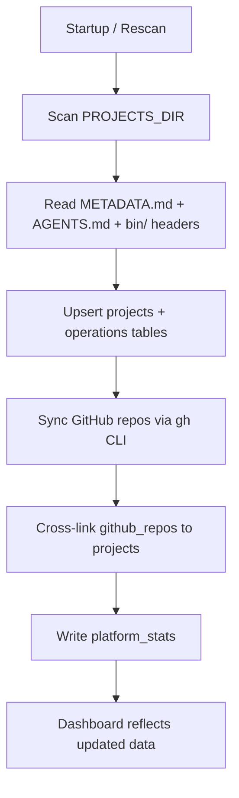
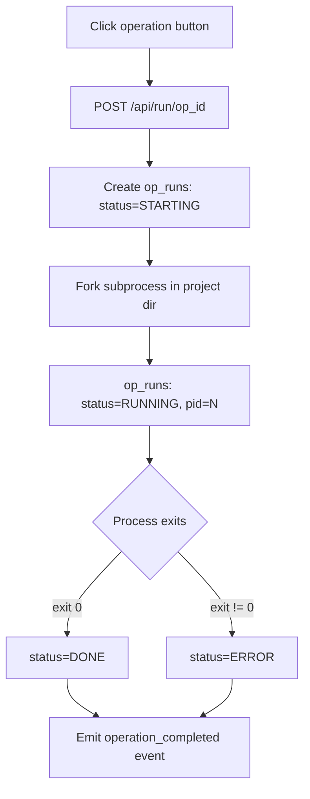
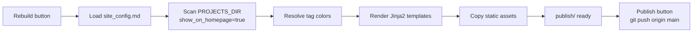
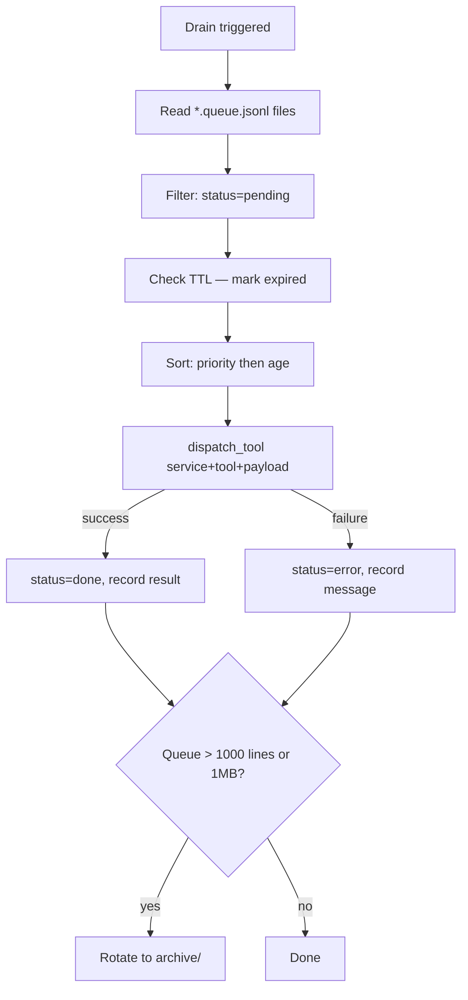

# End-to-End Flows

## Project Scan

**Trigger:** Platform startup (background thread) or user clicks Rescan button (`POST /api/scan`).

For each directory in `$PROJECTS_DIR`, reads `METADATA.md` key-value fields, parses `AGENTS.md` for bookmarks and endpoints, scans `bin/` script headers for `# CommandCenter Operation` markers, and checks filesystem flags (`has_git`, `has_venv`, `has_docs`, etc.). Upserts into `projects` and `operations`. After the per-project loop, syncs GitHub repos via `gh api /user/repos` and cross-links repos to local projects by name. Writes `scan_projects_total`, `github_repo_count`, `projects_by_state_*`, and `scan_last_completed` to `platform_stats`.

**Reads:** Filesystem (`$PROJECTS_DIR`), `METADATA.md`, `AGENTS.md`, `bin/` scripts, GitHub API.
**Writes:** `projects`, `operations`, `github_repos`, `platform_stats`.

---

## Run Operation

**Trigger:** User clicks an operation button on the Dashboard or project detail.

Creates an `op_runs` record with status STARTING, forks a subprocess in the project directory (activating venv if needed), redirects stdout/stderr to `logs/{project}_{script}_{timestamp}.log`, and updates the record to RUNNING with the PID. A background monitor parses `[$PROJECT_NAME]` status lines from output. On process exit: status becomes DONE (exit 0) or ERROR (non-zero exit).

**Reads:** `operations` table, project path.
**Writes:** `op_runs` table, log file.

---

## Stop Operation

**Trigger:** User clicks Stop on a running operation.

Loads the `op_runs` record, sends SIGTERM to the process group, and waits for the background monitor (from Run Operation) to detect the exit. Updates `op_runs` to status STOPPED with `finished_at`.

**Reads:** `op_runs` table.
**Writes:** `op_runs` table (status=STOPPED).

---

## Portfolio Publish

**Trigger:** User clicks Rebuild (`POST /publisher/build`) or Publish (`POST /publisher/publish`).

**Build:** Reads `config/site_config.md` YAML frontmatter for branding and renders its Markdown body as `home_html`. Scans `$PROJECTS_DIR` for projects with `show_on_homepage = true`, resolves tag colors from `data/tag_colors.json`, and renders three Jinja2 templates to `$PUBLISHER_TARGET/publish/`. Copies static assets (images, diagrams, project docs).

**Publish:** Runs `git add -A && git commit -m "Update homepage {date}" && git push origin main` in `$PUBLISHER_TARGET`.

**Reads:** `config/site_config.md`, `$PROJECTS_DIR/*/METADATA.md`, `data/tag_colors.json`, Jinja2 templates.
**Writes:** `$PUBLISHER_TARGET/publish/` static files; GitHub Pages branch on publish.

---

## Heartbeat Poll

**Trigger:** Scheduler every `health_check_interval` seconds; `POST /api/health/poll` for on-demand.

For each project with a port or explicit `health_check_type`: performs HTTP GET or TCP connect, upserts `heartbeats`, appends to `health_check_log`, and fires a `state_transition` or `alert_fired` event on state change (UP ↔ DOWN ↔ DEGRADED). Recomputes rolling 24-hour `uptime_pct` from `health_check_log`.

**Reads:** `projects` (port, health_endpoint, desired_state), `heartbeats`, `health_check_log`.
**Writes:** `heartbeats`, `health_check_log`, `events`.

---

## Schedule Fire

**Trigger:** Scheduler tick every 60 seconds; also on startup catch-up.

Queries `operations` where `schedule IS NOT NULL AND schedule_enabled = 1`. Evaluates each cron expression against current time. On match, delegates to the Run Operation flow, updates `last_scheduled_run`, and recalculates `next_scheduled_run`. On startup, fires one immediate catch-up run for each missed schedule and emits `schedule_missed` events.

**Reads:** `operations` (schedule, last_scheduled_run, schedule_enabled).
**Writes:** `op_runs` (via Run Operation), `operations` (last/next scheduled run), `events`.

---

## Workflow Transition

**Trigger:** `POST /api/services/workflow/transition` or Kanban board card drag.

Loads the workflow instance and template, validates that the target state is in the current state's transitions list, updates `workflow_instances.current_state`, appends a row to `workflow_history`, and emits a `workflow_transition` event. Returns 400 with an error message on invalid transition.

**Reads:** `workflow_instances`, `workflow_templates`.
**Writes:** `workflow_instances` (current_state), `workflow_history`, `events`.

---

## AsyncQueue Drain

**Trigger:** GAME startup (after scan), `POST /api/services/async-queue/drain`, or scheduler cron job.

Reads all `data/queues/*.queue.jsonl` files, filters for `status = pending`, checks TTL (marks expired), and processes remaining messages in priority-then-age order. For each: resolves service and tool via `service_registry.dispatch_tool()`, marks as `processing`, executes, and writes `done` or `error` back to the file. Rotates the queue file to `archive/` when it exceeds 1000 lines or 1 MB.

**Reads:** Queue JSONL files, `queue_config.yaml`, `services`, `service_tools`.
**Writes:** Queue JSONL files (status updates), archive files, `events`.

---

## Configuration Edit

**Trigger:** User edits an inline field on the Configuration screen, Project Detail, or Publisher.

Writes the updated value to the `projects` table immediately, then patches the same key in the project's `METADATA.md` on disk. DB is the working copy for fast reads; METADATA.md is the source of truth that survives a database rebuild via rescan.

**Reads:** `projects` table, `METADATA.md`.
**Writes:** `projects` table, `METADATA.md` (bidirectional sync), `events` (`metadata_changed`).
