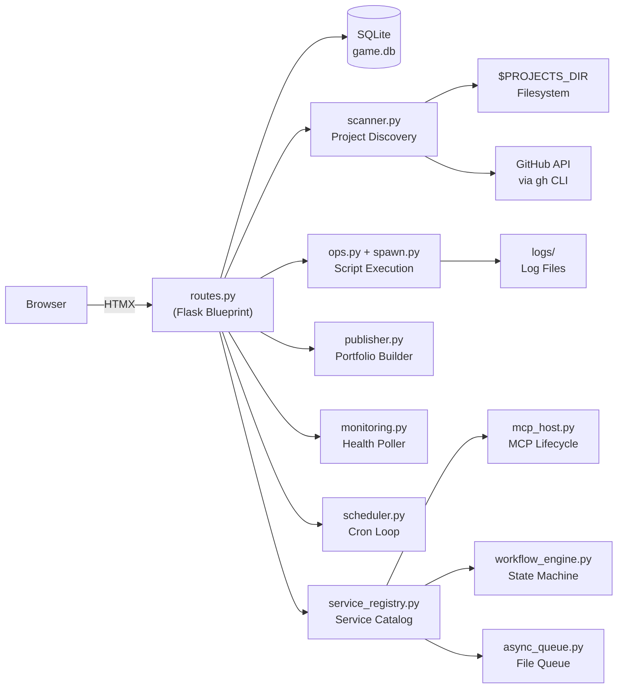

# GAME — Agentic Developer Framework

## What It Is

GAME is a Python-based developer framework that gives agentic developers complete visibility and control over every project they own — from a single dashboard. It solves the fragmented tooling problem: scattered scripts, inconsistent project structures, no unified way to run operations, monitor health, or expose capabilities to AI agents. GAME scans your projects directory at startup, reads each project's metadata and scripts, and presents everything through a polished operations center. Developers get instant access to project status, runnable scripts, health monitoring, documentation, and a portfolio publisher — all without changing how they build.

## What It Can Do

- Scans all projects on startup and builds a live service catalog from `METADATA.md`, `bin/` scripts, `AGENTS.md` endpoints, and MCP tool manifests
- Launches any registered `bin/` script as a background job with full log capture, live status tracking, and stop control from the dashboard
- Monitors service health via HTTP/TCP polling with uptime tracking, state-change alerts, and an interleaved event log across all projects
- Publishes a static portfolio site to GitHub Pages by rendering project metadata through Jinja2 templates — no Astro, no npm required
- Hosts and manages developer-created MCP servers: discovers, registers, starts, stops, and exposes them on configurable network ports
- Runs a generic workflow state machine (specification tickets, deployments, reviews) with full transition history and event emission
- Provides a file-based async message queue that accepts work even when the server is down and drains automatically on startup
- Exposes all project capabilities through five unified transports: REST, CLI (`game-cli.sh`), MCP, async queue, and web UI

## Built on Specification Driven Design

GAME is a live showcase of the Prototyper methodology — a Specification Driven Design workflow where AI agents build applications directly from structured specification files rather than hand-written code. The project was originally prototyped conventionally, then completely rebuilt from its own specification files using AI agents. GAME actively supports and integrates with this workflow: it tracks specification directories, surfaces validation checks, and provides a Workflow screen for managing specification tickets through their full lifecycle. The full specification and rules engine for GAME weighs approximately 18,498 tokens — the scale at which AI-driven builds become a meaningful advantage over manual implementation.

## Architecture Overview

## Vision

GAME is heading toward a fully unified capability platform for small developer teams — where every project's scripts, endpoints, and AI tools are discoverable, runnable, and shareable through a single control plane. The next frontier is seamless capability sharing within a circle of trust: exposing MCP servers and async queues across machines, enabling real-time inter-project coordination, and making the portfolio homepage a live reflection of a developer's entire productive output. As the specification-driven build methodology matures, GAME will serve as both the tool that enforces that methodology and the proof that it works at scale.
