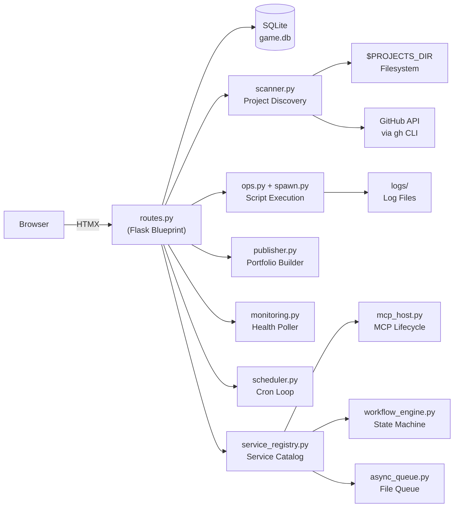

# GAME — Agentic Developer Framework

## What It Is

- A Python-based developer framework that gives agentic developers complete visibility and control over their projects and projects they download.

- Solves the fragmented tooling problem where all your projects run and behave differently so you must acclimate. Now they all can be run the same way and their core capabilities are exposed for your other proects to call.  

- Projects are conformed to simple annotation standards - such that they all
behave similarly.  Their capabilities and metadata are scanned by the engine and then exposed via mcp AND via python.  

- An polished operations center guides the flow.  Developers get live access to project status, runnable scripts, health monitoring, documentation for their
projects with no cost or changes.  

## What It Can Do

- Conforms projects using annotations to standard methedology
- Scans all projects on startup and builds a live capability catalog from `METADATA.md`, `bin/` scripts, `AGENTS.md` endpoints, and MCP tool manifests
- Command, Control, & Observability for conformed projects
- Monitors service health, Scheduled Jobs with uptime tracking, state-change alerts, and cross project log searching. 
- Hosts and manages developer-created MCP servers: discovers, registers, starts, stops, and exposes them on capability catalog
- Runs simple workflow state machines (specification updates, project namespaces)
- Provides (file-based) async message queue 
- Exposes your project capabilities through five unified transports: REST, CLI (`game-cli.sh`), MCP, async queue, and web UI
- Dashboard / Single Pane of Glass

## Built via My Specification Driven Design

GAME is a live showcase of the Prototyper methodology — a Specification Driven Design workflow where AI agents build applications directly from structured specification files rather than hand-written code. The project was originally prototyped conventionally, then completely rebuilt from its own specification files using AI agents. GAME actively supports and integrates with this workflow: it tracks specification directories, surfaces validation checks, and provides a Workflow screen for managing specification tickets through their full lifecycle. The specification for GAME weighs in at (100K tokens) and Build Rules (65K Tokens) and branding (5K Tokens) rules.  I reliably build with sonnet using about 20 customized prompts totalling (24K Tokens).   

## Architecture Overview

## Vision

GAME is heading toward a fully unified capability platform for small developer teams — where every project's scripts, endpoints, and AI tools are discoverable, runnable, and shareable through a single control plane. The next frontier is seamless capability sharing within a circle of trust: exposing MCP servers and async queues across machines, enabling real-time inter-project coordination, and making the portfolio homepage a live reflection of a developer's entire productive output. As the specification-driven build methodology matures, GAME will serve as both the tool that enforces that methodology and the proof that it works at scale.
