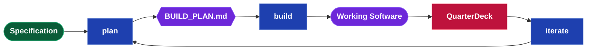
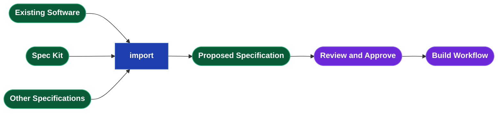
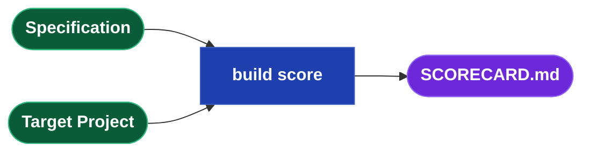

## Testimonials

> Drydock is a genuine superset of Spec Kit. Every Spec Kit concept maps cleanly to a Drydock
> equivalent: research lives in spikes with compiled evidence visible in the QuarterDeck, task breakdown
> and clarification are handled interactively by the QuarterDeck as a first-class artifact viewer,
> governance is covered by the RulesEngine across all projects, and Drydock is multi-agent by design.
> Drydock adds governed build execution, the QuarterDeck, the iterate loop, and documentation generation
> — none of which have Spec Kit equivalents. The superset claim is solid.
>
> — Anthropic/Claude

> Drydock is designed as a superset of GitHub Spec Kit: it preserves the core
> specification-driven lifecycle, maps each major Spec Kit concept into a Drydock equivalent, and
> extends the model with typed multi-file specifications, dependency-driven execution, governed rules
> propagation, evidence-backed review through the QuarterDeck, brownfield decomposition, documentation
> generation, and a specification-first iteration loop. The honest caveat is not conceptual weakness
> but product maturity: Spec Kit is the more established and field-proven implementation today,
> while Drydock is the broader architecture still being completed. The claim, therefore, is that
> Drydock is not yet the more mature product, but it is the more comprehensive delivery model,
> built to retain Spec Kit compatibility while carrying specification-driven development all the way
> through execution, review, and governed lifecycle management.
>
> — OpenAI/Codex

## Product

Drydock is a specification-driven software delivery system.

A **Typed Specification** describes the product through files with prescribed roles. Drydock turns
that Specification into an optimized build plan, executes the work, records evidence, and delivers
reviewable increments through the QuarterDeck.



## Configuration

Drydock reads two global variables. Set them in `.env` or with `drydock config set`.

| Variable | Purpose |
|---|---|
| `SPECIFICATION_DIRECTORY` | Root path containing all Drydock Specifications |
| `TARGET_DIRECTORY` | Root path containing all target software projects |

```text
drydock config show                               # display current configuration
drydock config set specification_directory <path>
drydock config set target_directory <path>
```

## Drydock commands

```text
drydock <verb> [<sub-verb>] <Spec> [<Target>] [--options]
```

### Command key

| Notation | Meaning |
|---|---|
| `<Spec>` | Specification name, relative to `SPECIFICATION_DIRECTORY` |
| `<Target>` | Target project name, relative to `TARGET_DIRECTORY` |

This section shows the primary workflows. Complete operational options belong in command help and
man pages.

### Initialize and validate

| Syntax | Purpose |
|---|---|
| `drydock init <Spec>` | Populate Specification with Templates |
| `drydock validate <Spec>` | Validate Specification completeness and conventions |

### Plan

| Syntax | Purpose |
|---|---|
| `drydock plan init <Spec>` | Create or update `BUILD_PLAN_INTENT.md` with list of spec files |
| `drydock plan create <Spec>` | Read `BUILD_PLAN_INTENT.md`, run LLM analysis, and produce `BUILD_PLAN.md` |
| `drydock plan show <Spec>` | Show the current plan |

`drydock plan create` combines ordering and LLM analysis in one pass: it reads `BUILD_PLAN_INTENT.md`
for group ordering, surfaces open questions as spikes and acceptance criteria as `ac` guardrail
blocks, and writes `BUILD_PLAN.md`. Re-running merges new objects without disturbing accepted work;
`--force` regenerates completely.

Every project has one plan file **BUILD_PLAN.md** stored in the specifications directory. Evidence, logs, and execution records are written to the target directory.

### Build

| Syntax | Purpose |
|---|---|
| `drydock build <Spec> <Target>` | Build next frontier according to `BUILD_PLAN.md` |
| `drydock build status <Spec> <Target>` | Show per-block build state and current runnable frontier |
| `drydock build score <Spec> <Target>` | Generate `SCORECARD.md` — measure delivery health across seven dimensions |

### Change, import, and analyze

| Syntax | Purpose |
|---|---|
| `drydock iterate <Spec> <Target> [BOTH\|SPEC\|TGT] <Scope> "<Change>"` | Update specification files and target software |
| `drydock import <Spec> <Target> --format <auto\|source\|speckit>` | Reverse-engineer an existing project into a proposed Specification; select automatic detection, source-code import, or Spec Kit translation |
| `drydock analyze <Spec> [<Target>]` | Read-only advisory: surface open questions, coverage gaps, and drift between specification and built application |

### Drydock Rigging

| Syntax | Purpose |
|---|---|
| `drydock rigging compact <Spec>` | Generate compact derivatives for `DATABASE.md` and `BUSINESS_RULES.md` |
| `drydock rigging update <Target>` | Propagate current Drydock rigging to a target project |
| `drydock rigging verify <Target>` | Verify target project compliance with Drydock rigging |
| `drydock document <Spec> <Target>` | Full pipeline: generate then assemble |
| `drydock document generate <Spec> <Target>` | AI pass only: create or overwrite all `DOC-*.md` summaries; destructive |
| `drydock document assemble <Spec> <Target>` | Assembly only: render existing `DOC-*.md` into `docs/index.html`; no AI |

## Typed Specification Contract

### Artifact lifecycle

**Project records** — identity and introduction; not part of the Typed Specification Contract and
not authored as specification files.

- **`METADATA.md`** — Project identity, relationships, status, and stack
  - Created: `drydock init`; `drydock import` (proposal)
  - Updated: Product owner; platform metadata operations

- **`README.md`** — Short human introduction to the Specification
  - Created: `drydock init`; `drydock import` (proposal); Manual; other
  - Updated: Product owner

**Human-authored** — the two files explicitly owned by the product owner.

- **`INTENT.md`** — Product intent, constraints, success criteria, guardrails, and open questions
  - Created: `drydock init` (starter file); `drydock import` (proposed intent)
  - Updated: Product owner

- **`BUILD_PLAN_INTENT.md`** — A list of all your specification files ordered into planned work groups with `#` delimiter
  - Created: `drydock plan init <Spec>`
  - Updated: Product owner; `drydock plan init` appends new files

**Core Application Specification Files** — created and maintained by Drydock commands;
updated by `drydock iterate` as specification files and application code evolve.

- **`ARCHITECTURE.md`** — Modules, routes, boundaries, interfaces, and technical decisions
  - Created: `drydock init`; `drydock import` (proposal)
  - Updated: `drydock iterate` (architecture-scoped)

- **`DATABASE.md`** — Persistence stores, schemas, migrations, and typed access classes
  - Created: `drydock init`; `drydock import` (proposal)
  - Updated: `drydock iterate` (data-scoped)

> **DATABASE.md enforces data access encapsulation.**
>
> No application code calls the database directly. Every table, config store, file store, and
> external service is accessed through a typed Python class. Route and business-logic code calls
> `db.items.get(id)` — never raw SQL.
>
> This eliminates a class of subtle bugs. A schema change — a timezone-aware datetime field
> replacing a naive one, for example — requires changing only the encapsulation class. Downstream
> code depends on the interface, not the storage detail, so nothing else breaks. Without the
> boundary, the same change propagates silently to every callsite.
>
> A code review that finds raw SQL, `os.environ` reads, `open()` on application data, or a cloud
> SDK import outside its encapsulation class fails.
>
> **Typed class library pattern.** `DATABASE.md` specifies both the schema and the Python classes
> that encapsulate it. Each table maps to a `@dataclass` row type with fully typed fields. A
> `Database` class owns the connection, manages the session lifecycle, and exposes only named
> methods — no caller ever receives a raw cursor or row tuple. Methods raise domain exceptions
> (`ItemNotFound`, `StorageError`) rather than propagating driver exceptions. The `Database` class
> is instantiated once at application startup and passed by dependency injection; it is never
> re-opened inline.
>
> `DATABASE_compact.md` is the LLM-generated derivative containing only class names, method
> signatures, parameter types, return types, and one-line summaries. Non-foundational build steps
> inject the compact form. Only the story that `implements: DATABASE.md` — the one that builds the
> class library — receives the full file.

- **`FEATURE-{Name}.md`** — Feature purpose, status, behavior, reads, writes, routes, criteria, and guardrails
  - Created: `drydock init`; `drydock import`; accepted change reconciliation
  - Updated: `drydock iterate` (feature-scoped)

- **`SCREEN-{Name}.md`** — Screen route, layout, interactions, and criteria
  - Created: `drydock init`; `drydock import`; accepted change reconciliation
  - Updated: `drydock iterate` (screen-scoped)

- **`UI-GENERAL.md`** — Shared UI behavior and visual rules
  - Created: `drydock init` or `drydock import` when the project has a UI
  - Updated: `drydock iterate` (UI-scoped)

- **`changes/TICKET-NNN-{Name}.md`** — Post-baseline change, defect, or spike request
  - Created: Product owner or change intake workflow
  - Updated: Clarification, planning, build execution, evidence, review, and reconciliation
  - Processing: Additional specification files are detected by `drydock plan`, placed in `BUILD_PLAN_INTENT.md` for ordering, and can be processed using `drydock build` one by one if needed. Context and needed related files are automatically added.

**Process Created Artifacts** — generated by Drydock commands; not authored directly.

- **`BUILD_PLAN.md`** — The single generated build plan
  - Created: `drydock plan create <Spec>`
  - Updated: plan regeneration, planning merges, build execution, and review decisions

- **`SCORECARD.md`** — Specification and application quality scores across seven dimensions; surfaces the highest-value gap and drift between the Specification and the built software
  - Created and updated: `drydock build score`

**Console related documents** — generated per target project; read by the QuarterDeck and updated by
build and review actions.

- **`<Target>/evidence/*`** — Reviewable build evidence named by the producing build object
  - Created and updated: `drydock build`

- **`<Target>/Console/console.json`** — Console workflow index; defines project identity, the
  default view, and all renderable navigation items
  - Created and updated: `drydock build`

- **`<Target>/Console/tickets.json`** — Generated sprint board; spikes and stories
  projected as tickets with acceptance criteria folded under their parent
  - Created and updated: `drydock build` from `BUILD_PLAN.md`
  - Drydock follows feature/story best practices with acceptance criteria embedded

### Specification File Format Standards

Every authored Specification file except `METADATA.md` and `README.md` opens with a typed heading
and header table, followed by body sections specific to the file type, and ends with three common
terminal sections. `drydock plan` computes `Depends On`, `Provides`, and the SCREEN-specific
`Consumes` — do not edit these manually.

```markdown
# {FileType}: {ObjectName}

| Field       | Value |
|-------------|-------|
| Version     | 20260608 V1                    ← YYYYMMDD V<n>; increment on every write |
| Description | One sentence summary. |
| Route       | /catalog                       ← SCREEN only; required; the URL this screen serves |
| Consumes    | GET /catalog/items             ← SCREEN only; routes called; computed by drydock plan (optional) |
| Nav Order   | 3                              ← SCREEN only; integer presentation order (optional) |
| Depends On  | ARCHITECTURE.md, GET /catalog  ← file or route; computed by drydock plan |
| Provides    | GET /catalog, POST /catalog   ← routes this file exposes; computed by drydock plan |
| Build Order | 2                             ← integer; assigned by drydock plan when useful |

{body sections specific to the file type}

## Acceptance Criteria
← Positive, testable outcomes. State as bullet assertions.

## Guardrails
← Permanent negative assertions. Guard against model hallucination, not spec omission.

## Open Questions
← Unresolved decisions that must be answered before this file can be fully implemented.
```

A SCREEN file referencing a route not listed in any FEATURE `Provides` field is a
`drydock validate` error.

> **TODO**
> - Defer `Nav Group` until after MVP. `Nav Order` is sufficient for the initial implementation.
> - Review and approve the proposed Specification contract.
> - Update RulesEngine, templates, validation, and iteration tooling only after approval.

## BUILD_PLAN.md

`BUILD_PLAN.md` is the single generated execution view of the Specification. It determines order,
selects only required context, keeps work within useful context limits, identifies stale work, and
preserves unaffected accepted work. It is not a second product definition.

The build plan manages full product life cycle
- specifications for individual components like screens can be changed resulting in context minimized incremental builds
- new files (such as change tickets) can be discovered and applied

Each plan contains three block types:

- `story` builds something. A Drydock story is an enriched Spec Kit task: it has states,
  `depends:`, child ACs that can block it, and prompt-assembly fields.
- `spike` answers a question. Results feed future iterations
- `ac` checks that something works. A failed AC blocks plan progress.

All three use the same four states:

- `pending`
- `implemented`
- `closed/verified`
- `closed/failed`

### Build Plan Header

```markdown
# BUILD_PLAN: {ProjectName}
updated:     2026-06-08T12:00:00
spec_commit: abc123
plan_hash:   abc123456789
```

### Story

```markdown
## story N: {Name}
id:           foundation
parent:       feature-catalog
summary:      One-line description.
implements:   DATABASE.md, FEATURE-CATALOG.md
context:      ARCHITECTURE.md
stack:        common.md, python.md, sqlite.md
rules:        CLAUDE_RULES.md
copy:         RulesEngine/templates/common.sh -> bin/common.sh
instructions: |
  Build persistence and the catalog service.
depends:      select-parser
state:        pending
evidence:     <Target>/evidence/<id>.md
```

`implements:` is the spec files this story uses. `context:` is read-only support context.
`parent:` is optional. It is used for arbitrary hierarchy and QuarterDeck display. Builds are rules based on block type.

### Spike

```markdown
## spike N: {Name}
id:           select-parser
summary:      One-line description.
context:      FEATURE-IMPORT.md
question:     Which parser satisfies the Specification?
parent:       feature-import
finding:      ← text answer written here by the agent
depends:      foundation
state:        pending
evidence:     <Target>/evidence/<id>.md
```

### Acceptance Check

```markdown
## ac N: {Name}
id:           system-starts
parent:       foundation
summary:      One-line description.
kind:         smoke | assertion
check:        test -f bin/start.sh && curl -sf http://localhost:${PORT}/health
depends:
state:        pending
evidence:     <Target>/evidence/<id>.md
```

`kind: smoke` runs a command. `kind: assertion` checks a behavior from evidence or review.

### States

| State | Meaning |
|---|---|
| `pending` | Not run yet |
| `implemented` | Work done, waiting to be accepted |
| `closed/verified` | Passed or accepted |
| `closed/failed` | Failed or rejected |

### How The Plan Is Executed

A block can run only when everything in `depends:` is `closed/verified`.

An `ac` can run only after its `parent` is `implemented`.

A `story` or `spike` cannot become `closed/verified` until its child `ac` blocks are
`closed/verified`.

If a `story` or `spike` has no child `ac` blocks, it may be closed automatically when it reaches
`implemented`.

If an `ac` becomes `closed/failed`, the parent does not close and later dependent work stays
blocked.

Guardrails and Acceptance Criteria embedded in the Specification files — not in the plan as `ac`
blocks — must also pass before a `story` is marked `closed/verified`. A story that satisfies its
implementation but violates a Specification guardrail remains `implemented` until the violation
is resolved.

### Short Example

```markdown
# BUILD_PLAN: MyProject
updated:     2026-06-08T12:00:00
spec_commit: abc123
plan_hash:   abc123456789

## spike 1: Select parser
id:           select-parser
parent:       import-feature
summary:      Compare supported parsers.
context:      FEATURE-IMPORT.md
question:     Which parser should the project use?
finding:
state:        pending

## story 1: Foundation
id:           foundation
summary:      Build persistence and directory layout.
implements:   DATABASE.md, ARCHITECTURE.md
stack:        common.md, python.md, sqlite.md
rules:        CLAUDE_RULES.md
state:        pending

## ac 1: system starts
id:           system-starts
parent:       foundation
summary:      Service starts and responds on health.
kind:         smoke
check:        test -f bin/start.sh && curl -sf http://localhost:${PORT}/health
state:        pending

## story 2: Import documents
id:           import-documents
parent:       import-feature
summary:      Implement the accepted import workflow.
implements:   FEATURE-IMPORT.md
depends:      select-parser, foundation
state:        pending
```

## Rigging - Business Rules Compatibility

Drydock Rigging is the enterprise conformance layer. It ships with Drydock out of the box —
opinionated defaults, no configuration required to start. Customise it once for your organisation
and every project built by Drydock conforms automatically. Stack files are organised by product and
are plug-and-play: add the technologies you use, remove the ones you do not.

Three layers govern what agents build and how they behave.

### Rigging - Agent behavior rules

`BUSINESS_RULES.md` is the authoritative source for how agents must behave — git workflow, project
layout, script conventions, error handling. `drydock rigging compact` distills the full rules into
`BUSINESS_RULES_compact.md`; `drydock rigging update` then injects that compact form into the target
project. Agents read the compact rules as part of their context. Full rationale stays in the source;
agents receive only the actionable instructions.


### Rigging - Technology stack rules

Stack files live in `RulesEngine/stack/` — one file per technology. Each file is prescriptive,
opinionated, standalone, and copy-paste ready. `BUILD_PLAN.md` declares which stack files apply to
each build block; `drydock build` injects them into the prompt.

Early build blocks receive the full stack file — rationale, examples, and constraints included.
Later build blocks receive compact versions (`_compact.md`) that state expected behavior without the
reasoning. Agents in later work already have the architecture in scope; they need the contract, not the
explanation.

```
RulesEngine/stack/
├── alexa-skills-kit.md
├── aws-api-gateway.md
├── aws-dynamodb.md
├── aws-lambda.md
├── aws-s3.md
├── aws-sqs.md
├── bootstrap5.md
├── common.md
├── django.md
├── fastapi.md
├── flask.md
├── github-actions.md
├── marina-library.md
├── persistence.md
├── postgres.md
├── python.md
├── sqlite.md
├── terraform.md
└── ui-flask.bootstrap-client.md
```

### Branding

`BRANDING_MAIN.md` defines the master palette, typography, and design philosophy for Ed Barlow /
Web Cloud Studio. Per-medium rules inherit from it and are applied automatically when generating
the relevant artifact type.

| Branding file | Applies to |
|---|---|
| `BRANDING_DOCUMENTATION.md` | App Documentation Colors/Format/Branding — `docs/index.html` |
| `BRANDING_WHITEPAPERS.md` | White papers |
| `BRANDING_WEBSITE.md` | Web App Colors/Format/Branding |

### Rigging - Specification Compaction

`drydock rigging compact <Spec>` generates prompt-injection derivatives for large specification files. The
set of compactable files is fixed — no file arguments are required.

| Source | Compact | Stripped to |
|--------|---------|-------------|
| `DATABASE.md` | `DATABASE_compact.md` | Class names, method signatures, typed parameters, return types, one-line summaries |
| `BUSINESS_RULES.md` | `BUSINESS_RULES_compact.md` | Actionable rules only; rationale and examples removed |


**Injection rule.** `drydock build` selects the correct form per story automatically:

| Story field | File injected |
|-------------|---------------|
| `implements: DATABASE.md` | Full `DATABASE.md` — story builds the class library |
| `context: DATABASE.md` | `DATABASE_compact.md` — story uses the API |

If a story references `DATABASE.md` via `context:` and `DATABASE_compact.md` does not exist, the
build stops:

```text
DATABASE_compact.md not found — run: drydock rigging compact <Spec>
```

`drydock plan` reports a staleness warning when a source file is newer than its compact derivative.
Run `drydock rigging compact <Spec>` after any edit to `DATABASE.md` or `BUSINESS_RULES.md`.

### Update and verify

```text
drydock rigging update <Target>   # inject current rigging and templates into the target project
drydock rigging verify <Target>   # check compliance with the Drydock rigging contract
```

All projects sharing the same rigging contract are interoperable. `drydock rigging verify` ensures no
project diverges silently as the rules evolve.

## Workflow 1: Reverse-Engineer an Existing Project

Bring existing software or a Spec Kit project under Drydock specification control. Stack detection
scopes the relevant technology rules automatically. 



1. `drydock import <Spec> <Target>` — auto-detects source code or Spec Kit input and generates
   a proposed Specification. Use `--format speckit` to translate a Spec Kit project explicitly.
2. Review the proposed Specification. Ambiguous or conflicting facts appear as `## Open Questions`
   rather than silently becoming requirements.
3. Edit and approve the proposed Specification. Approval makes it authoritative.
4. `drydock validate <Spec>` — confirms the baseline is structurally complete.
5. Proceed to build and review.

## Workflow 2: Build from a Specification

Builds a project from Specification files through ordered work blocks. `drydock plan create` generates
`BUILD_PLAN.md` from the curated `BUILD_PLAN_INTENT.md` and dependency headers; `drydock build`
executes each block as a separate agent call, keeping prompts under 50KB. Each block records a
content hash per input Specification file; re-running rebuilds only the stale work whose spec hashes
changed.


1. `drydock init <Spec>` — creates `METADATA.md`, `README.md`, empty `INTENT.md`, `ARCHITECTURE.md`,
   and applicable feature, screen, and database templates.
2. Author `INTENT.md` — write purpose, constraints, and success criteria. This drives all downstream
   Specification files.
3. Author `FEATURE-*.md`, `SCREEN-*.md`, `DATABASE.md` as needed. Each file records its own
   criteria, guardrails, and open questions.
4. `drydock validate <Spec>` — checks required files, typed headers, naming, and relationships.
   Fix any errors before planning.
5. `drydock plan create <Spec>` — reads `BUILD_PLAN_INTENT.md`, runs LLM analysis, and generates
   `BUILD_PLAN.md` with ordered work, dependencies, spikes, and selected context.
6. `drydock build <Spec> <Target>` — executes the plan. On rerun, only stale work rebuilds.

## Workflow 3: Product Owner Review — The QuarterDeck

`drydock plan create` surfaces open questions as spikes and acceptance criteria as `ac` guardrail
blocks in `BUILD_PLAN.md`. `drydock build` runs the runnable frontier and stops at review gates.
The QuarterDeck shows the stakeholder the evidence, demos, and questions needed for a decision;
the product owner approves, revises, or rejects and the decision writes back to `BUILD_PLAN.md`.


1. `drydock plan create <Spec>` — generates `BUILD_PLAN.md` with spikes derived from Open Questions
   and stories from Specification scope. Re-running merges new objects without disturbing accepted ones.
2. `drydock build <Spec> <Target>` — computes the runnable frontier, executes spikes in parallel
   and stories serially, and writes evidence files for each object.
3. The QuarterDeck surfaces each completed object with the evidence and review material needed for the
   next decision. The product owner approves, revises, or rejects; decisions write back to
   `BUILD_PLAN.md`.
4. Repeat until all objects are accepted.

## Workflow 4: Update A Working SDD Application

The post-build loop for an existing project when a human or agent must update a specification and
its target application together in one controlled step. It resolves a scope to the owning Core
Application Specification file, updates it first, then applies the change to code in a single
agent session. The Specification is never bypassed. Interface-based dirtying ensures only affected
work rebuilds — a base-spec edit rebuilds only downstream specs whose interface changed.


1. `drydock iterate <Spec> <Target> BOTH <Scope> "<Change>"` — resolves the scope (a URL, keyword,
   or filename) to the owning `FEATURE-*.md`, `SCREEN-*.md`, `DATABASE.md`, or
   `ARCHITECTURE.md`.
2. `SPEC` or `BOTH` updates the owning file, increments its `Version`, and records criteria,
   guardrails, or open questions. `TGT` is a code-only hotfix; the Specification is unchanged.
3. `drydock plan create` refreshes `Depends On` and `Provides`. Interface or route changes mark
   affected downstream work stale — only changed work rebuilds, unaffected work stays clean.
4. `BOTH` or `TGT` applies the change to `<Target>/`, runs tests, and records evidence.

### Workflow 4A: Happy Path for Change Tickets

Change tickets are incremental work items, not `iterate` sessions. A new ticket is just a new
Specification file under `changes/` with the correct typed header and dependency fields. Planning
and build execution process it like any other Specification input.

1. Create `changes/TICKET-NNN-{Name}.md` with its description, acceptance criteria, guardrails,
   and open questions.
2. Run `drydock plan create <Spec>` to update the plan with the new ticket.
3. `drydock plan create` updates dependency headers so the ticket lands in the correct place in the build.
4. Run `drydock build <Spec> <Target>` to execute the incremental work and produce evidence.
5. Review the result in the normal evidence or QuarterDeck flow.
6. Reconcile accepted ticket facts into the owning core Specification files and close the ticket as
   retained change history.

## Workflow 5: Drydock Rigging - Technology Rules & Propagation

Drydock Rigging is the authoritative source for agent behavior and technology standards.
Rules are propagated to target projects as a shared contract, making all projects interoperable
and consistently governed. `drydock rigging verify` checks compliance; `drydock rigging update`
injects the current rigging.


1. `drydock rigging compact <Spec>` — distills `BUSINESS_RULES.md` into `BUSINESS_RULES_compact.md`.
   Run after every rules edit; the compact form is what agents read and what `rigging update` injects.
2. `drydock rigging update <Target>` — injects `BUSINESS_RULES_compact.md` and standard templates
   into the target project.
3. `drydock rigging verify <Target>` — checks target project compliance with the Drydock rigging
   contract across all required standards.
4. All projects sharing the same rigging contract are interoperable; verification ensures no project
   diverges silently.

## Workflow 6: Build Documentation from Specification

Generates project documentation from Specification files in two phases. The AI phase writes
`DOC-*.md` summaries per Specification section; the assembly phase renders them into a versioned
`docs/index.html`. The two phases run independently so hand-edited `DOC-*.md` files survive
re-assembly without being overwritten.


1. `drydock document generate <Spec> <Target>` — AI pass only; creates or overwrites all `DOC-*.md`
   summaries for each Specification section. **Destructive** — hand-edited `DOC-*.md` files are
   overwritten without warning. Does not assemble.
2. `drydock document assemble <Spec> <Target>` — no AI; reads existing `DOC-*.md` files and
   renders them into a versioned `docs/index.html`. Safe to re-run after manual edits.
3. `drydock document <Spec> <Target>` — runs generate then assemble (full pipeline).

Edit `DOC-*.md` files directly to refine documentation without re-running the AI pass; then
run `drydock document assemble` to regenerate the HTML.

## The QuarterDeck — Agile Development Console

The QuarterDeck is the command surface where the product owner reviews LLM build output and makes
decisions. Evidence is presented using Agile methodology — the same structured handoff between
builder and owner, without the meeting.

**You are in control.** The QuarterDeck exists so the LLM can surface what it built and what it
needs a decision on. You review, approve, revise, or reject — and those decisions write back into
the build.

The QuarterDeck is metadata-driven: it accepts evidence and manages a simple Agile board (kanban)
designed to show project state, blockers, and decisions that require product-owner input.

The QuarterDeck reads:

**`<Target>/Console/console.json`** is the QuarterDeck workflow index. It defines project identity (derived from
`METADATA.md` and `README.md`), the default view, and all renderable navigation items:
Specification snapshots, sprint boards, questionnaires, evidence pages, and review pages. Each
item declares its section, renderer, source path, and optional review target.

**`<Target>/Console/tickets.json`** is a generated projection of the Agile `BUILD_PLAN.md`. Spikes
and stories appear as tickets; acceptance criteria are folded under their parent. Column assignment
maps directly to object state.

Review decisions made in the QuarterDeck — approve, revise, reject, add defect — are written back
to `BUILD_PLAN.md` by the same decision writer used by the CLI. Both files regenerate after each
decision.

The QuarterDeck does not replace the Specification, `BUILD_PLAN.md`, or build engine. It renders
their state and records decisions through a standardized interface.

> **TODO**
> - Use one decision writer for QuarterDeck and CLI review actions.
> - Generate project identity fields from `METADATA.md` and `README.md` instead of fixed QuarterDeck text.
> - Reconcile accepted facts into the owning Specification file.

## Spec Kit Compatibility

Drydock is a Spec-Kit-compatible SDD runtime and typed specification system. It preserves the
familiar Spec Kit lifecycle, adds dependency-driven execution and review control, and can import or
export Spec Kit artifacts. Drydock's Typed Specification remains authoritative. Spec Kit-compatible
artifacts are generated compatibility views and integration surfaces, not the source of truth.

### Concept mapping

Every Spec Kit concept has a Drydock equivalent. Drydock adds capabilities beyond the Spec Kit
surface that have no Spec Kit counterpart.

| Spec Kit concept | Drydock equivalent | Compatibility level | Status | Lossiness |
|---|---|---|---|---|
| `constitution.md` — governing principles | `INTENT.md` for product-specific intent plus Drydock Rigging for reusable governance | Enriched | Native | Partial split: one Spec Kit artifact maps to two Drydock layers |
| `specs/<feature>/spec.md` — functional requirements | Owning `FEATURE-{Name}.md` plus `SCREEN-{Name}.md` when UI behavior is first-class | Enriched | Native plus generated compatibility view | Low: behavior is preserved, but typed ownership may split one source into multiple Drydock files |
| Generated `spec.md` view | QuarterDeck-rendered or exported compatibility view assembled from the owning typed Specification files | Approximate | Planned compatibility view | Moderate: generated for interchange and review; not a native authoring artifact |
| `plan.md` — technical architecture and implementation plan | `ARCHITECTURE.md`, `DATABASE.md`, and `BUILD_PLAN.md` together, plus a generated `plan.md` compatibility view | Enriched | Native plus generated compatibility view | Low: planning detail is preserved but distributed across Drydock artifacts |
| `data-model.md` — persistence schema | `DATABASE.md` with schema, stores, migrations, and typed access classes | Exact or enriched | Native | Low: exact for most systems; enriched when Drydock carries additional persistence detail |
| `research.md` — technology research and decisions | Agile spikes, findings, evidence files, and reviewed outcomes surfaced through the QuarterDeck | Enriched | Native | Moderate: chronology and evidence are preserved, but the artifact is not a single native markdown file |
| `tasks.md` — ordered task breakdown | `BUILD_PLAN.md` execution objects, QuarterDeck tickets, and a generated `tasks.md` compatibility view | Enriched | Native plus generated compatibility view | Low: order and state are preserved; Drydock carries richer execution state than plain tasks |
| `contracts/` — API contracts | Routes and interfaces in `FEATURE-*.md` and `ARCHITECTURE.md` | Enriched | Native | Low: contracts remain intact but live inside typed ownership files |
| `quickstart.md` — setup and validation | `README.md`, `AGENTS.md`, and generated QuarterDeck guidance where useful | Enriched | Native plus generated guidance | Low: operational guidance is preserved, but may be redistributed |
| `/clarify` — ambiguity resolution | `Open Questions`, `drydock analyze`, and review decisions recorded through the QuarterDeck | Enriched | Native workflow | Low: same intent, broader system scope |
| `/checklist` — focused validation checklist | Acceptance criteria, review checklists, and QuarterDeck review surfaces scoped to feature, screen, or ticket | Enriched | Planned compatibility behavior | Low: intent is preserved; presentation differs |
| `/plan` | `drydock plan create` with typed dependency resolution, context sizing, and build-graph generation | Enriched | Native | Low: same planning purpose with stronger execution semantics |
| `/analyze` | `drydock analyze` over the full Typed Specification and target application | Enriched | Native workflow | Low: Drydock analyzes a broader system than a single feature workflow |
| `/implement` | `drydock build` with evidence and review gates | Enriched | Native | Low: same purpose with added staleness, evidence, and review semantics |

### Compatibility views

Where a Spec Kit artifact is useful for interchange, review, or agent integration, Drydock
generates it as a compatibility view over the authoritative Typed Specification and build state.

- `spec.md` is a generated feature-level compatibility view assembled from the owning typed
  Specification files. It is presented through the QuarterDeck or exported on demand.
- `plan.md` is a generated compatibility view over `ARCHITECTURE.md`, `DATABASE.md`, and the
  relevant planning state in `BUILD_PLAN.md`.
- `tasks.md` is a generated compatibility view over execution objects, evidence, and review state
  already present in `BUILD_PLAN.md` and the QuarterDeck.

These views improve compatibility without collapsing Drydock back into a single-file specification
model.

Drydock adds capabilities with no Spec Kit equivalent:

| Drydock capability | Description |
|---|---|
| `SCREEN-*.md` | Dedicated specification file type for UI screens |
| `drydock iterate` | Post-build spec-and-code update loop |
| QuarterDeck | Stakeholder review web application; interactive viewer for agile artifacts |
| Agile plan mode | Spike-and-story delivery with per-object state and review gates |
| Drydock Rigging | Technology governance propagated to all target projects |
| Ordered build planning | `BUILD_PLAN_INTENT.md`-driven work ordering with context optimization |
| Brownfield import | Translate Spec Kit projects or source code into Drydock Specification |
| Documentation generation | Specification-to-HTML documentation pipeline |

### Import

```text
drydock import <Spec> <SpecKitProject> --format speckit
```

The translator reads `.specify/memory/constitution.md` and each Spec Kit feature directory, then
creates a normal Drydock Specification. The resulting Drydock files become authoritative after
product-owner review.

| Spec Kit input | Drydock destination |
|---|---|
| `.specify/memory/constitution.md` | Project-specific intent, constraints, and success criteria in `INTENT.md`; reusable engineering rules remain governed by Drydock |
| `specs/<feature>/spec.md` | One `FEATURE-{Name}.md`; clearly identified UI behavior also contributes to `SCREEN-*.md` |
| `spec.md` user stories and acceptance scenarios | Feature behavior and acceptance criteria in the owning `FEATURE-*.md` |
| `spec.md` success criteria and assumptions | `INTENT.md` when project-wide; otherwise the owning `FEATURE-*.md` |
| `plan.md` technical context and structure | `ARCHITECTURE.md`, `METADATA.md`, and `DATABASE.md` where applicable |
| `research.md` accepted decisions | The owning `FEATURE-*.md`, `ARCHITECTURE.md`, or `DATABASE.md` |
| `research.md` unresolved decisions | `## Open Questions` in the owning Drydock file |
| `data-model.md` | `DATABASE.md` |
| `contracts/` | Routes and interfaces in `FEATURE-*.md` and `ARCHITECTURE.md` |
| `quickstart.md` | Useful operating instructions in `README.md` or `AGENTS.md`; otherwise ignored |
| `tasks.md` | Generated `tasks.md` compatibility view plus QuarterDeck task state projected from `BUILD_PLAN.md` |

Translation performs these steps:

1. Discover the Spec Kit constitution and feature directories.
2. Scaffold the standard Drydock Specification.
3. Classify project-wide intent, feature behavior, screens, architecture, persistence, and interfaces.
4. Merge each statement into its owning Drydock file.
5. Preserve unresolved or conflicting statements as open questions.
6. Generate relationship headers and validate the proposed Specification.
7. Write a conversion report listing mapped, duplicated, ambiguous, and ignored content.

The conversion report is review evidence, not a permanent Specification file. The translator must
not silently discard ambiguous or conflicting source content.

### Integration behaviors

Initial useful behaviors:

| Behavior | Drydock use |
|---|---|
| `clarify` | Resolve blocking open questions in the owning Specification files |
| `checklist` | Generate focused checks for a feature, screen, or ticket |
| `analyze` | Assist build-plan optimization and clarify uncertain implementation order |
| Agent integrations | Expose Drydock workflows to supported coding agents |

Rules:

1. Spec Kit output must resolve back into the Drydock Specification.
2. Imported Spec Kit artifacts are inputs, not a second source of truth.
3. Spec Kit directories generated by an adapter are disposable.
4. Drydock remains usable without Spec Kit.

## Workflow 7: Configure Drydock

`drydock config` sets the two global paths Drydock needs to locate Specifications and target
projects. Run once per installation; settings persist in `.env` or the Drydock global config file.

```text
drydock config show                               # display current paths
drydock config set specification_directory <path> # root of all Specifications
drydock config set target_directory <path>        # root of all target projects
```

Both paths are resolved at command run time. Changing them does not invalidate existing plans or
evidence — Drydock resolves Specifications and targets by name relative to the configured roots.

## Workflow 8: Build Status

`drydock build status` reads `BUILD_PLAN.md` and the target directory and reports the state of every
plan object — how many blocks are pending, implemented, verified, or failed, and which are
currently runnable. No build state is modified.

```text
drydock build status <Spec> <Target>   # print per-block state and current runnable frontier
```

Use `drydock build status` to orient after a partial build, after a failed run, or before deciding
whether to proceed or revise the plan.

## Workflow 9: Analyze and Refine

`drydock analyze` evaluates the Typed Specification and — when `<Target>` is provided — the
built application, then generates or refines a build plan optimized for uncertain or incremental
work. Use it when the scope is unclear, the initial plan feels oversized, or post-build drift has
accumulated.

1. `drydock analyze <Spec>` — score Specification coverage; surface open questions and missing
   detail that would create uncertainty during a build.
2. `drydock analyze <Spec> <Target>` — compare Specification against the built application;
   identify drift, incomplete implementation, and candidates for the next iteration.
3. Apply findings with `drydock iterate` or `drydock plan` as appropriate.

`drydock analyze` examines and advises — it does not modify `BUILD_PLAN.md`. Run it when the
problem is not yet well-defined; run `drydock plan create` once ready to build.

## Workflow 10: Score

`drydock build score` measures delivery health across seven dimensions — Specification completeness,
implementation coverage, test coverage, documentation coverage, specification drift, build quality,
and acceptance criteria coverage. Output is `SCORECARD.md` in the Specification directory.



1. `drydock build score <Spec> <Target>` — compare Specification against the built application;
   surfaces drift between what was specified and what was delivered.
2. `SCORECARD.md` identifies the highest-value gap across all seven dimensions. Use it to
   prioritize the next `drydock iterate` or `drydock plan create` run.

## Delivery plan

### 1. Review this plan

Status: `IN REVIEW`

- Tighten the product language.
- Review the proposed Specification contract.
- Review workflows and command names.

### 2. Complete the command surface

Status: `CURRENT`

- Keep `drydock` as the simple command surface.
- Add only proven workflow commands.
- Keep existing lower-level operations callable for debugging and migration.

### 3. Apply approved Specification changes

Status: `TODO`

- Update `RulesEngine/SPECIFICATION_CONTRACT.md`.
- Update templates and validation.
- Add `changes/TICKET-*`.
- Rename `SPEC_SCORECARD.md` → `SCORECARD.md`.

### 4. Unify evidence and review

Status: `TODO`

- Standardize evidence emitted by all builds.
- Standardize QuarterDeck review items.
- Standardize decisions and reconciliation.

### 5. Improve planning without rewriting working engines

Status: `TODO`

- Define the smallest shared plan contract.
- Preserve optimized context selection and incremental rebuilds.
- Add Python encapsulation only where it simplifies the system.
- Regenerate the Drydock `bin/` drivers as Python around the approved Drydock contracts.

### 6. Add Spec Kit adapters

Status: `TODO`

- Implement `drydock import --format auto|source|speckit`.
- Implement Spec Kit artifact classification and translation.
- Emit a conversion report and require baseline review.
- Prove `clarify`.
- Prove `checklist`.
- Prove `analyze`.

## Sources

- [GitHub Spec Kit](https://github.com/github/spec-kit)
- [Spec Kit documentation](https://github.github.com/spec-kit/)
