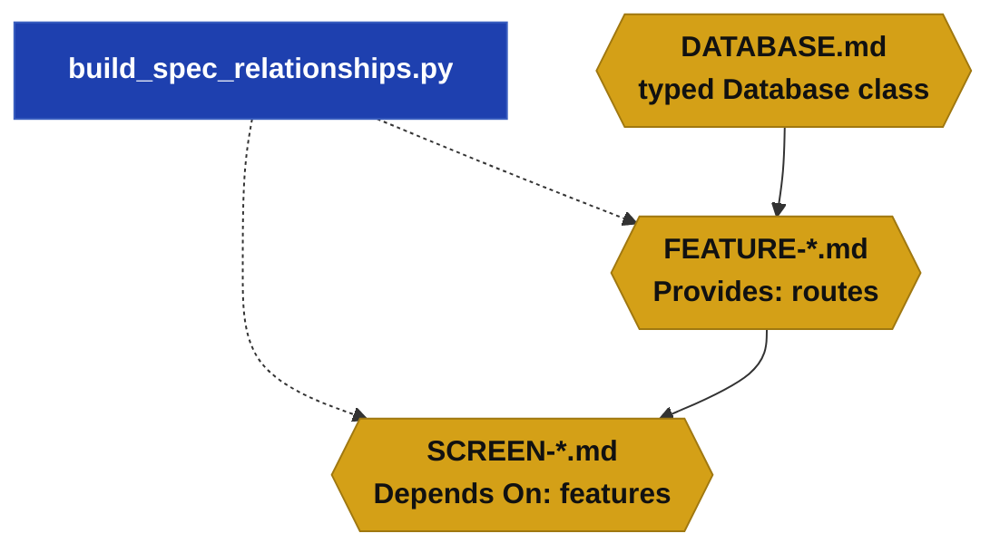
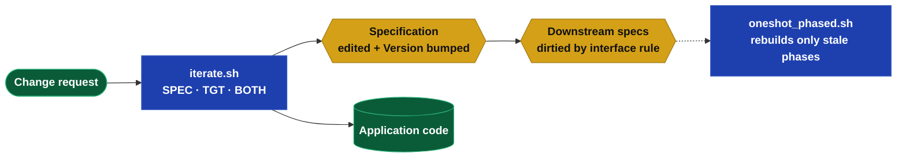

## The Problem

The first build of a Specification Driven Design project is the easy case. A clean specification
goes in, an AI agent expands it against the stack rules, and a working system comes out. The
specification is the source of truth and the code is a projection of it.

Then reality arrives. A defect is found. A field needs a timezone. A screen needs a column. The
question is no longer "how do I build this" but "how do I fold this change back into a living
system." Three failure modes lurk in that question:

- **Specification rot.** If the change is made to the code and not the specification, the two
  diverge. The next full build silently reverts the fix. The source of truth quietly stops being
  true.
- **Over-rebuild.** If the change touches a foundational file, a naive build rebuilds everything
  that file touches — which, for a database or an architecture file, is the whole system.
- **Lost changes.** If the change is parked in a backlog to be applied later, the backlog grows,
  the context evaporates, and the change is applied long after the person who understood it has
  moved on.

This paper is the history of getting that loop wrong three times, and the model that finally
got it right.

## Loop 1 — Capture changes from the session log (`tran_logger.sh`)

The first instinct was automation. After an interactive session with the agent, a tool read the
session transcript, extracted what looked like bugs and decisions, and wrote them back into the
specification directory as numbered tickets.

It failed on signal-to-noise. A working session contains exploration, dead ends, and thinking
aloud. Extracting "the changes" from that stream produced tickets that were sometimes wrong,
frequently redundant, and always required human review before they could be trusted. The tool
added a step without removing one. It was retired.

> **Lesson:** A transcript is a record of how a decision was reached, not a statement of the
> decision. Mining intent out of process is harder than simply stating the intent.

## Loop 2 — Log changes, apply in batches (`change_log.sh`, `/sdd`, `iterate_batch.sh`)

The second loop made the human state the change explicitly. A defect became a one-line entry in a
`CHANGE_LOG.md` — a pipe-delimited record of date, type, scope, and description. A batch runner
later read the log, grouped entries by scope, and applied each group.

This was more honest than mining a transcript, but it was clunky in practice. The log was a second
place to look, separate from the specification. Each pending change drove its own apply pass, so a
handful of small fixes became a handful of separate agent sessions. And the entries described the
change without making it — the specification still did not reflect reality until the batch ran.

> **Lesson:** A change log is a queue, and a queue is latency. The longer a change sits described
> but not applied, the more the specification lies about the system.

## Loop 3 — Fix the specification and re-build

The third loop dropped the intermediary entirely: edit the specification, then re-run the build.
This was correct in principle — the specification stayed the source of truth — and it is most of
the answer. But it exposed the over-rebuild problem in full.

A one-line change to a database file forced a rebuild of every phase that database file touched.
Because foundational files are context for the entire build, "every phase that touches it" meant
"every phase." A trivial, safe change became an expensive, risky rebuild, and the operator learned
to fear editing the foundation at all.

Two things were missing: a way to know which downstream artifacts a change actually invalidated,
and an architecture in which a small change stayed small.

> **Lesson:** Editing the specification is right. Rebuilding indiscriminately is not. The build
> needs to know the difference between a change that ripples and a change that does not.

## The Answer, Part 1 — Contain the blast radius with encapsulation

The over-rebuild problem was treated first as a tracking problem and then, correctly, as an
architectural one. A one-line storage change rippling through the whole system is a symptom: it
means application code reaches directly into storage, so every reader is coupled to the storage
shape.

The cloud layer never had this problem. A single library owned every external service; application
code that imported the cloud SDK directly failed review. Swapping or changing a service touched one
class. The fix was to generalize that discipline to every persistent store:

- Each database table is a typed row plus a CRUD class, composed into one `Database` class.
- All environment access goes through one typed `Config` class.
- File access goes through a `FileStore` class.
- External services are wrapped in classes over a shared base class.

With the boundary in place, the database file is no longer a global dependency. It is the
implementation behind a typed interface. A change to storage internals — a new index, a default, a
tightened format inside an existing field — is absorbed by the class and is invisible to everything
upstream.

> **The interface, not the schema, is the dependency boundary.** A storage change that leaves the
> interface unchanged invalidates nothing downstream.

## The Answer, Part 2 — The specification dependency tree

Encapsulation shrinks the blast radius; the dependency tree measures what remains. Every
specification file carries machine-maintained relationship headers. `Provides` lists the routes a
feature exposes. `Depends On` lists the files a screen or feature requires. A scanner derives these
by matching the routes a screen references to the features that provide them.

*The tree is derived, not hand-written. Features depend on the database through its typed class;
screens depend on features through their routes.*

This tree turns "what did I just invalidate" into a bounded question. When a feature is edited, its
dependent screens are exactly the ones whose routes it provides. When the database is edited, the
candidate set is the features that use it. The tree supplies the candidates; the interface rule
decides which ones are genuinely stale.

## The Answer, Part 3 — Interface-based dirtying

When the operator edits a base specification, the agent that made the change is responsible for
marking the downstream artifacts the change actually invalidated. It does so by bumping only the
`Version` header of each affected file. The rule is interface-based:

- **Editing `DATABASE.md` or `ARCHITECTURE.md`:** dirty a feature only if the typed access
  interface it uses changed — a method signature, a field it reads, a config key, a service
  method. A storage-internal change dirties nothing.
- **Editing a `FEATURE`:** dirty a screen only if the API behavior or the route set changed.
  Identical routes and identical behavior dirty nothing.

A `Version` bump is a real, committed change to the file. Unlike a touched modification time, it
survives a clone, it appears in a diff, and it changes the file's content hash — which is exactly
what the build watches.

## The Answer, Part 4 — Build records and hash-based staleness

Each phase of a build records, in its metadata, the content hash of every specification file that
fed it, plus the specification commit. On the next build, a phase is stale when any of its input
hashes differs from the recorded hash. Nothing else rebuilds.

This is durable where modification times are not. A fresh clone resets every file's timestamp, so a
timestamp-based check would rebuild everything on a machine that had built nothing. A content hash
depends only on the bytes, so it gives the same answer everywhere. And because the dirtying rule
bumps a downstream file's `Version`, that file's hash changes, and the phase that built it is
marked stale — automatically and selectively.

## The Answer, Part 5 — One command, three intentions (`iterate.sh`)

The loop is now a single command with an action that names the intent:

*BOTH edits the specification and applies it to code in one session; SPEC edits the specification
only; TGT is a code-only emergency fix.*

- **SPEC** edits the specification only. Use it when a full rebuild will follow.
- **TGT** patches the application code only and leaves the specification untouched. It is the
  emergency hotfix, and it is the one path that knowingly accepts drift.
- **BOTH** edits the specification, dirties the downstream, then applies the change to the code in
  the same session. It is the default, because for a small project the cost of doing both is low
  and it never lets the specification and the code drift apart.

After a specification edit, the relationship headers are refreshed so the next iteration reasons
about the current tree. The change is made once, in the right place, and the build rebuilds only
what the change reached.

## Principles

The four loops reduce to a short list of principles that hold beyond this toolchain:

1. **Iterate the source of truth.** If the specification is authoritative, the change belongs in
   the specification — not a transcript, not a log, not the code alone.
2. **Make small changes small.** Contain coupling behind typed interfaces so a change to an
   implementation does not become a change to everything that uses it.
3. **Invalidate by interface, not by file.** A dependent is stale only when the contract it relies
   on changed.
4. **Choose a staleness signal that survives a clone.** Content hashes do; timestamps do not.
5. **Name the intent.** An explicit action — specification, code, or both — beats a flag, and a
   sensible default beats a decision the operator has to make every time.
