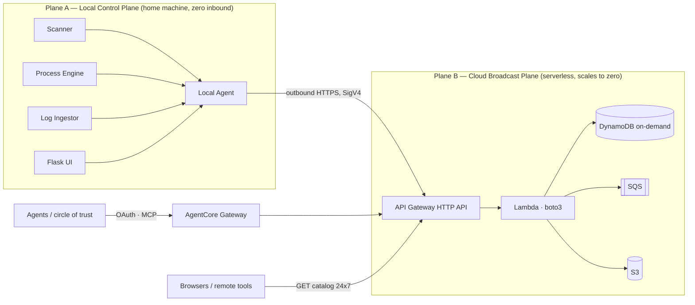

## Executive Summary

Marina is, today, a single-host Flask application that runs entirely on the developer's machine. It
scans local directories, forks `bin/` scripts, polls `localhost` health endpoints, ingests local log
files, and hosts MCP servers on a local port range. These operations are **intrinsically local** —
they act on local processes, local disk, and local PIDs. They cannot move to AWS, and they should not.

What the owner identified as worth broadcasting — the **capability catalog, project metadata, and
last-known health** — is read-mostly state. That state should live in the cloud, where it is reachable
24×7 even when the laptop is off. The conclusion is a hybrid, not a migration.

> **The one non-negotiable: the home network exposes zero inbound.** The local agent makes only
> outbound HTTPS calls to AWS. There is no port forward, no public IP on the home side, and nothing to
> attack inbound. This directly answers the project's founding worry — that home networks are "very
> vulnerable from attacks that direction." The cloud split *strengthens* the security perimeter rather
> than weakening it.

### The two planes

*Operations stay local because the things they act on are local. State is published outward; reads are served by the cloud.*

## Feature-by-Feature Mapping

| Marina feature | Verdict | AWS service | Phase |
|---|---|---|---|
| SQLite catalog / state | Move (projection) | DynamoDB on-demand, single-table | P1 |
| Catalog & capability read API | Move (read 24×7) | API Gateway HTTP API + Lambda | P1 |
| Heartbeat / event ingest | Move (ingest 24×7) | API Gateway + Lambda → DynamoDB | P2 |
| AsyncQueue (JSONL store-and-forward) | Replace | SQS (pay-per-request) | P2 |
| VoiceForward upload | Split — capture cloud, transcribe local | API Gateway → S3 + SQS | P2 |
| MCP hosting / capability sharing | Promote-to-remote | AgentCore Gateway + Identity | P3 |
| Scanner / process engine / log ingestor / scheduler | Stay local | — | — |
| Docker per-project isolation | Stay local; optional cloud burst | ECS Fargate | P4 |

The async queue is the clearest swap. The specification's own rationale — "a phone sends a voice note
at 2 AM, the server is down, drain on startup" — is the canonical SQS use case. The local drain pulls
messages when the machine is alive; the queue itself never sleeps. VoiceForward follows the same split:
capture audio to S3 and enqueue a job 24×7, but keep the expensive Whisper transcription local so there
is no GPU cost.

## Decision Table

Mark one decision per row. The recommendation column is the analysis position; the cost column is the
estimated monthly spend at this scale (a handful of projects, light sporadic traffic).

| AWS service | Replaces / provides | Recommendation | Est. $/mo | Your decision |
|---|---|---|---|---|
| **DynamoDB on-demand** | SQLite catalog projection | **Adopt P1** | ~$0 (cents) | ☐ Adopt ☐ Defer ☐ Skip |
| **API Gateway HTTP API** | Public 24×7 read/ingest surface | **Adopt P1** | ~$0–1 | ☐ Adopt ☐ Defer ☐ Skip |
| **Lambda (boto3)** | Catalog/ingest compute | **Adopt P1** | ~$0 (free tier) | ☐ Adopt ☐ Defer ☐ Skip |
| **SQS** | AsyncQueue transport | **Adopt P2** | ~$0 (free tier) | ☐ Adopt ☐ Defer ☐ Skip |
| **S3** | VoiceForward audio capture | **Adopt P2** | ~$0–1 | ☐ Adopt ☐ Defer ☐ Skip |
| **AgentCore Gateway** | MCP tool exposure to circle of trust | **Adopt P3** | ~$1–5 (usage) | ☐ Adopt ☐ Defer ☐ Skip |
| **AgentCore Identity** | OAuth / credential brokering for agents | **Adopt P3** | ~$0–1 | ☐ Adopt ☐ Defer ☐ Skip |
| **Cognito** | Human / team auth (circle of trust) | **Adopt P3** | ~$0 (free tier MAUs) | ☐ Adopt ☐ Defer ☐ Skip |
| **WAF** | Abuse / cost protection on API Gateway | **Optional P1** | ~$6–8 (has a floor) | ☐ Adopt ☐ Defer ☐ Skip |
| **SSM Parameter Store** | Local agent credentials (preferred) | **Adopt P1** | $0 (standard tier) | ☐ Adopt ☐ Defer ☐ Skip |
| **Secrets Manager** | Credentials needing rotation | Defer (use SSM unless rotation needed) | ~$0.40/secret | ☐ Adopt ☐ Defer ☐ Skip |
| **ECS Fargate** | Sporadic cloud container runs | **Adopt P4 (optional)** | ~$0 idle | ☐ Adopt ☐ Defer ☐ Skip |
| **Aurora Serverless v2** | Relational catalog (alternative to DynamoDB) | **Skip for catalog** | floor applies | ☐ Adopt ☐ Defer ☐ Skip |
| **EKS / Kubernetes** | Always-on orchestration | **Skip** | ~$73+ floor | ☐ Adopt ☐ Defer ☐ Skip |

### DynamoDB over Aurora

The owner likes Aurora but needs on-demand, not always-on. Aurora Serverless v2 now scales to a low
floor and can pause, but it carries cold-start latency and a standing monthly cost, and it is overkill
for a catalog that is essentially key-value. **DynamoDB on-demand is the better "costs next to nothing"
fit**: pay-per-request, no idle charge, cents per month at this scale. Keep Aurora Serverless v2 (or
Aurora DSQL) in reserve only if a future feature genuinely needs relational SQL — joins or ad-hoc
queries across projects. Do not adopt Aurora for the catalog.

### Kubernetes is not recommended

EKS carries a control-plane floor of roughly seventy dollars per month before any nodes, which
contradicts the near-zero-cost goal. Keep workloads local — Docker provides the per-project isolation
already specified in the Docker architecture — and use Fargate for the occasional cloud run. Revisit
Kubernetes only if Marina grows into many always-on shared services.

### WAF is the one real floor

WAF is the only service in the P1 path with a standing monthly cost (~$6–8). It is **optional**: API
Gateway's own throttling and usage plans, combined with IAM (SigV4) and Cognito authorization, provide
adequate protection for a private circle of trust at zero floor. Adopt WAF only if the catalog is
opened to the broader internet.

## Security Framework

The local agent is **outbound-only**. It signs requests to API Gateway with SigV4 (native to boto3),
pushes catalog, heartbeat, and event data upward, and long-polls SQS for inbound work. It never opens a
listener on the public internet.

The public surface — API Gateway plus Lambda — is hardened with:

- **IAM / SigV4** for machine-to-machine callers (the local agent, remote cron jobs).
- **Cognito or AgentCore Identity (JWT / OAuth)** for humans and agents in the circle of trust.
- **API Gateway throttling and usage plans** to cap abuse and cost; **WAF** optionally on top.
- **Least-privilege IAM** for the local agent: write only its own catalog partition, read only its own
  queue, write only its own S3 prefix.
- **SSM Parameter Store / Secrets Manager** for the local agent's scoped credentials.

The authorization model already exists in the specification. The capability schema in
`SPECIFICATION_CONTRACT.md` carries `permissions: { owners, access }`. Those owners map directly to IAM
or Cognito groups — there is no new authorization concept to invent. DynamoDB items are partitioned by
owner: one AWS account per owner to start, multi-tenant partition keys when sharing across the circle
of trust.

## Phasing

1. **Phase 1 — Broadcast catalog (MVP, zero idle).** DynamoDB on-demand, API Gateway HTTP API, and
   Lambda. The local agent publishes catalog and metadata on each scan; the cloud serves the catalog
   and capability reads 24×7. SigV4 plus optional WAF.
2. **Phase 2 — Durable ingest.** SQS for the async queue and S3 for VoiceForward capture, with
   heartbeat and event ingest Lambdas. The local drain pulls when alive; remote producers work 24×7.
3. **Phase 3 — Secure capability sharing.** AgentCore Gateway and Identity expose the catalog as MCP
   tools to the circle of trust over OAuth, retiring the raw-port `.mcp.json` exposure model.
4. **Phase 4 (optional) — Cloud burst.** Fargate task definitions for sporadic containerized runs,
   reusing the Dockerfiles already generated by the conformance layer.

## Cost Model

| Path | Services | Estimated $/mo |
|---|---|---|
| **P1 only** (read catalog) | DynamoDB + API Gateway + Lambda + SSM | **~$0–2** (add ~$6–8 if WAF) |
| **P1–P3** (catalog + ingest + sharing) | + SQS + S3 + AgentCore + Cognito | **~$2–9** without WAF; **~$8–17** with WAF |

The dominant variable is WAF. Everything else lives within or near free-tier limits at this scale.
AgentCore pricing is newer and usage-based; the figures above are conservative estimates and should be
confirmed against current AWS pricing before Phase 3.

## Open Questions

- **AWS account model:** one shared account with per-owner partition keys, or one account per owner?
  Recommendation: start single-account, partitioned by owner.
- **AgentCore pricing:** confirm Gateway and Identity consumption pricing before committing Phase 3.
- **Catalog audience:** private circle of trust only (no WAF needed), or internet-facing (WAF
  recommended)?
- **Deployment tooling:** CloudFormation, CDK, Terraform, or raw boto3 scripts for provisioning the
  cloud plane? The owner prefers boto3 for application code; infrastructure provisioning is a separate
  choice.

*Next stage, after the decisions above are marked: author the `FEATURE-CLOUD-*` and
`ARCHITECTURE-CLOUD.md` specifications in the Specifications repository for the selected services only.*
