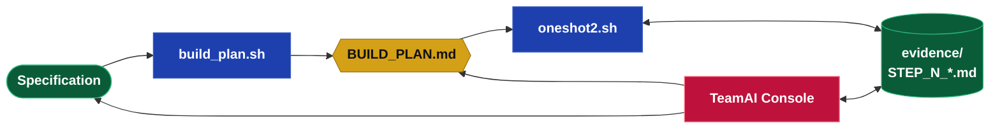

## The Workflow

A specification goes in; a reviewed, working build comes out. `build_plan.sh` analyzes the
specification and writes the plan, `BUILD_PLAN.md`, splitting the work into spikes for the unknowns,
stories for the known work, and acceptance criteria to verify it. You approve the plan once, up
front. `oneshot2.sh` then drives the build: it runs the runnable frontier, writes each step's
evidence to `evidence/`, and stops at a gate. The product owner reviews that evidence in the TeamAI
console and approves, revises, or rejects; the decision returns to `BUILD_PLAN.md` and unblocks the
next frontier.

> **Agile terms** (standard definitions):
>
> - **Spike** — a time-boxed investigation that resolves an unknown.
> - **Story** — a small unit of working, user-valued functionality, sized for one iteration.
> - **Acceptance criteria** — the conditions a story must satisfy to be accepted as done.
> - **Demo** — a working increment shown to the product owner for review.
> - **Evidence** — the artifacts a step produces (`STEP_N_*.md`), read into the steps that follow.



## Commands

Each command names its output: the plan produces the plan file; the build consumes it and produces
evidence; the console writes decisions back.

| Command | Produces |
|---------|----------|
| `bin/build_plan.sh <Spec> --analysis` | `BUILD_PLAN.md` — spikes, stories, acceptance criteria, and their dependency graph. |
| `bin/oneshot2.sh <Spec> <Target>` | Runs the runnable frontier → writes `evidence/STEP_N_*.md`, then **stops at the gate and exits** (it is a batch, not a daemon). Review, then re-run to continue. Pass `--watch` to hold and poll instead. |
| `bin/oneshot2.sh <Spec> <Target> state` | Renders `AGILE_PLAN.md` as a mermaid chart colored by state, with an *approved / total* count. |
| `teamai_console/bin/start.sh <Spec> [<Target>]` | Opens the Per-Project Collaboration Console — an Agile board (Backlog → In Progress → Needs Review → Done) where you read each ticket's evidence and **Approve**, **Request change**, or **Reject**. |

> All AI runs through the Claude CLI (`claude -p`). Each call is stateless — the declared input and
> output files *are* the build's memory, which is why decisions are reconciled into the
> specification rather than left as loose output.

## Custom DEV UI

The TeamAI Collaboration Console is a per-project Kanban board built entirely by an LLM as part
of the Edgar2 project build. It was generated through the same oneshot pipeline it supports —
making it both a product of the methodology and a live demonstration of it. The console required
no hand-written frontend code; the specification described the review workflow and the build
produced a working React application.

The board surfaces the Agile state machine as a visual interface: tickets move from Backlog through
In Progress and Needs Review to Done, each carrying its full evidence file, acceptance criteria
checklist, and the product owner decision panel. The LLM cannot write decisions to the plan
directly — that authority belongs to the product owner — so the console is the handoff point
between the automated build and human judgement.


*The TeamAI console during the Edgar2 build: seven spikes approved in Done, stories queued in Backlog and one In Progress.*


*The per-ticket review panel: finding, acceptance criteria status, and the product owner decision buttons. Evidence is expanded below.*

## The Plan File: BUILD_PLAN.md

`build_plan.sh` writes one file, and that file is the whole truth of the build: every object, every
dependency, every state — enough to render the plan, compute the runnable frontier, and resume after
an interruption without consulting anything else. The plan *is* the state.

The file opens with **plan metadata** — `spec` (the specification analyzed), `target` (the build
workspace), `plan_hash` (a hash of the spec; a change invalidates the plan), and `updated` (the last
state write) — then lists three kinds of object.

Every spike and story is an Agile **ticket** — like a Jira card, minus story points. It carries a
clean `name`, a one-line `summary` (the synopsis you read on the board), a `description` (the task
itself, complete enough for the engineer to operate on), declared `inputs` / `evidence`, and a
`state`. The task is kept separate from the result: the `description` says what to do; the
`finding`, written after the run, says what came out, in one line. Full detail lives in the
evidence file, not in the plan.

**Spikes** — investigate one unknown each:

| Field | Meaning |
|-------|---------|
| `name` / `summary` | The unknown as a ticket name, and a one-line synopsis for reading. |
| `description` | The task the engineer operates on. |
| `inputs` | Declared files read — the spec and earlier evidence. |
| `evidence` | The `STEP_N_*.md` artifact(s) it must write. |
| `question` / `finding` | The unknown it resolves; the one-line result, written after the run. |
| `state` | pending → running → awaiting review → approved / revise / rejected. |

**Stories** — build one piece of known work each:

| Field | Meaning |
|-------|---------|
| `name` / `summary` | The work item and a one-line synopsis. |
| `description` | The task the engineer builds from. |
| `inputs` / `kind` | Declared files read; `python` (pytest-verified) or `analysis` (review-verified). |
| `state` | pending → built → tested → accepted. |

**Acceptance criteria** — verify behaviour. The criterion text *is* the ticket name; every spike
and story carries at least one:

| Field | Meaning |
|-------|---------|
| `parent` | The spike or story it verifies. |
| `origin` | `dev` (team-defined, part of the ticket) or `po` (a defect the product owner entered). |
| `kind` | `guardrail` (permanent) or `assertion` (reconciled once verified). |
| `state` | open → verified / failed. |

A `BUILD_PLAN.md` reads like this:

```
# AGILE_PLAN: Edgar2
spec:       Edgar2
target:     /abs/path/to/build
plan_hash:  abc123def456
updated:    2026-05-24T12:00:00

## spike 1: Library discovery
summary:     Choose the PDF parser and prove it extracts tables.
description: Compare candidate PDF libraries on three sample filings; pick one and show
             it extracts the position tables cleanly, with no heavy native dependencies.
inputs:      SPECIFICATION.md
evidence:    STEP_1_LIBRARY_DISCOVERY.md
question:    Which PDF library?
finding:     pdfplumber extracts all three sample tables; no native deps.
state:       approved

## story 1: Filing importer
summary:     Ingest a filing and persist normalized rows.
description: Build importer.py that reads a filing via the chosen library and writes
             normalized rows to the filings and positions tables, deduplicated by accession.
inputs:      SPECIFICATION.md, STEP_1_LIBRARY_DISCOVERY.md
kind:        python
evidence:    STEP_S1_FILING_IMPORTER.md
state:       pending

## ac 1: importer rejects a duplicate filing
parent:      story 1
origin:      dev
kind:        guardrail
state:       open
```

When a spike settles a question, its decisions are written into the specification and the matching
`## Open Questions` bullet is closed — decisions never live only in evidence or code.

## Iterating Your Project

Once an initial build is complete, new requirements are added through change files rather than by
editing the original specification. The build system detects what is new, generates only the
additional work objects required, and appends them to the existing plan so that approved spikes
and accepted stories are never disturbed.

### Adding New Work

Create a descriptively named `.md` file in the specification directory — for example
`CHANGE-PAYMENT-FLOW.md` or `FEATURE-EXPORT.md`. Describe the new requirements in plain
language; structure it however is clearest. All `.md` files in the specification directory
(other than `METADATA.md`, `README.md`, and `AGILE_PLAN.md`) are automatically included in the
analysis.

> **Suggested naming:** prefix iteration files with `CHANGE-` to distinguish them from the
> original specification. The system accepts any name — clear names are the only requirement.

### Running the Merge Analysis

Commit the new file to git, then re-run the analysis command:

```bash
bash bin/build_plan.sh <Spec> --analysis
```

The tool compares the current git HEAD against `spec_commit` stored in `AGILE_PLAN.md` to
identify which files are new or changed since the last analysis. It then:

1. Prints the list of changed files.
2. Sends those files plus the original specification to Claude for decomposition.
3. Generates new spikes, stories, and acceptance criteria numbered after the existing objects.
4. Appends the new objects to `AGILE_PLAN.md` without touching any existing state.
5. Updates `spec_commit` to the current commit.

```
Changed files since last analysis (a3f9c1d2):
  + CHANGE-PAYMENT-FLOW.md
Analyzing 1 changed file(s) with claude -p (sonnet) ...
Merged into AGILE_PLAN.md: +0 spike(s), +2 story(ies), +3 acceptance criteria.

Next: bash bin/oneshot2.sh MyProject ../MyProject
```

If no `.md` files have changed since the last commit, the command reports this and exits cleanly.
Use `--force` to regenerate the entire plan from scratch (this discards all approved/accepted state
and should only be used when the specification itself changes significantly).

### Continuing the Build

Running `oneshot2.sh` after a merge analysis automatically picks up the new objects. On each
invocation, the driver calls `merge-seed` — which copies any objects present in the spec-directory
plan but absent from the live target plan, leaving all existing states intact. The new objects
appear as `pending` on the runnable frontier and the build continues from where it left off.

```bash
bash bin/oneshot2.sh <Spec> <TargetDir>          # resumes; runs new frontier objects
bash bin/oneshot2.sh <Spec> <TargetDir> status   # shows all objects including new ones
```

### What Does Not Change

- Approved spikes, accepted stories, and verified acceptance criteria are never modified by a
  merge analysis or a `merge-seed` operation.
- The original specification file is not edited during iteration — new requirements live in the
  change files until a spike reconciles a decision back into it.
- Object numbers are permanent; new objects always receive the next unused number.

### Lightweight Iteration with CLAUDE.md and ACCEPTANCE_CRITERIA.md

For projects that run outside the full spike-and-story pipeline — CLI tools, data pipelines,
scripts that evolve incrementally — iteration discipline can be enforced through a `CLAUDE.md`
instruction rather than through the agile console infrastructure.

Add the following rule to your project's `CLAUDE.md`:

```
## Change Management

**Every code change must be documented in `ACCEPTANCE_CRITERIA.md`** before committing.
Add a new versioned section (`## Change Set N — YYYY-MM-DD`) with bullet-point acceptance
criteria in the form *"component does X"*. This file is the rebuild contract — it must stay
current so the project can be reconstructed from specs alone.
```

This creates a lightweight `ACCEPTANCE_CRITERIA.md` — a file that grows with the project and
serves as its living specification. Each change set is immutable once committed: corrections
go into a new numbered set rather than editing earlier ones, so the file reads as a complete,
append-only history of every decision made.

```
## Change Set 1 — 2026-05-26: Starting/Completed messages, show flag, row-count tests

- `build_schema.py main()` prints `Starting build_schema` on entry and `Completed build_schema` on exit.
- `run_pipeline.py main()` logs `Starting Edgar2 pipeline` on entry and `Completed Edgar2 pipeline` on exit.
- `run_pipeline.py` accepts a `--show` flag that re-renders the scoreboard without re-fetching.
- `test_pipeline.py` asserts the `filings` table has exactly `len(DEFAULT_TICKERS) × 4` rows.

## Change Set 2 — 2026-05-26: CSV export script

- `export_csv.py` is runnable as `python3 export_csv.py [--db PATH] [--out PATH]`.
- Priority columns appear left-to-right: ticker, period_end, form_type, total_score, band.
- Signal columns are extracted from the `signal_detail` JSON field.
```

Because the agent reads `CLAUDE.md` at the start of every session, this instruction is honoured
automatically — no scaffolding required. Every new feature, defect fix, or refactor arrives with
its acceptance criteria already written. The file doubles as a rebuild contract: if the codebase
were lost, `ACCEPTANCE_CRITERIA.md` alone contains enough specification to reconstruct it from
scratch by feeding it back to an agent.

This pattern sits one level below the full oneshot pipeline. It does not produce spikes, a
`BUILD_PLAN.md`, or a Kanban board — but it imposes the same discipline that makes those tools
useful: every change is written down before it is committed, and the written record is permanent.
