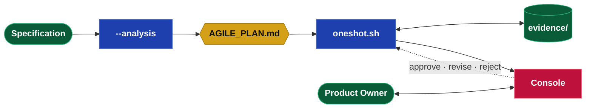

## How it works

A specification goes in; a reviewed, working build comes out. The team decomposes the spec into
an agile backlog, builds the runnable frontier one ticket at a time, and stops at a review gate.
You review in the Console and decide; the build resumes.

```bash
bash bin/oneshot.sh <Spec> <Target>          # builds the frontier, then stops at the gate
bash <Target>/Console/start.sh               # review the board (http://127.0.0.1:8080)
bash bin/oneshot.sh <Spec> <Target> approve <id>   # accept; unblocks dependents
```

The analysis runs automatically on first use. To (re)plan explicitly:
`bash bin/build_plan.sh <Spec> --analysis`.



## Decomposition

The team turns the specification into **features**, then into **stories** (known work) and
**spikes** (unknowns). Every story and spike carries **acceptance criteria**. A ticket that needs
a decision only you can make carries an **Open Question** and is **blocked** until you answer.

## The Console

The team communicates through the Console — a config-driven web app deployed to every project, no
build required. One file, `console.json`, lists **items**; each renders by its type. Items group
into **sections**, and a section is the item's state:

| Section | Holds |
|---------|-------|
| **Core Docs** | The specification, co-edited (`editable_markdown`). |
| **Plan** | The sprint board (`kanban`). |
| **Action Items** | Open questions to answer (`questionnaire`). |
| **Pages** | Demos and evidence to read and sign off (`markdown` + `"review": true`). |
| **Archive** | Closed items. |

For a oneshot build the config is generated from `AGILE_PLAN.md` after every run — you do not
write it. `console.json`:

```json
{
  "console": { "name": "Edgar2 Console", "default_item": "board", "state_db": "data/console_state.sqlite" },
  "project": { "id": "Edgar2", "name": "Edgar2", "description": "oneshot build." },
  "items": [
    { "id": "spec",  "label": "Specification", "section": "core",  "type": "markdown", "path": "specification.md" },
    { "id": "board", "label": "Sprint Board",  "section": "plan",  "type": "kanban",   "path": "tickets.json" },
    { "id": "ev_s1", "label": "S1 Importer",   "section": "pages", "type": "markdown", "path": "../evidence/STEP_S1_FILING_IMPORTER.md", "review": true }
  ]
}
```

The board, `tickets.json` — features own stories through `parent`; acceptance criteria and a
blocker are first-class:

```json
{
  "tickets": [
    { "id": "FEAT-1", "title": "Filing importer", "kind": "feature", "status": "in_progress" },
    { "id": "SPIKE-1", "title": "Choose a PDF library", "parent": "FEAT-1", "status": "review",
      "blocked": true, "blocked_reason": "Which PDF library?", "links": ["q_parser"],
      "ac": ["Extracts tables from all three sample filings", "No native dependencies"] },
    { "id": "STORY-1", "title": "Persist normalized rows", "parent": "FEAT-1", "status": "backlog",
      "ac": ["Rejects a duplicate filing", "Writes filings and positions tables"] }
  ]
}
```

An Open Question, `questionnaires/spike_1.json` — answers are saved back into the file:

```json
{
  "id": "spike_1", "title": "PDF library", "state": "open",
  "questions": [
    { "id": "native_ok", "label": "Native deps", "prompt": "Are native dependencies acceptable?",
      "input": "select", "options": ["No — pure Python", "Yes"] }
  ]
}
```

Evidence, `evidence/STEP_S1_FILING_IMPORTER.md` — surfaced with a sign-off bar:

~~~markdown
# STEP S1 — Filing importer

## What was built
- importer.py reads a filing and writes normalized rows.

## How to try it
    python importer.py samples/0001.pdf

## Result
- 3 filings imported; duplicate rejected; tests pass.
~~~

## Evidence and decisions

- Every step ships a **demo and an evidence file**; nothing advances without something to see.
- **Low-priority decisions** are made by the team, with the rationale in the step's evidence.
- **Your decisions** happen in the Console: **Approve · Revise · Reject** an increment, verify or
  fail each acceptance criterion, answer the open questions. A revision returns as a new criterion.

## AGILE_PLAN.md

The plan is the state — backlog and live state in one file, enough to render the board, compute
the frontier, and resume.

```
# AGILE_PLAN: Edgar2
spec:        Edgar2
spec_commit: abc123def456
updated:     2026-06-06T12:00:00

## feature 1: Filing importer
summary:    Ingest a filing and persist normalized rows.

## spike 1: Choose a PDF library
parent:     feature 1
description: Compare candidate libraries; demo extraction.
evidence:   STEP_1_LIBRARY_DISCOVERY.md
question:   Which PDF library?
finding:    pdfplumber; no native deps.
state:      approved

## story 1: Persist normalized rows
parent:     feature 1
description: Build importer.py against the chosen library.
inputs:     STEP_1_LIBRARY_DISCOVERY.md
kind:       python
evidence:   STEP_S1_FILING_IMPORTER.md
state:      pending

## ac 1: importer rejects a duplicate filing
parent:     story 1
state:      open
```

## Commands

| Command | Does |
|---------|------|
| `bash bin/build_plan.sh <Spec> --analysis` | Decompose the spec into `AGILE_PLAN.md`. Runs automatically on first `oneshot.sh`. |
| `bash bin/oneshot.sh <Spec> <Target>` | Build the frontier, write demos and evidence, refresh the Console board, stop at the gate. |
| `bash bin/oneshot.sh <Spec> <Target> approve｜revise｜reject <id>` | Record a decision on a ticket. |
| `bash bin/oneshot.sh <Spec> <Target> status` | Print every object and its state. |
| `bash <Target>/Console/start.sh` | Open the Console at `http://127.0.0.1:8080`. |
