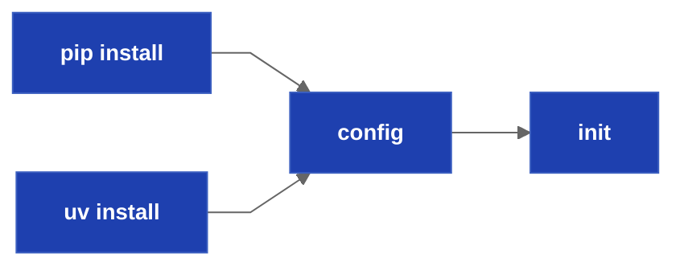
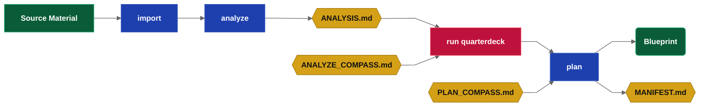
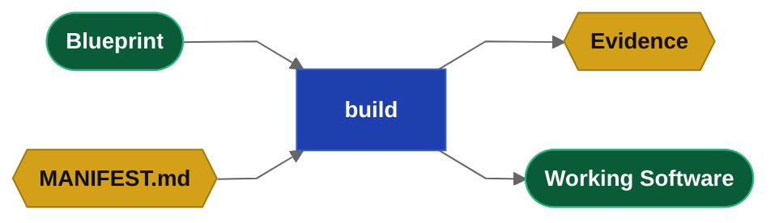
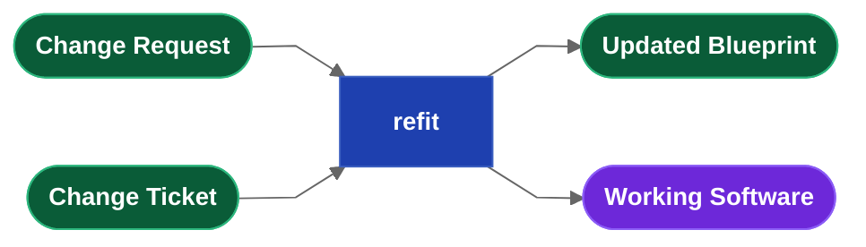

## What is Drydock

Drydock is a governed Blueprint-driven software delivery system built around the **SAIL methodology**.

**The Commander.** Drydock addresses its operator as the Commander. The Commander owns the product direction, reviews the work, and approves decisions in the QuarterDeck.

**Drydock Blueprints** are the authoritative, living definition of a software product. Blueprints are composed of **Typed Specification Files** with prescribed roles. `drydock plan` turns imported source material into Blueprints and writes a **Manifest** that tracks dependency-aware build order, runnable work, and incremental rebuild scope.

Drydock builds with the product specification, the applicable Rigging, and the current plan. It groups related work to keep builds context-aware and reviewable.
Drydock build also applies dependency legitimacy guardrails before accepting generated Python dependency changes.

Rigging provides governed business rules, stack guidance, branding, and compact derivatives that keep downstream builds focused on how to use a capability instead of reloading full authoring context every time.

The loop phase lets the Commander update the product while preserving the specification as the source of truth. Edit specifications or add change tickets, run `drydock refit`, and rebuild normally.

Quality is verified deterministically with `drydock score ac` based on programmatic acceptance criteria. Project Quality is
verified by the LLM using `drydock score build` to evaluate the completed build.  

**Trust But Verify** - the Commander reviews in the Quarterdeck - running the next step in the process indicates approval.


### Glossary

| Drydock term | Meaning |
|---|---|
| Commander | The operator; the Agile Product Owner. |
| Target | The named project under `$DRYDOCK_WORKSPACE/targets/<Target>`. |
| Blueprint | The Typed Specification files that define the product; the source of truth. |
| Manifest | The executable build plan and dependency graph, `MANIFEST.md`. |
| Frontier | The set of Manifest blocks that are runnable now. |
| QuarterDeck | The web review console between the Commander and the LLM process. |
| Compass | Persistent project guidance used by Drydock commands. |
| Rigging | Shared branding, stack rules, templates, and compact context derivatives. |
| Soundings | The per-story acceptance-criterion verification board; Sea Trials is the project-level gate. |
| Proof integrity | Static analysis that demotes a vacuous or tautological acceptance proof to UNVERIFIED, so a passing test cannot lift the score without actually proving behavior. |
| Sea Trials | Product-level objectives and proof-of-delivery criteria. |
| Refit | Change process that maps updates into the manifest. |

## Drydock Features

**Drydock is DevOps for specifications** and provides a governed build pipeline to create working software from your imported specifications. 

**Overview**
- Works with your LLM subscription. No API keys, no per-token billing. (Trivial port to other LLM CLIs)
- Build large projects with low-end models 
- Context optimization at every step — LLM usage minimized.
- drydock is a devops/build process for Specifications - spec creation is out of scope

**Agile Methodology**
- Your Crew (LLM) uses Agile Best bractice
- The Story Planning phase surface blockers and questions
- The Decomposition phase turns specifications into features and stories
- Agile story points are token costs.

**Test Driven Develoment**
- Your Crew (LLM) uses Test Driven Development
- Create programmatic acceptance criteria before building using a checklist
- Surface questions for Commander review in the Quarterdeck
- Surface project acceptance criteria as SEA_TRIALS.md
- Can use EARS-notation acceptance criteria with grammar validation

**The Quarterdeck**
- QuarterDeck is a custom Commander to Crew web portal.
- Display Markdown using templates 
- Persist Commander decisions for future commands
- Questionaires provide feedback to your Crew 
- Surface Blockers and Build Failures for review 
- Gives the Commander control of each phase 

**Import**
- Copy specifications into the drydock workspace 
- Assume source spec are in arbitrary formats 

**Context Optimization**
- Context optimization at every stage
- Build sets of stories together to optimize context
- Dependency-graph build plan with runnable frontier ensures correct build order
- Context aware Blueprint Stacking best practices
- Compaction

**Governance**
- `drydock analyze` is Story Planning and surfaces any gaps
- Persistent intent injection at each process stage 
- `drydock plan` creates typed specifications with prescibed roles.
- EARS acceptance criteria, grammar-validated.
- Programatic Acceptance criteria for each story.
- Sealed foundational specifications require a change ticket to alter.
- Persistence encapsulation (library) prevent forced large rebuilds 
- Rigging injects enterprise standards, stack rules, and voice.
- Writes reviewable build evidence for completed work.

**Verification**
- Story Guardrails/AC are absolute prohibitions with a hard gate 
- Project Guardrails/AC validated using `drydock score relase` by the crew
- `drydock score ac` re-verifies story deterministic AC (SOUNDINGS.md).
- `drydock score release` re-verifies project acceptance using the LLM (SEA_TRIALS.md)
- Pre-Build RED->GREEN enforcement - Vacuous and unneeded AC are demoted 

**Complete change-management methodology**
- Blueprint drift detection and stale-plan reset
- Track cksum and git commit ids for built blueprints
- Refit detects new specs, any changes to existing spec, and change tickets
- Refit updates the Manifest for changes
- Changes are Built using `drydock build`

**Additional Features**
- Generates consistent project documentation in your voice 

## The drydock CLI

```text
drydock <verb> [<sub-verb>] [arguments] [--options]
```

Each project's `<Target>` uses a Workspace of `$DRYDOCK_WORKSPACE/targets/<Target>` and builds to `$DRYDOCK_BUILD_DIRECTORY/<Target>`.

```text
usage: drydock [-h] [--version] [--debug] <command> ...

Drydock — governed Blueprint-driven software delivery.
Copyright (c) 2026 Web Cloud Studio. All rights reserved.

positional arguments:
  <command>
    config    Show or set Drydock configuration.
    init      Initialize a target workspace.
    status    Show project status and orientation.
    validate  Validate a Blueprint's Typed Specification.
    document  Generate projdct documentation from Blueprints
    publish   Render frontmatter Markdown into publishable HTML.
    rigging   Manage Drydock Rigging.
    plan      Create the Manifest and Blueprints
    build     Build or inspect build state.
    refit     Update Blueprint and target software together.
    analyze   Decompose imported sources into stories, blockers, and acceptance milestones.
    run       Start a Drydock service.
    import    Copy your Specifications into the workspace.
    score     Evaluate acceptance and release readiness.

options:
  -h, --help  show this help message and exit
  --version   show program's version number and exit
  --debug     Show full traceback on unexpected errors.
```

## SAIL Phase 1 — Set Up: Laying the Keel

Install Drydock, configure runtime defaults, and create a workspace for a Target build.
Process environment variables override values stored in Drydock's user-scoped `.env`.



### Installation Instructions

**Prerequisites**

- Python 3.11 or later
- A subscription-authenticated CLI: `claude` (Anthropic) or `codex` (OpenAI)

**Install**

```bash
uv tool install drydock-sdd
# or: pipx install drydock-sdd
```

`uv tool` and `pipx` place `drydock` on `PATH` automatically.

**Configure the workspace**

Set `$PROJECTS` to the directory where you keep your projects, then run:

```bash
drydock config set drydock_workspace "$PROJECTS/drydock"
drydock config set drydock_build_directory "$PROJECTS"
```

**Initialize a target**

```bash
drydock init <Target>
```

The resulting layout:

```text
$PROJECTS/
├── drydock/                    # Drydock workspace
│   └── targets/<Target>/       # Created by drydock init - Project Workspace
└── <Target>/                   # Final Build Location for projects
```

### Commands

```text
drydock --help
drydock --version
drydock config show
drydock config set <key> <value>
drydock init <Target> [--display-name <name>] [--description <desc>]
drydock status [<Target>]
drydock run quarterdeck [<Target>] [--host HOST] [--port PORT]
```

### drydock status

`drydock status` is the primary orientation command. With no arguments it shows the workspace
dashboard across all initialized Targets. With a `<Target>` argument it filters to that Target,
showing its validation state, plan progress, and current runnable step.

### drydock config

`drydock config` establishes user-scoped defaults.


| Variable | Purpose |
|---|---|
| `drydock_build_directory` | Build root. Drydock builds `$DRYDOCK_BUILD_DIRECTORY/<Target>` and defaults this location under the workspace when unset. |
| `drydock_workspace` | Drydock workspace root. Commands require a resolved workspace. |
| `drydock_model` | Default model name passed to the configured subscription-authenticated CLI. |
| `llm_provider` | Subscription CLI provider: `claude` or `codex`. |
| `prompt_warn_tokens` | Prompt-size warning threshold in tokens. |
| `quarterdeck_port` | Default QuarterDeck service port. |

### drydock init

`drydock init <Target>` creates the temporary workspace for the Target under `$DRYDOCK_WORKSPACE/targets/`. Use `--display-name` to set a human-readable project name and `--description` to seed the one-line project summary in Target metadata.

## SAIL Phase 2 — Agile Analyze: Charting the Course

The Analyze phase turns imported source material into an Analysis for review, then into an executable Manifest for build.

1. `drydock import` brings source material under Drydock control.
2. `drydock analyze` reads the imported sources and derives stories, acceptance milestones, blockers, questions
3. `drydock run quarterdeck` lets the product owner review, approve, and answer questions
4. `drydock plan` consumes the analysis and creates Blueprint files and the Manifest.

> **Definition — Compass Files**
>
> Compass files hold Commander guidance for the project and for specific phases.
> `COMPASS.md` is inserted into every command. 
> `PLAN_COMPASS.md` is inserted into `drydock plan`. 
> `ANALYZE_COMPASS.md` is inserted into `drydock analyze`. 
> `MANIFEST.md` is the non-hand-editable directives for `drydock build`. 
> Compass files let the Commander define goals, constraints, and definition of done.

### Commands

```text
drydock import <Target> <Source> --format <auto|markdown|source|speckit|compass> [--force]
drydock analyze <Target>
drydock run quarterdeck [<Target>] [--host HOST] [--port PORT]
drydock plan [--overwrite] [--no-conform] <Target>
```



### drydock import

`drydock import <Target> <Source> --format <auto|markdown|source|speckit|compass>` is the intake step.
It brings external material under Drydock control. Drydock copies the selected source material into
the Target workspace for later analysis. Compass imports write `COMPASS.md` at the Target root.

`drydock import <Target> <Source File> --format markdown` imports general markdown specifications

`drydock import <Target> <Directory> --format markdown` imports general markdown specifications

`drydock import <Target> <Source> --format <source|speckit>` imports specifications from other systems

`drydock import <Target> <Source> --format compass` normalizes the source into the canonical
`COMPASS.md` format and writes it to the Target root. An existing `COMPASS.md` is preserved unless
`--force` is given.

### drydock analyze

`drydock analyze` decomposes imported source material into reviewable planning artifacts. It prepares the files the Commander uses to confirm scope, resolve blockers, answer questions, and approve the build direction before planning.

**Input files**

| Artifact | Location | Purpose |
|---|---|---|
| `sources/*` | `blueprint/` | Imported source material; read-only planning context |
| `*COMPASS.md` | Target root | Project guidance and command guidance |
| `ANALYZE_COMPASS.md` | Target root | Commander guidance for repeated analyze runs |
| `BLOCKERS.md` | Target root | Commander-edited blocker answers from prior runs |
| `questionnaires/*.json` | `QuarterDeck/` | Created by `drydock analyze`. Persistent answers consumed on re-run |

**Output files**

| Artifact | Location | Purpose |
|---|---|---|
| `BLOCKERS.md` | Target root | Questions on any blockers the LLM has found. Existence implies blockers.  Edit to resolve them. |
| `ANALYSIS.md` | Target root | Summary of the decomposition, story list, blockers, questions, and recommendations |
| `SEA_TRIALS.md` | Target root | Project-level acceptance criteria and release objectives |
| `COMPASS.md` | Target root | Created if absent. Review it if one was automatically created. |
| `questionnaires/*.json` | `QuarterDeck/` | Review questionnaires for unresolved decisions and genuine research spikes |
| `commanders_chair.html` | `QuarterDeck/` | QuarterDeck summary view for the current state |

The most important guard is `BLOCKERS.md`. If `BLOCKERS.md` exists, the Commander edits it and reruns `drydock analyze` until the blockers are cleared. `SEA_TRIALS.md` captures release-level success criteria. 

| Quality | Meaning |
|---|---|
| `Blocked` | One or more blockers prevent planning from proceeding |
| `Questions` | Planning may proceed, but open questions remain |
| `Ready` | No blockers remain |

### Agile Story Refinement with drydock run quarterdeck

> **Definition — QuarterDeck**
>
> The QuarterDeck is a web console that renders Markdown output generated by the LLM.
> It is how the Commander communicates with the Crew

`drydock run quarterdeck` starts a web console for the Commander (product owner).  It is your helm or cockpit.  Navigate to the listed host and port.

At this stage, the QuarterDeck shows the artifacts, blockers, questions, questionnaires, and activity that need review in the planning session. Review the tabs, answer blockers, and adjust Compass guidance before moving to `drydock plan`.

Questionnaires and BLOCKERS.md can be edited directly or modified in the QuarterDeck to respond.  Responses are used on the next run of `drydock analyze`.

Commander responses in the QuarterDeck are preserved for the build (by writing them to the appropriate markdown file).

The QuarterDeck calls out blockers and action items and gives the Commander a single place to review the current planning state.

### drydock plan

`drydock plan` converts the reviewed analysis into Typed Specification files under `blueprint/`, writes `MANIFEST.md`.
`MANIFEST.md` is the build graph plan. It records dependency-aware build order, the runnable frontier, and the work that must be revisited after change.

**Input files**

| Artifact | Location | Purpose |
|---|---|---|
| `sources/*` | `blueprint/` | Imported source files, re-read and reformatted into Typed Specifications |
| `ANALYSIS.md` | Target root | The reviewed analysis that drives decomposition |
| `PLAN_COMPASS.md` | Target root | Commander guidance for planning and grouping |
| `COMPASS.md` | Target root | Project guidance |
| `questionnaires/*.json` | `QuarterDeck/` | Resolved planning decisions |
| `SEA_TRIALS.md` | Target root | Structured project acceptance criteria and stable IDs |

**Output files**

| Artifact | Location | Purpose |
|---|---|---|
| `ARCHITECTURE.md`,<br> `DATABASE.md`,<br> `FEATURE-{Name}.md`,<br> `SCREEN-{Name}.md`,<br> `UI-GENERAL.md` | `blueprint/` | Typed Specification files |
| `MANIFEST.md` | Target root | The executable build plan |
| `SOUNDINGS.md` | Target root | Acceptance criteria projected by stable ID, `drydock score ac` sets its Verified column |

**Replan behavior**

`drydock plan` is rerun-safe. It preserves reviewed work where possible, rebuilds planning artifacts when inputs changed, and never overwrites Commander-owned Compass files.

## SAIL Phase 3 — Implement: Sailing the Frontier

Implement the Blueprint using the Manifest

* The Manifest exposes the phases with `drydock build status <Target>`.
* Iterate through the build phases with `drydock build <Target>`.
* Measure delivery health with `drydock score`.
* The rigging implements company standards and branding.

### Commands

```text
drydock build <Target> [--build-dir <path>]
drydock build <Target> --dry-run [--show-prompt] [--build-dir <path>]
drydock build <Target> --reset-failed [--build-dir <path>]
drydock build <Target> --normalize-order [--build-dir <path>]
drydock build <Target> --step <STEP> [--build-dir <path>]
drydock build <Target> --step <STEP> --force
drydock build status <Target>
drydock score ac <Target>
drydock score release <Target>

drydock document generate <Target> [--model <model>]
drydock document assemble <Target> [--theme <theme>]
drydock document assemble readme <Target>
drydock document <Target> [--model <model>] [--theme <theme>]

drydock publish <Source.md> --output <Output.html> [--theme <theme>] [--flatten] [--pdf] [--pdf-output <Output.pdf>]

drydock validate <Target> [--verbose]

drydock rigging --add --file <path>
drydock rigging --add --dir <path>
drydock rigging compact <Target> [--all] [--force] [--include-file <file.md>] [--exclude-file <file.md>] [--include-dir <dir>]
drydock rigging update <Target> [--dry-run]
drydock rigging verify <Target>
```

### Agile Build Planning with drydock run quarterdeck

Review `MANIFEST.md` in the QuarterDeck to understand the build process and to update build direction and instructions.

The manifest is your final Plan - The Commander can rearrange stories at their
whim in the QuarterDeck.

In the Build Compass you review the build plan in the Manifest.   The manifest will group similar steps
to reduce your context and will set the stories up in a meaningful implementaton plan of Foundation -> Data and Persistence -> Features -> User Interface.  Each step will display its estimated counts and the Commander can:
* reorder stories so important/testable steps are done first
* re group stories so they can be run by a single agent
* review Blueprint programmatic and user acceptance

If you do not story plan, you accept the LLM's default order of stories.

Note that the manifest titles each of the build steps and these steps are the implemented one by one.

The general order for operations is a loop:

    drydock build status <Target>
    while <STEPS REMAIN TO BE DONE>
      drydock build <Target>
      drydock build status <Target>

Passing programmatic acceptance unlocks the next set of dependent operations.

### drydock build

Build executes the work blocks in `MANIFEST.md` based on their dependency graph. 

Build also validates changed Python dependency manifests as part of build acceptance. Registry-backed
dependency names must resolve legitimately before a build block is accepted; suspicious dependency
names stop the block and surface a reviewable failure.

Each Manifest build step is quality-gated at the story or grouped-block level. Drydock shows
per-story acceptance observations in build evidence and operator output. Pre-build proof passes are
informational. Post-build proof failures fail the step.



**Input files**

| Artifact | Location | Purpose |
|---|---|---|
| `COMPASS.md` | Target root | Always Injected |
| `MANIFEST.md` | Target root | Executable build plan and dependency graph |
| `ARCHITECTURE.md`, `DATABASE.md`,<br> `FEATURE-{Name}.md`, <br>`SCREEN-{Name}.md`,<br> `UI-GENERAL.md` | `blueprint/` | Typed Specification files consumed for the current build step or phase |

**Output files**

| Artifact | Location | Purpose |
|---|---|---|
| `evidence/` | Target root | Reviewable build evidence written for completed work |
| Built application files | `<Target>` | Target working directory for build<br>override in `METADATA.md` field `build_dir:` |

`drydock build <Target>` executes the dependency-ready frontier and writes the application into `$DRYDOCK_BUILD_DIRECTORY/<Target>`. `--build-dir` overrides the output directory for the current run.

`--reset-failed` resets failed Manifest blocks and retries them. `--normalize-order` normalizes authored Manifest group order before building. `--step <STEP>` builds one named step, and `--force` resets that step and its child acceptance checks before rebuilding it.

`--dry-run` previews the next build step without invoking the LLM or writing files. `--show-prompt` prints the full assembled prompt only when combined with `--dry-run`.

Before executing work, `drydock build` checks previously applied Blueprint files for drift. If a governing specification changed, build stops and directs the Commander to run `drydock refit`. Foundational specifications such as `ARCHITECTURE.md`, `DATABASE.md`, and `UI-GENERAL.md` require an explicit change ticket.
Before acceptance closes a build block, `drydock build` also validates newly introduced or changed registry-backed Python dependency names. Dependency legitimacy failures are written through the normal build evidence and failure path.

### Agile Build Review with drydock run quarterdeck

The QuarterDeck guides the Commander through the agile process.  The build review lets the user see evidence, demos, and questions needed for a decision.

Conceptually the Build Review screen is similar to the `drydock build status` command.

### drydock build status

`drydock build status` reads `MANIFEST.md` and the runtime logs and reports the state of the plan.

```text
drydock build status <Target>   # print per-block state and current runnable frontier
```

### drydock score

```text
drydock score ac <Target>
drydock score release <Target>
```

**Behavior description**

`drydock score` has two modes. The Commander scans checkmarks in the QuarterDeck instead of
granting approvals.

`drydock score ac` verifies acceptance deterministically, with no LLM call and no network. It runs
each acceptance criterion's Programmatic Acceptance, applies proof-integrity analysis, and records a
`✓ PASS`, `✗ FAIL`, or `— UNVERIFIED` verdict per criterion in `SOUNDINGS.md` with a timestamp. A
criterion whose proof is vacuous — an empty body, a constant assertion, or a self-comparison — is
demoted to `UNVERIFIED` rather than trusted.

`drydock score release` evaluates the project-level criteria in `SEA_TRIALS.md`. Because those
criteria are expressed in EARS notation, the release gate is LLM-assisted: it judges each project
criterion against the completed build and reports the release verdict. Deterministic `score ac`
proofs and guardrail results feed the gate; a guardrail that cannot be verified deterministically
fails it.

**Input files**

| Artifact | Location | Purpose |
|---|---|---|
| `MANIFEST.md` | Target root | Acceptance-criterion blocks and their parent stories |
| `SEA_TRIALS.md` | Target root | Project criteria, measurement contracts, and guardrails |
| `blueprint/*.md` | Target Blueprint | Programmatic Acceptance proofs |
| Built application | Configured build directory | Git identity and executable proof subject |

**Output files**

| Artifact | Location | Purpose |
|---|---|---|
| `SOUNDINGS.md` | Target root | Per-criterion verified status, evidence, and timestamp (`score ac`) |
| `SCORECARD.md` | Target root | Release scoring results, verdicts, and blockers (`score release`) |

**Exit codes**

| Code | Meaning |
|---:|---|
| `0` | Scoring completes successfully |
| `1` | Scoring cannot complete or the Target does not satisfy the evaluated gate |
| `2` | Command syntax is invalid |

### drydock document

```text
drydock document generate <Target> [--model <model>]
drydock document assemble <Target> [--theme <theme>]
drydock document <Target> [--model <model>] [--theme <theme>]
```

`drydock document` creates Target documentation from the Target Blueprint.

`drydock document generate <Target>` reads the Target Blueprint, `METADATA.md`, `MANIFEST.md`,
and documentation configuration and writes the standard Target documentation set under
`$DRYDOCK_BUILD_DIRECTORY/<Target>/docs/`.

`drydock document assemble <Target>` reads existing `DOC-*.md` files under
`$DRYDOCK_BUILD_DIRECTORY/<Target>/docs/` and renders one browsable documentation site at
`$DRYDOCK_BUILD_DIRECTORY/<Target>/docs/index.html`.

`drydock document <Target>` runs `generate` and then `assemble` as one documentation pipeline.

The Target documentation configuration lives at
`$DRYDOCK_WORKSPACE/targets/<Target>/documentation.yaml`.

```yaml
theme: slate
sections:
  - OVERVIEW
  - FEATURES
  - SCREENS
  - ARCHITECTURE
  - SCHEMA
  - FLOWS
  - PIPELINE
  - SIGNALS
```

The `sections:` order defines the documentation navigation order. CLI flags override configuration
values for the current run.

Supported theme names are `slate`, `harbor`, and `paper`.

**Input files**

| Artifact | Location | Purpose |
|---|---|---|
| `documentation.yaml` | Target workspace root | Documentation section, navigation order, and theme configuration |
| Typed Specification files | Target workspace `blueprint/` | Source material for generated documentation |
| `MANIFEST.md` | Target workspace root | Build plan and implementation structure used as documentation context |
| `METADATA.md` | Target workspace root | Target metadata used as documentation context |
| `DOC-*.md` | Target build `docs/` | Markdown documentation files consumed by `document assemble` |

**Output files**

| Artifact | Location | Purpose |
|---|---|---|
| `DOC-OVERVIEW.md` | Target build `docs/` | Product overview documentation |
| `DOC-FEATURES.md` | Target build `docs/` | Feature documentation |
| `DOC-SCREENS.md` | Target build `docs/` | Screen and user interface documentation |
| `DOC-ARCHITECTURE.md` | Target build `docs/` | Architecture documentation |
| `DOC-SCHEMA.md` | Target build `docs/` | Optional data schema documentation |
| `DOC-FLOWS.md` | Target build `docs/` | Optional workflow documentation |
| `DOC-PIPELINE.md` | Target build `docs/` | Optional delivery pipeline documentation |
| `DOC-SIGNALS.md` | Target build `docs/` | Optional signals, telemetry, and operating documentation |
| `index.html` | Target build `docs/` | Browsable single-page documentation site |
| `styles/spec.css` | Target build `docs/` | Documentation site theme CSS |

### drydock publish

Drydock publish converts arbitrary Markdown into HTML or PDF. Use it for white papers and other published artifacts. Your Markdown should have appropriate frontmatter.

```text
drydock publish <Source.md> --output <Output.html> [--theme <theme>] [--pdf] [--pdf-output <Output.pdf>]
```

`drydock publish` deterministically renders a frontmatter Markdown document into publishable HTML. It uses document frontmatter for title, author, studio, cover text, theme, and other formatting. It does not call an LLM. Supported themes are `sail`, `slate`, and `paper`.

`--flatten` publishes H1 and H2 sections as separate HTML pages with navigation. `--pdf` also renders a PDF from the generated HTML using the local browser renderer.

Example:
```bash
 drydock publish docs/Drydock_Specification.md --output docs/index.html
 drydock publish docs/Drydock_Specification.md --output dist/Drydock_Whitepaper.html --theme sail --pdf
```

## SAIL Phase 4 — Loop: The Refit

A Refit lets the Commander update the application while keeping the Blueprint and built software aligned. Change tickets become first-class build inputs and drifted specifications are mapped back into the normal build loop.

### Commands

```text
drydock refit <Target>
```


### drydock refit

`drydock refit` processes change tickets in `blueprint/changes/`, normalizes them into the Drydock build flow, updates the Manifest, and resets impacted work so it can be rebuilt in dependency order.

Each change ticket is a Typed Specification file with an `Amends:` header that names the Blueprint file it changes. Refit uses that relationship to map the ticket into the existing plan.

Refit also checks the current Blueprint for drift against previously applied work. If a specification changed, Refit reopens the affected Manifest work so the next `drydock build` can rebuild it. Foundational files such as `ARCHITECTURE.md`, `DATABASE.md`, and `UI-GENERAL.md` require explicit change tickets.

**Input files.** `blueprint/changes/*.md`, Blueprint files, `MANIFEST.md`, and `COMPASS.md`.

**Output files.** Updated `blueprint/changes/*.md` and patched `MANIFEST.md`.

**Exit codes.** `0` success or no-op; `1` operational failure or unticketed foundational drift; `2` usage error.

## Artifact I/O Matrix 

What drydock operations read/write

| Artifact | Location | analyze | plan | build | score | refit |
|---|---|---|---|---|---|---|
| ANALYSIS.md | Target root | O | I | · | · | · |
| ANALYZE_COMPASS.md | Target root | C/I | · | · | · | · |
| ARCHITECTURE.md | blueprint/ | · | O | I | I | I |
| BLOCKERS.md | Target root | O/I | X | · | · | · |
| commanders_chair.html | QuarterDeck/ | O | · | · | · | · |
| COMPASS.md | Target root | O*/I | I | I | I | I |
| DATABASE.md | blueprint/ | · | O | I | I | I |
| FEATURE-{Name}.md | blueprint/ | · | O | I | I | I |
| MANIFEST.md | Target root | · | O | I | I | I |
| PLAN_COMPASS.md | Target root | · | C/I | · | · | · |
| questionnaires/*.json | QuarterDeck/questionnaires/ | O/I | I | I | · | · |
| SCORECARD.md | Target root | · | · | · | O | · |
| SCREEN-{Name}.md | blueprint/ | · | O | I | I | I |
| SEA_TRIALS.md | Target root | O | · | · | · | · |
| SOUNDINGS.md | Target root | · | O | O/I | I | · |
| changes/TICKET-{NNN}-{Name}.md | blueprint/changes/ | · | I | I | · | O |
| sources/* | blueprint/sources/ | I | I | · | · | · |
| UI-GENERAL.md | blueprint/ | · | O | I | I | I |

**Legend:** `O` the command produces the artifact · `I` the command consumes the artifact ·
`C` the command creates the artifact if absent (never overwrites) · `X` gates/blocks the command ·
`·` no relation · `O*` the command produces the artifact only when it is absent.

Human-authored feedback artifacts (`ANALYZE_COMPASS.md`, `PLAN_COMPASS.md`, answered `BLOCKERS.md`) are prompts that guide future runs of the commands.

## Directory Layout

Drydock stores its own state under `$DRYDOCK_WORKSPACE/targets/<Target>`. The built application lives under `$DRYDOCK_BUILD_DIRECTORY/<Target>`. The QuarterDeck is configuration driven and uses files from the Drydock-managed Target tree.

```text
$DRYDOCK_WORKSPACE/                       # explicit config/env or Git top-level — required
├── logs/
│   ├── history.jsonl                     # append-only command-invocation log
│   └── run.log, run.log.1 … run.log.5    # rotating per-command execution logs
│
└── targets/
    └── <Target>/                         # one self-contained project
        ├── METADATA.md                   # identity: Blueprint name, code_root, status, stack
        ├── README.md                     # short human introduction to the project
        ├── ANALYSIS.md                   # Planning Session analysis: quality, stories, blockers, questions
        ├── ANALYZE_COMPASS.md
        ├── BLOCKERS.md
        ├── COMPASS.md                    # project guidance: intent, constraints, guardrails
        ├── MANIFEST.md                   # the executable Manifest
        ├── PLAN_COMPASS.md
        ├── SCORECARD.md                  # seven-dimension quality + drift scores
        ├── SEA_TRIALS.md                 # Project AC — project-level acceptance criteria
        ├── SOUNDINGS.md                  # AC — calculated acceptance/readiness ledger
        │
        ├── blueprint/                    # the Blueprint — conformed Typed Specification
        │   ├── sources/                  # preserved unconformed import material
        │   ├── ARCHITECTURE.md
        │   ├── DATABASE.md
        │   ├── FEATURE-{Name}.md
        │   ├── SCREEN-{Name}.md
        │   ├── UI-GENERAL.md
        │   └── changes/
        │       └── TICKET-NNN-{Name}.md
        │
        ├── evidence/                     # reviewable build evidence, named by build object
        │
        └── QuarterDeck/                  # console state only; runtime served from the package
            ├── console.yaml
            ├── pages/
            │   └── overview.md
            ├── data/
            └── questionnaires/
                └── planning.json
```

```text
$DRYDOCK_BUILD_DIRECTORY/
└── <Target>/                             # application source tree built by drydock build
```


## The Manifest — (a Graph Build Plan)

`MANIFEST.md` is the single generated execution view of the Blueprint. It determines order,
selects only required context, keeps work within useful context limits, identifies stale work, and
preserves unaffected accepted work. It is not a second product definition.

The Manifest manages the full product lifecycle:

- specifications for individual components like screens can be changed resulting in
  context-minimized incremental builds
- new files (such as change tickets) can be discovered and applied

Each Manifest contains four block types:

- `feature` optionally groups substantial workflows and owns feature-level acceptance
- `story` builds something. A Drydock story is an enriched Spec Kit task: it has states,
  `depends:`, Blueprint acceptance, and prompt-assembly fields.
- `spike` answers a question. Results feed future iterations
- `ac` is a legacy block type retained for existing Manifests. Durable acceptance lives in the
  Blueprint.

### Plan Header

```markdown
# MANIFEST: {ProjectName}
updated:     2026-06-08T12:00:00
plan_hash:   abc123456789
applied_specs: |
  DATABASE.md sha256=<content_sha256> commit=<file_commit_sha> applied_by=foundation applied_at=2026-06-26T14:22:00Z
```

Build execution evidence lives in the execution log. The Manifest preamble carries build-state
provenance required to detect stale previously applied Blueprint Specifications.
`applied_specs` records one line per Blueprint Specification file that has been applied by a
successful story or spike. The path is relative to `blueprint/`. `sha256` is the authoritative
dirty signal. `commit` is the latest git commit that touched that file, or `-` when unavailable.
`applied_by` identifies the story or spike that last applied the file. `applied_at` is the UTC
application timestamp.

### Story Blocks

```markdown
## story N: {Name}
id:           foundation
parent:       feature-catalog
summary:      One-line description.
implements:   DATABASE.md, FEATURE-CATALOG.md
context:      ARCHITECTURE.md
stack:        common.md, python.md, sqlite.md
rules:        CLAUDE_RULES.md
accepts:      st-foundation, st-catalog
copy:         Rigging/templates/common.sh -> bin/common.sh
instructions: |
  Build persistence and the catalog service.
depends:      select-parser
state:        pending
evidence:     evidence/<id>.md
scope:        blueprint | target | both
```

`implements:` is the spec files this story uses. `context:` is read-only support context.
`parent:` is optional. It is used for arbitrary hierarchy and QuarterDeck display. Builds are
rules-based on block type. `scope:` declares whether a story changes the Blueprint, target
software, or both.
`accepts:` lists stable `SEA_TRIALS.md` IDs implemented by the story. Every required technical or
behavioral Sea Trial is referenced by an implementing story or a Blueprint Programmatic Acceptance
proof. Guardrails require no story or proof reference.  Unknown references and missing required coverage invalidate a generated plan.

### Feature Blocks

A feature is an optional grouping block. Small plans do not require features. Build execution uses
the grouping block as the atomic build unit: if a pending child story or spike depends on another
child story or spike inside the same feature, that dependency is internal sequencing and does not
block the feature from running. A feature can run only when every dependency outside the feature is
`closed/verified`. A feature closes only after all required child stories, spikes, and feature-level
`ac` blocks are `closed/verified`.

### Spike Blocks

```markdown
## spike N: {Name}
id:           select-parser
summary:      One-line description.
context:      FEATURE-IMPORT.md
question:     Which parser satisfies the Blueprint?
parent:       feature-import
finding:      ← text answer written here by the agent
depends:      foundation
state:        pending
evidence:     evidence/<id>.md
```

### Acceptance Check Blocks

```markdown
## ac N: {Name}
id:           system-starts
parent:       foundation
summary:      One-line description.
kind:         smoke | assertion
check:        test -f bin/start.sh && curl -sf http://localhost:${PORT}/health
depends:
state:        pending
evidence:     evidence/<id>.md
```

`ac` blocks are supported for legacy Manifests and exceptional orchestration checks. Blueprint
`Programmatic Acceptance` is the normal source of durable acceptance.

An `ac` block's `depends:` may name its own parent story only; the build engine drops any
cross-story `ac` dependency on read. Acceptance checks are out of the build-ordering stream:
they are never positioned among steps, only run after their parent story builds.

### Block States

All four block types use the same four states:

| State | Meaning |
|---|---|
| `pending` | Not run yet |
| `implemented` | Legacy work done state, waiting to be reconciled |
| `closed/verified` | Passed or accepted |
| `closed/failed` | Failed or rejected |

### Execution Rules

A build block can run only when every external dependency in `depends:` is `closed/verified`.
Dependencies between stories or spikes inside the same grouping block are internal build-agent
sequencing and do not split the build block. A standalone `story` or `spike` is a one-step build
block. A grouped feature is a multi-step build block containing its pending child stories and
spikes. A build block with an unverified external dependency blocks build execution and reports the
blocking dependency.

Legacy `ac` blocks are reconciled by the build engine or QuarterDeck. They are not the normal
acceptance authority for new plans.

A `story` or `spike` becomes `closed/verified` after the build agent succeeds, files are written,
and Blueprint `Programmatic Acceptance` passes after the build.

Drydock may run the same `Programmatic Acceptance` before the build as an observation. A proof that
already passes is recorded as `GREEN (prepassed)` or `GREEN (vacuous)`. This does not block the build.

The story and the deterministic tests that prove its acceptance are written in the same build
step. The Blueprint's `Programmatic Acceptance` is the story's Definition of Done — declared
before the build and human-owned. The build authors the executable tests that satisfy it and may
add finer coverage, but never removes or weakens a declared acceptance assertion.

`closed/failed` is not terminal. The product owner reopens failed work from the QuarterDeck —
revising the block's instructions, acceptance, or scope interactively — and the decision writer
returns it to `pending` with the revision recorded. The decision writer is the only mutator of
Manifest block state; recovery never requires hand-editing `MANIFEST.md`.

Guardrails and `Programmatic Acceptance` embedded in the Specification files are evaluated as part
of story build verification. `Programmatic Acceptance` is deterministic and non-agentic. Drydock
may run it before the build as an observation and runs it after the build as the acceptance gate.

A story that fails post-build `Programmatic Acceptance` becomes `closed/failed`. A story whose proof
passes before the build is marked as weak evidence and does not fail for that reason alone. A story
that fails build records a single-line
`finding:` with the failure reason, surfaced on the Build Compass. `User Acceptance` entries are
Commander review signals and do not block ordinary downstream build unless modeled as explicit
dependencies.

### Worked Example

```markdown
# MANIFEST: MyProject
updated:     2026-06-08T12:00:00
plan_hash:   abc123456789

## spike 1: Select parser
id:           select-parser
parent:       import-feature
summary:      Compare supported parsers.
context:      FEATURE-IMPORT.md
question:     Which parser should the project use?
finding:
state:        pending

## story 1: Foundation
id:           foundation
summary:      Build persistence and directory layout.
implements:   DATABASE.md, ARCHITECTURE.md
stack:        common.md, python.md, sqlite.md
rules:        CLAUDE_RULES.md
state:        pending

## ac 1: system starts
id:           system-starts
parent:       foundation
summary:      Service starts and responds on health.
kind:         smoke
check:        test -f bin/start.sh && curl -sf http://localhost:${PORT}/health
state:        pending

## story 2: Import documents
id:           import-documents
parent:       import-feature
summary:      Implement the accepted import workflow.
implements:   FEATURE-IMPORT.md
depends:      select-parser, foundation
state:        pending
```

## The QuarterDeck — Agile Development Console

The QuarterDeck is the command surface where the product owner reviews LLM build output and makes
decisions. Evidence is presented using Agile methodology — the same structured handoff between
builder and owner, without the meeting.

The QuarterDeck is configuration-driven: a console rendered from a single `QuarterDeck/console.yaml`
index file over Markdown and JSON inputs. It holds no logic of its own; it shows the artifacts a
project produces and routes the few that require a decision to the product owner. Full configuration
reference, page-type schemas, and API surface are documented in `QuarterDeck/README.md`.

**Page types.** Each item in `console.yaml` declares one renderer:

| Type | Purpose |
|---|---|
| `markdown` | Renders a single `.md` file as HTML; `tabs: true` splits `##` headings into clickable tabs. |
| `editable_markdown` | Renders a `.md` file with an EDIT control for in-place editing. |
| `document` | Collapses `path_md` / `path_html` / `path_pdf` variants into a tab bar. |
| `jsonl` | Read-only table from an append-only JSONL file. |
| `kanban` | Renders `MANIFEST.md`-derived tickets as a four-column board. |
| `questionnaire` | Form backed by a JSON file; saves answers in SQLite and writes them back to the source file. |
| `link` | External URL or local file; opens in a new tab. |
| `command_status` | Derived read-only acceptance-readiness view from Core Docs. |
| `compass` | The Build Compass: the live `MANIFEST.md` work graph — grouped, costed, state-badged (buildable now / review / done / failed with reason), and editable (reorder/regroup/rename/split). |

**Standard artifacts.** Every Drydock QuarterDeck carries three pinned source-of-truth artifacts
in Drydock Core, shown by file existence:

| Artifact | Purpose |
|---|---|
| **Commanders Chair** | Orientation and default view: mission and current state at a glance. |
| **Soundings** | Acceptance-criteria checklist — each capability, its state, and evidence. |
| **Sea Trials** | Objectives and success criteria — what the project must achieve to be declared delivered. |

`drydock init <Target>` creates these artifacts without overwriting existing files. `drydock plan`
preserves them and projects acceptance gates into Soundings by stable ID.

**Decisions write back.** Review decisions made in the QuarterDeck are written to `MANIFEST.md` by
the same decision writer used by the CLI. The `compass` page is the Build Compass — the live work
graph with per-step lifecycle state and constrained structure editing. The QuarterDeck renders plan
state and records decisions; it does not
replace the Blueprint, `MANIFEST.md`, or build engine.

**Blockers.** `drydock analyze` emits `BLOCKERS.md` only when questions prevent planning; a healthy
project has no `BLOCKERS.md`. When present, the Blockers section appears first in the sidebar. The
product owner answers the questions and re-runs `drydock analyze`; when all blockers are resolved
the file is deleted. Blockers are mandatory gate conditions, distinct from spikes.

## Drydock Rigging — Portfolio Governance

Drydock Rigging is the enterprise conformance layer shipped with Drydock. Organizations customize it
once; every project built by Drydock conforms automatically.

Three layers govern agent behavior: business rules, technology stack rules, and branding.

**Business rules.** `BUSINESS_RULES.md` defines how agents must behave — git workflow, project
layout, script conventions, error handling. Agents receive the compact derivative
`BUSINESS_RULES_compact.md`; the full source stays in `Rigging/`.

**Stack rules.** `Rigging/stack/` holds one file per technology, prescriptive and standalone.

**Branding.** `BRANDING_MAIN.md` defines the master palette, typography, and design philosophy.
Per-medium files (`BRANDING_DOCUMENTATION.md`, `BRANDING_WHITEPAPERS.md`, `BRANDING_WEBSITE.md`)
inherit from it.

### Compaction

Compaction creates a `<file>_compact.md` from `<file>.md`. It keeps the callable surface of the source file and drops explanatory detail that downstream build steps do not need.

Consumer stories receive the compact derivative. This lets Drydock build with focused context instead of restacking full specifications for every dependent change.

If a required compact derivative is absent, the build stops with a directive to run `drydock rigging compact <Target>`. `drydock plan` warns when a source is newer than its derivative.

`Rigging/` ships with pre-built compact derivatives. `--all` also refreshes Drydock's own Rigging compacts. Files without a callable surface are skipped. `_compact.md` files are never treated as sources.

### Commands

```
drydock rigging --add --file <path>
drydock rigging --add --dir <path>
drydock rigging compact <Target> [--all] [--force]
                                 [--include-file <file.md>] [--exclude-file <file.md>]
                                 [--include-dir <dir>]
drydock rigging update <Target> [--dry-run]
drydock rigging verify <Target>
```

| Flag | Effect |
|------|--------|
| `--all` | Also regenerate compact derivatives in Drydock's own `Rigging/` tree |
| `--force` | Ignore the freshness gate; recompact all discovered files |
| `--include-file <file.md>` | Add a specific file to the compaction set (repeatable) |
| `--exclude-file <file.md>` | Remove a file from the auto-discovered set (repeatable) |
| `--include-dir <dir>` | Add all Markdown files under a directory (repeatable) |

`drydock rigging update` injects `BUSINESS_RULES_compact.md` and standard templates into the target project's `AGENTS.md` in an idempotent manner. `--dry-run` previews those changes without writing files. `drydock rigging verify` checks target compliance with the Rigging contract.

## Drydock Document - Project Documentation

Generates project documentation from a Blueprint's Typed Specification files in two phases. The AI
phase writes `DOC-*.md` summaries per Specification section; the assembly phase renders them into a
versioned `$DRYDOCK_BUILD_DIRECTORY/<Target>/docs/index.html`. The two phases run independently so
hand-edited build `DOC-*.md` files survive re-assembly without being overwritten.


1. `drydock document generate <Target>` — AI pass only; creates or overwrites all `DOC-*.md`
   summaries for each configured section under `$DRYDOCK_BUILD_DIRECTORY/<Target>/docs/`.
   **Destructive** — hand-edited build `DOC-*.md` files are overwritten without warning. Does not
   assemble.
2. `drydock document assemble <Target>` — no AI; reads existing `DOC-*.md` files and renders them
   into `$DRYDOCK_BUILD_DIRECTORY/<Target>/docs/index.html`. Safe to re-run after manual edits.
3. `drydock document <Target>` — runs generate then assemble (full pipeline).

Edit build `DOC-*.md` files directly to refine documentation without re-running the AI pass; then
run `drydock document assemble` to regenerate the HTML. The Target root `documentation.yaml`
stores the navigation order and default theme.

4. `drydock document assemble readme <Target>` regenerates `README.md` for the built project when needed outside the normal build hook.

### Spec Kit Import Contract

```text
drydock import <Target> <SpecKitProject> --format speckit
```

The translator reads `.specify/memory/constitution.md` and each Spec Kit feature directory, then
creates a normal Drydock Blueprint. The resulting Drydock files become authoritative after
product-owner review.

| Spec Kit input | Drydock destination |
|---|---|
| `.specify/memory/constitution.md` | Project-specific intent, constraints, and success criteria in `COMPASS.md`; reusable engineering rules remain governed by Drydock |
| `specs/<feature>/spec.md` | One `FEATURE-{Name}.md`; clearly identified UI behavior also contributes to `SCREEN-*.md` |
| `spec.md` user stories and acceptance scenarios | Feature behavior and acceptance criteria in the owning `FEATURE-*.md` |
| `spec.md` success criteria and assumptions | `COMPASS.md` when project-wide; otherwise the owning `FEATURE-*.md` |
| `plan.md` technical context and structure | `ARCHITECTURE.md`, `METADATA.md`, and `DATABASE.md` where applicable |
| `research.md` accepted decisions | The owning `FEATURE-*.md`, `ARCHITECTURE.md`, or `DATABASE.md` |
| `research.md` unresolved decisions | `## Open Questions` in the owning Drydock file |
| `data-model.md` | `DATABASE.md` |
| `contracts/` | Routes and interfaces in `FEATURE-*.md` and `ARCHITECTURE.md` |
| `quickstart.md` | Useful operating instructions in `README.md` or `AGENTS.md`; otherwise ignored |
| `tasks.md` | Generated `tasks.md` compatibility view plus QuarterDeck task state projected from `MANIFEST.md` |

Translation performs these steps:

1. Discover the Spec Kit constitution and feature directories.
2. Scaffold the standard Drydock Blueprint.
3. Classify project-wide intent, feature behavior, screens, architecture, persistence, and interfaces.
4. Merge each statement into its owning Drydock file.
5. Preserve unresolved or conflicting statements as open questions.
6. Generate relationship headers and validate the proposed Blueprint.
7. Write a conversion report listing mapped, duplicated, ambiguous, and ignored content.

The conversion report is review evidence, not a permanent Specification file. The translator must
not silently discard ambiguous or conflicting source content.

## Drydock Security

The following explains the current implementation of drydock security.  The surface most exposed is the llm
parsing and below is how drydock currently implements for claude and codex.

Drydock also applies a dependency legitimacy guardrail during build to reduce hallucinated or suspicious package-name supply-chain exposure.

For stronger encapsulation, wrapping this command in bwrap (bubblewrap) confines the build's filesystem to the config home and working directory — recommended as an added safety layer but out of scope for the current implementation.  A pipeline sandbox should limit read/write to the two main directories in scope for this work - namely DRYDOCK_BUILD_DIRECTORY and DRYDOCK_WORKSPACE.

### Claude Implementation

Drydock encapsulates the llm when claude is chosen via:

Drydock invokes the Claude CLI as a non-interactive build agent inside an isolated configuration home. HOME / CLAUDE_CONFIG_DIR are set per-subprocess to a dedicated ~/.drydock/claude-home, seeded only with the subscription credentials, so the agent reads none of the user's settings, plugins, MCP servers, history, or state. -p runs in print (headless) mode — single prompt in, response out, no interactive session.

    HOME=~/.drydock/claude-home CLAUDE_CONFIG_DIR=~/.drydock/claude-home \
    claude -p \
        --verbose \
        --safe-mode \
        --output-format stream-json \
        --include-partial-messages \
        --dangerously-skip-permissions \
        --model <model>

      --verbose emits full event detail for the durable execution log.
      --safe-mode disables auto-discovery of CLAUDE.md/AGENTS.md, auto-memory, hooks, plugins, and MCP servers
      --output-format stream-json streams structured JSON events for logging
      --include-partial-messages forwards incremental token deltas so console output appears as it is generated.
      --dangerously-skip-permissions runs build agent unattended without permission prompts (text-only Drydock commands instead use --tools "" --strict-mcp-config to withhold tools).
      --model <model> selects the configured model.


### Codex Implementation

When the provider is codex, Drydock isolates Codex's configuration and identity — not its command execution. 

 CODEX_HOME=/tmp/drydock-codex-home-XXXX codex exec \
     --ignore-user-config \
     --ignore-rules \
     --ephemeral \
     --sandbox <codex_sandbox> \
     --cd <build_dir> \
     --json \
     --output-last-message <output_file> \
     --model <model> -

 - CODEX_HOME=<dir> — a temporary home seeded only with auth.json, so Codex inherits none of the user's config, rules, memories, or session history.
 - --ignore-user-config — disables $CODEX_HOME/config.toml.
 - --ignore-rules — disables user and project .rules.
 - --ephemeral — disables persisted session state.
 - --sandbox <codex_sandbox> — the OS execution-sandbox policy, resolved from codex_sandbox (default danger-full-access).
 - --cd <build_dir> — sets the working root.
 - --json — structured event output.
 - --output-last-message <output_file> — captures the final agent message deterministically.
 - --model <model> — selects the runtime model.
 - trailing - — Codex reads the fully assembled Drydock prompt from stdin.

Execution sandbox. The codex provider executes model-generated commands in the invoking shell. codex_sandbox selects the OS sandbox policy: danger-full-access (default, no OS confinement), workspace-write, or read-only. Non-default modes require the platform sandbox helper (codex-linux-sandbox on Linux) and fail fast when it is absent. Drydock does not require an external encapsulation layer; hardened deployments confine execution by running Drydock inside a container that exposes only the workspace and target directories.

## Blueprints - Typed Specification Contract

### Blueprint File Inventory

**Project records** — identity and introduction; not part of the Typed Specification Contract and
not authored as specification files.

- **`METADATA.md`** — Project identity, relationships, status, and stack
  - Created: `drydock import` conversion
  - Updated: Product owner; platform metadata operations

- **`README.md`** — Short human introduction to the Blueprint
  - Created: `drydock import` conversion; Manual; other
  - Updated: Product owner

**Human-authored** — product guidance explicitly owned by the product owner.

- **`COMPASS.md`** — Project guidance: constraints, guardrails, and definition of done. Lives at the Target
  root (not inside `blueprint/`). Injected into every LLM run as ambient project context.
  Created by `drydock analyze` (generated from spec if absent) or by
  `drydock import --format compass` (user-supplied guidance, normalized at import).
  - Auto Generate: `drydock analyze` (auto-generated)
  - Created: `drydock import --format compass` (user-supplied, normalized at import)
  - Updated: Product owner

- **`sources/`** — Preserved unconformed Markdown supplied to `drydock import`
  - Created and updated: `drydock import <Target> <Source> --format markdown`
  - Used as read-only planning context; never treated as conformed Typed Specification files

- **`ANALYZE_COMPASS.md`** — Persistent standing directive for `drydock analyze`: durable
  Commander guidance re-injected on every run. Lives at the Target root.
  - Created: `drydock analyze` (empty template on first run)
  - Updated: Product owner
  - Never overwritten or deleted by `drydock analyze`

- **`PLAN_COMPASS.md`** — Persistent standing directive for `drydock plan`: durable
  Commander guidance re-injected on every run. Lives at the Target root.
  - Created: `drydock plan` (empty template on first run)
  - Updated: Product owner
  - Never overwritten or deleted by `drydock plan`

**Core Application Specification Files** — created and maintained by Drydock commands;
updated by `drydock refit` as specification files and application code evolve.

- **`ARCHITECTURE.md`** — Modules, routes, boundaries, interfaces, and technical decisions
  - Created: `drydock import` conversion
  - Updated: `drydock refit` (architecture-scoped)

- **`DATABASE.md`** — Persistence stores, schemas, migrations, and typed access classes
  - Created: `drydock import` conversion
  - Updated: `drydock refit` (data-scoped)

- **`FEATURE-{Name}.md`** — Feature purpose, status, behavior, reads, writes, routes, criteria, and guardrails
  - Created: `drydock import` conversion; accepted change reconciliation
  - Updated: `drydock refit` (feature-scoped)

- **`SCREEN-{Name}.md`** — Screen route, layout, interactions, and criteria
  - Created: `drydock import` conversion; accepted change reconciliation
  - Updated: `drydock refit` (screen-scoped)

- **`UI-GENERAL.md`** — Shared UI behavior and visual rules
  - Created: `drydock import` conversion when the project has a UI
  - Updated: `drydock refit` (UI-scoped)

- **`changes/TICKET-NNN-{Name}.md`** — Post-baseline change, defect, or spike request
  - Created: Product owner or change intake workflow
  - Updated: Clarification, planning, build execution, evidence, review, and reconciliation
  - Processing: Additional specification files are detected by `drydock plan`, placed in
    `MANIFEST.md` for ordering, and processed by `drydock build`. Required context is added
    automatically.

**Process Created Artifacts** — generated by Drydock commands; not authored directly.

- **`<Target>/METADATA.md`** — Project identity (Blueprint name, `code_root`, status, stack) and
  lifecycle state (`drydock build state:` field; forward-only ladder: `init → analyzed → planned → building → built`)
  - Created: `drydock init <Target>`; enriched by `drydock import`
  - Updated: product owner; Drydock Target operations; each command on state advance

- **`<Target>/MANIFEST.md`** — The single generated executable build plan
  - Created: `drydock plan <Target>`
  - Updated: plan regeneration, planning merges, build execution, and review decisions

- **`<Target>/ANALYSIS.md`** — Planning Session analysis: quality signal, story list, blockers, open questions
  - Created and updated: `drydock analyze <Target>`

- **`<Target>/QuarterDeck/questionnaires/spike-*.json`** — Planning Session questionnaires; four
  fixed spikes (intent, stack, gaps-ac, guardrails) plus variable spikes for genuine unknowns
  - Created and updated: `drydock analyze <Target>`
  - Answered through: QuarterDeck Planning Session

- **`<Target>/QuarterDeck/commanders_chair.html`** — Template-filled orientation dashboard; quality
  signal, story count, stack, and next recommended step
  - Created: `drydock analyze <Target>` on first run; updated when lifecycle state advances

- **`SCORECARD.md`** — Acceptance and release scoring results, approval blockers, and ranked improvements
  - Created and updated: `drydock score`

- **`evidence/build-score.json`** — Code-bound scoring evidence with input hashes, Git identity, deterministic observations, proof results, and LLM execution identity
  - Created and updated: `drydock score`

- **`logs/history.jsonl`** — append-only command-invocation log; one JSON record per command with
  the command line, timestamp, target, and return code. Pure-report commands are excluded
  - Created and updated: the CLI, on every recorded command

- **`logs/run.log`** — rotating per-command execution log capturing diagnostic output for each run.
  Drydock keeps the active `run.log` plus five rotated copies, `run.log.1` through `run.log.5`
  - Created and updated: the CLI run logger, on every command

**Console related documents** — generated per target project; read by the QuarterDeck and updated by
build and review actions.

- **`<Target>/evidence/*`** — Reviewable build evidence named by the producing build object
  - Created and updated: `drydock build`

- **`<Target>/QuarterDeck/console.yaml`** — console index; defines project identity, the
  default view, the sidebar section taxonomy, and all renderable navigation items
  - Created and updated: `drydock init`

### Specification File Format

Every authored Specification file except `METADATA.md` and `README.md` opens with a typed heading
and header table, followed by body sections specific to the file type, and ends with three common
terminal sections. `drydock plan` computes `Depends On`, `Provides`, and the SCREEN-specific
`Consumes` — do not edit these manually.

```markdown
# {FileType}: {ObjectName}

| Field       | Value |
|-------------|-------|
| Version     | 20260608 V1                    ← YYYYMMDD V<n>; increment on every write |
| Description | One sentence summary. |
| Route       | /catalog                       ← SCREEN only; required; the URL this screen serves |
| Consumes    | GET /catalog/items             ← SCREEN only; routes called; computed by drydock plan (optional) |
| Nav Order   | 3                              ← SCREEN only; integer presentation order (optional) |
| Depends On  | ARCHITECTURE.md, GET /catalog  ← file or route; computed by drydock plan |
| Provides    | GET /catalog, POST /catalog   ← routes this file exposes; computed by drydock plan |
| Build Order | 2                             ← integer; assigned by drydock plan when useful |

{body sections specific to the file type}

## Programmatic Acceptance
← Executable Python assertions. Each check has a stable heading, intent text, and a fenced `python` block.
← `Sea Trials: st-id, st-id` between the heading and fence binds the proof to project acceptance IDs.

## User Acceptance
← Commander-observed checks that cannot be honestly automated.

## Guardrails
← Permanent negative assertions. Guard against model hallucination, not spec omission.

## Open Questions
← Unresolved decisions that must be answered before this file can be fully implemented.
```

A SCREEN file referencing a route not listed in any FEATURE `Provides` field is an error.

### Specification Decomposition Methodology

Decomposing to features is done by project type - For example a web applications decomposes by routes
with UI screens having one file for the Page and another for the web route.
This structure populates `Provides`, `Consumes`, and `Depends On`.

Other applications can use different decomposition methods.

| System shape | Interface points named in `Provides` / `Consumes` |
|---|---|
| Web application | HTTP routes — `GET /catalog` |
| CLI tool | Commands and sub-verbs — `drydock plan` |
| Library or package | Public API symbols — `Database.items.get` |
| Data pipeline | Datasets, tables, and files produced and consumed |
| Event-driven system | Topics, queues, and event types |

### Database Encapsulation

**DATABASE.md enforces data access encapsulation.**

No application code calls the database directly. Every table, config store, file store, and external
service is accessed through a typed Python class. Route and business-logic code calls
`db.items.get(id)` — never raw SQL.

This eliminates a class of subtle bugs. A schema change — a timezone-aware datetime field replacing
a naive one, for example — requires changing only the encapsulation class. Downstream code depends
on the interface, not the storage detail, so nothing else breaks. Without the boundary, the same
change propagates silently to every callsite.

A code review that finds raw SQL, `os.environ` reads, `open()` on application data, or a cloud SDK
import outside its encapsulation class fails.

**Typed class library pattern.** `DATABASE.md` specifies both the schema and the Python classes that
encapsulate it. Each table maps to a `@dataclass` row type with fully typed fields. A `Database`
class owns the connection, manages the session lifecycle, and exposes only named methods — no caller
ever receives a raw cursor or row tuple. Methods raise domain exceptions (`ItemNotFound`,
`StorageError`) rather than propagating driver exceptions. The `Database` class is instantiated once
at application startup and passed by dependency injection; it is never re-opened inline.

`DATABASE_compact.md` is the LLM-generated derivative containing only class names, method
signatures, parameter types, return types, and one-line summaries. Non-foundational build steps
inject the compact form. Only the story that `implements: DATABASE.md` — the one that builds the
class library — receives the full file.
