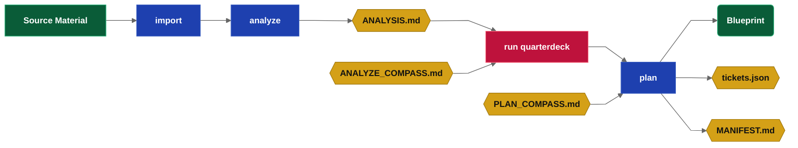
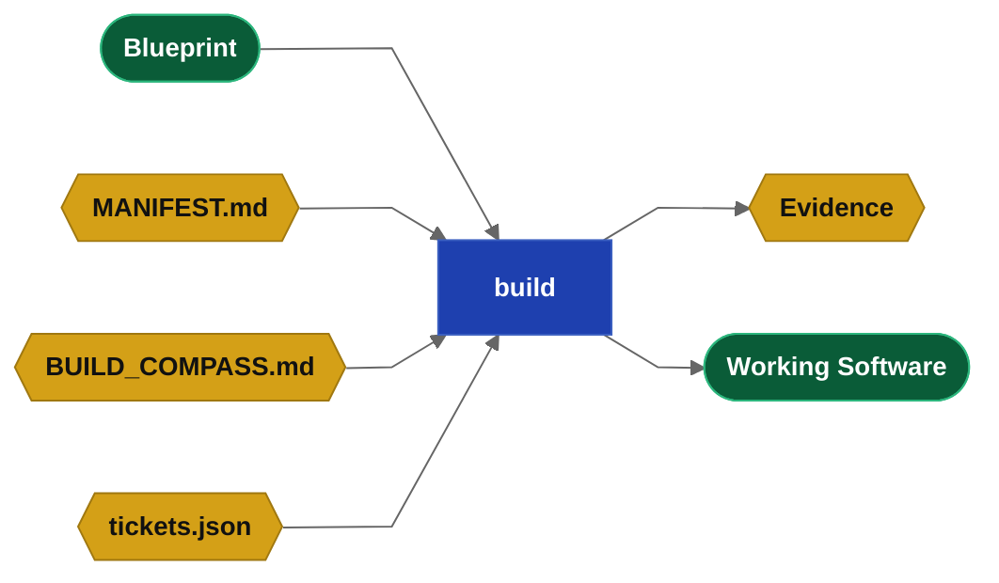
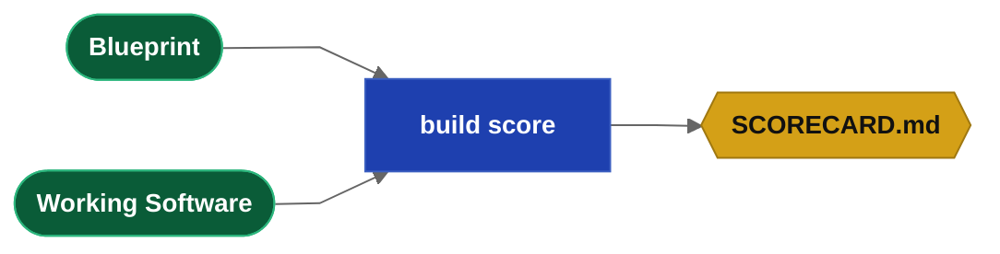
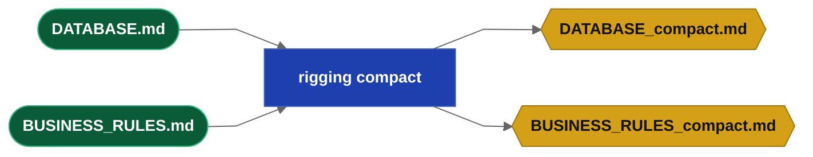

## What is Drydock

Drydock is a governed Blueprint-driven software delivery system built around the **SAIL methodology**.

**The Commander.** Drydock addresses its operator as the Commander.  Drydock uses agile best practices and the Commander is the product owner. The QuarterDeck enables the Commander to own intent, review evidence and decisions, and to provide feedback at each stage.  That feedback guides the work and command reruns will incorprate that user intent.  This document uses "Commander" as synonym for user. The Commander has the role of agile project owner.

**Drydock Blueprints** are the authoritative, living definition of a software product. Blueprints are composed of **Typed Specification Files** with prescribed roles. `drydock plan` turns imported specifications into Blueprints ready for execution.  `drydock plan` creates a **Manifest** and defines your typed specification files into a simple graph database suited for **context optimized builds**.

Context management is the KEY to reproducable specification driven builds.  `drydock build` uses a **dependency graph** to deliver working software using a use context-size-aware file stacking strategy that ensures the work is done accurately.  In Story Planning, the Agile team provides EXACT story points (token cost) to implement each story.  In Story Planning, you group similar stories in the QuarterDeck to optimizes build token cost.

**Enterprise branding and stack rules** are injected using Rigging.  Rigging is applied using the concept Builder / User.  Feature builders need the whole specification to implement.  Feature users use markdown compaction to recieve only how to use the feature.  They do not need to know what it does or why.

The loop phase lets the Commander **update and iterate** the application while preserving the specification as the source of truth.


## The drydock CLI

```text
drydock <verb> [<sub-verb>] [arguments] [--options]
```

Each project's `<Target>` uses a Workspace of `$DRYDOCK_WORKSPACE/targets/<Target>` and builds to `$DRYDOCK_BUILD_DIRECTORY/<Target>`.

```text
usage: drydock [-h] [--version] [--debug] <command> ...

Drydock — governed Blueprint-driven software delivery.
Copyright (c) 2026 Web Cloud Studio. All rights reserved.

positional arguments:
  <command>
    config    Show or set Drydock configuration.
    init      Initialize a target workspace.
    status    Show project status and orientation.
    validate  Validate a Blueprint's Typed Specification.
    document  Generate and assemble Blueprint documentation.
    rigging   Manage Drydock Rigging.
    plan      Manage the build plan.
    build     Build or inspect build state.
    refit     Update Blueprint and target software together.
    analyze   Decompose imported sources into stories, blockers, and acceptance milestones.
    survey    Score a target's build process against its acceptance criteria.
    run       Start a Drydock service.
    import    Reverse-engineer a project into a Blueprint.

options:
  -h, --help  show this help message and exit
  --version   show program's version number and exit
  --debug     Show full traceback on unexpected errors.
```

## SAIL Phase 1 — Set Up: Laying the Keel

### Summary

Install Drydock, configure runtime defaults, and create a workspace for a Target build.
Process environment variables override values stored in Drydock's user-scoped `.env`.


### Requirements

Drydock requires a working codex or claude cli.

### Commands

```text
drydock --help
drydock --version
drydock config show
drydock config set <key> <value>
drydock init <Target>
drydock status [<Target>]
drydock run quarterdeck [<Target>] [--host HOST] [--port PORT]
```

### drydock status

`drydock status` is the primary orientation command. With no arguments it shows the workspace
dashboard across all initialized Targets. With a `<Target>` argument it filters to that Target,
showing its validation state, plan progress, and current runnable frontier.

### drydock config

`drydock config` establishes user-scoped defaults.


| Variable | Purpose |
|---|---|
| `DRYDOCK_BUILD_DIRECTORY` | `drydock build` builds `$DRYDOCK_BUILD_DIRECTORY/<Target>`. |
| `DRYDOCK_WORKSPACE` | Home directory for the drydock |
| `LLM_PROVIDER` | Subscription CLI provider: `claude` or `codex` |
| `PROMPT_WARN_KB` | Build-block prompt-size warning threshold |
| `MODEL` | LLM model - gpt-6.4, gpt-5.5, sonnet, opus  |
| `QUARTERDECK_PORT` | Default QuarterDeck service port |

### drydock init

`drydock init <Target>` creates the temporary workspace for the <target> under targets/.  It populates the artifacts such that you can proceed with the workflow.

### drydock run quarterdeck <Target>

`drydock run quarterdeck` opens the product-owner review surface, a simple configuration file driven console.
The intent is to ensure you are set up correctly for the phases that follow - you should see an empty project ready for work.

## SAIL Phase 2 — Analyze: Charting the Course

The Analyze phase turns imported source material into an Analysis for review, then into an executable Manifest for build.

1. `drydock import` brings source material under Drydock control.
2. `drydock analyze` reads the imported sources and derives stories, acceptance milestones, blockers, questions
3. `drydock run quarterdeck` lets the product owner review, approve, and answer questions
4. `drydock plan` consumes the reviewed analysis and creates Blueprint files, the Manifest, and tickets.json.

What is a compass
: a compass file contains user overrides and it is marked Important:.  The llm treats compass files as the intent of the commander.  COMPASS.md is inserted into EVERY command.  Files named XXX_COMPASS.md are inserted into `drydock XXX`.

### Commands

```text
drydock import <Target> <Source> --format <auto|markdown|source|speckit|compass>
drydock analyze <Target>
drydock run quarterdeck [<Target>] [--host HOST] [--port PORT]
drydock plan <Target>
```



### drydock import

`drydock import <Target> <Source> --format <auto|markdown|source|speckit|compass>` is the intake step.
It brings external material under Drydock control.  Drydock can import data from other specification systems or can import
a compass file.  The data is copied as is into `blueprint/sources/`.

`drydock import <Target> <Source File> --format markdown` imports general markdown specifications

`drydock import <Target> <Directory> --format markdown` imports general markdown specifications

`drydock import <Target> <Source> --format <source|speckit>` imports specifications from other systems

`drydock import <Target> <Source> --format compass` copies the source into the target `COMPASS.md`.

### drydock analyze

`drydock analyze` is Sprint Feature Planning. The LLM decomposes `blueprint/sources/` into a set of
markdown artifacts using agile. It prepares the following files for Commander review.

**Input files**

| Artifact | Location | Purpose |
|---|---|---|
| `sources/*` | `blueprint/` | Imported source material; read-only planning context |
| `COMPASS.md` | Target root | Project intent |
| `ANALYZE_COMPASS.md` | Target root | Commanders Feedback: Update it - injected every run |
| `BLOCKERS.md` | Target root | Blockers is created by analyze with any gaps or required information.  Users should edit file to address these concerns. |
| `questionnaires/*.json` | `QuarterDeck/` | Persistent answers consumed on re-run |

**Output files**

| Artifact | Location | Purpose |
|---|---|---|
| `BLOCKERS.md` | Target root | Questions on any blockers the LLM has found. Existence implies blockers.  Edit to resolve them. |
| `ANALYSIS.md` | Target root | Summary of the decomposition, story list, blockers, questions, and recommendations |
| `SEA_TRIALS.md` | Target root | Product-level objectives and success criteria |
| `SOUNDINGS.md` | Target root | Acceptance tests and milestones  |
| `COMPASS.md` | Target root | The master project intent file.   Always imported.  Review it if one was automatically created. |
| `questionnaires/*.json` | `QuarterDeck/` | Review questionnaires for unresolved decisions and genuine research spikes |
| `commanders_chair.html` | `QuarterDeck/` | QuarterDeck summary view for the current state |

#### Build Readiness

The LLM also gives a verdict on the condition of the build.  The most important guard is `BLOCKERS.md`.  If
`BLOCKERS.md` exists, the Commander edits it to answer the questions and reruns `drydock analyze`. The
Commander's answers guide the LLM on the next run, and the cycle repeats until no blockers remain.

| Quality | Meaning |
|---|---|
| `Blocked` | One or more blockers prevent planning from proceeding |
| `Questions` | Planning may proceed, but open questions remain |
| `Ready` | No blockers remain |

### drydock run quarterdeck — Analysis Review

**What is the Quarterdeck:**
: The quarterdeck is a dumb console that can render markdown output generated by the LLM.

`drydock run quarterdeck` starts a web console for the Commander (product owner).  Navigate to the listed host and port to review.

The QuarterDeck shows the artifacts, blockers, questions, questionnaires, and activity that need review.

* BLOCKERS.md prevents `drydock plan` from running.
* Questionnaires contain decisions that guide planning

Questionnaires and BLOCKERS.md can be edited directly or modified in the QuarterDeck to respond.  Responses are used on the next run of `drydock analyze`.

Commander responses in the QuarterDeck are preserved for the build (by writing them to the appropriate markdown file).

The QuarterDeck calls out blockers and action items.  It also enables the Commander to review core decisions such as the process
the LLM intends to use to decompose the imported material into Blueprints.  This review indicates how well the
application builds.  The Agile process continues this decomposition until the plan holds a list of actionable stories
ready to implement.

### drydock plan

`drydock plan` is Sprint Story planning.  Imported source files are re-read and reformatted according to the
analysis.  This step creates Typed Specification files under `blueprint/`, writes `BUILD_COMPASS.md`, and drafts `MANIFEST.md`.

The headers of the blueprints are structured as a dependency graph and the runnable frontier is established.

The plan contains Acceptance Criteria, Spikes and Specification Tickets for features, screens, and scaffolding.

One major goal of the decomposition is for MANIFEST.md to contain a graph database of your work.  The configuration variable
`PROMPT_WARN_KB` (default 50KB) sets a maximum total context size for each build.  Each step stacks
multiple files into a prompt for execution — including `COMPASS.md`, the applicable subsets of the stack, and
the task instructions.  Similar tasks are grouped together to save context.

**Input files**

| Artifact | Location | Purpose |
|---|---|---|
| `sources/*` | `blueprint/` | Imported source files, re-read and reformatted into Typed Specifications |
| `ANALYSIS.md` | Target root | The reviewed analysis that drives decomposition |
| `PLAN_COMPASS.md` | Target root | Persistent standing-directive feedback, re-injected every run |
| `COMPASS.md` | Target root | Project intent |
| `questionnaires/*.json` | `QuarterDeck/` | Resolved planning decisions |

**Output files**

| Artifact | Location | Purpose |
|---|---|---|
| `ARCHITECTURE.md`,<br> `DATABASE.md`,<br> `FEATURE-{Name}.md`,<br> `SCREEN-{Name}.md`,<br> `UI-GENERAL.md` | `blueprint/` | Typed Specification files |
| `BUILD_COMPASS.md` | Target root | Story-planning grouping and build-order input for `drydock build` |
| `MANIFEST.md` | Target root | The executable build plan |
| `SOUNDINGS.md` | Target root | Acceptance gates projected by stable ID |
| `tickets.json` | Target root | Target ticketing system projection |

#### Standing-Directive Feedback

`PLAN_COMPASS.md` is a persistent, human-editable standing directive. The Commander
records durable guidance there — decomposition preferences, recurring corrections — and `drydock
plan` re-injects it on every run.

### drydock run quarterdeck — Plan Review

Review `MANIFEST.md` in the QuarterDeck to understand the build process and update direction.

## SAIL Phase 3 — Implement: Working the Frontier

Implement the Blueprint using the Manifest

* The Manifest exposes the phases with `drydock build status`.
* Iterate through the build phases with `drydock build`.
* Measure delivery health with `drydock build score`.
* The rigging implements company standards and branding.

### Commands

```text
drydock build <Target>
drydock build status <Target>
drydock build score <Target>
drydock document <Target>
drydock document generate <Target>
drydock document assemble <Target>
drydock validate <Target> [--verbose]
drydock rigging compact <Target> [--all] [--force] [--include-file <file.md>] [--exclude-file <file.md>] [--include-dir <dir>]
drydock rigging update <Target>
drydock rigging verify <Target>
```

### Story Planning

Story Planning is the agile step where your work is prioritized and assigned to a developer. It lives in QuarterDeck before build execution and produces `BUILD_COMPASS.md`.

In story planning, your Agile LLM team provides story points (token costs) to build each story and you:
* reorder stories so important/testable steps are done first
* group stories so they can be run by a single agent
* Check / Review Acceptance Criteria

If you do not story plan, you accept the LLM's default order of stories and they will build one by one.

### drydock build

Build executes the work blocks in `MANIFEST.md` based on their dependency graph. `BUILD_COMPASS.md`
is the story-planning input that defines the authored grouping and build order. The Manifest and
its Typed Specifications execute in the steps or phases the plan lists.



**Input files**

| Artifact | Location | Purpose |
|---|---|---|
| `BUILD_COMPASS.md` | Target root | Story-planning grouping and build-order input |
| `MANIFEST.md` | Target root | Executable build plan and dependency graph |
| `tickets.json` | Target root | Target ticketing system projection consumed during build execution |
| `ARCHITECTURE.md`, `DATABASE.md`,<br> `FEATURE-{Name}.md`, <br>`SCREEN-{Name}.md`,<br> `UI-GENERAL.md` | `blueprint/` | Typed Specification files consumed for the current build step or phase |

**Output files**

| Artifact | Location | Purpose |
|---|---|---|
| `evidence/` | Target root | Reviewable build evidence written for completed work |
| Built application files | `<Target>` | Target working directory for build<br>override in `METADATA.md` field `build_dir:` |

`drydock build <Target>` executes the approved frontier and builds the application in the target working directory `$DRYDOCK_BUILD_DIRECTORY/<Target>`.

### drydock run quarterdeck — Build Review

The QuarterDeck guides the Commander through the agile process.  The build review lets the user see evidence, demos, and questions needed for a decision;

### drydock build status

`drydock build status` reads `MANIFEST.md` and the runtime logs and reports the state of the plan.

```text
drydock build status <Target>   # print per-block state and current runnable frontier
```

### drydock build score

`drydock build score` measures delivery health across seven dimensions — Typed Specification
completeness, implementation coverage, test coverage, documentation coverage, Blueprint drift,
build quality, and acceptance criteria coverage. Output is `SCORECARD.md` at the Target root,
alongside `ANALYSIS.md`, `MANIFEST.md`, and `METADATA.md`.



1. `drydock build score <Target>` — compare the Blueprint against the built application; surfaces
   drift between what was specified and what was delivered.
2. `SCORECARD.md` identifies the highest-value gap across all seven dimensions. Use it to
   prioritize the `drydock refit`.

### drydock survey

```text
drydock survey <Target>             # render the latest scoreboard
drydock survey <Target> --run       # score (LLM-assisted) and append results
drydock survey <Target> --import D   # re-read a Blueprint/sources directory and regenerate AC
drydock survey <Target> --command status   # filter to one command
```

A Target carries one Surveyor workspace at `survey/`: per-command acceptance-criteria
files under `survey/ac/SURVEY-<command>.md`, an append-only `survey/scores.jsonl`, and the scoring
`survey/RUBRIC.md`. Each command is scored on five weighted dimensions — behavioral correctness,
specification quality, process integrity, evidence/reproducibility, and contract conformance — to a
0–100 score and a band (`SEAWORTHY`, `SEA_TRIALS`, `TAKING_WATER`, `DRY_DOCK`). A guardrail breach
or regression caps the band regardless of the number.

The scoring math is deterministic and lives in the command. An LLM judges each acceptance
criterion and synthesizes recommendations; the command computes the scores and writes the files, so
runs need no file-write permission and tests substitute a fake runner. `--import` regenerates the
acceptance-criteria files from the specification so the process can iterate on its own definitions.

1. `drydock survey <Target> --run` — judge each command against its AC; record one scored entry
   per command with root-cause flags and generalized recommended fixes.
2. The scoreboard surfaces which dimension of which command is dragging; a flag recurring across
   commands (e.g. `unresolved-uncertainty`) signals a *process* defect to fix in the prompt or
   command contract, not a one-off code fix.

### drydock document

This command reads the specification and branding instructions and creates documentation in `docs/index.html`.

`drydock document generate <Target>` reads the Blueprint and Manifest and creates project documentation in `docs/DOC-*.md`.
`drydock document assemble <Target>` combines into `docs/index.html`.
`drydock document <Target>` runs both steps as one delivery pipeline.

## SAIL Phase 4 — Loop: The Refit

A Refit lets the Commander update the application.  The process updates the Blueprint and optionally the Target. Blueprints changes
are kept in sync with the application with a `drydock build`.

The post-build refit for an existing project keeps the code and Blueprints aligned.  Drydock provides two methods for this.  The first
uses change tickets which have the same dependency graph as do the other Blueprints.  This enables it to be chunked with `drydock build` after
a new plan is built.  The alternative tracks the git commit of the build and can use git to identify files which have been changed and which
can rerun only those files.

### Commands

```text
drydock refit <Target> <blueprint|target|both> <Scope> <Change>
```


TODO: Section not as intended - /thinkthrough with ed - i am confused since a refit is a build... so whats the separate command... There needs be a better ingest process for tickets/requests (formatted or not) into
the depencency graph and that is an llm call... then it can build.  The other option which also
works is for the user to just edit the spec files.  Since we track the build commits for each file it just works.  That was my main working process and ... its not here...

The `refit` command delegates final integration to a separate merge step. Each output file produced by the refit is compared against its prior state; files whose content has changed are marked dirty and reapplied to the working tree.

#### Portfolio Governance Propagation

Portfolio-governance propagation is part of Refit because it applies maintained Drydock Rigging
changes back into an existing Target and proves continued conformance after the change.

1. `drydock rigging compact <Target> --all` — compacts the architecture files from `x.md` to `x_compact.md`. Drydock agents use the Full or compact form as needed.
2. `drydock rigging update <Target>` — injects `BUSINESS_RULES_compact.md` and standard templates into the target project.
3. `drydock rigging verify <Target>` — checks target project compliance with the Drydock rigging contract across all required standards.
4. Repeat verification after material Rigging changes and before delivery gates that require portfolio compliance.

Staleness is computed from content hashes at the form each block consumes. A block that `implements:` a file is keyed to the full file's hash; a block that receives it as `context:` is keyed to the compact derivative's hash, so an edit that does not change the compact form — rationale, examples, internal detail — dirties no consumers. A change to a file's `Provides` or `Consumes` set additionally marks every dependent block stale.

#### Refits with Change Tickets

Change tickets are incremental work items, not `refit` sessions. A new ticket is just a new
Specification file under `changes/` with the correct typed header and dependency fields. Planning
and build execution process it like any other Specification input.

1. Create `changes/TICKET-NNN-{Name}.md` with its description, acceptance criteria, guardrails, and open questions.
2. Run `drydock plan <Target>` to update the plan with the new ticket.
3. `drydock plan` updates dependency headers so the ticket lands in the correct place in the build.
4. Run `drydock build <Target>` to execute the incremental work and produce evidence.
5. Review the result in the normal evidence or QuarterDeck flow.
6. Reconcile accepted ticket facts into the owning core Specification files and close the ticket as
   retained change history.

## Workspace Layout

Drydock stores its own state under `$DRYDOCK_WORKSPACE/targets/<Target>`. The built application lives under `$DRYDOCK_BUILD_DIRECTORY/<Target>`. The QuarterDeck is configuration driven and uses files from the Drydock-managed Target tree.

### Artifact Usage Matrix

| Artifact | Location | analyze | plan | build | build score | refit |
|---|---|---|---|---|---|---|
| ANALYSIS.md | Target root | O | I | · | · | · |
| ANALYZE_COMPASS.md | Target root | C/I | · | · | · | · |
| ARCHITECTURE.md | blueprint/ | · | O | I | I | I |
| BLOCKERS.md | Target root | O/I | X | · | · | · |
| BUILD_COMPASS.md | Target root | · | O | I | · | · |
| commanders_chair.html | QuarterDeck/ | O | · | · | · | · |
| COMPASS.md | Target root | O*/I | I | I | I | I |
| DATABASE.md | blueprint/ | · | O | I | I | I |
| FEATURE-{Name}.md | blueprint/ | · | O | I | I | I |
| MANIFEST.md | Target root | · | O | I | I | I |
| PLAN_COMPASS.md | Target root | · | C/I | · | · | · |
| questionnaires/*.json | QuarterDeck/questionnaires/ | O/I | I | I | · | · |
| SCORECARD.md | Target root | · | · | · | O | · |
| SCREEN-{Name}.md | blueprint/ | · | O | I | I | I |
| SEA_TRIALS.md | Target root | O | · | · | · | · |
| SOUNDINGS.md | Target root | O | O/I | O | I | · |
| sources/* | blueprint/sources/ | I | I | · | · | · |
| tickets.json | Target root | · | O | I | I | I |
| UI-GENERAL.md | blueprint/ | · | O | I | I | I |

**Legend:** `O` the command produces the artifact · `I` the command consumes the artifact ·
`C` the command creates the artifact if absent (never overwrites) · `X` gates/blocks the command ·
`·` no relation · `O*` the command produces the artifact only when it is absent.

Human-authored feedback artifacts (`ANALYZE_COMPASS.md`, `PLAN_COMPASS.md`, answered `BLOCKERS.md`) are prompts that guide future runs of the commands.

### Directory Layout

```text
$DRYDOCK_WORKSPACE/                       # Git top-level or cwd — the Drydock project
├── logs/
│   ├── ships_log.jsonl                   # workspace product/design decision ledger
│   ├── history.jsonl                     # append-only command-invocation log
│   └── run.log, run.log.1 … run.log.5    # rotating per-command execution logs
│
└── targets/
    └── <Target>/                         # one self-contained project
        ├── METADATA.md                   # identity: Blueprint name, code_root, status, stack
        ├── README.md                     # short human introduction to the project
        ├── ANALYSIS.md                   # Planning Session analysis: quality, stories, blockers, questions
        ├── ANALYZE_COMPASS.md
        ├── BLOCKERS.md
        ├── COMPASS.md                    # project guidance: intent, constraints, guardrails
        ├── MANIFEST.md                   # the executable Manifest
        ├── PLAN_COMPASS.md
        ├── SCORECARD.md                  # seven-dimension quality + drift scores
        ├── SEA_TRIALS.md                 # Project AC — project-level acceptance criteria
        ├── SOUNDINGS.md                  # AC — calculated acceptance/readiness ledger
        ├── tickets.json                  # target ticketing system / board projection
        │
        ├── BUILD_COMPASS.md              # story-planning grouping and build-order input
        │
        ├── blueprint/                    # the Blueprint — conformed Typed Specification
        │   ├── sources/                  # preserved unconformed import material
        │   ├── ARCHITECTURE.md
        │   ├── DATABASE.md
        │   ├── FEATURE-{Name}.md
        │   ├── SCREEN-{Name}.md
        │   ├── UI-GENERAL.md
        │   └── changes/
        │       └── TICKET-NNN-{Name}.md
        │
        ├── evidence/                     # reviewable build evidence, named by build object
        │
        └── QuarterDeck/                  # console state only; runtime served from the package
            ├── console.yaml
            ├── pages/
            │   └── overview.md
            ├── data/
            └── questionnaires/
                └── planning.json
```

```text
$DRYDOCK_BUILD_DIRECTORY/
└── <Target>/                             # application source tree built by drydock build
```

## The Blueprint — Typed Specification Contract

### Blueprint File Inventory

**Project records** — identity and introduction; not part of the Typed Specification Contract and
not authored as specification files.

- **`METADATA.md`** — Project identity, relationships, status, and stack
  - Created: `drydock import` conversion
  - Updated: Product owner; platform metadata operations

- **`README.md`** — Short human introduction to the Blueprint
  - Created: `drydock import` conversion; Manual; other
  - Updated: Product owner

**Human-authored** — the product intent explicitly owned by the product owner.

- **`COMPASS.md`** — Project guidance: intent, constraints, and guardrails. Lives at the Target
  root (not inside `blueprint/`). Injected into every LLM run as ambient project context.
  Created by `drydock analyze` (generated from spec if absent) or seeded via
  `drydock import --format compass`.
  - Auto Generate: `drydock analyze` (auto-generated)
  - Created: `drydock import --format compass` (user-supplied)
  - Updated: Product owner

- **`sources/`** — Preserved unconformed Markdown supplied to `drydock import`
  - Created and updated: `drydock import <Target> <Source> --format markdown`
  - Used as read-only planning context; never treated as conformed Typed Specification files

- **`ANALYZE_COMPASS.md`** — Persistent standing directive for `drydock analyze`: durable
  Commander guidance re-injected on every run. Lives at the Target root.
  - Created: `drydock analyze` (empty template on first run)
  - Updated: Product owner
  - Never overwritten or deleted by `drydock analyze`

- **`PLAN_COMPASS.md`** — Persistent standing directive for `drydock plan`: durable
  Commander guidance re-injected on every run. Lives at the Target root.
  - Created: `drydock plan` (empty template on first run)
  - Updated: Product owner
  - Never overwritten or deleted by `drydock plan`

**Core Application Specification Files** — created and maintained by Drydock commands;
updated by `drydock refit` as specification files and application code evolve.

- **`ARCHITECTURE.md`** — Modules, routes, boundaries, interfaces, and technical decisions
  - Created: `drydock import` conversion
  - Updated: `drydock refit` (architecture-scoped)

- **`DATABASE.md`** — Persistence stores, schemas, migrations, and typed access classes
  - Created: `drydock import` conversion
  - Updated: `drydock refit` (data-scoped)

- **`FEATURE-{Name}.md`** — Feature purpose, status, behavior, reads, writes, routes, criteria, and guardrails
  - Created: `drydock import` conversion; accepted change reconciliation
  - Updated: `drydock refit` (feature-scoped)

- **`SCREEN-{Name}.md`** — Screen route, layout, interactions, and criteria
  - Created: `drydock import` conversion; accepted change reconciliation
  - Updated: `drydock refit` (screen-scoped)

- **`UI-GENERAL.md`** — Shared UI behavior and visual rules
  - Created: `drydock import` conversion when the project has a UI
  - Updated: `drydock refit` (UI-scoped)

- **`changes/TICKET-NNN-{Name}.md`** — Post-baseline change, defect, or spike request
  - Created: Product owner or change intake workflow
  - Updated: Clarification, planning, build execution, evidence, review, and reconciliation
  - Processing: Additional specification files are detected by `drydock plan`, placed in
    `BUILD_COMPASS.md` for ordering, and processed by `drydock build`. Required context is added
    automatically.

**Process Created Artifacts** — generated by Drydock commands; not authored directly.

- **`BUILD_COMPASS.md`** — Story-planning grouping and build-order input for `drydock build`
  - Created and updated: `drydock plan <Target>`

- **`<Target>/METADATA.md`** — Project identity (Blueprint name, `code_root`, status, stack) and
  lifecycle state (`drydock build state:` field; forward-only ladder: `init → analyzed → planned → building → built`)
  - Created: `drydock init <Target>`; enriched by `drydock import`
  - Updated: product owner; Drydock Target operations; each command on state advance

- **`<Target>/MANIFEST.md`** — The single generated executable build plan
  - Created: `drydock plan <Target>`
  - Updated: plan regeneration, planning merges, build execution, and review decisions

- **`<Target>/ANALYSIS.md`** — Planning Session analysis: quality signal, story list, blockers, open questions
  - Created and updated: `drydock analyze <Target>`

- **`<Target>/QuarterDeck/questionnaires/spike-*.json`** — Planning Session questionnaires; four
  fixed spikes (intent, stack, gaps-ac, guardrails) plus variable spikes for genuine unknowns
  - Created and updated: `drydock analyze <Target>`
  - Answered through: QuarterDeck Planning Session

- **`<Target>/QuarterDeck/commanders_chair.html`** — Template-filled orientation dashboard; quality
  signal, story count, stack, and next recommended step
  - Created: `drydock analyze <Target>` on first run; updated when lifecycle state advances

- **`SCORECARD.md`** — Blueprint and application quality scores across seven dimensions; surfaces the highest-value gap and drift between the Blueprint and the built software
  - Created and updated: `drydock build score`

- **`logs/ships_log.jsonl`** — Drydock's append-only JSONL ledger of product and design events; see
  "The Ship's Log"
  - Created and updated: agents developing Drydock, according to `SHIPS_LOG_PROCESS.md`, through
    the repository-local validated persistence utility

- **`logs/history.jsonl`** — append-only command-invocation log; one JSON record per command with
  the command line, timestamp, target, and return code. Pure-report commands are excluded
  - Created and updated: the CLI, on every recorded command

- **`logs/run.log`** — rotating per-command execution log capturing diagnostic output for each run.
  Drydock keeps the active `run.log` plus five rotated copies, `run.log.1` through `run.log.5`
  - Created and updated: the CLI run logger, on every command

**Console related documents** — generated per target project; read by the QuarterDeck and updated by
build and review actions.

- **`<Target>/evidence/*`** — Reviewable build evidence named by the producing build object
  - Created and updated: `drydock build`

- **`<Target>/QuarterDeck/console.yaml`** — console index; defines project identity, the
  default view, the sidebar section taxonomy, and all renderable navigation items
  - Created and updated: `drydock init`

- **`<Target>/tickets.json`** — Target ticketing system projection; features, spikes, and stories
  projected as tickets with acceptance criteria folded under their parent
  - Created and updated: `drydock build` from `MANIFEST.md`
  - Drydock follows feature/story best practices with acceptance criteria embedded

### Specification File Format

Every authored Specification file except `METADATA.md` and `README.md` opens with a typed heading
and header table, followed by body sections specific to the file type, and ends with three common
terminal sections. `drydock plan` computes `Depends On`, `Provides`, and the SCREEN-specific
`Consumes` — do not edit these manually.

```markdown
# {FileType}: {ObjectName}

| Field       | Value |
|-------------|-------|
| Version     | 20260608 V1                    ← YYYYMMDD V<n>; increment on every write |
| Description | One sentence summary. |
| Route       | /catalog                       ← SCREEN only; required; the URL this screen serves |
| Consumes    | GET /catalog/items             ← SCREEN only; routes called; computed by drydock plan (optional) |
| Nav Order   | 3                              ← SCREEN only; integer presentation order (optional) |
| Depends On  | ARCHITECTURE.md, GET /catalog  ← file or route; computed by drydock plan |
| Provides    | GET /catalog, POST /catalog   ← routes this file exposes; computed by drydock plan |
| Build Order | 2                             ← integer; assigned by drydock plan when useful |

{body sections specific to the file type}

## Acceptance Criteria
← Positive, testable outcomes. State as bullet assertions.

## Guardrails
← Permanent negative assertions. Guard against model hallucination, not spec omission.

## Open Questions
← Unresolved decisions that must be answered before this file can be fully implemented.
```

A SCREEN file referencing a route not listed in any FEATURE `Provides` field is an error.

### Specification Decomposition Methodology

Decomposing to features is done by project type - For example a web applications decomposes by routes
with UI screens having one file for the Page and another for the web route.
This structure populates `Provides`, `Consumes`, and `Depends On`.

Other applications can use different decomposition methods.

| System shape | Interface points named in `Provides` / `Consumes` |
|---|---|
| Web application | HTTP routes — `GET /catalog` |
| CLI tool | Commands and sub-verbs — `drydock plan` |
| Library or package | Public API symbols — `Database.items.get` |
| Data pipeline | Datasets, tables, and files produced and consumed |
| Event-driven system | Topics, queues, and event types |

### Database Encapsulation

**DATABASE.md enforces data access encapsulation.**

No application code calls the database directly. Every table, config store, file store, and external
service is accessed through a typed Python class. Route and business-logic code calls
`db.items.get(id)` — never raw SQL.

This eliminates a class of subtle bugs. A schema change — a timezone-aware datetime field replacing
a naive one, for example — requires changing only the encapsulation class. Downstream code depends
on the interface, not the storage detail, so nothing else breaks. Without the boundary, the same
change propagates silently to every callsite.

A code review that finds raw SQL, `os.environ` reads, `open()` on application data, or a cloud SDK
import outside its encapsulation class fails.

**Typed class library pattern.** `DATABASE.md` specifies both the schema and the Python classes that
encapsulate it. Each table maps to a `@dataclass` row type with fully typed fields. A `Database`
class owns the connection, manages the session lifecycle, and exposes only named methods — no caller
ever receives a raw cursor or row tuple. Methods raise domain exceptions (`ItemNotFound`,
`StorageError`) rather than propagating driver exceptions. The `Database` class is instantiated once
at application startup and passed by dependency injection; it is never re-opened inline.

`DATABASE_compact.md` is the LLM-generated derivative containing only class names, method
signatures, parameter types, return types, and one-line summaries. Non-foundational build steps
inject the compact form. Only the story that `implements: DATABASE.md` — the one that builds the
class library — receives the full file.

## The Manifest — Executable Build Plan

`MANIFEST.md` is the single generated execution view of the Blueprint. It determines order,
selects only required context, keeps work within useful context limits, identifies stale work, and
preserves unaffected accepted work. It is not a second product definition.

The Manifest manages the full product lifecycle:

- specifications for individual components like screens can be changed resulting in
  context-minimized incremental builds
- new files (such as change tickets) can be discovered and applied

Each Manifest contains four block types:

- `feature` optionally groups substantial workflows and owns feature-level acceptance
- `story` builds something. A Drydock story is an enriched Spec Kit task: it has states,
  `depends:`, child ACs that can block it, and prompt-assembly fields.
- `spike` answers a question. Results feed future iterations
- `ac` checks that something works. A failed AC blocks plan progress.

The Manifest itself has one lifecycle state:

- `draft` — the Planning Session is active and no work is runnable
- `approved` — the product owner accepted the complete plan and the frontier is runnable
- `closed` — all required work and acceptance gates are closed

### Plan Header

```markdown
# MANIFEST: {ProjectName}
updated:     2026-06-08T12:00:00
plan_hash:   abc123456789
state:       draft
```

Build provenance lives in the execution log, not the plan header: every build block records the
content hash of each specification, stack, and prompt file injected into it. The plan header
carries only the plan's own identity.

### Story Blocks

```markdown
## story N: {Name}
id:           foundation
parent:       feature-catalog
summary:      One-line description.
implements:   DATABASE.md, FEATURE-CATALOG.md
context:      ARCHITECTURE.md
stack:        common.md, python.md, sqlite.md
rules:        CLAUDE_RULES.md
copy:         Rigging/templates/common.sh -> bin/common.sh
instructions: |
  Build persistence and the catalog service.
depends:      select-parser
state:        pending
evidence:     evidence/<id>.md
scope:        blueprint | target | both
```

`implements:` is the spec files this story uses. `context:` is read-only support context.
`parent:` is optional. It is used for arbitrary hierarchy and QuarterDeck display. Builds are
rules-based on block type. `scope:` declares whether a story changes the Blueprint, target
software, or both.

### Feature Blocks

A feature is an optional non-executable parent ticket. Small plans do not require features. A
feature closes only after all required child stories, spikes, and feature-level `ac` blocks are
`closed/verified`.

### Spike Blocks

```markdown
## spike N: {Name}
id:           select-parser
summary:      One-line description.
context:      FEATURE-IMPORT.md
question:     Which parser satisfies the Blueprint?
parent:       feature-import
finding:      ← text answer written here by the agent
depends:      foundation
state:        pending
evidence:     evidence/<id>.md
```

### Acceptance Check Blocks

```markdown
## ac N: {Name}
id:           system-starts
parent:       foundation
summary:      One-line description.
kind:         smoke | assertion
check:        test -f bin/start.sh && curl -sf http://localhost:${PORT}/health
depends:
state:        pending
evidence:     evidence/<id>.md
```

`kind: smoke` runs a command. `kind: assertion` checks a behavior from evidence or review.

### Block States

All four block types use the same four states:

| State | Meaning |
|---|---|
| `pending` | Not run yet |
| `implemented` | Work done, waiting to be accepted |
| `closed/verified` | Passed or accepted |
| `closed/failed` | Failed or rejected |

### Execution Rules

A block can run only when the plan is `approved` and everything in `depends:` is
`closed/verified`. Features are never directly executable.

An `ac` can run only after its `parent` is `implemented`.
Feature-level `ac` blocks are the exception: they become runnable after all executable child
stories and spikes are `closed/verified`, because features are non-executable parents.

A `story` or `spike` cannot become `closed/verified` until its child `ac` blocks are
`closed/verified`.

If a `story` or `spike` has no child `ac` blocks, it may be closed automatically when it reaches
`implemented`.

If an `ac` becomes `closed/failed`, the parent does not close and later dependent work stays
blocked.

`closed/failed` is not terminal. The product owner reopens failed work from the QuarterDeck —
revising the block's instructions, acceptance criteria, or scope interactively — and the decision
writer returns it to `pending` with the revision recorded. The decision writer is the only mutator
of plan state; recovery never requires hand-editing `MANIFEST.md`.

Guardrails and Acceptance Criteria embedded in the Specification files — not in the plan as `ac`
blocks — must also pass before a `story` is marked `closed/verified`. A story that satisfies its
implementation but violates a Specification guardrail remains `implemented` until the violation
is resolved.

### Worked Example

```markdown
# MANIFEST: MyProject
updated:     2026-06-08T12:00:00
plan_hash:   abc123456789

## spike 1: Select parser
id:           select-parser
parent:       import-feature
summary:      Compare supported parsers.
context:      FEATURE-IMPORT.md
question:     Which parser should the project use?
finding:
state:        pending

## story 1: Foundation
id:           foundation
summary:      Build persistence and directory layout.
implements:   DATABASE.md, ARCHITECTURE.md
stack:        common.md, python.md, sqlite.md
rules:        CLAUDE_RULES.md
state:        pending

## ac 1: system starts
id:           system-starts
parent:       foundation
summary:      Service starts and responds on health.
kind:         smoke
check:        test -f bin/start.sh && curl -sf http://localhost:${PORT}/health
state:        pending

## story 2: Import documents
id:           import-documents
parent:       import-feature
summary:      Implement the accepted import workflow.
implements:   FEATURE-IMPORT.md
depends:      select-parser, foundation
state:        pending
```

## The QuarterDeck — Agile Development Console

The QuarterDeck is the command surface where the product owner reviews LLM build output and makes
decisions. Evidence is presented using Agile methodology — the same structured handoff between
builder and owner, without the meeting.

**You are in control.** The QuarterDeck exists so the LLM can surface what it built and what it
needs a decision on. You review, approve, revise, or reject — and those decisions write back into
the build.

The QuarterDeck is configuration-driven: a console rendered from a single index file over Markdown
and JSON inputs. It holds no logic of its own. It shows the artifacts a project produces and routes
the few that require a decision to the product owner.

### Console Index — console.yaml

**`QuarterDeck/console.yaml`** is the console index. It defines project identity, the
default view, the sidebar section taxonomy (id / label / dot / collapsed / pinned), and every
renderable navigation item: source-of-truth documents, the kanban board, questionnaires, evidence
pages, and review pages. Each item declares its renderer, source path, home section, and optional
review target. Console state — archive overrides and questionnaire answers — is held in
`QuarterDeck/data/console_state.sqlite`. No command rewrites `console.yaml` at runtime.

The section taxonomy:

| Section id | Label | Behavior |
|---|---|---|
| `blockers` | Blockers | Conditional, first in the sidebar; appears only when `BLOCKERS.md` exists; full red treatment. |
| `core` | Drydock Core | Fixed source-of-truth artifacts, pinned; shown by file existence. |
| `actions` | Action Items | Derived; receives any item carrying a pending action from its home section. |
| `docs` | Docs | Glob-discovered from `docs/`; single-format rendering, priority html > pdf > md. |
| `archive` | Archive | Collapsed; completed ephemeral items; no status icons. |

The **Master Blueprint** is the standard label for the authoritative project specification file in
the Drydock Core section.

**`tickets.json`** is the target ticketing-system artifact and a generated projection of
the Agile `MANIFEST.md`. Spikes and stories appear as tickets; acceptance criteria are folded under
their parent. Column assignment maps directly to object state. `drydock init` does not create
`tickets.json`; `drydock plan` is its sole writer. The kanban board lives in Core and, like
every item, stays hidden until its backing file exists — it appears once a plan exists.

For Drydock's own repository, the QuarterDeck is also the primary viewer for project-owned
artifacts under `docs/`: the authoritative specification, Sea Trials, Soundings acceptance ledger,
rendered documentation, and supporting publication or reservation artifacts. The QuarterDeck
points to those files directly and never duplicates their content.

### Page Types

Each item declares exactly one renderer:

| Type | Purpose |
|---|---|
| `markdown` | Renders a single `.md` file as HTML; `tabs: true` splits `##` headings into clickable tabs. |
| `editable_markdown` | Renders a `.md` file as HTML and exposes an EDIT control that opens the backing file for in-place editing in the console. |
| `document` | Collapses related `path_md` / `path_html` / `path_pdf` variants into a tab bar (Read / View HTML / PDF). Missing variants are silently omitted; a single present variant renders without tabs. |
| `jsonl` | Read-only table from an append-only JSONL file; supports field selection, date truncation, and badge coloring. |
| `kanban` | Renders `MANIFEST.md`-derived tickets as a four-column board. |
| `questionnaire` | Form backed by a JSON file; saves answers in SQLite and writes them back to the source file. |
| `link` | External URL or local file; opens in a new tab. |
| `command_status` | Derived read-only view of acceptance readiness from Core Docs (see below). |
| `plan_decision` | Whole-plan approval for a `MANIFEST.md`. |

The reusable `command_status` page type derives a read-only acceptance-status report using only
configured Markdown Core Docs. It discovers the authoritative Soundings source by its single table
with `ID`, `Acceptance Criterion`, `State`, and `Evidence` columns, calculates status totals, and
reports deterministic structural inconsistencies. It does not inspect implementation files, tests,
non-Core artifacts, or invoke an LLM. It is specific to Drydock's own repository and is not seeded
in a target's console.

### Section Routing and Status Icons

Each item declares a `section` — its **home**, where it rests when complete. Actions is not declared
on items; it is derived. The console computes each item's displayed section in order:

1. Backing file absent — the item is hidden.
2. Manually archived — Archive.
3. Carries a pending action — Actions, regardless of declared home.
4. Otherwise — its home section.

An item carries a pending action when it is a `questionnaire` not yet in a done state, or a review
item (`review: true`) not yet approved. All other items carry no pending action and appear in their
home section immediately.

The sidebar carries two status states only: a red ❌ box for an item with a pending action, a green
✅ box for an item that is done or carries no pending action. Items in Archive and `link` items
carry no status icon.

### Page Header and Controls

Each page renders a standard header: the item title, the backing filename in small monospace, and
context-appropriate controls above a divider, then the file content.

- **EDIT** appears for `editable_markdown` items; it opens the backing file for in-place editing.
- **APPROVE** appears for review items not yet approved; once approved the header shows a
  "✓ Approved" badge in its place.
- Questionnaire submission is its approval; questionnaires carry no separate APPROVE control.

No reject control exists. A review item that is not approved remains in Actions until the product
owner revises its backing file and approves it.

### Auto-Discovery and Overrides

The **`sources:`** key in `console.yaml` accepts a list of glob rules
(`{glob, section, type, ...}`) that auto-discover files as items. Items in the explicit `items:`
list (matched by ID or by resolved path) take priority — a file already referenced by an explicit
item is never duplicated. The optional **`overrides:`** list (`{match: <path>, <fields>}`) adjusts
source-generated items before they are appended, supporting label, section, and type customization
without hand-listing every file.

**Archive/unarchive toggle** — any item not in a pinned section can be moved to the Archive section
via `POST /api/item/{id}/archive`. The original section is not rewritten; the override is
SQLite-backed and reversed by `POST /api/item/{id}/unarchive`. Pinned sections (e.g. Drydock Core)
are immune. Items in the Archive section of the nav carry an unarchive `↑` button; items in
non-pinned sections carry an archive `↓` button.

### Blockers

`drydock analyze` emits `BLOCKERS.md` only when it finds questions that prevent planning. A
healthy project has no `BLOCKERS.md`; the file's existence is the signal. When present, the Blockers
section appears first in the sidebar with full red treatment and holds a single editable item. The
product owner answers the questions in `BLOCKERS.md` and re-runs `drydock analyze`, which injects the
answers; when all blockers are resolved the new run deletes `BLOCKERS.md` rather than writing an
empty file. Blockers are mandatory gate conditions, distinct from spikes, which are optional
exploratory questionnaires.

### Decisions Write Back

Review decisions made in the QuarterDeck — approve, revise, reject, add defect — are written back
to `MANIFEST.md` by the same decision writer used by the CLI. Both files regenerate after each
decision.

Before execution begins, the generated `plan_decision` page runs the Planning Session. It presents
the Draft plan and applies whole-plan approval through the authoritative plan-state
writer. Ordinary QuarterDeck review controls do not approve a plan.

The QuarterDeck does not replace the Blueprint, `MANIFEST.md`, or build engine. It renders
their state and records decisions through a standardized interface.

**The QuarterDeck is a generated projection.** It holds no state of its own —
`MANIFEST.md` remains the single source of build state, and the console can be deleted and
regenerated at any time. This property keeps it honest: every decision made in the console writes
back through the decision writer, and failed work is reopened and revised here interactively
rather than by hand-editing plan files. Decisions of record are appended to the Ship's Log.

### Standard QuarterDeck Artifacts

Every Drydock QuarterDeck carries three standard product-owner artifacts. They are the
methodology's fixed reference points; Drydock's own repository is their reference instance. Each is
a source-of-truth document, filed in **Drydock Core** and pinned. When a Master Blueprint is
available, Core presents the artifacts in this order: Commanders Chair, Master Blueprint, Analysis,
Sea Trials, Soundings, then Ship's Log. Each is shown by file existence. The Analysis artifact, when
`ANALYSIS.md` is present, renders its `##` sections as tabs; `drydock analyze` emits plain Markdown
and the tabbed presentation is declared on the item, not hardcoded to a filename.

| Artifact | Purpose |
|---|---|
| **Commanders Chair** | The orientation page and default view: mission and current state at a glance. |
| **Soundings** | The project's authoritative acceptance-criteria checklist — each capability, its state, and the evidence. The standard way Drydock tracks acceptance criteria. |
| **Sea Trials** | The project's objectives and success criteria, derived from the specification — what the project must achieve to be declared delivered. The standard way Drydock states project objectives. |

Soundings records *implementation acceptance* — whether each capability is built and verified. Sea
Trials records *strategic outcomes* — whether the assembled product has proven its purpose. The two
are complementary, not duplicates.

`drydock init <Target>` creates target-local Commanders Chair, Sea Trials, and Soundings artifacts
without overwriting existing files. Soundings contains one acceptance ledger with `ID`,
`Acceptance Criterion`, `State`, and `Evidence` columns. `drydock plan` preserves the
standard artifacts, projects the plan's acceptance gates into Soundings by stable ID, updates their
state from the plan, and preserves recorded evidence. QuarterDeck calculates summary totals from
the ledger; Soundings does not store a redundant summary.

**QuarterDeck pages are terse.** A page carries minimal exposition: a one-line statement of what it
is, then the content. The standard artifacts are checklists and criteria, not essays — Soundings is
a list of acceptance criteria under a single-sentence header, not a narrative.

## The Ship's Log — Your Decision Log

The Ship's Log is a conceptual decision-log view backed only by Drydock's
`logs/ships_log.jsonl`. It records material decisions and milestones from development of the
Drydock application, not mechanics: what was decided or reached, why, what evidence supported it,
and what it supersedes. Commit identifiers, file hashes, routine edits, commands, and test runs
belong to execution logs. The QuarterDeck renders the JSONL through its reusable `jsonl` page type;
downstream publishing tools consume the same canonical records directly. No `SHIPS_LOG.md` artifact
exists.

```json
{"schema_version":1,"event_id":"uuid","recorded_at":"2026-06-11T18:32:00Z","event_type":"decision","title":"Decision title","summary":"What was decided.","rationale":"Why, including material rejected alternatives.","source":{"type":"agent","command":"drydock build","provider":"codex"},"affected_scope":[],"alternatives":[],"evidence":[],"supersedes":[],"tags":[]}
```

Drydock development agents are instructed by the required repository-local
`SHIPS_LOG_PROCESS.md`, not shared Rigging or target-project injection. An agent evaluates capture
immediately after a material decision or milestone and performs a final capture review before
commit or task completion. The agent invokes `python bin/ships_log.py record`; users are not
expected to record events manually, and Ship's Log operations are not part of the public `drydock`
CLI.

The repository-local utility validates and appends entries. Entries are never rewritten or
deleted; a reversed decision appends a new event whose `supersedes` list references earlier event
IDs. Agents use the existing `tags` list to classify applicable records as `open-item`,
`deferred-item`, or `accepted-risk`; QuarterDeck displays those tags in its Ship's Log JSONL view.

Standard agent-driven capture during Drydock-managed target design and build workflows remains an
intended product capability so users can review and publish their decision history. Target-project
injection and the supporting decision backend are deferred until this Drydock-only workflow has
been validated.

**Audit by diff.** Because every Blueprint lives in git, the log can be cross-checked: diff the
specification files between commits and produce an English analysis of what changed, inferring the
decisions the changes imply. Inference is lossy — a diff shows what changed, not why — so diff
analysis is the audit trail and backfill mechanism, not the primary capture. `drydock analyze`
reports specification changes not covered by a Ship's Log entry.

## Drydock Rigging — Portfolio Governance

Drydock Rigging is the enterprise conformance layer. It ships with Drydock out of the box —
opinionated defaults, no configuration required to start. An organization customizes it once
and every project built by Drydock conforms automatically. Stack files are organized by product and
are plug-and-play: add the technologies in use, remove the others.

Three layers govern what agents build and how they behave: agent behavior rules, technology stack
rules, and branding.

### Agent Behavior Rules

`BUSINESS_RULES.md` is the authoritative source for how agents must behave — git workflow, project
layout, script conventions, error handling. `drydock rigging compact` distills the full rules into
`BUSINESS_RULES_compact.md`; `drydock rigging update` then injects that compact form into the target
project. Agents read the compact rules as part of their context. Full rationale stays in the source;
agents receive only the actionable instructions.

### Technology Stack Rules

Stack files live in `Rigging/stack/` — one file per technology. Each file is prescriptive,
opinionated, standalone, and copy-paste ready. `MANIFEST.md` declares which stack files apply to
each build block; `drydock build` injects them into the prompt.

Early build blocks receive the full stack file — rationale, examples, and constraints included.
Later build blocks receive compact versions (`_compact.md`) that state expected behavior without
the reasoning. Agents in later work already have the architecture in scope; they need the contract,
not the explanation.

```text
Rigging/stack/
├── alexa-skills-kit.md
├── aws-api-gateway.md
├── aws-dynamodb.md
├── aws-lambda.md
├── aws-s3.md
├── aws-sqs.md
├── bootstrap5.md
├── common.md
├── django.md
├── fastapi.md
├── flask.md
├── github-actions.md
├── marina-library.md
├── persistence.md
├── postgres.md
├── python.md
├── sqlite.md
├── terraform.md
└── ui-flask.bootstrap-client.md
```

### Branding Rules

`BRANDING_MAIN.md` defines the master palette, typography, and design philosophy for Ed Barlow /
Web Cloud Studio. Per-medium rules inherit from it and are applied automatically when generating
the relevant artifact type.

| Branding file | Applies to |
|---|---|
| `BRANDING_DOCUMENTATION.md` | App Documentation Colors/Format/Branding — `docs/index.html` |
| `BRANDING_WHITEPAPERS.md` | White papers |
| `BRANDING_WEBSITE.md` | Web App Colors/Format/Branding |

### Compaction — Full Context for Builders, Compact Context for Users

Specification compaction addresses one of the central inefficiencies in LLM-assisted software
development: the cost of loading build-time context into a consumer's prompt. When a service is
built from a full specification — routes, schemas, constraints, rationale, implementation guidance
— that same specification becomes a liability when injected into an agent that only needs to call
the service. Drydock's answer is the compact derivative: a machine-generated document that extracts
only the callable surface of a specification file and discards everything else. The format follows
the Model Context Protocol (MCP) convention — each callable unit is represented by its name or
route path, a one-line description, a typed input table, and a return description — making the
compact form immediately interpretable by any LLM familiar with tool-use patterns. Builder stories
receive the full specification; consumer stories receive the compact derivative. The result is a
structured, deterministic reduction in prompt size that preserves exactly what a caller needs and
nothing more.

`drydock rigging compact <Target>` creates compact derivatives for eligible Blueprint inputs.
Existing derivatives are regenerated only when stale: `<stem>_compact.md` is missing or older
than its source.

Files that contain no callable technical surface — branding guides, tone documents, process
narratives — are classified by the compaction agent and skipped with status `no-surface`. These
files are builder-only inputs and do not produce compact derivatives.

| Flag | Effect |
|------|--------|
| `--force` | Ignore the freshness gate; recompact all discovered files |
| `--all` | Also refresh existing compact derivatives in Drydock's own `Rigging/` tree |
| `--include-file <file.md>` | Add a specific Markdown file to the compaction set (repeatable) |
| `--exclude-file <file.md>` | Remove a file from the auto-discovered set (repeatable) |
| `--include-dir <dir>` | Add all Markdown files under a directory to the compaction set (repeatable) |

Files are processed one at a time. All `--include-file` and `--include-dir` arguments must
resolve to `.md` files; `_compact.md` files are never treated as sources.

| Source | Compact | Usage surface extracted |
|--------|---------|------------------------|
| `DATABASE.md` | `DATABASE_compact.md` | Class names, method signatures, typed parameters, return types, one-line per-method summaries |
| `BUSINESS_RULES.md` | `BUSINESS_RULES_compact.md` | Callable enforcement points — conditions and expected outcomes a consuming story must satisfy |
| Any `FEATURE-*.md` | `FEATURE-*_compact.md` | HTTP routes and callable units with typed input tables and return descriptions |



**Injection rule.** `drydock build` selects the correct form per story automatically:

| Story field | File injected |
|-------------|---------------|
| `implements: DATABASE.md` | Full `DATABASE.md` — story builds the class library |
| `context: DATABASE.md` | `DATABASE_compact.md` — story uses the API |

If a story references `DATABASE.md` via `context:` and `DATABASE_compact.md` does not exist, the
build stops:

```text
DATABASE_compact.md not found — run: drydock rigging compact <Target>
```

`drydock plan` reports a staleness warning when a source file is newer than its compact
derivative.

## Documentation — From Blueprint to docs/index.html

Generates project documentation from a Blueprint's Typed Specification files in two phases. The AI
phase writes `DOC-*.md` summaries per Specification section; the assembly phase renders them into a
versioned `docs/index.html`. The two phases run independently so hand-edited `DOC-*.md` files
survive re-assembly without being overwritten.


1. `drydock document generate <Target>` — AI pass only; creates or overwrites all `DOC-*.md`
   summaries for each Specification section. **Destructive** — hand-edited `DOC-*.md` files are
   overwritten without warning. Does not assemble.
2. `drydock document assemble <Target>` — no AI; reads existing `DOC-*.md` files and renders them
   into a versioned `docs/index.html`. Safe to re-run after manual edits.
3. `drydock document <Target>` — runs generate then assemble (full pipeline).

Edit `DOC-*.md` files directly to refine documentation without re-running the AI pass; then
run `drydock document assemble` to regenerate the HTML.

### Spec Kit Import Contract

```text
drydock import <Target> <SpecKitProject> --format speckit
```

The translator reads `.specify/memory/constitution.md` and each Spec Kit feature directory, then
creates a normal Drydock Blueprint. The resulting Drydock files become authoritative after
product-owner review.

| Spec Kit input | Drydock destination |
|---|---|
| `.specify/memory/constitution.md` | Project-specific intent, constraints, and success criteria in `COMPASS.md`; reusable engineering rules remain governed by Drydock |
| `specs/<feature>/spec.md` | One `FEATURE-{Name}.md`; clearly identified UI behavior also contributes to `SCREEN-*.md` |
| `spec.md` user stories and acceptance scenarios | Feature behavior and acceptance criteria in the owning `FEATURE-*.md` |
| `spec.md` success criteria and assumptions | `COMPASS.md` when project-wide; otherwise the owning `FEATURE-*.md` |
| `plan.md` technical context and structure | `ARCHITECTURE.md`, `METADATA.md`, and `DATABASE.md` where applicable |
| `research.md` accepted decisions | The owning `FEATURE-*.md`, `ARCHITECTURE.md`, or `DATABASE.md` |
| `research.md` unresolved decisions | `## Open Questions` in the owning Drydock file |
| `data-model.md` | `DATABASE.md` |
| `contracts/` | Routes and interfaces in `FEATURE-*.md` and `ARCHITECTURE.md` |
| `quickstart.md` | Useful operating instructions in `README.md` or `AGENTS.md`; otherwise ignored |
| `tasks.md` | Generated `tasks.md` compatibility view plus QuarterDeck task state projected from `MANIFEST.md` |

Translation performs these steps:

1. Discover the Spec Kit constitution and feature directories.
2. Scaffold the standard Drydock Blueprint.
3. Classify project-wide intent, feature behavior, screens, architecture, persistence, and interfaces.
4. Merge each statement into its owning Drydock file.
5. Preserve unresolved or conflicting statements as open questions.
6. Generate relationship headers and validate the proposed Blueprint.
7. Write a conversion report listing mapped, duplicated, ambiguous, and ignored content.

The conversion report is review evidence, not a permanent Specification file. The translator must
not silently discard ambiguous or conflicting source content.

## Drydock Security

The following explains the current implementation of drydock security.  The surface most exposed is the llm
parsing and below is how drydock currently implements for claude and codex.

For stronger encapsulation, wrapping this command in bwrap (bubblewrap) confines the build's filesystem to the config home and working directory — recommended as an added safety layer but out of scope for the current implementation.  A pipeline sandbox should limit read/write to the two main directories in scope for this work - namely DRYDOCK_BUILD_DIRECTORY and DRYDOCK_WORKSPACE.

### Claude Implementation

Drydock encapsulates the llm when claude is chosen via:

Drydock invokes the Claude CLI as a non-interactive build agent inside an isolated configuration home. HOME / CLAUDE_CONFIG_DIR are set per-subprocess to a dedicated ~/.drydock/claude-home, seeded only with the subscription credentials, so the agent reads none of the user's settings, plugins, MCP servers, history, or state. -p runs in print (headless) mode — single prompt in, response out, no interactive session.

    HOME=~/.drydock/claude-home CLAUDE_CONFIG_DIR=~/.drydock/claude-home \
    claude -p \
        --verbose \
        --safe-mode \
        --output-format stream-json \
        --include-partial-messages \
        --dangerously-skip-permissions \
        --model <model>

      --verbose emits full event detail for the durable execution log.
      --safe-mode disables auto-discovery of CLAUDE.md/AGENTS.md, auto-memory, hooks, plugins, and MCP servers
      --output-format stream-json streams structured JSON events for logging
      --include-partial-messages forwards incremental token deltas so console output appears as it is generated.
      --dangerously-skip-permissions runs build agent unattended without permission prompts (text-only Drydock commands instead use --tools "" --strict-mcp-config to withhold tools).
      --model <model> selects the configured model.


### Codex Implementation

Drydock encapsulates the llm when codex is chosen via:

    Drydock runs Codex in a clean room with

    CODEX_HOME=/tmp/drydock-codex-home-XXXX codex exec \
        --ignore-user-config
        --ignore-rules \
        --ephemeral \
        --sandbox workspace-write \
        --cd <build_dir> \
        --json
        --output-last-message <output_file> \
        --model <model> -;

Explanation:

    CODEX_HOME=<dir> points Codex at a temporary home seeded only with auth.json,
    --ignore-user-config disables $CODEX_HOME/config.toml,
    --ignore-rules disables user/project .rules,
    --ephemeral disables persisted session state,
    --sandbox workspace-write constrains tool execution to the workspace sandbox,
    --cd <build_dir> sets the working root,
    --json enables structured event output,
    --output-last-message <output_file> captures the final agent message deterministically,
    --model <model> selects the runtime model
    trailing - tells Codex to read the fully assembled Drydock prompt from stdin
