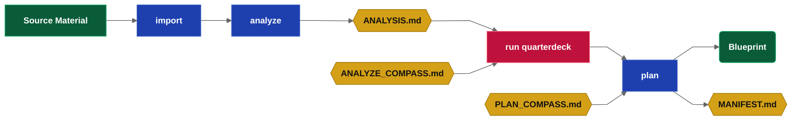
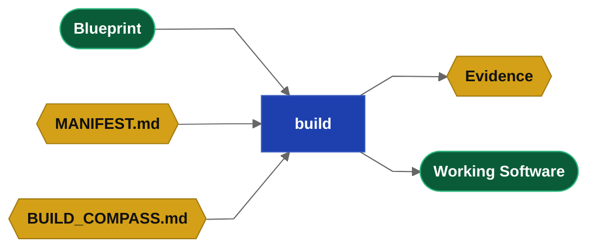

## What is Drydock

Drydock is a governed Blueprint-driven software delivery system built around the **SAIL methodology**.

**The Commander.** Drydock addresses its operator as the Commander.  Drydock uses agile best practices and the Commander is the product owner. The QuarterDeck enables the Commander to own intent, review evidence and decisions, and to provide feedback at each stage.  That feedback guides the work and command reruns will incorprate that user intent.  This document uses "Commander" as synonym for user. The Commander has the role of agile project owner.

**Drydock Blueprints** are the authoritative, living definition of a software product. Blueprints are composed of **Typed Specification Files** with prescribed roles. `drydock plan` turns imported specifications into Blueprints ready for execution.  `drydock plan` creates a **Manifest** and defines your typed specification files into a simple graph database suited for **context optimized builds**.

Context management is the KEY to reproducable specification driven builds.  `drydock build` uses a **dependency graph** to deliver working software using a use context-size-aware file stacking strategy that ensures the work is done accurately.  In Story Planning, the Agile LLM provides EXACT story points (token cost) to implement each story.  In Story Planning, you group similar stories in the QuarterDeck to optimizes build token cost.

**Enterprise branding and stack rules** are injected using Rigging.  Rigging is applied using the concept Builder / User.  Feature builders need the whole specification to implement.  Feature users use markdown compaction to recieve only how to use the feature.  They do not need to know what it does or why.

The loop phase lets the Commander **update and iterate** the application while preserving the specification as the source of truth.


### Glossary

| Drydock term | Meaning |
|---|---|
| Commander | The operator; the Agile Product Owner. |
| Target | The named project under `$DRYDOCK_WORKSPACE/targets/<Target>`. |
| Blueprint | The Typed Specification files that define the product; the source of truth. |
| Manifest | The executable build plan and dependency graph, `MANIFEST.md`. |
| Frontier | The set of Manifest blocks that are runnable now. |
| QuarterDeck | The web review console between the Commander and the LLM process. |
| Compass | Persistent Commander intent injected into command prompts. |
| Rigging | Shared branding, stack rules, templates, and compact context derivatives. |
| Soundings | The acceptance checklist and implementation evidence ledger. |
| Sea Trials | Product-level objectives and proof-of-delivery criteria. |
| Ship's Log | The append-only ledger of material decisions and milestones. |
| Refit | The Loop-phase change process that keeps the Blueprint and the software aligned. |

## The drydock CLI

```text
drydock <verb> [<sub-verb>] [arguments] [--options]
```

Each project's `<Target>` uses a Workspace of `$DRYDOCK_WORKSPACE/targets/<Target>` and builds to `$DRYDOCK_BUILD_DIRECTORY/<Target>`.

```text
usage: drydock [-h] [--version] [--debug] <command> ...

Drydock — governed Blueprint-driven software delivery.
Copyright (c) 2026 Web Cloud Studio. All rights reserved.

positional arguments:
  <command>
    config    Show or set Drydock configuration.
    init      Initialize a target workspace.
    status    Show project status and orientation.
    validate  Validate a Blueprint's Typed Specification.
    document  Generate and assemble Blueprint documentation.
    publish   Render frontmatter Markdown into publishable HTML.
    rigging   Manage Drydock Rigging.
    plan      Manage the build plan.
    build     Build or inspect build state.
    refit     Update Blueprint and target software together.
    analyze   Decompose imported sources into stories, blockers, and acceptance milestones.
    survey    Score a target's build process against its acceptance criteria.
    run       Start a Drydock service.
    import    Reverse-engineer a project into a Blueprint.

options:
  -h, --help  show this help message and exit
  --version   show program's version number and exit
  --debug     Show full traceback on unexpected errors.
```

## SAIL Phase 1 — Set Up: Laying the Keel

Install Drydock, configure runtime defaults, and create a workspace for a Target build.
Process environment variables override values stored in Drydock's user-scoped `.env`.


### Installation Instructions

**Prerequisites**

- Python 3.11 or later
- A subscription-authenticated CLI: `claude` (Anthropic) or `codex` (OpenAI)

**Install**

```bash
uv tool install drydock-sdd
# or: pipx install drydock-sdd
```

`uv tool` and `pipx` place `drydock` on `PATH` automatically.

**Configure the workspace**

Set `$PROJECTS` to the directory where you keep your projects, then run:

```bash
drydock config set drydock_workspace "$PROJECTS/drydock"
drydock config set drydock_build_directory "$PROJECTS"
```

**Initialize a target**

```bash
drydock init <Target>
```

The resulting layout:

```text
$PROJECTS/
├── drydock/                    # Drydock workspace
│   └── targets/<Target>/       # Created by drydock init - Project Workspace
└── <Target>/                   # Final Build Location for projects
```

### Commands

```text
drydock --help
drydock --version
drydock config show
drydock config set <key> <value>
drydock init <Target>
drydock status [<Target>]
drydock run quarterdeck [<Target>] [--host HOST] [--port PORT]
```

### drydock status

`drydock status` is the primary orientation command. With no arguments it shows the workspace
dashboard across all initialized Targets. With a `<Target>` argument it filters to that Target,
showing its validation state, plan progress, and current runnable frontier.

### drydock config

`drydock config` establishes user-scoped defaults.


| Variable | Purpose |
|---|---|
| `DRYDOCK_BUILD_DIRECTORY` | `drydock build` builds `$DRYDOCK_BUILD_DIRECTORY/<Target>`; defaults to `$DRYDOCK_WORKSPACE/build`. |
| `DRYDOCK_WORKSPACE` | Drydock workspace root; set explicitly or resolved from the Git top-level. Required — commands error when neither is available. |
| `LLM_PROVIDER` | Subscription CLI provider: `claude` or `codex` |
| `PROMPT_WARN_TOKENS` | Build-block prompt-size warning threshold in tokens |
| `MODEL` | LLM model - gpt-5.4, gpt-5.5, sonnet, opus  |
| `QUARTERDECK_PORT` | Default QuarterDeck service port |

### drydock init

`drydock init <Target>` creates the temporary workspace for the <target> under targets/.  It populates the artifacts such that you can proceed with the workflow. `drydock init` creates `$DRYDOCK_WORKSPACE` when it does not exist. Target-consuming commands require an initialized Target and direct the Commander to `drydock init <Target>` otherwise.

## SAIL Phase 2 — Agile Analyze: Charting the Course

The Analyze phase turns imported source material into an Analysis for review, then into an executable Manifest for build.

1. `drydock import` brings source material under Drydock control.
2. `drydock analyze` reads the imported sources and derives stories, acceptance milestones, blockers, questions
3. `drydock run quarterdeck` lets the product owner review, approve, and answer questions
4. `drydock plan` consumes the reviewed analysis and creates Blueprint files and the Manifest.

> **Definition — Compass**
>
> Compass files contains Commander overrides marked `Important:`. They are the intent of the Commander.
> `COMPASS.md` is inserted into every command. 
> `PLAN_COMPASS.md` is inserted into `drydock plan`. 
> `ANALYZE_COMPASS.md` is inserted into `drydock analyze`. 
> Compass files let the Commander define goals, constraints, and definition of done.

### Commands

```text
drydock import <Target> <Source> --format <auto|markdown|source|speckit|compass>
drydock analyze <Target>
drydock run quarterdeck [<Target>] [--host HOST] [--port PORT]
drydock plan <Target>
```



### drydock import

`drydock import <Target> <Source> --format <auto|markdown|source|speckit|compass>` is the intake step.
It brings external material under Drydock control.  Drydock can import data from other specification systems or can import
a compass file.  The data is copied as is into `blueprint/sources/`.

`drydock import <Target> <Source File> --format markdown` imports general markdown specifications

`drydock import <Target> <Directory> --format markdown` imports general markdown specifications

`drydock import <Target> <Source> --format <source|speckit>` imports specifications from other systems

`drydock import <Target> <Source> --format compass` copies the source into the target `COMPASS.md`.

### drydock analyze

`drydock analyze` is Agile Decomposition, the phase where the Agile Epic is split into features and stories and the plan is created. The LLM decomposes `blueprint/sources/` into a set of markdown artifacts using its role as an Agile Best Practices Team. It prepares the following files for Commander review.

**Input files**

| Artifact | Location | Purpose |
|---|---|---|
| `sources/*` | `blueprint/` | Imported source material; read-only planning context |
| `*COMPASS.md` | Target root | Project intent - Note that the COMPASS.md is injected into EVERY prompt |
| `ANALYZE_COMPASS.md` | Target root | Commanders Feedback: Update it - injected every run |
| `BLOCKERS.md` | Target root | Created by `drydock analyze`. Blockers identify gaps or required information and the Commander edits file to address these concerns. |
| `questionnaires/*.json` | `QuarterDeck/` | Created by `drydock analyze`. Persistent answers consumed on re-run |

**Output files**

| Artifact | Location | Purpose |
|---|---|---|
| `BLOCKERS.md` | Target root | Questions on any blockers the LLM has found. Existence implies blockers.  Edit to resolve them. |
| `ANALYSIS.md` | Target root | Summary of the decomposition, story list, blockers, questions, and recommendations |
| `SEA_TRIALS.md` | Target root | Product-level objectives and success criteria |
| `SOUNDINGS.md` | Target root | Acceptance tests and milestones  |
| `COMPASS.md` | Target root | Created if it does not Exist. The master project intent file.   Always imported.  Review it if one was automatically created. |
| `questionnaires/*.json` | `QuarterDeck/` | Review questionnaires for unresolved decisions and genuine research spikes |
| `commanders_chair.html` | `QuarterDeck/` | QuarterDeck summary view for the current state |

The LLM gives a verdict on the condition of the build.  The most important guard is `BLOCKERS.md`.  If
`BLOCKERS.md` exists, the Commander edits it to answer the questions and reruns `drydock analyze`. The
Commander's answers guide the LLM on the next run, and the cycle repeats until no blockers remain.

| Quality | Meaning |
|---|---|
| `Blocked` | One or more blockers prevent planning from proceeding |
| `Questions` | Planning may proceed, but open questions remain |
| `Ready` | No blockers remain |

### Agile Story Refinement with drydock run quarterdeck

> **Definition — QuarterDeck**
>
> The QuarterDeck is a web console that renders Markdown output generated by the LLM.
> It is how the Commander communicates with the Crew

`drydock run quarterdeck` starts a web console for the Commander (product owner).  It is your helm or cockpit.  Navigate to the listed host and port.

At this stage, each story will be presented in its feature/story heirarchy with acceptance criteria.  Blockers have been identified and should be reconciled.  The QuarterDeck shows the artifacts, blockers, questions, questionnaires, and activity that need review in the planning session.  Review the tabs. When you are ready and ok with the plan move to the next step.  Change the instructions by filling out the Questionaires, Compass, or Analyze Compass.

Questionnaires and BLOCKERS.md can be edited directly or modified in the QuarterDeck to respond.  Responses are used on the next run of `drydock analyze`.

Commander responses in the QuarterDeck are preserved for the build (by writing them to the appropriate markdown file).

The QuarterDeck calls out blockers and action items.  It also enables the Commander to review core decisions such as the process the LLM intends to use to decompose the imported material into Blueprints.  This review indicates how well the application builds.  The Agile process continues this decomposition until the plan holds a list of actionable stories ready to implement.

### drydock plan

`drydock plan` is Sprint Story planning.  Imported source files are re-read and reformatted according to the
analysis.  This step creates Typed Specification files under `blueprint/`, writes `BUILD_COMPASS.md`, and drafts `MANIFEST.md`.

The headers of the blueprints are structured as a dependency graph and the runnable frontier is established.

The plan contains Acceptance Criteria, Spikes and Specification Tickets for features, screens, and scaffolding.

One major goal of the decomposition is for MANIFEST.md to contain a graph database of your work.  The configuration variable
`PROMPT_WARN_TOKENS` (default 50,000 tokens) sets a maximum total context size for each build.  Each step stacks
multiple files into a prompt for execution — including `COMPASS.md`, the applicable subsets of the stack, and
the task instructions.  Similar tasks are grouped together to save context.

**Input files**

| Artifact | Location | Purpose |
|---|---|---|
| `sources/*` | `blueprint/` | Imported source files, re-read and reformatted into Typed Specifications |
| `ANALYSIS.md` | Target root | The reviewed analysis that drives decomposition |
| `PLAN_COMPASS.md` | Target root | Human Editable important block for `build plan`, re-injected every run |
| `COMPASS.md` | Target root | Project intent |
| `questionnaires/*.json` | `QuarterDeck/` | Resolved planning decisions |

**Output files**

| Artifact | Location | Purpose |
|---|---|---|
| `ARCHITECTURE.md`,<br> `DATABASE.md`,<br> `FEATURE-{Name}.md`,<br> `SCREEN-{Name}.md`,<br> `UI-GENERAL.md` | `blueprint/` | Typed Specification files |
| `BUILD_COMPASS.md` | Target root | Story-planning grouping and build-order input for `drydock build` |
| `MANIFEST.md` | Target root | The executable build plan |
| `SOUNDINGS.md` | Target root | Acceptance gates projected by stable ID |

**Replan behavior**

`drydock plan` is rerun-safe. When a prior `MANIFEST.md` exists, the following merge rules apply:

- `applied_specs` is restored verbatim — it is the build graph database and is never regenerated by `plan`.
- Blueprint files whose sha256 matches their `applied_specs` record (clean) are protected: `plan` does not overwrite them with the LLM-generated version.
- Block states are preserved for any block whose `implements:` files are all clean.
- Blocks with any dirty `implements:` file (sha256 changed since application) are reset to `pending` for re-execution.
- Spike `finding:` text is preserved regardless of dirty state.
- `BUILD_COMPASS.md` and `PLAN_COMPASS.md` are never overwritten.

A Commander dirties a file explicitly — via the QuarterDeck or by editing it directly — to force re-application of its story on the next `drydock build`.

## SAIL Phase 3 — Implement: Sailing the Frontier

Implement the Blueprint using the Manifest

* The Manifest exposes the phases with `drydock build status <Target>`.
* Iterate through the build phases with `drydock build <Target>`.
* Measure delivery health with `drydock build score`.
* The rigging implements company standards and branding.

### Commands

```text
drydock build <Target>
drydock build <Target> --step <STEP>
drydock build <Target> --step <STEP> --force
drydock build status <Target>
drydock build score <Target>

drydock document generate <Target> [--model <model>]
drydock document assemble <Target> [--theme <theme>]
drydock document <Target> [--model <model>] [--theme <theme>]

drydock publish <Source.md> --output <Output.html> [--theme <theme>] [--pdf] [--pdf-output <Output.pdf>]

drydock validate <Target> [--verbose]

drydock rigging compact <Target> [--all] [--force] [--include-file <file.md>] [--exclude-file <file.md>] [--include-dir <dir>]
drydock rigging update <Target>
drydock rigging verify <Target>
```

### Agile Build Planning with drydock run quarterdeck

Review `MANIFEST.md` in the QuarterDeck to understand the build process and to update build direction and instructions.

The manifest is your final Plan - The Commander can rearrange stories at their
whim in the QuarterDeck.

In the Build Compass you review the build plan in the Manifest.   The manifest will group similar steps
to reduce your context and will set the stories up in a meaningful implementaton plan of Foundation -> Data and Persistence -> Features -> User Interface.  Each step will display its estimated counts and the Commander can:
* reorder stories so important/testable steps are done first
* re group stories so they can be run by a single agent
* review Blueprint programmatic and user acceptance

If you do not story plan, you accept the LLM's default order of stories.

Note that the manifest titles each of the build steps and these steps are the implemented one by one.

The general order for operations is a loop:

    drydock build status <Target>
    while <STEPS REMAIN TO BE DONE>
      drydock build <Target>
      drydock build status <Target>

Passing programmatic acceptance unlocks the next set of dependent operations.

### drydock build

Build executes the work blocks in `MANIFEST.md` based on their dependency graph. `BUILD_COMPASS.md`
is the story-planning input that defines the authored grouping and build order. The Manifest and
its Typed Specifications execute in the steps or phases the plan lists.



**Input files**

| Artifact | Location | Purpose |
|---|---|---|
| `COMPASS.md` | Target root | Always Injected |
| `BUILD_COMPASS.md` | Target root | Story-planning grouping and build-order input |
| `MANIFEST.md` | Target root | Executable build plan and dependency graph |
| `ARCHITECTURE.md`, `DATABASE.md`,<br> `FEATURE-{Name}.md`, <br>`SCREEN-{Name}.md`,<br> `UI-GENERAL.md` | `blueprint/` | Typed Specification files consumed for the current build step or phase |

**Output files**

| Artifact | Location | Purpose |
|---|---|---|
| `evidence/` | Target root | Reviewable build evidence written for completed work |
| Built application files | `<Target>` | Target working directory for build<br>override in `METADATA.md` field `build_dir:` |

`drydock build <Target>` executes the dependency-ready frontier and builds the application in the target working directory `$DRYDOCK_BUILD_DIRECTORY/<Target>`.
`drydock build <Target> --dry-run` resolves the same build block, assembles the same prompt,
prints build diagnostics, assembled-file names, prompt size, and estimated tokens, and exits without
compact refresh, LLM execution, file writes, evidence writes, Manifest state changes, QuarterDeck
refresh, README generation, or git initialization/commit. `--dry-run` does not print file contents
or the full prompt by default. `--show-prompt` prints the full assembled prompt only when explicitly
combined with `--dry-run`.
Before executing any agent, `drydock build` compares every previously applied Blueprint
Specification in the Manifest's `applied_specs` registry against the current Blueprint file
content. A changed or missing previously applied Specification blocks the build and reports the
stale file, recorded commit, current commit, recorded hash, and current hash. New unapplied
Specification files do not block build.

`ARCHITECTURE.md`, `DATABASE.md`, and `UI-GENERAL.md` are sealed foundational Specifications;
their compact derivatives carry the same sealing. When a sealed foundational Specification is
stale, the block message names it and instructs the Commander to create a change ticket in
`blueprint/changes/` with `Amends: <file>` and run `drydock refit`. For a stale ordinary
Specification, the block message instructs the Commander to run `drydock refit`.

### drydock build - PseudoCode State Machine

  ```pseudocode
  states:
    pending = not built
    implemented = legacy built state awaiting review
    closed/verified = built and programmatic acceptance passed
    closed/failed = build or programmatic acceptance failed

  status_labels:
    pending -> [pending]
    implemented -> [review]
    closed/verified -> [done]
    closed/failed -> [FAILED]

  next_buildable_block:
    for block in manifest:
      if block has child stories_or_spikes:
        pending_children = child stories_or_spikes where child.state == pending
        if pending_children is empty: continue
        if any(external dep.state != closed/verified for dep in block.depends): stop blocked
        if any(external dep.state != closed/verified for dep in pending_children.depends): stop blocked
        return block with pending_children
      if block is story_or_spike and block.state == pending:
        if any(dep.state != closed/verified for dep in block.depends): stop blocked
        return block
    return none

  build:
    block = selected_block or next_buildable_block()
    if block is none: stop
    run_agent(block)
    if agent_failed or no_files_written:
      block.pending_children.state = closed/failed
    else if programmatic_acceptance_fails(block.pending_children.implements):
      block.pending_children.state = closed/failed
    else:
      block.pending_children.state = closed/verified
      if all block child stories_or_spikes are closed/verified:
        block.state = closed/verified

  force_rebuild(block):
    block.state = pending
    for child in block.child_stories_or_spikes:
      child.state = pending
    for ac in block.child_acs:
      ac.state = pending
    build(block)
```

### Agile Build Review with drydock run quarterdeck

The QuarterDeck guides the Commander through the agile process.  The build review lets the user see evidence, demos, and questions needed for a decision.

Conceptually the Build Review screen is similar to the `drydock build status` command.

### drydock build status

`drydock build status` reads `MANIFEST.md` and the runtime logs and reports the state of the plan.

```text
drydock build status <Target>   # print per-block state and current runnable frontier
```

### drydock build score

`drydock build score` measures delivery health across seven dimensions — Typed Specification
completeness, implementation coverage, test coverage, documentation coverage, Blueprint drift,
build quality, and acceptance criteria coverage. Output is `SCORECARD.md` at the Target root,
alongside `ANALYSIS.md`, `MANIFEST.md`, and `METADATA.md`.


1. `drydock build score <Target>` — compare the Blueprint against the built application; surfaces
   drift between what was specified and what was delivered.
2. `SCORECARD.md` identifies the highest-value gap across all seven dimensions. Use it to
   prioritize the `drydock refit`.

TODO: Need to import SOUNDINGS and SEA TRIALS as well.

### drydock survey

TODO: Drydock survey was the mechanism i used to have Claude and Codex judge each others prompt and iterate them.  I
have not decided it it is strategic though it certainly is of value.  I built the prompts with opus then iterated from
weak/er models through stronger models to have them determine the ideal prompt that met the needs defined.

```text
drydock survey <Target>             # render the latest scoreboard
drydock survey <Target> --run       # score (LLM-assisted) and append results
drydock survey <Target> --import D   # re-read a Blueprint/sources directory and regenerate AC
drydock survey <Target> --command status   # filter to one command
```

A Target carries one Surveyor workspace at `survey/`: per-command acceptance-criteria
files under `survey/ac/SURVEY-<command>.md`, an append-only `survey/scores.jsonl`, and the scoring
`survey/RUBRIC.md`. Each command is scored on five weighted dimensions — behavioral correctness,
specification quality, process integrity, evidence/reproducibility, and contract conformance — to a
0–100 score and a band (`SEAWORTHY`, `SEA_TRIALS`, `TAKING_WATER`, `DRY_DOCK`). A guardrail breach
or regression caps the band regardless of the number.

The scoring math is deterministic and lives in the command. An LLM judges each acceptance
criterion and synthesizes recommendations; the command computes the scores and writes the files, so
runs need no file-write permission and tests substitute a fake runner. `--import` regenerates the
acceptance-criteria files from the specification so the process can iterate on its own definitions.

1. `drydock survey <Target> --run` — judge each command against its AC; record one scored entry
   per command with root-cause flags and generalized recommended fixes.
2. The scoreboard surfaces which dimension of which command is dragging; a flag recurring across
   commands (e.g. `unresolved-uncertainty`) signals a *process* defect to fix in the prompt or
   command contract, not a one-off code fix.

### drydock document

```text
drydock document generate <Target> [--model <model>]
drydock document assemble <Target> [--theme <theme>]
drydock document <Target> [--model <model>] [--theme <theme>]
```

`drydock document` creates Target documentation from the Target Blueprint.

`drydock document generate <Target>` reads the Target Blueprint, `METADATA.md`, `MANIFEST.md`,
and documentation configuration and writes the standard Target documentation set under
`$DRYDOCK_BUILD_DIRECTORY/<Target>/docs/`.

`drydock document assemble <Target>` reads existing `DOC-*.md` files under
`$DRYDOCK_BUILD_DIRECTORY/<Target>/docs/` and renders one browsable documentation site at
`$DRYDOCK_BUILD_DIRECTORY/<Target>/docs/index.html`.

`drydock document <Target>` runs `generate` and then `assemble` as one documentation pipeline.

The Target documentation configuration lives at
`$DRYDOCK_WORKSPACE/targets/<Target>/documentation.yaml`.

```yaml
theme: slate
sections:
  - OVERVIEW
  - FEATURES
  - SCREENS
  - ARCHITECTURE
  - SCHEMA
  - FLOWS
  - PIPELINE
  - SIGNALS
```

The `sections:` order defines the documentation navigation order. CLI flags override configuration
values for the current run.

Supported theme names are `slate`, `harbor`, and `paper`.

**Input files**

| Artifact | Location | Purpose |
|---|---|---|
| `documentation.yaml` | Target workspace root | Documentation section, navigation order, and theme configuration |
| Typed Specification files | Target workspace `blueprint/` | Source material for generated documentation |
| `MANIFEST.md` | Target workspace root | Build plan and implementation structure used as documentation context |
| `METADATA.md` | Target workspace root | Target metadata used as documentation context |
| `DOC-*.md` | Target build `docs/` | Markdown documentation files consumed by `document assemble` |

**Output files**

| Artifact | Location | Purpose |
|---|---|---|
| `DOC-OVERVIEW.md` | Target build `docs/` | Product overview documentation |
| `DOC-FEATURES.md` | Target build `docs/` | Feature documentation |
| `DOC-SCREENS.md` | Target build `docs/` | Screen and user interface documentation |
| `DOC-ARCHITECTURE.md` | Target build `docs/` | Architecture documentation |
| `DOC-SCHEMA.md` | Target build `docs/` | Optional data schema documentation |
| `DOC-FLOWS.md` | Target build `docs/` | Optional workflow documentation |
| `DOC-PIPELINE.md` | Target build `docs/` | Optional delivery pipeline documentation |
| `DOC-SIGNALS.md` | Target build `docs/` | Optional signals, telemetry, and operating documentation |
| `index.html` | Target build `docs/` | Browsable single-page documentation site |
| `styles/spec.css` | Target build `docs/` | Documentation site theme CSS |

### drydock publish

Drydock publish enables you to convert arbitrary markdown into html or pdfs.  Use this for white papers and other
artifacts.  Your markdown should have appropriate frontmatter.

```text
drydock publish <Source.md> --output <Output.html> [--theme <theme>] [--pdf] [--pdf-output <Output.pdf>]
```

`drydock publish` deterministically renders a frontmatter Markdown document into publishable HTML.  It uses document frontmatter for title, author, studio, cover text, theme, and other formatting.  It does not call an LLM. Supported themes are `sail`, `slate`, and `paper`.

`--pdf` also renders a PDF from the generated HTML using the local browser renderer.

Example:
```bash
 drydock publish docs/Drydock_Specification.md --output docs/index.html
 drydock publish docs/Drydock_Specification.md --output dist/Drydock_Whitepaper.html --theme sail --pdf
```

## SAIL Phase 4 — Loop: The Refit

A Refit lets the Commander update the application.  The process updates the Blueprint and optionally the Target. Blueprints changes
are kept in sync with the application with a `drydock build`.

The post-build refit for an existing project keeps the code and Blueprints aligned.  Drydock provides two methods for this.  The first
uses change tickets which have the same dependency graph as do the other Blueprints.  This enables it to be chunked with `drydock build` after
a new plan is built.  The alternative tracks the git commit of the build and can use git to identify files which have been changed and which
can rerun only those files.

### Commands

```text
drydock refit <Target>
```


### drydock refit

`drydock refit` conforms change tickets in `blueprint/changes/` to the Drydock build process. The Commander (or an external ticketing system) places `TICKET-NNN-{Name}.md` files in that directory. Refit normalizes each ticket's typed spec header, generates or refines stories and acceptance criteria, and patches `MANIFEST.md` with new story rows for those tickets. The ticket pass never touches applied manifest rows; only the drift reconciliation pass resets them.

**Change ticket format.** A change ticket is a Typed Specification file with FileType `CHANGE`. It carries an `Amends:` header field that names the parent Blueprint spec the ticket modifies (e.g. `Amends: FEATURE-Copy.md`). `drydock refit` reads this field to resolve dependency inheritance and to inject the parent spec as context.

**Dependency inheritance.** A change ticket's `Depends On:` field equals the parent spec's `Depends On:` set plus the parent spec filename itself. `drydock refit` computes this deterministically from the parent spec header before the LLM call and injects the resolved list into the prompt.

**Role boundary.** `drydock refit` is a targeted patch: it processes only tickets in `blueprint/changes/` and inserts or replaces pending manifest rows for those tickets. `drydock plan create` is a full regeneration: it reads all Blueprint inputs and rewrites `MANIFEST.md` with state-preserving merge. Run `drydock plan create` after `drydock refit` when the full plan graph must be recomputed.

**Behavior.** Scans `blueprint/changes/*.md`. For each ticket: reads `Amends:`, resolves parent spec dependencies, runs one LLM call to normalize the ticket header and generate manifest rows, writes the updated ticket, and patches `MANIFEST.md`. Tickets without an `Amends:` field are skipped with a warning. After the ticket pass, refit runs a deterministic drift reconciliation over the Manifest's `applied_specs` registry.

**Drift reconciliation.** Refit compares every `applied_specs` record against the current Blueprint file content. For each drifted file, refit computes the reset cascade: every block whose `implements:` or `context:` references the file or one of its compact derivatives, every transitive dependent of those blocks through `depends:`, and every child of a reset block. Refit sets each cascaded block's `state:` to `pending`, reopens the parent feature of each reset step, removes the drifted file's `applied_specs` records, and removes every record stamped by a reset block. The next `drydock build` rebuilds the reset blocks in dependency order.

**Sealed foundational Specifications.** A drifted `ARCHITECTURE.md`, `DATABASE.md`, or `UI-GENERAL.md` (or a compact derivative of one) resets its cascade only when a ticket in the same refit run amends it. Without such a ticket, refit reports the file as blocked with the instruction to create a change ticket carrying `Amends: <file>`, leaves its blocks and records untouched, and exits 1. A foundational reset cascades to every dependent block; a foundational change rebuilds the application.

**Input files.** `blueprint/changes/*.md`, `blueprint/<parent-spec>.md`, `blueprint/*.md` (drift comparison), `MANIFEST.md`, `COMPASS.md`, `MANIFEST_CONTRACT.md`.

**Output files.** Updated `blueprint/changes/*.md` (headers normalized); patched `MANIFEST.md` (ticket rows, cascaded `state:` resets, pruned `applied_specs` records).

**Exit codes.** `0` success or no-op; `1` operational failure or unticketed foundational drift; `2` usage error.

TODO: The refit can roll the change tickets into the primary specification files.

## Artifact I/O Matrix 

What drydock operations read/write

| Artifact | Location | analyze | plan | build | build score | refit |
|---|---|---|---|---|---|---|
| ANALYSIS.md | Target root | O | I | · | · | · |
| ANALYZE_COMPASS.md | Target root | C/I | · | · | · | · |
| ARCHITECTURE.md | blueprint/ | · | O | I | I | I |
| BLOCKERS.md | Target root | O/I | X | · | · | · |
| BUILD_COMPASS.md | Target root | · | O | I | · | · |
| commanders_chair.html | QuarterDeck/ | O | · | · | · | · |
| COMPASS.md | Target root | O*/I | I | I | I | I |
| DATABASE.md | blueprint/ | · | O | I | I | I |
| FEATURE-{Name}.md | blueprint/ | · | O | I | I | I |
| MANIFEST.md | Target root | · | O | I | I | I |
| PLAN_COMPASS.md | Target root | · | C/I | · | · | · |
| questionnaires/*.json | QuarterDeck/questionnaires/ | O/I | I | I | · | · |
| SCORECARD.md | Target root | · | · | · | O | · |
| SCREEN-{Name}.md | blueprint/ | · | O | I | I | I |
| SEA_TRIALS.md | Target root | O | · | · | · | · |
| SOUNDINGS.md | Target root | O | O/I | O | I | · |
| changes/TICKET-{NNN}-{Name}.md | blueprint/changes/ | · | I | I | · | O |
| sources/* | blueprint/sources/ | I | I | · | · | · |
| UI-GENERAL.md | blueprint/ | · | O | I | I | I |

**Legend:** `O` the command produces the artifact · `I` the command consumes the artifact ·
`C` the command creates the artifact if absent (never overwrites) · `X` gates/blocks the command ·
`·` no relation · `O*` the command produces the artifact only when it is absent.

Human-authored feedback artifacts (`ANALYZE_COMPASS.md`, `PLAN_COMPASS.md`, answered `BLOCKERS.md`) are prompts that guide future runs of the commands.

## Directory Layout

Drydock stores its own state under `$DRYDOCK_WORKSPACE/targets/<Target>`. The built application lives under `$DRYDOCK_BUILD_DIRECTORY/<Target>`. The QuarterDeck is configuration driven and uses files from the Drydock-managed Target tree.

```text
$DRYDOCK_WORKSPACE/                       # explicit config/env or Git top-level — required
├── logs/
│   ├── ships_log.jsonl                   # workspace product/design decision ledger
│   ├── history.jsonl                     # append-only command-invocation log
│   └── run.log, run.log.1 … run.log.5    # rotating per-command execution logs
│
└── targets/
    └── <Target>/                         # one self-contained project
        ├── METADATA.md                   # identity: Blueprint name, code_root, status, stack
        ├── README.md                     # short human introduction to the project
        ├── ANALYSIS.md                   # Planning Session analysis: quality, stories, blockers, questions
        ├── ANALYZE_COMPASS.md
        ├── BLOCKERS.md
        ├── COMPASS.md                    # project guidance: intent, constraints, guardrails
        ├── MANIFEST.md                   # the executable Manifest
        ├── PLAN_COMPASS.md
        ├── SCORECARD.md                  # seven-dimension quality + drift scores
        ├── SEA_TRIALS.md                 # Project AC — project-level acceptance criteria
        ├── SOUNDINGS.md                  # AC — calculated acceptance/readiness ledger
        │
        ├── BUILD_COMPASS.md              # story-planning grouping and build-order input
        │
        ├── blueprint/                    # the Blueprint — conformed Typed Specification
        │   ├── sources/                  # preserved unconformed import material
        │   ├── ARCHITECTURE.md
        │   ├── DATABASE.md
        │   ├── FEATURE-{Name}.md
        │   ├── SCREEN-{Name}.md
        │   ├── UI-GENERAL.md
        │   └── changes/
        │       └── TICKET-NNN-{Name}.md
        │
        ├── evidence/                     # reviewable build evidence, named by build object
        │
        └── QuarterDeck/                  # console state only; runtime served from the package
            ├── console.yaml
            ├── pages/
            │   └── overview.md
            ├── data/
            └── questionnaires/
                └── planning.json
```

```text
$DRYDOCK_BUILD_DIRECTORY/
└── <Target>/                             # application source tree built by drydock build
```


## The Manifest — (a Graph Build Plan)

`MANIFEST.md` is the single generated execution view of the Blueprint. It determines order,
selects only required context, keeps work within useful context limits, identifies stale work, and
preserves unaffected accepted work. It is not a second product definition.

The Manifest manages the full product lifecycle:

- specifications for individual components like screens can be changed resulting in
  context-minimized incremental builds
- new files (such as change tickets) can be discovered and applied

Each Manifest contains four block types:

- `feature` optionally groups substantial workflows and owns feature-level acceptance
- `story` builds something. A Drydock story is an enriched Spec Kit task: it has states,
  `depends:`, Blueprint acceptance, and prompt-assembly fields.
- `spike` answers a question. Results feed future iterations
- `ac` is a legacy block type retained for existing Manifests. Durable acceptance lives in the
  Blueprint.

### Plan Header

```markdown
# MANIFEST: {ProjectName}
updated:     2026-06-08T12:00:00
plan_hash:   abc123456789
applied_specs: |
  DATABASE.md sha256=<content_sha256> commit=<file_commit_sha> applied_by=foundation applied_at=2026-06-26T14:22:00Z
```

Build execution evidence lives in the execution log. The Manifest preamble carries build-state
provenance required to detect stale previously applied Blueprint Specifications.
`applied_specs` records one line per Blueprint Specification file that has been applied by a
successful story or spike. The path is relative to `blueprint/`. `sha256` is the authoritative
dirty signal. `commit` is the latest git commit that touched that file, or `-` when unavailable.
`applied_by` identifies the story or spike that last applied the file. `applied_at` is the UTC
application timestamp.

### Story Blocks

```markdown
## story N: {Name}
id:           foundation
parent:       feature-catalog
summary:      One-line description.
implements:   DATABASE.md, FEATURE-CATALOG.md
context:      ARCHITECTURE.md
stack:        common.md, python.md, sqlite.md
rules:        CLAUDE_RULES.md
copy:         Rigging/templates/common.sh -> bin/common.sh
instructions: |
  Build persistence and the catalog service.
depends:      select-parser
state:        pending
evidence:     evidence/<id>.md
scope:        blueprint | target | both
```

`implements:` is the spec files this story uses. `context:` is read-only support context.
`parent:` is optional. It is used for arbitrary hierarchy and QuarterDeck display. Builds are
rules-based on block type. `scope:` declares whether a story changes the Blueprint, target
software, or both.

### Feature Blocks

A feature is an optional grouping block. Small plans do not require features. Build execution uses
the grouping block as the atomic build unit: if a pending child story or spike depends on another
child story or spike inside the same feature, that dependency is internal sequencing and does not
block the feature from running. A feature can run only when every dependency outside the feature is
`closed/verified`. A feature closes only after all required child stories, spikes, and feature-level
`ac` blocks are `closed/verified`.

### Spike Blocks

```markdown
## spike N: {Name}
id:           select-parser
summary:      One-line description.
context:      FEATURE-IMPORT.md
question:     Which parser satisfies the Blueprint?
parent:       feature-import
finding:      ← text answer written here by the agent
depends:      foundation
state:        pending
evidence:     evidence/<id>.md
```

### Acceptance Check Blocks

```markdown
## ac N: {Name}
id:           system-starts
parent:       foundation
summary:      One-line description.
kind:         smoke | assertion
check:        test -f bin/start.sh && curl -sf http://localhost:${PORT}/health
depends:
state:        pending
evidence:     evidence/<id>.md
```

`ac` blocks are supported for legacy Manifests and exceptional orchestration checks. Blueprint
`Programmatic Acceptance` is the normal source of durable acceptance.

An `ac` block's `depends:` may name its own parent story only; the build engine drops any
cross-story `ac` dependency on read. Acceptance checks are out of the build-ordering stream:
they are never positioned among steps, only run after their parent story builds.

### Block States

All four block types use the same four states:

| State | Meaning |
|---|---|
| `pending` | Not run yet |
| `implemented` | Legacy work done state, waiting to be reconciled |
| `closed/verified` | Passed or accepted |
| `closed/failed` | Failed or rejected |

### Execution Rules

A build block can run only when every external dependency in `depends:` is `closed/verified`.
Dependencies between stories or spikes inside the same grouping block are internal build-agent
sequencing and do not split the build block. A standalone `story` or `spike` is a one-step build
block. A grouped feature is a multi-step build block containing its pending child stories and
spikes. A build block with an unverified external dependency blocks build execution and reports the
blocking dependency.

Legacy `ac` blocks are reconciled by the build engine or QuarterDeck. They are not the normal
acceptance authority for new plans.

A `story` or `spike` becomes `closed/verified` after the build agent succeeds, files are written,
and Blueprint `Programmatic Acceptance` passes.

The story and the deterministic tests that prove its acceptance are written in the same build
step. The Blueprint's `Programmatic Acceptance` is the story's Definition of Done — declared
before the build and human-owned. The build authors the executable tests that satisfy it and may
add finer coverage, but never removes or weakens a declared acceptance assertion.

`closed/failed` is not terminal. The product owner reopens failed work from the QuarterDeck —
revising the block's instructions, acceptance, or scope interactively — and the decision writer
returns it to `pending` with the revision recorded. The decision writer is the only mutator of
Manifest block state; recovery never requires hand-editing `MANIFEST.md`.

Guardrails and `Programmatic Acceptance` embedded in the Specification files run after each
successful story build. `Programmatic Acceptance` is deterministic and non-agentic: each check is
a Python invocation run as a post-build hook, so verification consumes no model context and cannot
self-report. A story that satisfies its implementation but fails programmatic acceptance becomes
`closed/failed` until rebuilt. A story that fails build records a single-line
`finding:` with the failure reason, surfaced on the Build Compass. `User Acceptance` entries are
Commander review signals and do not block ordinary downstream build unless modeled as explicit
dependencies.

### Worked Example

```markdown
# MANIFEST: MyProject
updated:     2026-06-08T12:00:00
plan_hash:   abc123456789

## spike 1: Select parser
id:           select-parser
parent:       import-feature
summary:      Compare supported parsers.
context:      FEATURE-IMPORT.md
question:     Which parser should the project use?
finding:
state:        pending

## story 1: Foundation
id:           foundation
summary:      Build persistence and directory layout.
implements:   DATABASE.md, ARCHITECTURE.md
stack:        common.md, python.md, sqlite.md
rules:        CLAUDE_RULES.md
state:        pending

## ac 1: system starts
id:           system-starts
parent:       foundation
summary:      Service starts and responds on health.
kind:         smoke
check:        test -f bin/start.sh && curl -sf http://localhost:${PORT}/health
state:        pending

## story 2: Import documents
id:           import-documents
parent:       import-feature
summary:      Implement the accepted import workflow.
implements:   FEATURE-IMPORT.md
depends:      select-parser, foundation
state:        pending
```

## The QuarterDeck — Agile Development Console

The QuarterDeck is the command surface where the product owner reviews LLM build output and makes
decisions. Evidence is presented using Agile methodology — the same structured handoff between
builder and owner, without the meeting.

The QuarterDeck is configuration-driven: a console rendered from a single `QuarterDeck/console.yaml`
index file over Markdown and JSON inputs. It holds no logic of its own; it shows the artifacts a
project produces and routes the few that require a decision to the product owner. Full configuration
reference, page-type schemas, and API surface are documented in `QuarterDeck/README.md`.

**Page types.** Each item in `console.yaml` declares one renderer:

| Type | Purpose |
|---|---|
| `markdown` | Renders a single `.md` file as HTML; `tabs: true` splits `##` headings into clickable tabs. |
| `editable_markdown` | Renders a `.md` file with an EDIT control for in-place editing. |
| `document` | Collapses `path_md` / `path_html` / `path_pdf` variants into a tab bar. |
| `jsonl` | Read-only table from an append-only JSONL file. |
| `kanban` | Renders `MANIFEST.md`-derived tickets as a four-column board. |
| `questionnaire` | Form backed by a JSON file; saves answers in SQLite and writes them back to the source file. |
| `link` | External URL or local file; opens in a new tab. |
| `command_status` | Derived read-only acceptance-readiness view from Core Docs. |
| `compass` | The Build Compass: the live `MANIFEST.md` work graph — grouped, costed, state-badged (buildable now / review / done / failed with reason), and editable (reorder/regroup/rename/split). |

**Standard artifacts.** Every Drydock QuarterDeck carries three pinned source-of-truth artifacts
in Drydock Core, shown by file existence:

| Artifact | Purpose |
|---|---|
| **Commanders Chair** | Orientation and default view: mission and current state at a glance. |
| **Soundings** | Acceptance-criteria checklist — each capability, its state, and evidence. |
| **Sea Trials** | Objectives and success criteria — what the project must achieve to be declared delivered. |

`drydock init <Target>` creates these artifacts without overwriting existing files. `drydock plan`
preserves them and projects acceptance gates into Soundings by stable ID.

**Decisions write back.** Review decisions made in the QuarterDeck are written to `MANIFEST.md` by
the same decision writer used by the CLI. The `compass` page is the Build Compass — the live work
graph with per-step lifecycle state and constrained structure editing. The QuarterDeck renders plan
state and records decisions; it does not
replace the Blueprint, `MANIFEST.md`, or build engine.

**Blockers.** `drydock analyze` emits `BLOCKERS.md` only when questions prevent planning; a healthy
project has no `BLOCKERS.md`. When present, the Blockers section appears first in the sidebar. The
product owner answers the questions and re-runs `drydock analyze`; when all blockers are resolved
the file is deleted. Blockers are mandatory gate conditions, distinct from spikes.

## The Ship's Log — Your Decision Log

The Ship's Log is a conceptual decision-log view backed only by Drydock's
`logs/ships_log.jsonl`. It records material decisions and milestones from development of the
Drydock application, not mechanics: what was decided or reached, why, what evidence supported it,
and what it supersedes. Commit identifiers, file hashes, routine edits, commands, and test runs
belong to execution logs. The QuarterDeck renders the JSONL through its reusable `jsonl` page type;
downstream publishing tools consume the same canonical records directly. No `SHIPS_LOG.md` artifact
exists.

```json
{"schema_version":1,"event_id":"uuid","recorded_at":"2026-06-11T18:32:00Z","event_type":"decision","title":"Decision title","summary":"What was decided.","rationale":"Why, including material rejected alternatives.","source":{"type":"agent","command":"drydock build","provider":"codex"},"affected_scope":[],"alternatives":[],"evidence":[],"supersedes":[],"tags":[]}
```

Drydock development agents are instructed by the required repository-local
`SHIPS_LOG_PROCESS.md`, not shared Rigging or target-project injection. An agent evaluates capture
immediately after a material decision or milestone and performs a final capture review before
commit or task completion. The agent invokes `python bin/ships_log.py record`; users are not
expected to record events manually, and event recording is not part of the public `drydock`
CLI. Publishing recorded events as development-log posts is: see `drydock shipslog`.

The repository-local utility validates and appends entries. Entries are never rewritten or
deleted; a reversed decision appends a new event whose `supersedes` list references earlier event
IDs. Agents use the existing `tags` list to classify applicable records as `open-item`,
`deferred-item`, or `accepted-risk`; QuarterDeck displays those tags in its Ship's Log JSONL view.

Standard agent-driven capture during Drydock-managed target design and build workflows remains an
intended product capability so users can review and publish their decision history. Target-project
injection and the supporting decision backend are deferred until this Drydock-only workflow has
been validated.

**Audit by diff.** Because every Blueprint lives in git, the log can be cross-checked: diff the
specification files between commits and produce an English analysis of what changed, inferring the
decisions the changes imply. Inference is lossy — a diff shows what changed, not why — so diff
analysis is the audit trail and backfill mechanism, not the primary capture. `drydock analyze`
reports specification changes not covered by a Ship's Log entry.

### drydock shipslog

```text
drydock shipslog [--dir <path>] [--dry-run]
```

`drydock shipslog` generates development-log posts from unpublished Ship's Log decision and
milestone events. Posts cover aligned seven-day windows that begin on Thursday and end on
Wednesday, matching the published development-log history. The command generates one post per
window that has fully elapsed and contains at least one unpublished event; the week in progress is
never published, and windows with no eligible events are skipped. Because windows are aligned and
contiguous, the published index reads as a continuous chronological record. Post generation runs
through the Ship's Log posts package, which performs one subscription-authenticated LLM rewrite
per post, enforces the disclosure rules, renders a Slate-branded HTML preview, and rebuilds the
posts index. The package's saved cursor advances only after a successful rewrite, so a failed week
stops the run and is retried on the next invocation.

The posts package directory is resolved from `--dir`, then the `shipslog_dir` configuration key,
then a `ShipsLog/` directory in the working directory. `--dry-run` reports the eligible windows
without generating posts.

Input files: `logs/ships_log.jsonl`, the posts package configuration (`blog.config.sh`), its
generation and disclosure contracts, and Rigging voice guidance (`BRANDING_POSTS.md`,
`BRANDING_MAIN.md`).

Output files: one material batch, one Markdown post, and one HTML preview per generated week under
the posts package's `blog/` tree, plus the rebuilt `blog/posts/index.html` and the advanced
cursor.

Exit codes: `0` when all eligible weeks generate (including when no week is eligible); `1` when a
week fails to generate; `2` on usage error.

## Drydock Rigging — Portfolio Governance

Drydock Rigging is the enterprise conformance layer shipped with Drydock. Organizations customize it
once; every project built by Drydock conforms automatically.

Three layers govern agent behavior: business rules, technology stack rules, and branding.

**Business rules.** `BUSINESS_RULES.md` defines how agents must behave — git workflow, project
layout, script conventions, error handling. Agents receive the compact derivative
`BUSINESS_RULES_compact.md`; the full source stays in `Rigging/`.

**Stack rules.** `Rigging/stack/` holds one file per technology, prescriptive and standalone.

**Branding.** `BRANDING_MAIN.md` defines the master palette, typography, and design philosophy.
Per-medium files (`BRANDING_DOCUMENTATION.md`, `BRANDING_WHITEPAPERS.md`, `BRANDING_WEBSITE.md`)
inherit from it.

### Compaction

Compaction creates a `<file>_compact.md` from `<file>.md`.  It extracts only the callable surface of the input file — routes, signatures, typed parameters, one-line summaries — discarding rationale and examples.  Once compacted, the file will be recompacted if `drydock rigging compact --all` is called.  

The manifest understands how to use compact files.  It divides stories into those that consume the file and those that build it.  Consumer stories receive the compact derivative.

If a required compact derivative is absent, the build stops with a directive to run
`drydock rigging compact <Target>`. `drydock plan` warns when a source is newer than its derivative.

**Rigging compaction.** `Rigging/` ships with pre-built compact derivatives. 

The `--all` argument recompacts all files previously compacted if the file is newer than the compact version.  Compaction cascades rebuild invalidation across every story that references those files via `context:`.
Do not edit Rigging files unless the governing source actually changed.

Files without callable surface are classified by the compaction agent and skipped (`no-surface`).
`_compact.md` files are never treated as sources.

**Compact stability.** When a compact derivative already exists, the compaction prompt receives
it alongside the source and reproduces it verbatim unless the source contains a structural change
to the extracted contract. When the regenerated body matches the existing derivative, compaction
keeps the existing file bytes, refreshes its modification time, and reports the file as
`skipped-unchanged`. An unchanged derivative keeps its `applied_specs` hash and triggers no
rebuild cascade.

`rigging compact` runs in three forms - the ARCHITECTURE.md role, the DATABASE.md role, and the evrything else role  The ARCHITECTURE and DATABASE components are repeatedly reinjected and should be special compaction when they are created is our solution.

### Commands

```
drydock rigging compact <Target> [--all] [--force]
                                 [--include-file <file.md>] [--exclude-file <file.md>]
                                 [--include-dir <dir>]
drydock rigging update <Target>
drydock rigging verify <Target>
```

| Flag | Effect |
|------|--------|
| `--all` | Also regenerate compact derivatives in Drydock's own `Rigging/` tree |
| `--force` | Ignore the freshness gate; recompact all discovered files |
| `--include-file <file.md>` | Add a specific file to the compaction set (repeatable) |
| `--exclude-file <file.md>` | Remove a file from the auto-discovered set (repeatable) |
| `--include-dir <dir>` | Add all Markdown files under a directory (repeatable) |

`drydock rigging update` injects `BUSINESS_RULES_compact.md` and standard templates into the target
project's `AGENTS.md` in an idempotent manner. `drydock rigging verify` checks target compliance
with the Rigging contract.

## Drydock Document - Project Documentation

Generates project documentation from a Blueprint's Typed Specification files in two phases. The AI
phase writes `DOC-*.md` summaries per Specification section; the assembly phase renders them into a
versioned `$DRYDOCK_BUILD_DIRECTORY/<Target>/docs/index.html`. The two phases run independently so
hand-edited build `DOC-*.md` files survive re-assembly without being overwritten.


1. `drydock document generate <Target>` — AI pass only; creates or overwrites all `DOC-*.md`
   summaries for each configured section under `$DRYDOCK_BUILD_DIRECTORY/<Target>/docs/`.
   **Destructive** — hand-edited build `DOC-*.md` files are overwritten without warning. Does not
   assemble.
2. `drydock document assemble <Target>` — no AI; reads existing `DOC-*.md` files and renders them
   into `$DRYDOCK_BUILD_DIRECTORY/<Target>/docs/index.html`. Safe to re-run after manual edits.
3. `drydock document <Target>` — runs generate then assemble (full pipeline).

Edit build `DOC-*.md` files directly to refine documentation without re-running the AI pass; then
run `drydock document assemble` to regenerate the HTML. The Target root `documentation.yaml`
stores the navigation order and default theme.

4. `drydock document assemble readme <Target>` will create a readme.  This is done in a hook when build is done but sometimes you might manually wish to run it.

### Spec Kit Import Contract

```text
drydock import <Target> <SpecKitProject> --format speckit
```

The translator reads `.specify/memory/constitution.md` and each Spec Kit feature directory, then
creates a normal Drydock Blueprint. The resulting Drydock files become authoritative after
product-owner review.

| Spec Kit input | Drydock destination |
|---|---|
| `.specify/memory/constitution.md` | Project-specific intent, constraints, and success criteria in `COMPASS.md`; reusable engineering rules remain governed by Drydock |
| `specs/<feature>/spec.md` | One `FEATURE-{Name}.md`; clearly identified UI behavior also contributes to `SCREEN-*.md` |
| `spec.md` user stories and acceptance scenarios | Feature behavior and acceptance criteria in the owning `FEATURE-*.md` |
| `spec.md` success criteria and assumptions | `COMPASS.md` when project-wide; otherwise the owning `FEATURE-*.md` |
| `plan.md` technical context and structure | `ARCHITECTURE.md`, `METADATA.md`, and `DATABASE.md` where applicable |
| `research.md` accepted decisions | The owning `FEATURE-*.md`, `ARCHITECTURE.md`, or `DATABASE.md` |
| `research.md` unresolved decisions | `## Open Questions` in the owning Drydock file |
| `data-model.md` | `DATABASE.md` |
| `contracts/` | Routes and interfaces in `FEATURE-*.md` and `ARCHITECTURE.md` |
| `quickstart.md` | Useful operating instructions in `README.md` or `AGENTS.md`; otherwise ignored |
| `tasks.md` | Generated `tasks.md` compatibility view plus QuarterDeck task state projected from `MANIFEST.md` |

Translation performs these steps:

1. Discover the Spec Kit constitution and feature directories.
2. Scaffold the standard Drydock Blueprint.
3. Classify project-wide intent, feature behavior, screens, architecture, persistence, and interfaces.
4. Merge each statement into its owning Drydock file.
5. Preserve unresolved or conflicting statements as open questions.
6. Generate relationship headers and validate the proposed Blueprint.
7. Write a conversion report listing mapped, duplicated, ambiguous, and ignored content.

The conversion report is review evidence, not a permanent Specification file. The translator must
not silently discard ambiguous or conflicting source content.

## Drydock Security

The following explains the current implementation of drydock security.  The surface most exposed is the llm
parsing and below is how drydock currently implements for claude and codex.

For stronger encapsulation, wrapping this command in bwrap (bubblewrap) confines the build's filesystem to the config home and working directory — recommended as an added safety layer but out of scope for the current implementation.  A pipeline sandbox should limit read/write to the two main directories in scope for this work - namely DRYDOCK_BUILD_DIRECTORY and DRYDOCK_WORKSPACE.

### Claude Implementation

Drydock encapsulates the llm when claude is chosen via:

Drydock invokes the Claude CLI as a non-interactive build agent inside an isolated configuration home. HOME / CLAUDE_CONFIG_DIR are set per-subprocess to a dedicated ~/.drydock/claude-home, seeded only with the subscription credentials, so the agent reads none of the user's settings, plugins, MCP servers, history, or state. -p runs in print (headless) mode — single prompt in, response out, no interactive session.

    HOME=~/.drydock/claude-home CLAUDE_CONFIG_DIR=~/.drydock/claude-home \
    claude -p \
        --verbose \
        --safe-mode \
        --output-format stream-json \
        --include-partial-messages \
        --dangerously-skip-permissions \
        --model <model>

      --verbose emits full event detail for the durable execution log.
      --safe-mode disables auto-discovery of CLAUDE.md/AGENTS.md, auto-memory, hooks, plugins, and MCP servers
      --output-format stream-json streams structured JSON events for logging
      --include-partial-messages forwards incremental token deltas so console output appears as it is generated.
      --dangerously-skip-permissions runs build agent unattended without permission prompts (text-only Drydock commands instead use --tools "" --strict-mcp-config to withhold tools).
      --model <model> selects the configured model.


### Codex Implementation

When the provider is codex, Drydock isolates Codex's configuration and identity — not its command execution. 

 CODEX_HOME=/tmp/drydock-codex-home-XXXX codex exec \
     --ignore-user-config \
     --ignore-rules \
     --ephemeral \
     --sandbox <codex_sandbox> \
     --cd <build_dir> \
     --json \
     --output-last-message <output_file> \
     --model <model> -

 - CODEX_HOME=<dir> — a temporary home seeded only with auth.json, so Codex inherits none of the user's config, rules, memories, or session history.
 - --ignore-user-config — disables $CODEX_HOME/config.toml.
 - --ignore-rules — disables user and project .rules.
 - --ephemeral — disables persisted session state.
 - --sandbox <codex_sandbox> — the OS execution-sandbox policy, resolved from codex_sandbox (default danger-full-access).
 - --cd <build_dir> — sets the working root.
 - --json — structured event output.
 - --output-last-message <output_file> — captures the final agent message deterministically.
 - --model <model> — selects the runtime model.
 - trailing - — Codex reads the fully assembled Drydock prompt from stdin.

Execution sandbox. The codex provider executes model-generated commands in the invoking shell. codex_sandbox selects the OS sandbox policy: danger-full-access (default, no OS confinement), workspace-write, or read-only. Non-default modes require the platform sandbox helper (codex-linux-sandbox on Linux) and fail fast when it is absent. Drydock does not require an external encapsulation layer; hardened deployments confine execution by running Drydock inside a container that exposes only the workspace and target directories.

## Blueprints - Typed Specification Contract

### Blueprint File Inventory

**Project records** — identity and introduction; not part of the Typed Specification Contract and
not authored as specification files.

- **`METADATA.md`** — Project identity, relationships, status, and stack
  - Created: `drydock import` conversion
  - Updated: Product owner; platform metadata operations

- **`README.md`** — Short human introduction to the Blueprint
  - Created: `drydock import` conversion; Manual; other
  - Updated: Product owner

**Human-authored** — the product intent explicitly owned by the product owner.

- **`COMPASS.md`** — Project guidance: intent, constraints, and guardrails. Lives at the Target
  root (not inside `blueprint/`). Injected into every LLM run as ambient project context.
  Created by `drydock analyze` (generated from spec if absent) or seeded via
  `drydock import --format compass`.
  - Auto Generate: `drydock analyze` (auto-generated)
  - Created: `drydock import --format compass` (user-supplied)
  - Updated: Product owner

- **`sources/`** — Preserved unconformed Markdown supplied to `drydock import`
  - Created and updated: `drydock import <Target> <Source> --format markdown`
  - Used as read-only planning context; never treated as conformed Typed Specification files

- **`ANALYZE_COMPASS.md`** — Persistent standing directive for `drydock analyze`: durable
  Commander guidance re-injected on every run. Lives at the Target root.
  - Created: `drydock analyze` (empty template on first run)
  - Updated: Product owner
  - Never overwritten or deleted by `drydock analyze`

- **`PLAN_COMPASS.md`** — Persistent standing directive for `drydock plan`: durable
  Commander guidance re-injected on every run. Lives at the Target root.
  - Created: `drydock plan` (empty template on first run)
  - Updated: Product owner
  - Never overwritten or deleted by `drydock plan`

**Core Application Specification Files** — created and maintained by Drydock commands;
updated by `drydock refit` as specification files and application code evolve.

- **`ARCHITECTURE.md`** — Modules, routes, boundaries, interfaces, and technical decisions
  - Created: `drydock import` conversion
  - Updated: `drydock refit` (architecture-scoped)

- **`DATABASE.md`** — Persistence stores, schemas, migrations, and typed access classes
  - Created: `drydock import` conversion
  - Updated: `drydock refit` (data-scoped)

- **`FEATURE-{Name}.md`** — Feature purpose, status, behavior, reads, writes, routes, criteria, and guardrails
  - Created: `drydock import` conversion; accepted change reconciliation
  - Updated: `drydock refit` (feature-scoped)

- **`SCREEN-{Name}.md`** — Screen route, layout, interactions, and criteria
  - Created: `drydock import` conversion; accepted change reconciliation
  - Updated: `drydock refit` (screen-scoped)

- **`UI-GENERAL.md`** — Shared UI behavior and visual rules
  - Created: `drydock import` conversion when the project has a UI
  - Updated: `drydock refit` (UI-scoped)

- **`changes/TICKET-NNN-{Name}.md`** — Post-baseline change, defect, or spike request
  - Created: Product owner or change intake workflow
  - Updated: Clarification, planning, build execution, evidence, review, and reconciliation
  - Processing: Additional specification files are detected by `drydock plan`, placed in
    `BUILD_COMPASS.md` for ordering, and processed by `drydock build`. Required context is added
    automatically.

**Process Created Artifacts** — generated by Drydock commands; not authored directly.

- **`BUILD_COMPASS.md`** — Story-planning grouping and build-order input for `drydock build`
  - Created and updated: `drydock plan <Target>`

- **`<Target>/METADATA.md`** — Project identity (Blueprint name, `code_root`, status, stack) and
  lifecycle state (`drydock build state:` field; forward-only ladder: `init → analyzed → planned → building → built`)
  - Created: `drydock init <Target>`; enriched by `drydock import`
  - Updated: product owner; Drydock Target operations; each command on state advance

- **`<Target>/MANIFEST.md`** — The single generated executable build plan
  - Created: `drydock plan <Target>`
  - Updated: plan regeneration, planning merges, build execution, and review decisions

- **`<Target>/ANALYSIS.md`** — Planning Session analysis: quality signal, story list, blockers, open questions
  - Created and updated: `drydock analyze <Target>`

- **`<Target>/QuarterDeck/questionnaires/spike-*.json`** — Planning Session questionnaires; four
  fixed spikes (intent, stack, gaps-ac, guardrails) plus variable spikes for genuine unknowns
  - Created and updated: `drydock analyze <Target>`
  - Answered through: QuarterDeck Planning Session

- **`<Target>/QuarterDeck/commanders_chair.html`** — Template-filled orientation dashboard; quality
  signal, story count, stack, and next recommended step
  - Created: `drydock analyze <Target>` on first run; updated when lifecycle state advances

- **`SCORECARD.md`** — Blueprint and application quality scores across seven dimensions; surfaces the highest-value gap and drift between the Blueprint and the built software
  - Created and updated: `drydock build score`

- **`logs/ships_log.jsonl`** — Drydock's append-only JSONL ledger of product and design events; see
  "The Ship's Log"
  - Created and updated: agents developing Drydock, according to `SHIPS_LOG_PROCESS.md`, through
    the repository-local validated persistence utility

- **`logs/history.jsonl`** — append-only command-invocation log; one JSON record per command with
  the command line, timestamp, target, and return code. Pure-report commands are excluded
  - Created and updated: the CLI, on every recorded command

- **`logs/run.log`** — rotating per-command execution log capturing diagnostic output for each run.
  Drydock keeps the active `run.log` plus five rotated copies, `run.log.1` through `run.log.5`
  - Created and updated: the CLI run logger, on every command

**Console related documents** — generated per target project; read by the QuarterDeck and updated by
build and review actions.

- **`<Target>/evidence/*`** — Reviewable build evidence named by the producing build object
  - Created and updated: `drydock build`

- **`<Target>/QuarterDeck/console.yaml`** — console index; defines project identity, the
  default view, the sidebar section taxonomy, and all renderable navigation items
  - Created and updated: `drydock init`

### Specification File Format

Every authored Specification file except `METADATA.md` and `README.md` opens with a typed heading
and header table, followed by body sections specific to the file type, and ends with three common
terminal sections. `drydock plan` computes `Depends On`, `Provides`, and the SCREEN-specific
`Consumes` — do not edit these manually.

```markdown
# {FileType}: {ObjectName}

| Field       | Value |
|-------------|-------|
| Version     | 20260608 V1                    ← YYYYMMDD V<n>; increment on every write |
| Description | One sentence summary. |
| Route       | /catalog                       ← SCREEN only; required; the URL this screen serves |
| Consumes    | GET /catalog/items             ← SCREEN only; routes called; computed by drydock plan (optional) |
| Nav Order   | 3                              ← SCREEN only; integer presentation order (optional) |
| Depends On  | ARCHITECTURE.md, GET /catalog  ← file or route; computed by drydock plan |
| Provides    | GET /catalog, POST /catalog   ← routes this file exposes; computed by drydock plan |
| Build Order | 2                             ← integer; assigned by drydock plan when useful |

{body sections specific to the file type}

## Programmatic Acceptance
← Executable Python assertions. Each check has a stable heading, intent text, and a fenced `python` block.

## User Acceptance
← Commander-observed checks that cannot be honestly automated.

## Guardrails
← Permanent negative assertions. Guard against model hallucination, not spec omission.

## Open Questions
← Unresolved decisions that must be answered before this file can be fully implemented.
```

A SCREEN file referencing a route not listed in any FEATURE `Provides` field is an error.

### Specification Decomposition Methodology

Decomposing to features is done by project type - For example a web applications decomposes by routes
with UI screens having one file for the Page and another for the web route.
This structure populates `Provides`, `Consumes`, and `Depends On`.

Other applications can use different decomposition methods.

| System shape | Interface points named in `Provides` / `Consumes` |
|---|---|
| Web application | HTTP routes — `GET /catalog` |
| CLI tool | Commands and sub-verbs — `drydock plan` |
| Library or package | Public API symbols — `Database.items.get` |
| Data pipeline | Datasets, tables, and files produced and consumed |
| Event-driven system | Topics, queues, and event types |

### Database Encapsulation

**DATABASE.md enforces data access encapsulation.**

No application code calls the database directly. Every table, config store, file store, and external
service is accessed through a typed Python class. Route and business-logic code calls
`db.items.get(id)` — never raw SQL.

This eliminates a class of subtle bugs. A schema change — a timezone-aware datetime field replacing
a naive one, for example — requires changing only the encapsulation class. Downstream code depends
on the interface, not the storage detail, so nothing else breaks. Without the boundary, the same
change propagates silently to every callsite.

A code review that finds raw SQL, `os.environ` reads, `open()` on application data, or a cloud SDK
import outside its encapsulation class fails.

**Typed class library pattern.** `DATABASE.md` specifies both the schema and the Python classes that
encapsulate it. Each table maps to a `@dataclass` row type with fully typed fields. A `Database`
class owns the connection, manages the session lifecycle, and exposes only named methods — no caller
ever receives a raw cursor or row tuple. Methods raise domain exceptions (`ItemNotFound`,
`StorageError`) rather than propagating driver exceptions. The `Database` class is instantiated once
at application startup and passed by dependency injection; it is never re-opened inline.

`DATABASE_compact.md` is the LLM-generated derivative containing only class names, method
signatures, parameter types, return types, and one-line summaries. Non-foundational build steps
inject the compact form. Only the story that `implements: DATABASE.md` — the one that builds the
class library — receives the full file.
