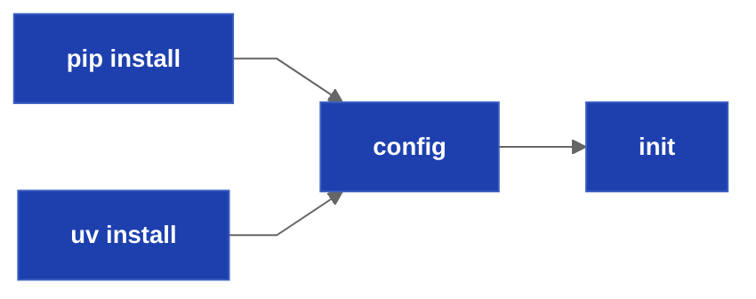
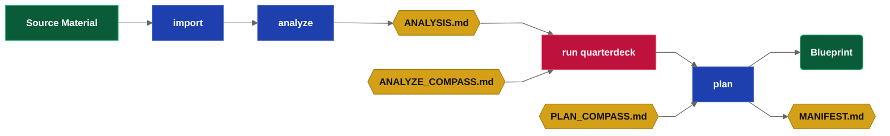
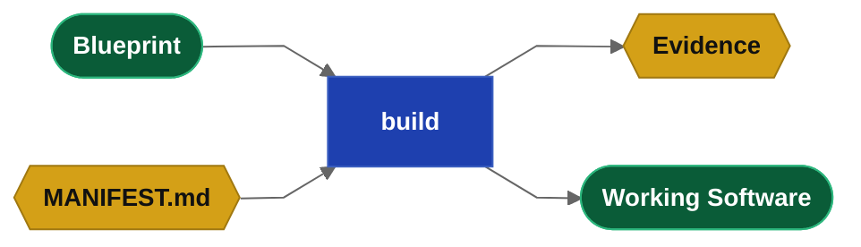
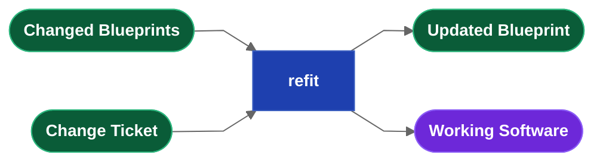

## What is Drydock

Drydock is a governed Blueprint-driven software delivery system built around the **SAIL methodology**.

**The Commander.** Drydock addresses its operator as the Commander. The Commander owns the product direction, reviews the work, and approves decisions in the QuarterDeck.

**Drydock Blueprints** are the authoritative, living definition of a software product. Blueprints are composed of **Typed Specification Files** with prescribed roles. `drydock plan` turns imported source material into Blueprints and writes a **Manifest** that tracks dependency-aware build order, runnable work, and incremental rebuild scope.

Drydock builds with the product specification, the applicable Rigging, and the current plan. It groups related work to keep builds context-aware and reviewable.
Drydock build also applies dependency legitimacy guardrails before accepting generated Python dependency changes.

Rigging provides governed business rules, stack guidance, branding, and compact derivatives that keep downstream builds focused on how to use a capability instead of reloading full authoring context every time.

The loop phase lets the Commander update the product while preserving the specification as the source of truth. Edit specifications or add change tickets, run `drydock refit`, and rebuild normally.

Quality is verified deterministically with `drydock score ac` based on programmatic acceptance criteria. Project Quality is
verified by the LLM using `drydock score release` to evaluate the completed build.  

**Trust But Verify** - the Commander reviews in the Quarterdeck - running the next step in the process indicates approval.


```mermaid
%%{init: {'theme': 'neutral', 'flowchart': {'curve': 'linear'}, 'themeVariables': {'fontSize': '14px'}}}%%
flowchart LR
  classDef dir    fill:#0a5c38,stroke:#2cb67d,color:#fff,font-weight:bold
  classDef md     fill:#d4a017,stroke:#a07810,color:#111,font-weight:bold
  classDef script fill:#1e40af,stroke:#3b5fc0,color:#fff,font-weight:bold
  classDef prompt fill:#c2410c,stroke:#ea580c,color:#fff,font-weight:bold
  classDef output fill:#6d28d9,stroke:#8b5cf6,color:#fff,font-weight:bold
  classDef web    fill:#be123c,stroke:#fb7185,color:#fff,font-weight:bold

  SETUP["Set Up"]:::script --> ANALYZE["Analyze & Plan"]:::script
  ANALYZE --> IMPLEMENT["Implement"]:::script
  IMPLEMENT --> TARGET(["Working Software"]):::dir
  TARGET --> LOOP["Loop"]:::script
  LOOP -.-> IMPLEMENT
  LOOP -.-> SCORE([Score]):::script
```

### Glossary

| Drydock term | Meaning |
|---|---|
| Commander | The operator; the Agile Product Owner. |
| Target | The named project under `$DRYDOCK_WORKSPACE/targets/<Target>`. |
| Blueprint | The Typed Specification files that define the product; the source of truth. |
| Manifest | The executable build plan and dependency graph, `MANIFEST.md`. |
| Frontier | The set of Manifest blocks that are runnable now. |
| QuarterDeck | The web review console between the Commander and the LLM process. |
| Compass | Persistent project guidance used by Drydock commands. |
| Rigging | Shared branding, stack rules, templates, and compact context derivatives. |
| Soundings | The per-story acceptance-criterion verification board; Sea Trials is the project-level gate. |
| Proof integrity | Static analysis that demotes a vacuous or tautological acceptance proof to UNVERIFIED, so a passing test cannot lift the score without actually proving behavior. |
| Sea Trials | Product-level objectives and proof-of-delivery criteria. |
| Refit | Change process that maps updates into the manifest. |

## Drydock Features

**Drydock is a DevOps/Build process for specifications** and provides a governed build pipeline to create working software from your imported specifications. 

**Overview**
- Works with your LLM subscription. No API keys, no per-token billing. (Trivial port to other LLM CLIs)
- Build large projects with low-end models 
- Context optimization — LLM usage minimized.
- Drydock builds - Specification creation is out of scope

**Agile Methodology**
- Your Crew (LLM) uses Agile Best practice
- The Story Planning phase surface blockers and questions
- The Decomposition phase turns specifications into features and stories
- Agile story points are token costs.
- Surface questions for Commander review in the Quarterdeck

**Test Driven Development**
- Your Crew (LLM) uses Test Driven Development
- Programmatic acceptance criteria created using a checklist 
- Use EARS-notation acceptance criteria for Project level AC (SEA_TRIALS.md)

**The Quarterdeck**
- QuarterDeck is a custom Commander to Crew web portal.
- Display Markdown using templates 
- Persist Commander decisions for future commands
- Questionaires provide feedback to your Crew 
- Surface Blockers and Build Failures for review 
- Gives the Commander control of each phase 

**Import**
- Copy specifications into the drydock workspace 
- Assume source spec are in arbitrary formats 

**Context Optimization**
- Context optimization at every stage
- Build sets of stories together to optimize context
- Dependency-graph build plan with runnable frontier ensures correct build order
- Context aware Blueprint Stacking best practices
- Compaction

**Governance**
- `drydock analyze` is Story Planning and surfaces any gaps
- Persistent intent injection at each process stage 
- `drydock plan` creates typed specifications with prescribed roles.
- Programmatic Acceptance criteria for each story.
- Sealed foundational specifications require a change ticket to alter.
- Persistence encapsulation (library) prevent forced large rebuilds 
- Rigging injects enterprise standards, stack rules, and voice.
- Writes reviewable build evidence for completed work.

**Verification**
- Story Guardrails/AC are absolute prohibitions with a hard gate 
- Project Guardrails/AC validated using `drydock score release` by the crew
- `drydock score ac` re-verifies story deterministic AC (SOUNDINGS.md).
- `drydock score release` re-verifies project acceptance using the LLM (SEA_TRIALS.md)
- Pre-Build RED->GREEN enforcement - Vacuous and unneeded AC are demoted 

**Complete change-management methodology**
- Blueprint drift detection and stale-plan reset
- Track cksum and git commit ids for built blueprints
- Refit detects new specs, any changes to existing spec, and change tickets
- Refit updates the Manifest for changes
- Changes are Built using `drydock build`

**Additional Features**
- Generates consistent project documentation in your voice 

## The drydock CLI

```text
drydock <verb> [<sub-verb>] [arguments] [--options]
```

Each project's `<Target>` uses a Workspace of `$DRYDOCK_WORKSPACE/targets/<Target>` and builds to `$DRYDOCK_BUILD_DIRECTORY/<Target>`.

```text
usage: drydock [-h] [--version] [--debug] <command> ...

Drydock — governed Blueprint-driven software delivery.
Copyright (c) 2026 Web Cloud Studio. All rights reserved.

positional arguments:
  <command>
    config    Show or set Drydock configuration.
    init      Initialize a target workspace.
    status    Show project status and orientation.
    validate  Validate a Blueprint's Typed Specification.
    document  Generate project documentation from Blueprints
    publish   Render frontmatter Markdown into publishable HTML.
    rigging   Manage Drydock Rigging.
    plan      Create the Manifest and Blueprints
    build     Build or inspect build state.
    refit     Update Blueprint and target software together.
    analyze   Decompose imported sources into stories, blockers, and acceptance milestones.
    run       Start a Drydock service.
    import    Copy your Specifications into the workspace.
    score     Evaluate acceptance and release readiness.

options:
  -h, --help  show this help message and exit
  --version   show program's version number and exit
  --debug     Show full traceback on unexpected errors.
```

## End-to-End Command Flow

A Target runs from source material to a scored release and through subsequent change with the
following commands.

```bash
# Build Specifications into Code With Agile and Test Driven Development
# Runs on your Claude/Codex/Other subscription CLI. No API keys or per-token-billing.

# ── S ── SET UP ──────────────────────────────────────────────────────────
drydock config set llm_provider claude      # or codex
drydock init            MyApp               # create the Target workspace

# ── A ── ANALYZE ─────────────────────────────────────────────────────────
drydock import          MyApp ./notes       # notes, a source tree, or Spec Kit
drydock analyze         MyApp               # → stories, acceptance criteria, blockers
drydock run quarterdeck MyApp               # the Commander answers the open questions
drydock plan            MyApp               # → Blueprint + MANIFEST.md dependency graph
drydock validate        MyApp               # typed specification conformance. no LLM.

# ── I ── IMPLEMENT ───────────────────────────────────────────────────────
while drydock status MyApp --ready; do      # build the runnable frontier, one step at a time
  drydock build         MyApp               # scoped context in, code + evidence out
  drydock build status  MyApp               # what is done, blocked, and next
done

drydock score ac        MyApp               # every assertion, deterministically → SOUNDINGS.md
drydock score release   MyApp               # Sea Trials release gate → SCORECARD.md

# ── L ── LOOP ────────────────────────────────────────────────────────────
# The Blueprint changes first; the software follows.
drydock refit           MyApp               # change tickets → conformed manifest work
drydock build           MyApp               # rebuild what the change touched
drydock document        MyApp               # documentation generated from the Blueprint
drydock rigging update  MyApp               # propagate shared rules and templates
```

## SAIL Phase 1 — Set Up: Laying the Keel

Install Drydock, configure runtime defaults, and create a workspace for a Target build.
Process environment variables override values stored in Drydock's user-scoped `.env`.


```mermaid
%%{init: {'theme': 'neutral', 'flowchart': {'curve': 'linear'}, 'themeVariables': {'fontSize': '14px'}}}%%
flowchart LR
  classDef dir    fill:#0a5c38,stroke:#2cb67d,color:#fff,font-weight:bold
  classDef md     fill:#d4a017,stroke:#a07810,color:#111,font-weight:bold
  classDef script fill:#1e40af,stroke:#3b5fc0,color:#fff,font-weight:bold
  classDef prompt fill:#c2410c,stroke:#ea580c,color:#fff,font-weight:bold
  classDef output fill:#6d28d9,stroke:#8b5cf6,color:#fff,font-weight:bold
  classDef web    fill:#be123c,stroke:#fb7185,color:#fff,font-weight:bold

  INSTALL["pip install"]:::script --> CONFIG["config"]:::script
  UVINSTAL["uv install"]:::script --> CONFIG
  CONFIG --> INIT["init"]:::script
```

### Installation Instructions

**Prerequisites**

- Python 3.11 or later
- A subscription-authenticated CLI: `claude` (Anthropic) or `codex` (OpenAI)

**Install**

```bash
uv tool install drydock-sdd
# or: pipx install drydock-sdd
```

`uv tool` and `pipx` place `drydock` on `PATH` automatically.

**Configure the workspace**

Set `$PROJECTS` to the directory where you keep your projects, then run:

```bash
drydock config set drydock_workspace "$PROJECTS/drydock"
drydock config set drydock_build_directory "$PROJECTS"
```

**Initialize a target**

```bash
drydock init <Target>
```

The resulting layout:

```text
$PROJECTS/
├── drydock/                    # Drydock workspace
│   └── targets/<Target>/       # Created by drydock init - Project Workspace
└── <Target>/                   # Final Build Location for projects
```

### Commands

```text
drydock --help
drydock --version
drydock config show
drydock config set <key> <value>
drydock init <Target> [--display-name <name>] [--description <desc>]
drydock status [<Target>] [--check | --ready]
drydock run quarterdeck [<Target>] [--host HOST] [--port PORT]
```

### drydock status

`drydock status` is the primary orientation command. With no arguments it shows the workspace
dashboard across all initialized Targets. With a `<Target>` argument it filters to that Target,
showing its validation state, plan progress, and current runnable step.

`drydock status <Target> --check` and `drydock status <Target> --ready` are deterministic
pipeline gates read from the Manifest alone. Neither calls an LLM or writes files.

| State | `--check` | `--ready` |
|---|---|---|
| Complete — every story and spike is `closed/verified` | `0` | `1` |
| Buildable — approved work remains | `1` | `0` |
| Blocked — no/unparsable/draft Manifest, no executable work, or unknown Target | `2` | `1` |

`--check` reports the terminal state; `--ready` is the build-loop guard:

```bash
while drydock status <Target> --ready; do drydock build <Target>; done
drydock status <Target> --check   # 0 complete, 2 blocked
```

### drydock config

`drydock config` establishes user-scoped defaults.


| Variable | Purpose |
|---|---|
| `drydock_build_directory` | Build root. Drydock builds `$DRYDOCK_BUILD_DIRECTORY/<Target>` and defaults this location under the workspace when unset. |
| `drydock_workspace` | Drydock workspace root. Commands require a resolved workspace. |
| `drydock_model` | Default model name passed to the configured subscription-authenticated CLI. |
| `llm_provider` | Subscription CLI provider: `claude` or `codex`. |
| `prompt_warn_tokens` | Prompt-size warning threshold in tokens. |
| `quarterdeck_port` | Default QuarterDeck service port. |

### drydock init

`drydock init <Target>` creates the temporary workspace for the Target under `$DRYDOCK_WORKSPACE/targets/`. Use `--display-name` to set a human-readable project name and `--description` to seed the one-line project summary in Target metadata.

## SAIL Phase 2 — Agile Analyze: Charting the Course

The Analyze phase turns imported source material into an Analysis for review, then into an executable Manifest for build.

1. `drydock import` brings source material under Drydock control.
2. `drydock score spec` optionally diagnoses potential errors in the imported specifications.
3. `drydock analyze` reads the imported sources and derives stories, acceptance milestones, blockers, questions
4. `drydock run quarterdeck` lets the product owner review, approve, and answer questions
5. `drydock plan` consumes the analysis and creates Blueprint files and the Manifest.

> **Definition — Compass Files**
>
> Compass files hold Commander guidance for the project and for specific phases.
> `COMPASS.md` is inserted into every command. 
> `PLAN_COMPASS.md` is inserted into `drydock plan`. 
> `ANALYZE_COMPASS.md` is inserted into `drydock analyze`. 
> `MANIFEST.md` is the non-hand-editable directives for `drydock build`. 
> Compass files let the Commander define goals, constraints, and definition of done.

### Commands

```text
drydock import <Target> <Source> --format <auto|markdown|source|speckit|compass> [--force]
drydock score spec <Target>
drydock analyze <Target>
drydock run quarterdeck [<Target>] [--host HOST] [--port PORT]
drydock plan [--overwrite] [--no-conform] <Target>
```


```mermaid
%%{init: {'theme': 'neutral', 'flowchart': {'curve': 'linear'}, 'themeVariables': {'fontSize': '14px'}}}%%
flowchart LR
  classDef dir    fill:#0a5c38,stroke:#2cb67d,color:#fff,font-weight:bold
  classDef md     fill:#d4a017,stroke:#a07810,color:#111,font-weight:bold
  classDef script fill:#1e40af,stroke:#3b5fc0,color:#fff,font-weight:bold
  classDef prompt fill:#c2410c,stroke:#ea580c,color:#fff,font-weight:bold
  classDef output fill:#6d28d9,stroke:#8b5cf6,color:#fff,font-weight:bold
  classDef web    fill:#be123c,stroke:#fb7185,color:#fff,font-weight:bold

  SRC["Source Material"]:::dir --> IMPORT["import"]:::script
  IMPORT --> ANALYZE["analyze"]:::script
  ANALYZE --> ANALYSIS{{"ANALYSIS.md"}}:::md
  ANALYSIS --> QUARTERDECK["run quarterdeck"]:::web
  ACOMPASS{{"ANALYZE_COMPASS.md"}}:::md --> QUARTERDECK
  QUARTERDECK --> PLANCREATE["plan"]:::script
  PCOMPASS{{"PLAN_COMPASS.md"}}:::md --> PLANCREATE
  PLANCREATE --> BLUEPRINT("Blueprint"):::dir
  PLANCREATE --> MANIFEST{{"MANIFEST.md"}}:::md
```

### drydock import

`drydock import <Target> <Source> --format <auto|markdown|source|speckit|compass>` is the intake step.
It brings external material under Drydock control. Drydock copies the selected source material into
the Target workspace for later analysis. Compass imports write `COMPASS.md` at the Target root.

`drydock import <Target> <Source File> --format markdown` imports general markdown specifications

`drydock import <Target> <Directory> --format markdown` imports general markdown specifications

`drydock import <Target> <Source> --format <source|speckit>` imports specifications from other systems

`drydock import <Target> <Source> --format compass` normalizes the source into the canonical
`COMPASS.md` format and writes it to the Target root. An existing `COMPASS.md` is preserved unless
`--force` is given.

`drydock import <Target> --update` refreshes the imported snapshot from the recorded source root
and records a new source version. `<Source>` is not accepted with `--update`.

### drydock score spec

`drydock score spec <Target>` diagnoses potential errors in the specification. Feed the output to your
LLM to update your specifications for likely errors. False positives may not require repair.

### drydock analyze

`drydock analyze` decomposes imported source material into reviewable planning artifacts. It prepares the files the Commander uses to confirm scope, resolve blockers, answer questions, and approve the build direction before planning.

**Input files**

| Artifact | Location | Purpose |
|---|---|---|
| `sources/*` | `blueprint/` | Imported source material; read-only planning context |
| `*COMPASS.md` | Target root | Project guidance and command guidance |
| `ANALYZE_COMPASS.md` | Target root | Commander guidance for repeated analyze runs |
| `BLOCKERS.md` | Target root | Commander-edited blocker answers from prior runs |
| `questionnaires/*.json` | `QuarterDeck/` | Created by `drydock analyze`. Persistent answers consumed on re-run |

**Output files**

| Artifact | Location | Purpose |
|---|---|---|
| `BLOCKERS.md` | Target root | Questions on any blockers the LLM has found. Existence implies blockers.  Edit to resolve them. |
| `ANALYSIS.md` | Target root | Summary of the decomposition, story list, blockers, questions, and recommendations |
| `SEA_TRIALS.md` | Target root | Project-level acceptance criteria and release objectives |
| `COMPASS.md` | Target root | Created if absent. Review it if one was automatically created. |
| `questionnaires/*.json` | `QuarterDeck/` | Review questionnaires for unresolved decisions and genuine research spikes |
| `commanders_chair.html` | `QuarterDeck/` | QuarterDeck summary view for the current state |

The most important guard is `BLOCKERS.md`. If `BLOCKERS.md` exists, the Commander edits it and reruns `drydock analyze` until the blockers are cleared. `SEA_TRIALS.md` captures release-level success criteria. 

| Quality | Meaning |
|---|---|
| `Blocked` | One or more blockers prevent planning from proceeding |
| `Questions` | Planning may proceed, but open questions remain |
| `Ready` | No blockers remain |

### Specification Decomposition Methodology

This structure populates `Provides`, `Consumes`, and `Depends On`.

Decomposing to features and stories is done by type of project - For example a web applications decomposes by routes
with one story to build function creating the route and a second story that built the screen that uses the route (screens can have multiple routes).

Other applications can use different decomposition methods.

| System shape | Interface points named in `Provides` / `Consumes` |
|---|---|
| Web application | HTTP routes — `GET /catalog` |
| CLI tool | Commands and sub-verbs — `drydock plan` |
| Library or package | Public API symbols — `Database.items.get` |
| Data pipeline | Datasets, tables, and files produced and consumed |
| Event-driven system | Topics, queues, and event types |

### Agile Story Refinement with drydock run quarterdeck

> **Definition — QuarterDeck**
>
> The QuarterDeck is a web console that renders Markdown output generated by the LLM.
> It is how the Commander communicates with the Crew

`drydock run quarterdeck` starts a web console for the Commander (product owner).  It is your helm or cockpit.  Navigate to the listed host and port.

At this stage, the QuarterDeck shows the artifacts, blockers, questions, questionnaires, and activity that need review in the planning session. Review the tabs, answer blockers, and adjust Compass guidance before moving to `drydock plan`.

Questionnaires and BLOCKERS.md can be edited directly or modified in the QuarterDeck to respond.  Responses are used on the next run of `drydock analyze`.

Commander responses in the QuarterDeck are preserved for the build (by writing them to the appropriate markdown file).

The QuarterDeck calls out blockers and action items and gives the Commander a single place to review the current planning state.

### drydock plan

`drydock plan` converts the reviewed analysis into Typed Specification files under `blueprint/`, writes `MANIFEST.md`.
`MANIFEST.md` is the build graph plan. It records dependency-aware build order, the runnable frontier, and the work that must be revisited after change.

**Input files**

| Artifact | Location | Purpose |
|---|---|---|
| `sources/*` | `blueprint/` | Imported source files, re-read and reformatted into Typed Specifications |
| `ANALYSIS.md` | Target root | The reviewed analysis that drives decomposition |
| `PLAN_COMPASS.md` | Target root | Commander guidance for planning and grouping |
| `COMPASS.md` | Target root | Project guidance |
| `questionnaires/*.json` | `QuarterDeck/` | Resolved planning decisions |
| `SEA_TRIALS.md` | Target root | Structured project acceptance criteria and stable IDs |

**Output files**

| Artifact | Location | Purpose |
|---|---|---|
| `ARCHITECTURE.md`,<br> `DATABASE.md`,<br> `FEATURE-{Name}.md`,<br> `SCREEN-{Name}.md`,<br> `UI-GENERAL.md` | `blueprint/` | Typed Specification files |
| `MANIFEST.md` | Target root | The executable build plan |

**Replan behavior**

`drydock plan` is rerun-safe. It preserves reviewed work where possible, rebuilds planning artifacts when inputs changed, and never overwrites Commander-owned Compass files.

## SAIL Phase 3 — Implement: Sailing the Frontier

Implement the Blueprint using the Manifest

* The Manifest exposes the phases with `drydock build status <Target>`.
* Iterate through the build phases with `drydock build <Target>`.
* Measure delivery health with `drydock score`.
* The rigging implements company standards and branding.

### Commands

```text
drydock build <Target> [--continue] [--repair-attempts <n>] [--escalate-model <model>] [--build-dir <path>]
drydock build <Target> [--step <id|name>] [--story <id|name>] [--ungate] [--reset] [--dry-run] [--show-prompt] [--normalize-order] [--build-dir <path>] [--repair-attempts <n>] [--escalate-model <model>]
drydock build <Target> --step <STEP> [--reset] [--build-dir <path>]
drydock build <Target> --story <STORY> [--reset] [--build-dir <path>]
drydock build <Target> --reset [--build-dir <path>]
drydock build <Target> --dry-run [--show-prompt] [--build-dir <path>]
drydock build <Target> --normalize-order [--build-dir <path>]
drydock build status <Target>
drydock score ac <Target> [--step <id>]
drydock score release <Target>

drydock document generate <Target> [--model <model>]
drydock document assemble <Target> [--theme <theme>]
drydock document assemble readme <Target>
drydock document <Target> [--model <model>] [--theme <theme>]

drydock publish <Source.md> --output <Output.html> [--theme <theme>] [--flatten] [--pdf] [--pdf-output <Output.pdf>]

drydock validate <Target> [--verbose]

drydock rigging --add --file <path>
drydock rigging --add --dir <path>
drydock rigging compact <Target> [--all] [--force] [--include-file <file.md>] [--exclude-file <file.md>] [--include-dir <dir>]
drydock rigging update <Target> [--dry-run]
drydock rigging verify <Target>
```

### Agile Build Planning with drydock run quarterdeck

Review `MANIFEST.md` in the QuarterDeck to understand the build process and to update build direction and instructions.

The manifest is your final Plan - The Commander can rearrange stories at their
whim in the QuarterDeck.

In the Build Compass you review the build plan in the Manifest.   The manifest will group similar steps
to reduce your context and will set the stories up in a meaningful implementation plan of Foundation -> Data and Persistence -> Features -> User Interface.  Each step will display its estimated counts and the Commander can:
* reorder stories so important/testable steps are done first
* re group stories so they can be run by a single agent
* review Blueprint programmatic and user acceptance

If you do not story plan, you accept the LLM's default order of stories.

Note that the manifest titles each of the build steps and these steps are the implemented one by one.

The general order for operations is a loop:

    drydock build status <Target>
    while <STEPS REMAIN TO BE DONE>
      drydock build <Target>
      drydock build status <Target>

Passing programmatic acceptance unlocks the next set of dependent operations.

### drydock build

`drydock build` converts Blueprints to code, executing the dependency-ready frontier of `MANIFEST.md` one block of stories at a time. Blocks are grouped by `drydock plan`, and the Commander controls grouping and build order in the QuarterDeck. Each story is validated against the deterministic acceptance criteria it declares, and a block advances only when its criteria pass. Pending dependency-ready work is reported as the frontier. A failed block is reported as resume work and resumes in place on the next build with its partial work and current failing checks.

A feature repair implements its failed stories and runs the Programmatic Acceptance criteria for both those stories and their verified siblings. A regression reopens the sibling story as `closed/failed`.

Each LLM attempt that reaches the acceptance gate is followed by a deterministic acceptance summary. A failed block receives up to three automatic repair passes. Repair continues when the set of passing acceptance criteria grows without regression, or when that set remains unchanged and at least one per-criterion case tally improves without another case tally regressing. Repair stops when neither condition is met or the repair-pass limit is reached.


```mermaid
%%{init: {'theme': 'neutral', 'flowchart': {'curve': 'linear'}, 'themeVariables': {'fontSize': '14px'}}}%%
flowchart LR
  classDef dir    fill:#0a5c38,stroke:#2cb67d,color:#fff,font-weight:bold
  classDef md     fill:#d4a017,stroke:#a07810,color:#111,font-weight:bold
  classDef script fill:#1e40af,stroke:#3b5fc0,color:#fff,font-weight:bold
  classDef prompt fill:#c2410c,stroke:#ea580c,color:#fff,font-weight:bold
  classDef output fill:#6d28d9,stroke:#8b5cf6,color:#fff,font-weight:bold
  classDef web    fill:#be123c,stroke:#fb7185,color:#fff,font-weight:bold

  SPEC(["Blueprint"]):::dir --> BUILD["build"]:::script
  BP{{"MANIFEST.md"}}:::md --> BUILD["build"]:::script
  BUILD --> EV{{"Evidence"}}:::md
  BUILD --> TARGET(["Working Software"]):::dir
```

**Input files**

| Artifact | Location | Purpose |
|---|---|---|
| `COMPASS.md` | Target root | Always Injected |
| `MANIFEST.md` | Target root | Executable build plan and dependency graph |
| `ARCHITECTURE.md`, `DATABASE.md`,<br> `FEATURE-{Name}.md`, <br>`SCREEN-{Name}.md`,<br> `UI-GENERAL.md` | `blueprint/` | Typed Specification files consumed for the current build step or phase |
| Imported sources | `blueprint/sources/` | Assets the Analysis marks `stage` are copied into the build directory |

**Output files**

| Artifact | Location | Purpose |
|---|---|---|
| Built application files | `<Target>` | Target working directory for build<br>override in `METADATA.md` field `build_dir:` |
| Staged build assets | `<Target>/sources/` | Imported test corpora, harnesses, and fixtures the build executes |

`drydock build <Target>` executes the dependency-ready frontier and writes the application into `$DRYDOCK_BUILD_DIRECTORY/<Target>`. 

Before the frontier runs, `drydock build` stages every imported source the Analysis marks build
disposition `stage` into `<build_dir>/sources/`, copied from `blueprint/sources/`. Staged assets
are read-only inputs recorded by content digest. A step that modifies one fails and the asset is
restored; `drydock score` reports a modified staged asset as a release blocker.

```text
  `--continue` resumes the frontier in place; this is the default.
  `--step <STEP>` builds one block: a feature group, or a story resolved to its containing block.
  `--story <STORY>` builds exactly one story, even inside a feature group.
  `--reset` discards prior work and rebuilds clean; with `--step`/`--story` it resets that block, and with no selector it resets every block and wipes the build directory.
  `--repair-attempts <n>` sets the number of automatic repair passes after a failed block (default 3).
  `--escalate-model <model>` uses an alternate model on the final repair attempt.
  `--normalize-order` normalizes authored Manifest group order before building.
  `--build-dir <path>` overrides the output directory for the current run.
  `--dry-run` previews the next build step without invoking the LLM or writing files.
  `--show-prompt` prints the full assembled prompt only when combined with `--dry-run`.
```

`--ungate` marks prior programmatic acceptance failures as UNVERIFIED, closes their owning build steps as verified, and continues with the next buildable step; execution and dependency failures remain gated.

Before executing work, `drydock build` checks previously applied Blueprint files for drift. If they have changed, the build stops and directs the Commander to run `drydock refit`. Foundational specifications such as `ARCHITECTURE.md`, `DATABASE.md`, and `UI-GENERAL.md` require explicit 
change tickets to modify.

Build status can be viewed on the Manifest page in the quarterdeck or with `drydock build status`.

### drydock build status

`drydock build status` reads `MANIFEST.md` and the runtime logs and reports the state of the plan.

```text
drydock build status <Target>   # print per-block state and current runnable frontier
```
### drydock score

`drydock score` audits specifications, reports build evidence, verifies acceptance, and evaluates release readiness.

```text
drydock score spec <Target>
drydock score ac <Target> [--step <id>]
drydock score build <Target>
drydock score release <Target>
drydock score drydock
```

It writes `SPECIFICATION_SCORECARD.md` atomically and prints identical content to the terminal.
Findings are advisory. The command does not modify imported sources, create Blueprints, ask product
questions, gate Analyze, or evaluate files outside `blueprint/sources/`.

The Commander scans checkmarks in the QuarterDeck instead of granting approvals.

`drydock score ac` verifies acceptance deterministically, with no LLM call by running the acceptance criterion. It writes the 
blueprint acceptance criteria to SOUNDINGS.md with a status of `✓ PASS`, `✗ FAIL`, or `— UNVERIFIED` and a timestamp.
Criteria with vacuous proof — an empty body, a constant assertion, or a self-comparison — is demoted to `UNVERIFIED` rather than trusted.
`drydock score ac` is deterministic.

`--step <id>` scopes verification to a single feature or story, resolved by id or display name. A scoped run verifies only that block's acceptance criteria, prints each result with its Blueprint source and failing detail, and leaves `SOUNDINGS.md` unchanged.

`drydock score release` is an LLM pass to evaluates the project-level criteria in `SEA_TRIALS.md`. 
`SEA_TRIALS.md` contains criteria are expressed in EARS notation. The LLM  judges the project and reports the release verdict. 

`drydock score build` reads build evidence and LLM usage logs and prints a deterministic post-build report.

`drydock score drydock` performs an advisory assessment of Drydock and writes ranked feature files to `docs/drydock_planning/`.

A `measurement` criterion carries `Command:`, a literal argv run from the build directory, and is
compared against `Target:` using `Operator:`. `Extract:` supplies a regular expression whose first
capture group reads the measured value from the command's standard output; without it the command
prints `{"value": <number>, "unit": "<unit>"}`. When `Extract:` is present, a non-zero exit status
is a measurement result rather than a failure. A `Command:` containing an unresolved `<placeholder>`
is rejected.

**Input files**

| Artifact | Location | Purpose |
|---|---|---|
| `blueprint/sources/**/*` | Target Blueprint | Raw imported sources (`score spec` reads Markdown content and inventories non-Markdown paths) |
| `evidence/*.md` | Target root | Build and repair evidence (`score build`) |
| `logs/llm.jsonl` | Workspace | LLM usage records (`score build`) |
| Drydock specification, prompts, implementation, and Rigging | Drydock repository | Methodology assessment inputs (`score drydock`) |
| `MANIFEST.md` | Target root | Acceptance-criterion blocks and their parent stories |
| `SEA_TRIALS.md` | Target root | Project criteria, measurement contracts, and guardrails |
| `blueprint/*.md` | Target Blueprint | Programmatic Acceptance proofs |
| Built application | Configured build directory | Git identity and executable proof subject |

**Output files**

| Artifact | Location | Purpose |
|---|---|---|
| `SPECIFICATION_SCORECARD.md` | Target root | Advisory raw-specification findings (`score spec`) |
| Terminal report | Terminal | Deterministic post-build evidence and usage report (`score build`) |
| `docs/drydock_planning/` | Drydock repository | Ranked methodology feature files (`score drydock`) |
| `SOUNDINGS.md` | Target root | Per-criterion verified status, evidence, and timestamp (whole-target `score ac`; a `--step` run leaves it unchanged) |
| `SCORECARD.md` | Target root | Release scoring results, verdicts, and blockers (`score release`) |

**Exit codes**

| Code | Meaning |
|---:|---|
| `0` | Scoring completes; `score spec` and `score drydock` findings remain advisory |
| `1` | Scoring cannot complete or the Target does not satisfy the evaluated build, acceptance, or release state |
| `2` | Command syntax is invalid |

### drydock document

`drydock document` creates Target documentation from the Target Blueprint.

```text
drydock document generate <Target> [--model <model>]
drydock document assemble <Target> [--theme <theme>]
drydock document <Target> [--model <model>] [--theme <theme>]
```

`drydock document generate <Target>` reads the Target Blueprint files and documentation configuration to create project
documentation in `$DRYDOCK_BUILD_DIRECTORY/<Target>/docs/`. It creates Markdown.

`drydock document assemble <Target>` reads `DOC-*.md` from `$DRYDOCK_BUILD_DIRECTORY/<Target>/docs/` and deterministically
creates browsable documentation.

`drydock document <Target>` runs `generate` and then `assemble` as one documentation pipeline.

Documentation configuration lives in `$DRYDOCK_WORKSPACE/targets/<Target>/documentation.yaml`.

```yaml
theme: slate
sections:
  - OVERVIEW
  - FEATURES
  - SCREENS
  - ARCHITECTURE
  - SCHEMA
  - FLOWS
  - PIPELINE
  - SIGNALS
```

The `sections:` order defines the documentation navigation order. CLI flags override configuration values for the current run.

Supported theme names are `slate`, `harbor`, and `paper`.

**Input files**

| Artifact | Location | Purpose |
|---|---|---|
| `documentation.yaml` | Target workspace root | Documentation section, navigation order, and theme configuration |
| Typed Specification files | Target workspace `blueprint/` | Source material for generated documentation |
| `MANIFEST.md` | Target workspace root | Build plan and implementation structure used as documentation context |
| `METADATA.md` | Target workspace root | Target metadata used as documentation context |
| `DOC-*.md` | Target build `docs/` | Markdown documentation files consumed by `document assemble` |

**Output files**

| Artifact | Location | Purpose |
|---|---|---|
| `DOC-OVERVIEW.md` | Target build `docs/` | Product overview documentation |
| `DOC-FEATURES.md` | Target build `docs/` | Feature documentation |
| `DOC-SCREENS.md` | Target build `docs/` | Screen and user interface documentation |
| `DOC-ARCHITECTURE.md` | Target build `docs/` | Architecture documentation |
| `DOC-SCHEMA.md` | Target build `docs/` | Optional data schema documentation |
| `DOC-FLOWS.md` | Target build `docs/` | Optional workflow documentation |
| `DOC-PIPELINE.md` | Target build `docs/` | Optional delivery pipeline documentation |
| `DOC-SIGNALS.md` | Target build `docs/` | Optional signals, telemetry, and operating documentation |
| `index.html` | Target build `docs/` | Browsable single-page documentation site |
| `styles/spec.css` | Target build `docs/` | Documentation site theme CSS |

### drydock publish

Drydock publish converts arbitrary Markdown into HTML or PDF. It uses front matter for the first section.
Use it for white papers and other published artifacts. 

```text
drydock publish <Source.md> --output <Output.html> [--theme <theme>] [--pdf] [--pdf-output <Output.pdf>]
```

`drydock publish` deterministically renders a frontmatter Markdown document into publishable HTML. It uses document frontmatter for title, author, studio, cover text, theme, and other formatting. It does not call an LLM. Supported themes are `sail`, `slate`, and `paper`.

`--flatten` publishes H1 and H2 sections as separate HTML pages with navigation. `--pdf` also renders a PDF from the generated HTML using the local browser renderer.

Example:
```bash
 drydock publish docs/Drydock_Specification.md --output docs/index.html
 drydock publish docs/Drydock_Specification.md --output dist/Drydock_Whitepaper.html --theme sail --pdf
```

## SAIL Phase 4 — Loop: The Refit

A Refit lets the Commander update the application while keeping the Blueprint and built software aligned. Change tickets become first-class build inputs and drifted specifications are mapped back into the normal build loop.

### Commands

```text
drydock refit <Target>
drydock refit <Target> --sources
drydock refit <Target> --relineage
```


```mermaid
%%{init: {'theme': 'neutral', 'flowchart': {'curve': 'linear'}, 'themeVariables': {'fontSize': '14px'}}}%%
flowchart LR
  classDef dir    fill:#0a5c38,stroke:#2cb67d,color:#fff,font-weight:bold
  classDef md     fill:#d4a017,stroke:#a07810,color:#111,font-weight:bold
  classDef script fill:#1e40af,stroke:#3b5fc0,color:#fff,font-weight:bold
  classDef prompt fill:#c2410c,stroke:#ea580c,color:#fff,font-weight:bold
  classDef output fill:#6d28d9,stroke:#8b5cf6,color:#fff,font-weight:bold
  classDef web    fill:#be123c,stroke:#fb7185,color:#fff,font-weight:bold

  CHANGE(["Changed Blueprints"]):::dir --> REFIT["refit"]:::script
  Ticket(["Change Ticket"]):::dir --> REFIT
  REFIT --> SPECOUT(["Updated Blueprint"]):::dir
  REFIT --> SOFTWARE(["Working Software"]):::output
```
### drydock refit

The `drydock refit` processes change tickets in `blueprint/changes/`, updates the Manifest, and resets impacted work so it can be 
rebuilt in dependency order.  It also modifies MANIFEST.md.

The Refit modifies change tickets with an `Amends:` header that names the Blueprint file it changes. **A change ticket may only
modify a single blueprint so change tickets must be created based on features or screens.  

Change tickets must be placed into `blueprint/changes/*.md`.

Refit also detects changed Blueprint files. It compares the cksum and git commit hashes to detect the changes.  If a specification has changed, Refit marks the affected Manifest work so the next `drydock build` will rebuild it. 

Foundational files such as `ARCHITECTURE.md`, `DATABASE.md`, and `UI-GENERAL.md` require explicit change tickets.

`drydock refit <Target> --sources` routes imported source changes. It reads the difference between
the last consumed source version and the current one, decomposes it into Manifest stories seated on
existing Blueprints, and writes one change ticket per affected Blueprint. Refit never creates a
Blueprint; a requirement that fits none fails the command and requires a replan. A change that
removes a service other stories consume fails before any file is written. A change to a foundational
contract is reported with its downstream consumers and does not block the command.

`drydock refit <Target> --relineage` rebuilds `LINEAGE.json` from the Target's git history and
attributes existing Manifest stories to the source requirements they implement. It requires a Target
git repository.

`--sources` and `--relineage` are mutually exclusive.

**Exit codes.** `0` success or no-op; `1` operational failure or unticketed foundational drift; `2` usage error.

## Artifact I/O Matrix 

What drydock operations read/write

| Artifact | Location | analyze | plan | build | score | refit |
|---|---|---|---|---|---|---|
| ANALYSIS.md | Target root | O | I | · | · | · |
| ANALYZE_COMPASS.md | Target root | C/I | · | · | · | · |
| ARCHITECTURE.md | blueprint/ | · | O | I | I | I |
| BLOCKERS.md | Target root | O/I | X | · | · | · |
| commanders_chair.html | QuarterDeck/ | O | · | · | · | · |
| COMPASS.md | Target root | O*/I | I | I | I | I |
| DATABASE.md | blueprint/ | · | O | I | I | I |
| FEATURE-{Name}.md | blueprint/ | · | O | I | I | I |
| LINEAGE.json | Target root | · | I/O | · | · | I/O |
| MANIFEST.md | Target root | · | O | I | I | I |
| PLAN_COMPASS.md | Target root | · | C/I | · | · | · |
| questionnaires/*.json | QuarterDeck/questionnaires/ | O/I | I | I | · | · |
| SCORECARD.md | Target root | · | · | · | O | · |
| SCREEN-{Name}.md | blueprint/ | · | O | I | I | I |
| SEA_TRIALS.md | Target root | O | · | · | · | · |
| SOUNDINGS.md | Target root | · | · | · | O | · |
| changes/TICKET-{NNN}-{Name}.md | blueprint/changes/ | · | I | I | · | O |
| sources/* | blueprint/sources/ | I | I | I | I | I |
| UI-GENERAL.md | blueprint/ | · | O | I | I | I |

**Legend:** `O` the command produces the artifact · `I` the command consumes the artifact ·
`C` the command creates the artifact if absent (never overwrites) · `X` gates/blocks the command ·
`·` no relation · `O*` the command produces the artifact only when it is absent.

Human-authored feedback artifacts (`ANALYZE_COMPASS.md`, `PLAN_COMPASS.md`, answered `BLOCKERS.md`) are prompts that guide future runs of the commands.

## Directory Layout

Drydock uses a per-target workspace stored in `$DRYDOCK_WORKSPACE/targets/<Target>`. 

Drydock builds applications into `$DRYDOCK_BUILD_DIRECTORY/<Target>`. 

The QuarterDeck is driven by configuration files and markdown from `targets/<Target>`.

```text
$DRYDOCK_WORKSPACE/                       # explicit config/env or Git top-level — required
├── logs/
│   ├── history.jsonl                     # append-only drydock executions
│   ├── llm.jsonl                         # append-only llm executions
│   └── *.log                             # command logs
└── targets/
    └── <Target>/                         # one self-contained project
        ├── METADATA.md                   # identity: Blueprint name, code_root, status, stack
        ├── README.md                     # short human introduction to the project
        ├── ANALYSIS.md                   # Planning Session analysis: quality, stories, blockers, questions
        ├── ANALYZE_COMPASS.md
        ├── BLOCKERS.md
        ├── COMPASS.md                    # project guidance: intent, constraints, guardrails
        ├── MANIFEST.md                   # the executable Manifest
        ├── PLAN_COMPASS.md
        ├── SCORECARD.md                  # seven-dimension quality + drift scores
        ├── SEA_TRIALS.md                 # Project AC — project-level acceptance criteria
        ├── SOUNDINGS.md                  # AC — calculated acceptance/readiness ledger
        │
        ├── blueprint/                    # the Blueprint — conformed Typed Specification
        │   ├── sources/                  # preserved unconformed import material
        │   ├── ARCHITECTURE.md
        │   ├── DATABASE.md
        │   ├── FEATURE-{Name}.md
        │   ├── SCREEN-{Name}.md
        │   ├── UI-GENERAL.md
        │   └── changes/
        │       └── TICKET-NNN-{Name}.md
        │
        └── QuarterDeck/                  # console state only; runtime served from the package
            ├── console.yaml
            ├── pages/
            │   └── overview.md
            ├── data/
            └── questionnaires/
                └── planning.json
```

```text
$DRYDOCK_BUILD_DIRECTORY/
└── <Target>/                             # application source tree built by drydock build
```


## The Manifest Graph Database

`MANIFEST.md` is created by `drydock plan` and can be modified in the QuarterDeck. It groups stories into blocks or sets of stories.
This determines build order.  `MANIFEST.md` contains story required context and build status.

The Manifest controls the build.  Ordering is important because the Commander will want to prioritize some work over other. Grouping
is important to save context when building similar blueprints.

Each Manifest contains four block types:

- `feature` optionally groups substantial workflows and owns feature-level acceptance
- `story` builds something. A Drydock story is an enriched Spec Kit task: it has states,
  `depends:`, Blueprint acceptance, and prompt-assembly fields.
- `spike` answers a question. Results feed future iterations
- `ac` is a legacy block type retained for existing Manifests. Durable acceptance lives in the Blueprint.

### Plan Header

```markdown
# MANIFEST: {ProjectName}
updated:     2026-06-08T12:00:00
plan_hash:   abc123456789
applied_specs: |
  DATABASE.md sha256=<content_sha256> commit=<file_commit_sha> applied_by=foundation applied_at=2026-06-26T14:22:00Z
```

Manifest contains the build-state provenance required to detect stale previously applied Blueprint Specifications.

`applied_specs` records one line per Blueprint Specification file that has been applied by a
successful story or spike. The path is relative to `blueprint/`. `sha256` is the authoritative
dirty signal. `commit` is the latest git commit that touched that file, or `-` when unavailable.
`applied_by` identifies the story or spike that last applied the file. `applied_at` is the UTC
application timestamp.

### Story Blocks

```markdown
## story N: {Name}
id:           foundation
parent:       feature-catalog
summary:      One-line description.
implements:   DATABASE.md, FEATURE-CATALOG.md
context:      ARCHITECTURE.md
stack:        common.md, python.md, sqlite.md
rules:        CLAUDE_RULES.md
accepts:      st-foundation, st-catalog
instructions: |
  Build persistence and the catalog service.
depends:      select-parser
state:        pending
evidence:     evidence/<id>.md
scope:        blueprint | target | both
```

`implements:` is the spec files this story uses. `context:` is read-only support context.
`parent:` is optional. It is used for arbitrary hierarchy and QuarterDeck display. Builds are
rules-based on block type. `scope:` declares whether a story changes the Blueprint, target
software, or both.
`accepts:` lists stable `SEA_TRIALS.md` IDs implemented by the story. Every required technical or
behavioral Sea Trial is referenced by an implementing story or a Blueprint Programmatic Acceptance
proof. Guardrails require no story or proof reference.  Unknown references and missing required coverage invalidate a generated plan.

### Grouping Blocks

Blocks group stories. Build execution uses the grouping block as the atomic build unit: if a pending child story or spike depends on another
child story or spike inside the same feature, that dependency is internal sequencing and does not
block the feature from running. A feature can run only when every dependency outside the feature is
`closed/verified`. A feature closes only after all required child stories, spikes, and feature-level
`ac` blocks are `closed/verified`.

### Spike Blocks

```markdown
## spike N: {Name}
id:           select-parser
summary:      One-line description.
context:      FEATURE-IMPORT.md
question:     Which parser satisfies the Blueprint?
parent:       feature-import
finding:      ← text answer written here by the agent
depends:      foundation
state:        pending
evidence:     evidence/<id>.md
```

### Acceptance Check Blocks

```markdown
## ac N: {Name}
id:           system-starts
parent:       foundation
summary:      One-line description.
kind:         smoke | assertion
check:        test -f bin/start.sh && curl -sf http://localhost:${PORT}/health
depends:
state:        pending
evidence:     evidence/<id>.md
```

`ac` blocks are supported for legacy Manifests and exceptional orchestration checks. Blueprint
`Programmatic Acceptance` is the normal source of durable acceptance.

An `ac` block's `depends:` may name its own parent story only; the build engine drops any
cross-story `ac` dependency on read. Acceptance checks are out of the build-ordering stream:
they are never positioned among steps, only run after their parent story builds.

### Block States

All block types use the same four states:

| State | Meaning |
|---|---|
| `pending` | Not run yet |
| `implemented` | Legacy work done state, waiting to be reconciled |
| `closed/verified` | Passed or accepted |
| `closed/failed` | Failed or rejected |

### Execution Rules

A build block can run only when every external dependency in `depends:` is `closed/verified`.
Dependencies between stories or spikes inside the same grouping block are internal build-agent
sequencing and do not split the build block. A standalone `story` or `spike` is a one-step build
block. A grouped feature is a multi-step build block containing its pending child stories and
spikes. A build block with an unverified external dependency blocks build execution and reports the
blocking dependency.

Legacy `ac` blocks are reconciled by the build engine or QuarterDeck. They are not the normal
acceptance authority for new plans.

A `story` or `spike` becomes `closed/verified` after the build agent succeeds, files are written,
and Blueprint `Programmatic Acceptance` passes after the build.

Drydock may run the same `Programmatic Acceptance` before the build as an observation. A proof that
already passes is recorded as `GREEN (prepassed)` or `GREEN (vacuous)`. This does not block the build.

The story and the deterministic tests that prove its acceptance are written in the same build
step. The Blueprint's `Programmatic Acceptance` is the story's Definition of Done — declared
before the build and human-owned. The build authors the executable tests that satisfy it and may
add finer coverage, but never removes or weakens a declared acceptance assertion.

`closed/failed` is not terminal. The product owner reopens failed work from the QuarterDeck —
revising the block's instructions, acceptance, or scope interactively — and the decision writer
returns it to `pending` with the revision recorded. The decision writer is the only mutator of
Manifest block state; recovery never requires hand-editing `MANIFEST.md`.

Guardrails and `Programmatic Acceptance` embedded in the Specification files are evaluated as part
of story build verification. `Programmatic Acceptance` is deterministic and non-agentic. Drydock
may run it before the build as an observation and runs it after the build as the acceptance gate.

A story that fails post-build `Programmatic Acceptance` becomes `closed/failed`. A story whose proof
passes before the build is marked as weak evidence and does not fail for that reason alone. A story
that fails build records a single-line
`finding:` with the failure reason, surfaced on the Build Compass. `User Acceptance` entries are
Commander review signals and do not block ordinary downstream build unless modeled as explicit
dependencies.

### Worked Example

```markdown
# MANIFEST: MyProject
updated:     2026-06-08T12:00:00
plan_hash:   abc123456789

## spike 1: Select parser
id:           select-parser
parent:       import-feature
summary:      Compare supported parsers.
context:      FEATURE-IMPORT.md
question:     Which parser should the project use?
finding:
state:        pending

## story 1: Foundation
id:           foundation
summary:      Build persistence and directory layout.
implements:   DATABASE.md, ARCHITECTURE.md
stack:        common.md, python.md, sqlite.md
rules:        CLAUDE_RULES.md
state:        pending

## ac 1: system starts
id:           system-starts
parent:       foundation
summary:      Service starts and responds on health.
kind:         smoke
check:        test -f bin/start.sh && curl -sf http://localhost:${PORT}/health
state:        pending

## story 2: Import documents
id:           import-documents
parent:       import-feature
summary:      Implement the accepted import workflow.
implements:   FEATURE-IMPORT.md
depends:      select-parser, foundation
state:        pending
```

## The QuarterDeck — Agile Development Console

The QuarterDeck is the command surface where the product owner reviews LLM build output and makes
decisions. Evidence is presented using screens that track the Agile methodology.

The QuarterDeck is configuration-driven.  It uses a single `QuarterDeck/console.yaml` and per Target
Markdown and JSON inputs. It holds no logic of its own; it renders the LLM output using templates which allow
the Commander to change the markdown cleanly.  

The QuarterDeck is documented in `QuarterDeck/README.md`.

**Page types.** 

| Type | Purpose |
|---|---|
| `markdown` | Renders a single `.md` file as HTML; `tabs: true` splits `##` headings into clickable tabs. |
| `editable_markdown` | Renders a `.md` file with an EDIT control for in-place editing. |
| `document` | Collapses `path_md` / `path_html` / `path_pdf` variants into a tab bar. |
| `jsonl` | Read-only table from an append-only JSONL file. |
| `kanban` | Renders `MANIFEST.md`-derived tickets as a four-column board. |
| `questionnaire` | Form backed by a JSON file. |
| `link` | External URL or local file; opens in a new tab. |
| `command_status` | Derived read-only acceptance-readiness view from Core Docs. |
| `compass` | The Build Compass: the live `MANIFEST.md` work graph — grouped, costed, state-badged (buildable now / review / done / failed with reason), and editable (reorder/regroup/rename/split). |

**Standard artifacts.** Drydock QuarterDeck uses standard artifacts including:

| Artifact | Purpose |
|---|---|
| **Commanders Chair** | Orientation and default view: mission and current state at a glance. |
| **Soundings** | Acceptance-criteria checklist — each capability, its state, and evidence. |
| **Sea Trials** | Objectives and success criteria — what the project must achieve to be declared delivered. |
| **COMPASS Files** | Persistent Commander guidance. |

`drydock init <Target>` enables the QuarterDeck for a `<Target>`. 

Artifacts are idempotent and use ID fields to prevent status from being overwritten.

**Blockers.** `drydock analyze` emits `BLOCKERS.md` only when questions prevent planning; a healthy
project has no `BLOCKERS.md`. When present, the Blockers section appears first in the sidebar. The
product owner answers the questions and re-runs `drydock analyze`; when all blockers are resolved
the file is deleted. Blockers are mandatory gate conditions, distinct from spikes.

## Drydock Rigging — Portfolio Governance

Drydock Rigging is the enterprise rules specifying application behavior.  The Commander will populate
a mandatory questionnaire as to which Rigging to add after `drydock analyze`.  

The Rigging that ships with Drydock are the Authors build rules. Organizations should review and provide their own
stack and branding and best practice files. Every project built by Drydock conforms to Rigging automatically.

**Drydock only ships with Pythonic Rigging** - COLLABORATORS should create Rigging for other implementation languages.  The 
Author of Drydock works in python and has no ability to test other Rigging and therefore they are not currently included
in the project.  

Three layers govern agent behavior: business rules, technology stack rules, and branding.

**Business rules.** `BUSINESS_RULES.md` defines how agents must behave — git workflow, project
layout, script conventions, error handling. It is injected into AGENTS.md in the <Target> receive a compacted derivative
`BUSINESS_RULES_compact.md`; the full source stays in `Rigging/`.

**Stack rules.** `Rigging/stack/` holds one file per technology, prescriptive and standalone.

**Branding.** `BRANDING_MAIN.md` defines the master palette, typography, and design philosophy.
Per-medium files (`BRANDING_DOCUMENTATION.md`, `BRANDING_WHITEPAPERS.md`, `BRANDING_WEBSITE.md`)
inherit from it.  Branding contains, for example, the color palette used by the built software and will be used unless that
is specified in the imported specifications. If that is the case, do not import BRANDING. 

Rigging is a flexible layer designed for your Best Practices and Enterprise software conformance.

### Compaction

Compaction creates a `<file>_compact.md` from `<file>.md`. The compacted file is the callable surface of the source file with no explanatory detail.

Stories building a feature may require the full version of the markdown but once that is built, additional stories need only use the compact derivative. This lets Drydock build with focused context instead of restacking full specifications for every dependent change.

Use of Full files and Compact files is determined automatically by the build graph.

When needed, `drydock build` will automatically create compacted files.

`drydock plan` warns when a source is newer than its derivative.  You should recompact those files.  This may entail a rebuild.  To control
this you can `touch` the files to change the compacted file create time to later than the main file. 

Drydock track compaction.  Rerun with `--all` to refresh all compaction including Drydock's own Rigging compacts. 
Files without a callable surface are skipped and that is marked in the file name. 

### Commands

```
drydock rigging --add --file <path>
drydock rigging --add --dir <path>
drydock rigging compact <Target> [--all] [--force]
                                 [--include-file <file.md>] [--exclude-file <file.md>]
                                 [--include-dir <dir>]
drydock rigging update <Target> [--dry-run]
drydock rigging verify <Target>
```

| Flag | Effect |
|------|--------|
| `--all` | Also regenerate compact derivatives in Drydock's own `Rigging/` tree |
| `--force` | Ignore the freshness gate; recompact all discovered files |
| `--include-file <file.md>` | Add a specific file to the compaction set (repeatable) |
| `--exclude-file <file.md>` | Remove a file from the auto-discovered set (repeatable) |
| `--include-dir <dir>` | Add all Markdown files under a directory (repeatable) |

`drydock rigging update` injects `BUSINESS_RULES_compact.md` and standard templates into the target project's `AGENTS.md` in an idempotent manner. `--dry-run` previews those changes without writing files. `drydock rigging verify` checks target compliance with the Rigging contract.

## Drydock Document - Project Documentation

Generate project documentation from a Blueprint's Typed Specification using `drydock document`. The generate 
phase uses the LLM to write `DOC-*.md` summaries to `docs/`.  The assemble phase renders them into a
versioned renderable content in html and pdf format.  The two phases run independently so
hand-edited `DOC-*.md` files survive re-assembly without being overwritten.


```mermaid
%%{init: {'theme': 'neutral', 'flowchart': {'curve': 'linear'}, 'themeVariables': {'fontSize': '14px'}}}%%
flowchart LR
  classDef dir    fill:#0a5c38,stroke:#2cb67d,color:#fff,font-weight:bold
  classDef md     fill:#d4a017,stroke:#a07810,color:#111,font-weight:bold
  classDef script fill:#1e40af,stroke:#3b5fc0,color:#fff,font-weight:bold
  classDef prompt fill:#c2410c,stroke:#ea580c,color:#fff,font-weight:bold
  classDef output fill:#6d28d9,stroke:#8b5cf6,color:#fff,font-weight:bold
  classDef web    fill:#be123c,stroke:#fb7185,color:#fff,font-weight:bold

  SPEC(["Blueprint"]):::dir --> GEN["document generate"]:::script
  GEN --> DOCMD{{"DOC-*.md"}}:::md
  DOCMD --> ASSEMBLE["document assemble"]:::script
  ASSEMBLE --> HTML(["Build docs/index.html"]):::output
```

1. `drydock document generate <Target>` — AI pass only; creates or overwrites all `DOC-*.md`
   summaries for each configured section under `$DRYDOCK_BUILD_DIRECTORY/<Target>/docs/`.
   **Destructive** — hand-edited build `DOC-*.md` files are overwritten without warning. Does not
   assemble.
2. `drydock document assemble <Target>` — no AI; reads existing `DOC-*.md` files and renders them
   into `$DRYDOCK_BUILD_DIRECTORY/<Target>/docs/index.html`. Safe to re-run after manual edits.
3. `drydock document <Target>` — runs generate then assemble (full pipeline).

Edit build `DOC-*.md` files directly to refine documentation without re-running the AI pass; then
run `drydock document assemble` to regenerate the HTML. The Target root `documentation.yaml`
stores the navigation order and default theme.

4. `drydock document assemble readme <Target>` regenerates `README.md` for the built project when needed outside the normal build hook.

## Drydock Security

This section explains drydock security.  

Drydock also applies a dependency legitimacy guardrail during build to reduce hallucinated or suspicious package-name supply-chain exposure.

For enterprise security encapsulation, use Docker or bwrap (bubblewrap) to restrict what the process can touch. Drydock only requires access
to DRYDOCK_BUILD_DIRECTORY and DRYDOCK_WORKSPACE.  Encapsulation is required to protect you from poorly written or malicious specifications. Drydock
trusts the imported material and **WILL** run it.

### Claude Security Details

Drydock invokes the Claude CLI as a non-interactive build agent inside an isolated configuration home. HOME / CLAUDE_CONFIG_DIR are set per-subprocess to a dedicated ~/.drydock/claude-home, seeded only with the subscription credentials, so the agent reads none of the user's settings, plugins, MCP servers, history, or state. -p runs in print (headless) mode — single prompt in, response out, no interactive session.

    HOME=~/.drydock/claude-home CLAUDE_CONFIG_DIR=~/.drydock/claude-home \
    claude -p \
        --verbose \
        --safe-mode \
        --output-format stream-json \
        --include-partial-messages \
        --dangerously-skip-permissions \
        --model <model>

      --verbose emits full event detail for the durable execution log.
      --safe-mode disables auto-discovery of CLAUDE.md/AGENTS.md, auto-memory, hooks, plugins, and MCP servers
      --output-format stream-json streams structured JSON events for logging
      --include-partial-messages forwards incremental token deltas so console output appears as it is generated.
      --dangerously-skip-permissions runs build agent unattended without permission prompts (text-only Drydock commands instead use --tools "" --strict-mcp-config to withhold tools).
      --model <model> selects the configured model.


### Codex Security Details 

Drydock isolates Codex's configuration and identity — not its command execution. 

 CODEX_HOME=/tmp/drydock-codex-home-XXXX codex exec \
     --ignore-user-config \
     --ignore-rules \
     --ephemeral \
     --sandbox <codex_sandbox> \
     --cd <build_dir> \
     --json \
     --output-last-message <output_file> \
     --model <model> -

 - CODEX_HOME=<dir> — a temporary home seeded only with auth.json, so Codex inherits none of the user's config, rules, memories, or session history.
 - --ignore-user-config — disables $CODEX_HOME/config.toml.
 - --ignore-rules — disables user and project .rules.
 - --ephemeral — disables persisted session state.
 - --sandbox <codex_sandbox> — the OS execution-sandbox policy, resolved from codex_sandbox (default danger-full-access).
 - --cd <build_dir> — sets the working root.
 - --json — structured event output.
 - --output-last-message <output_file> — captures the final agent message deterministically.
 - --model <model> — selects the runtime model.
 - trailing - — Codex reads the fully assembled Drydock prompt from stdin.

Execution sandbox. The codex provider executes model-generated commands in the invoking shell. codex_sandbox selects the OS sandbox policy: danger-full-access (default, no OS confinement), workspace-write, or read-only. Non-default modes require the platform sandbox helper (codex-linux-sandbox on Linux) and fail fast when it is absent. Drydock does not require an external encapsulation layer; hardened deployments confine execution by running Drydock inside a container that exposes only the workspace and target directories.

### Specification File Format

Every authored Specification file except `METADATA.md` and `README.md` opens with a typed heading
and header table, followed by body sections specific to the file type, and ends with three common
terminal sections. `drydock plan` computes `Depends On`, `Provides`, and the SCREEN-specific
`Consumes` — do not edit these manually.

```markdown
# {FileType}: {ObjectName}

| Field       | Value |
|-------------|-------|
| Version     | 20260608 V1                    ← YYYYMMDD V<n>; increment on every write |
| Description | One sentence summary. |
| Route       | /catalog                       ← SCREEN only; required; the URL this screen serves |
| Consumes    | GET /catalog/items             ← SCREEN only; routes called; computed by drydock plan (optional) |
| Nav Order   | 3                              ← SCREEN only; integer presentation order (optional) |
| Depends On  | ARCHITECTURE.md, GET /catalog  ← file or route; computed by drydock plan |
| Provides    | GET /catalog, POST /catalog   ← routes this file exposes; computed by drydock plan |
| Build Order | 2                             ← integer; assigned by drydock plan when useful |

{body sections specific to the file type}

## Programmatic Acceptance
← Executable Python assertions. Each check has a stable heading, intent text, and a fenced `python` block.
← `Sea Trials: st-id, st-id` between the heading and fence binds the proof to project acceptance IDs.
← `Suite: full` between the heading and fence declares that the check runs the complete test suite. One terminal verification story carries it; every other check is bounded to its story.

## User Acceptance
← Commander-observed checks that cannot be honestly automated.

## Guardrails
← Permanent negative assertions. Guard against model hallucination, not spec omission.

## Open Questions
← Unresolved decisions that must be answered before this file can be fully implemented.
```

A SCREEN file referencing a route not listed in any FEATURE `Provides` field is an error.

## Database Encapsulation

**DATABASE.md enforces data access encapsulation.**

No application code calls the database directly. Every table, config store, file store, and external
service is accessed through a typed Python class. Route and business-logic code calls
`db.items.get(id)` — never raw SQL.

This eliminates a class of subtle bugs. A schema change — a timezone-aware datetime field replacing
a naive one, for example — requires changing only the encapsulation class. Downstream code depends
on the interface, not the storage detail, so nothing else breaks. Without the boundary, the same
change propagates silently to every callsite.

A code review that finds raw SQL, `os.environ` reads, `open()` on application data, or a cloud SDK
import outside its encapsulation class fails.

**Typed class library pattern.** `DATABASE.md` specifies both the schema and the Python classes that
encapsulate it. Each table maps to a `@dataclass` row type with fully typed fields. A `Database`
class owns the connection, manages the session lifecycle, and exposes only named methods — no caller
ever receives a raw cursor or row tuple. Methods raise domain exceptions (`ItemNotFound`,
`StorageError`) rather than propagating driver exceptions. The `Database` class is instantiated once
at application startup and passed by dependency injection; it is never re-opened inline.

`DATABASE_compact.md` is the LLM-generated derivative containing only class names, method
signatures, parameter types, return types, and one-line summaries. Non-foundational build steps
inject the compact form. Only the story that `implements: DATABASE.md` — the one that builds the
class library — receives the full file.
