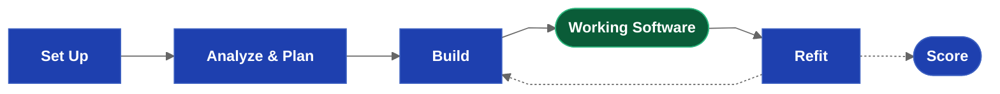
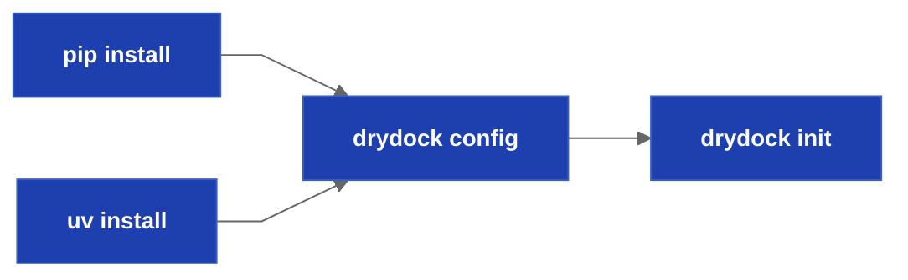
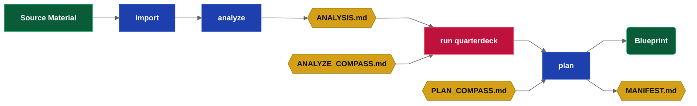
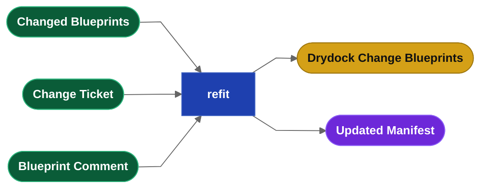

## What is Drydock

Drydock is a specification-driven software build pipeline.

The user is the **Commander**, who owns the product direction, reviews the work, and approves decisions.

Drydock imports specifications for your project in any format.

Drydock turns this material into **Blueprints**, the authoritative definition of your software product. `drydock plan` writes the **Blueprints** and a **Manifest** (graph database) that tracks build order, runnable work, and incremental build scope.

**Blueprints** represent the smallest **building block** of your software. Blueprints are agile stories with a full definition of done and Acceptance Criteria. Drydock groups related **building blocks** into **blocks**. A **block** combines **Blueprints** with **Rigging**. Blocks are deterministically optimized for context.  **Rigging** is enterprise business rules, technology rules, stack guidance, and branding so they provide common behavior and style.

Drydock uses test-driven development. Each **building block** carries acceptance criteria that must pass before the next step.  This lets the process use low level models to create working software.  The process can create working software for large projects for which frontier models will lose the thread and perform poorly.

The process is geared towards quick revision and long term maintainance of your software. At the start of the project, drydock lets you quickly iterate and get your project 'correct' and once you have production quality software, drydock enables a full maintenance cycle.  Users can either edit specifications, add change tickets, or provide comments on their blueprints and `drydock refit` will manage the process to create new stories and blueprints which let you rebuild quickly and cleanly.

`drydock score` verifies software quality against a variety of metrics.  It can test programmatic acceptance criteria and it can test project intent so the **Commander** can know the quality of the build.

The **QuarterDeck** is a simple yet flexible web console enabling the **Commander** to understand and guides the build. It shows blockers, decisions, questionnaires, and build progress.  The quarterdeck provides full agile tooling such as a kanban board and a log of decisions and activities.


```mermaid
%%{init: {'theme': 'neutral', 'flowchart': {'curve': 'linear'}, 'themeVariables': {'fontSize': '14px'}}}%%
flowchart LR
  classDef dir    fill:#0a5c38,stroke:#2cb67d,color:#fff,font-weight:bold
  classDef md     fill:#d4a017,stroke:#a07810,color:#111,font-weight:bold
  classDef script fill:#1e40af,stroke:#3b5fc0,color:#fff,font-weight:bold
  classDef prompt fill:#c2410c,stroke:#ea580c,color:#fff,font-weight:bold
  classDef output fill:#6d28d9,stroke:#8b5cf6,color:#fff,font-weight:bold
  classDef web    fill:#be123c,stroke:#fb7185,color:#fff,font-weight:bold

  SETUP["Set Up"]:::script --> ANALYZE["Analyze & Plan"]:::script
  ANALYZE --> IMPLEMENT["Build"]:::script
  IMPLEMENT --> TARGET(["Working Software"]):::dir
  TARGET --> LOOP["Refit"]:::script
  LOOP -.-> IMPLEMENT
  LOOP -.-> SCORE([Score]):::script
```

### Glossary

| Drydock term | Meaning |
|---|---|
| **Commander** | The operator. The Agile Product Owner. |
| **Target** | The named project under `$DRYDOCK_WORKSPACE/targets/<Target>`. |
| **Blueprint** | The Typed Specification files that define the product. The source of truth. |
| **Manifest** | The executable build plan and dependency graph, `MANIFEST.md`. |
| **Frontier** | The set of **Manifest** blocks that are runnable now. |
| **QuarterDeck** | The web review console between the **Commander** and the LLM process. |
| **Compass** | Persistent project guidance used by Drydock commands. |
| **Rigging** | Shared branding, technology rules, business rules, and their compact context derivatives. |
| **Soundings** | Blueprint acceptance-criterion summary and verification. |
| **Sea Trials** | Product-level objectives and proof-of-delivery criteria. |
| **Refit** | Change process that maps updates into the **Manifest**. |
| **Crew** | The LLM agents that perform the work. |
| **Building Block** | A story representing the smallest buildable specification. |
| **Block** | A group of **Manifest** stories built as one unit. |
| **Tier** | A Bluprint's build order. |

## The drydock CLI

```text
drydock <verb> [<sub-verb>] [arguments] [--options]
```

LLM actions are scoped to the workspace at `$DRYDOCK_WORKSPACE/targets/<Target>` and software in `$DRYDOCK_BUILD_DIRECTORY/<Target>`. 

### S — Set Up

```bash
drydock init MyApp                  # create the workspace
```

### A — Analyze and Plan

```bash
drydock import MyApp ./notes        # load specifications
drydock analyze MyApp               # stories, questions, blockers
drydock run quarterdeck MyApp       # review and answer
drydock plan MyApp                  # Blueprints and Manifest
```

### I — Implement

```bash
n=1; max=5
while drydock status MyApp --ready
do
    echo "*** BUILD ATTEMPT $n ***"
    drydock build MyApp || drydock diagnose MyApp --apply || true
    n=$((n+1))
    if [ "$n" -ge "$max" ]; then
        echo "hit $max build attempts - aborting"
        exit 1
    fi
done
drydock status MyApp --check        
```

Score the result.

```bash
drydock score ac MyApp              # story acceptance
drydock score build MyApp           # build evidence
drydock score release MyApp         # release gate
```

### L — Loop

```bash
drydock refit MyApp                 # map changes into the Manifest- rerun the build 
```

## SAIL Phase 1 — Set Up: Laying the Keel

Install Drydock, configure runtime defaults, and create a workspace for each **Target**. 


```mermaid
%%{init: {'theme': 'neutral', 'flowchart': {'curve': 'linear'}, 'themeVariables': {'fontSize': '14px'}}}%%
flowchart LR
  classDef dir    fill:#0a5c38,stroke:#2cb67d,color:#fff,font-weight:bold
  classDef md     fill:#d4a017,stroke:#a07810,color:#111,font-weight:bold
  classDef script fill:#1e40af,stroke:#3b5fc0,color:#fff,font-weight:bold
  classDef prompt fill:#c2410c,stroke:#ea580c,color:#fff,font-weight:bold
  classDef output fill:#6d28d9,stroke:#8b5cf6,color:#fff,font-weight:bold
  classDef web    fill:#be123c,stroke:#fb7185,color:#fff,font-weight:bold

  INSTALL["pip install"]:::script --> CONFIG["drydock config"]:::script
  UVINSTAL["uv install"]:::script --> CONFIG
  CONFIG --> INIT["drydock init"]:::script
```

### Installation 

**Prerequisites**

- Python 3.11 or later
- A subscription-authenticated CLI, `claude` (Anthropic) or `codex` (OpenAI), or the token-billed `gemini` (Google).

**Install**

```bash
uv tool install drydock-sdd
# or: pipx install drydock-sdd
```

`uv tool` and `pipx` place `drydock` on `$PATH` automatically.

**Configure the workspace**

`$PROJECTS` is the directory for your built software.

```bash
drydock config set drydock_workspace "$PROJECTS/drydock"
drydock config set drydock_build_directory "$PROJECTS"
```

**Initialize the target workspace**

```bash
drydock init <Target>
```

The resulting layout is shown below.

```text
$PROJECTS/
├── drydock/                    # Drydock workspace
│   └── targets/<Target>/       # Created by drydock init - Project Workspace
└── <Target>/                   # Final Build Location for projects
```

### General Setup Commands

```text
drydock --help
drydock --version
drydock config show
drydock config set <key> <value>
drydock init <Target> [--display-name <name>] [--description <desc>]
drydock status [<Target>] [--check | --ready]
drydock run quarterdeck [<Target>] [--host HOST] [--port PORT]
```

### drydock status

```text
`drydock status` shows the status of a project. 
`drydock status <Target> --check` ` reports the terminal state (for batch)
`drydock status <Target> --ready` reports whether the project has work to do (for batch)
```

### drydock config

`drydock config` sets user-scoped defaults.

| Variable | Purpose |
|---|---|
| `drydock_build_directory` | Build root |
| `drydock_workspace` | Workspace root |
| `change_ticket_directory` | Refit ticket directory |
| `drydock_model` | Default model |
| `drydock_effort` | Reasoning effort |
| `drydock_build_escalate_model` | Model for the final repair attempt |
| `codex_sandbox` | Codex OS sandbox policy |
| `prompt_warn_tokens` | Prompt size that warns |
| `prompt_error_tokens` | Prompt size that fails |
| `block_min_savings` | Shared tokens needed to group two stories |
| `quarterdeck_port` | QuarterDeck port |
| `diagnose` | Diagnose failures automatically |
| `sandbox_mem_limit` | Acceptance-run memory cap (MB) |
| `capture_output_limit` | Captured command output cap (MB) |
| `repair_attempts` | Repair passes per failed block |
| `repair_stall_limit` | Passes without progress before repair stops |
| `max_output_tokens` | Output tokens per response |
| `haiku_thinking_tokens` | Haiku thinking budget - Required for haiku builds. |

### drydock init

`drydock init <Target>` creates `$DRYDOCK_WORKSPACE/targets/<Target>`. 

`--display-name` sets a human-readable project name. 
`--description` seeds the one-line project summary in **Target** metadata.

## SAIL Phase 2 — Agile Analyze: Charting the Course

### Analyze Commands

```text
drydock import <Target> <Source> --format <auto|markdown|source|speckit|compass> [--force]
drydock score spec <Target>
drydock analyze <Target>
drydock run quarterdeck [<Target>] [--host HOST] [--port PORT]
drydock plan [--overwrite] [--no-conform] <Target>
```


```mermaid
%%{init: {'theme': 'neutral', 'flowchart': {'curve': 'linear'}, 'themeVariables': {'fontSize': '14px'}}}%%
flowchart LR
  classDef dir    fill:#0a5c38,stroke:#2cb67d,color:#fff,font-weight:bold
  classDef md     fill:#d4a017,stroke:#a07810,color:#111,font-weight:bold
  classDef script fill:#1e40af,stroke:#3b5fc0,color:#fff,font-weight:bold
  classDef prompt fill:#c2410c,stroke:#ea580c,color:#fff,font-weight:bold
  classDef output fill:#6d28d9,stroke:#8b5cf6,color:#fff,font-weight:bold
  classDef web    fill:#be123c,stroke:#fb7185,color:#fff,font-weight:bold

  SRC["Source Material"]:::dir --> IMPORT["import"]:::script
  IMPORT --> ANALYZE["analyze"]:::script
  ANALYZE --> ANALYSIS{{"ANALYSIS.md"}}:::md
  ANALYSIS --> QUARTERDECK["run quarterdeck"]:::web
  ACOMPASS{{"ANALYZE_COMPASS.md"}}:::md --> QUARTERDECK
  QUARTERDECK --> PLANCREATE["plan"]:::script
  PCOMPASS{{"PLAN_COMPASS.md"}}:::md --> PLANCREATE
  PLANCREATE --> BLUEPRINT("Blueprint"):::dir
  PLANCREATE --> MANIFEST{{"MANIFEST.md"}}:::md
```

1. `drydock import` brings source material into the Drydock workspace.
2. `drydock score spec` (optional) scores your imported specifications.
3. `drydock analyze` derives stories, acceptance milestones, blockers, and questions.
4. `drydock run quarterdeck` starts the web server for **Commander** review.
5. `drydock plan` creates the **Blueprint** files and the **Manifest**.

### drydock import

`drydock import <Target> <Source> --format <auto|markdown|source|speckit|compass>` copies your source material into the **Target** workspace. Your guidance and intent is set with --compass which writes `COMPASS.md`.

```text
drydock import <Target> <Source File> --format markdown
drydock import <Target> <Directory> --format markdown
drydock import <Target> <Source> --format <source|speckit>
drydock import <Target> <Source> --format compass [--force]   # --force replaces COMPASS.md
drydock import <Target> --update
```

`--update` refreshes the imported snapshot from the recorded source root and records a new source version

Imported source files must be UTF-8. a file that fails UTF-8 decoding is not analyzed.

### drydock score spec

`drydock score spec <Target>` diagnoses potential specification errors.  This optional step attempts to find specification errors before you start.

### drydock analyze

`drydock analyze` decomposes imported source material into stories, questionnaires, and blockers.
`BLOCKERS.md` halts the build so if blockers exist, the **Commander** must edit (manually or in the **QuarterDeck**) and
rerun `drydock analyze` until the blockers clear. `SEA_TRIALS.md` captures project success criteria for end of cycle project grading.

### Epic Decomposition 

Drydock decomposes source material into **Blueprints** by project type. For example, a web application decomposes by route and screens. Other system types decompose as follows.

| System Type | Methodology |
|---|---|
| Web application | HTTP routes and web screens |
| CLI tool | Commands and sub-verbs |
| Library or package | Public API contract — e.g. `Database.items.get` |
| Data pipeline | Datasets, tables, process, inputs, and outputs |
| Event-driven | Topics, queues, and event types |

### Story Refinement 

`drydock run quarterdeck` starts the web console at the listed host and port.  The **QuarterDeck** shows status, blockers, questionnaires, decisions, and activity on interactive screens where the **Commander** approves or responds.

The **Commander** defines the technology stack in the **QuarterDeck** by selecting **Rigging** files.  Rigging is required to build and use each component technology. A small set of rigging is provided for this open source project so if you are building in other languages and with other technologies, please provide an update with a pull request to the drydock source.

### drydock plan

`drydock plan` converts the analysis into **Blueprints** stored in `<Target>/blueprint/` and will writes the optimized build graph (`MANIFEST.md`).

**Input files**

| Artifact | Location | Purpose |
|---|---|---|
| `sources/*` | `blueprint/` | Imported sources |
| `ANALYSIS.md` | Target root | Reviewed analysis |
| `PLAN_COMPASS.md` | Target root | Planning and grouping guidance |
| `COMPASS.md` | Target root | Project guidance |
| `questionnaires/*.json` | `QuarterDeck/` | Resolved decisions |
| `SEA_TRIALS.md` | Target root | Project acceptance criteria |

**Output files**

| Artifact | Location | Purpose |
|---|---|---|
| `ARCHITECTURE.md`,<br> `DATABASE.md`,<br> `FEATURE-{Name}.md`,<br> `SCREEN-{Name}.md`,<br> `UI-GENERAL.md` | `blueprint/` | Blueprints |
| `MANIFEST.md` | Target root | Build plan |

#### Build Order by Tier

`drydock plan` orders the build by **Tier**.  We separate tiers to optimize context.  Generally blueprints within a tier do not share context with blueprints in other tiers.  The context optimization algorithm is deterministic and if context is not duplicated there is no savings, so combining blueprints in one step will yield no optimization.

| Tier | Name | Builds |
|---|---|---|
| 1 | `language` | The tree, the environment, the test runner. |
| 2.1 | `platform - database` | The one database/persistence. |
| 2.2 | `platform - web server` | The one web server. |
| 2.3 | `platform - cli` | The command-line entry point. |
| 3 | `branding` | The palette, the typography, the voice. |
| 4 | `interface` | The shared UI shell. |
| 5 | `screen-foundation` | The screen idiom. |
| 6 | `application` | Every service and every screen. |

`DATABASE.md` enforces data access encapsulation as a mechanism so that changes to the database or persistence layer do not 
invalidate all downstream blueprints.  Application code does not call the database directly and instead uses reaches 
persistence through every a typed class library. Downstream objects call this library which means they do not need to 
be rebuilt unless the contract changes. 

## SAIL Phase 3 — Implement: Building The Software

Implement builds the **Blueprints** using the **Manifest**.

* `drydock build status <Target>` shows each **block**'s state and the runnable **Frontier**.
* `drydock build <Target>` runs the ready **blocks**.
* `drydock score` measures delivery health.
* **Rigging** applies company standards and branding.

### The Manifest

The **Manifest** is the build graph and build plan. It is optimized deterministically so it will group similar **building blocks** into **blocks** such that token count is minimized. **Blocks** are ordered.

The **QuarterDeck** lets the **Commander**:

* Reorder stories so important or testable steps run first
* Regroup stories so one agent runs them
* Review **Blueprint** programmatic and user acceptance
* See a Kanban board of progress
* Manage changes via the **Refit** process

### drydock build

```text
drydock build <Target> [--continue] [--step <id|name>] [--story <id|name>]
                       [--ungate] [--reset] [--dry-run] [--build-dir <path>]
                       [--repair-attempts <n>] [--escalate-model <model>]
drydock build status <Target>
```

`drydock build` converts **Blueprints** to code, executing ready **blocks** from `MANIFEST.md` in order.

Each **building block** is checked against its deterministic acceptance criteria. A **block** completes only when all pass. `drydock build` self-repairs. It diagnoses and fixes failed **blocks**, then resumes.  A failed **block** gets a configurable number of repair passes. Repair stops after two consecutive passes without progress, or at the pass limit.

**The build loop**

The Build is self repairing.  `drydock diagnose` identifies problems with the prior build step and may update blueprints to
correct identified errors. The llm is authorized to make these decisions which will show in the **QuarterDeck**.  Because the LLM is non-deterministic, this self repair process finds and fixes issues which do not require human intervention.  The diagnose command will stop on serious errors or misspecification.

```bash
n=1
max=5
while drydock status "$PROJECT" --ready
do
    echo "RUNNING BUILD ATTEMPT $n"
    drydock build "$PROJECT" $OPTS || drydock diagnose "$PROJECT" --apply
    n=$((n+1))
    if [ "$n" -ge "$max" ]
    then
        echo "ERROR - hit $max build iterations"
        exit 1
    fi
done
```

`drydock diagnose` writes a diagnostic report and recommends **Blueprint** changes. `--apply` updates
the **Blueprints** and invalidates their build graph, so the build self-repairs and continues.

The **QuarterDeck** surfaces these decisions. Review is generally pro forma because `drydock diagnose` knows
your intent from your **Compass** files.


```mermaid
%%{init: {'theme': 'neutral', 'flowchart': {'curve': 'linear'}, 'themeVariables': {'fontSize': '14px'}}}%%
flowchart LR
  classDef dir    fill:#0a5c38,stroke:#2cb67d,color:#fff,font-weight:bold
  classDef md     fill:#d4a017,stroke:#a07810,color:#111,font-weight:bold
  classDef script fill:#1e40af,stroke:#3b5fc0,color:#fff,font-weight:bold
  classDef prompt fill:#c2410c,stroke:#ea580c,color:#fff,font-weight:bold
  classDef output fill:#6d28d9,stroke:#8b5cf6,color:#fff,font-weight:bold
  classDef web    fill:#be123c,stroke:#fb7185,color:#fff,font-weight:bold

  SPEC(["Blueprint"]):::dir --> BUILD["build"]:::script
  BP{{"MANIFEST.md"}}:::md --> BUILD["build"]:::script
  BUILD --> EV{{"Evidence"}}:::md
  BUILD --> TARGET(["Working Software"]):::dir
```

`drydock build <Target>` writes the application to `$DRYDOCK_BUILD_DIRECTORY/<Target>`.

| Flag | Effect |
|---|---|
| `--reset` | Discard prior work |
| `--repair-attempts <n>` | Repair passes after a failed block (default 6) |

Before building, `drydock build` checks applied **Blueprint** files for changes and possibly directs the **Commander** to `drydock refit`.

### drydock score

```text
drydock score spec <Target>
drydock score ac <Target> [--step <id>] [--full]
drydock score build <Target>
drydock score release <Target>
drydock score report <Target>
drydock score <Target>
```

`drydock score` audits specifications, verifies acceptance, reports build evidence, and evaluates release readiness.

| Command | Behavior |
|---|---|
| `score spec` | Advisory findings on imported sources. Writes `SPECIFICATION_SCORECARD.md` |
| `score ac` | Verifies every acceptance criterion, with no LLM. Writes `SOUNDINGS.md` |
| `score build` | Reports repairs, tokens, and cache hit rate |
| `score release` | Runs the acceptance gate, then an LLM judges `SEA_TRIALS.md` |
| `score report` | Publishes the build receipt to `drydock_receipt/index.html` |
| `score <Target>` | Summarizes the last run of each score |

### drydock document

```text
drydock document generate <Target> [--model <model>]
drydock document assemble <Target> [--theme <theme>]
drydock document <Target> [--model <model>] [--theme <theme>]
drydock document assemble readme <Target>
```

`drydock document` creates **Target** documentation from the **Blueprint**.
`drydock document assemble` builds browsable documentation from those files.
`drydock document <Target>` runs `generate`, then `assemble`.
`drydock document assemble readme` regenerates the built project's `README.md`.

Configuration lives in `$DRYDOCK_WORKSPACE/targets/<Target>/documentation.yaml`.

```yaml
theme: slate
sections:
  - OVERVIEW
  - FEATURES
  - SCREENS
  - ARCHITECTURE
  - SCHEMA
  - FLOWS
  - PIPELINE
  - SIGNALS
```

Themes are `slate`, `harbor`, and `paper`.

### drydock publish

```text
drydock publish <Source.md> --output <Output.html> [--theme <theme>] [--flatten]
                [--pdf] [--pdf-output <Output.pdf>]
```

`drydock publish` deterministically renders a front-matter Markdown document to HTML and pdf.  Front matter sets the title, author, studio, cover text, theme, and formatting.

`--flatten` publishes each H1 and H2 section as a separate page with navigation.
`--pdf` renders a PDF with the local browser.

```bash
drydock publish docs/Drydock_Specification.md --output docs/index.html
drydock publish docs/Drydock_Specification.md --output dist/Drydock_Whitepaper.html --theme sail --pdf
```

## SAIL Phase 4 — Loop: The Refit

A **Refit** updates the **Manifest** from **Blueprint** changes and change tickets, creating new nodes for a normal build.

### Build Commands

```text
drydock diagnose <Target>
drydock diagnose <Target> --apply
drydock diagnose <Target> --no-apply
drydock diagnose <Target> --run <stamp>

drydock refit <Target>
```


```mermaid
%%{init: {'theme': 'neutral', 'flowchart': {'curve': 'linear'}, 'themeVariables': {'fontSize': '14px'}}}%%
flowchart LR
  classDef dir    fill:#0a5c38,stroke:#2cb67d,color:#fff,font-weight:bold
  classDef md     fill:#d4a017,stroke:#a07810,color:#111,font-weight:bold
  classDef script fill:#1e40af,stroke:#3b5fc0,color:#fff,font-weight:bold
  classDef prompt fill:#c2410c,stroke:#ea580c,color:#fff,font-weight:bold
  classDef output fill:#6d28d9,stroke:#8b5cf6,color:#fff,font-weight:bold
  classDef web    fill:#be123c,stroke:#fb7185,color:#fff,font-weight:bold

  CHANGE(["Changed Blueprints"]):::dir --> REFIT["refit"]:::script
  Ticket(["Change Ticket"]):::dir --> REFIT
  Comment(["Blueprint Comment"]):::dir --> REFIT
  REFIT --> SPECOUT(["Drydock Change Blueprints"]):::md
  REFIT --> SOFTWARE(["Updated Manifest"]):::output
```

### drydock diagnose

`drydock diagnose` writes a report explaining failed builds and authorizes the LLM to create **Blueprint** diffs that let the next build proceed.

The report contains Root Cause, Details, Commander Feedback Requested, and a Repair Proposal.  Commander Feedback Requested lists the next steps and asks how to proceed.

`--apply` applies the diffs and records decisions in `DECISIONS.json`.

### drydock refit

`drydock refit <Target>` maps changes into new **Manifest** stories. Changes are tickets (Jira or
plain English), direct **Blueprint** edits, and Feature-ticket **Blueprint** comments.

## Directory Layout

Each **Target** has a workspace at `$DRYDOCK_WORKSPACE/targets/<Target>` and builds to
`$DRYDOCK_BUILD_DIRECTORY/<Target>`. The **QuarterDeck** reads its configuration and Markdown from the
workspace.

```text
$DRYDOCK_WORKSPACE/                       
├── logs/                                 
└── targets/
    └── <Target>/                         # one per project
        ├── METADATA.md                   # identity
        ├── ANALYSIS.md                   # output of analyze 
        ├── ANALYZE_COMPASS.md
        ├── BLOCKERS.md
        ├── COMPASS.md                    # intent, constraints, guardrails
        ├── MANIFEST.md                   # the build graph
        ├── PLAN_COMPASS.md
        ├── SCORECARD.md                  
        ├── SEA_TRIALS.md                 # project-level acceptance criteria
        ├── SOUNDINGS.md                  # detailed acceptance criteria 
        ├── blueprint/                    # the Blueprint — conformed Typed Specification
        │   ├── sources/                  # imported material
        │   ├── *.md
        │   └── changes/
        │       └── TICKET-NNN-{Name}.md
        └── QuarterDeck/                  # web console
```

```text
$DRYDOCK_BUILD_DIRECTORY/
└── <Target>/                             # built software
```

## The Manifest Graph Database

`drydock plan` creates the build graph in `MANIFEST.md`, which the **Commander** manages in the
**QuarterDeck**. The **Manifest** groups **building blocks** into **blocks**, sets build order, and
tracks context and build status. **Building blocks** are deterministically optimized for context. 

### Grouping Blocks

The optimizer groups **building blocks** to share context. A **block** builds as one unit, runs when
its dependencies are `closed/verified`, and closes when all its stories pass.

## The QuarterDeck — Agile Development Console

The **QuarterDeck** is where the **Commander** reviews LLM build output and makes decisions. Its
screens follow the Agile methodology and are documented in `QuarterDeck/README.md`.

**Standard artifacts.**

| Artifact | Purpose |
|---|---|
| **Commanders Chair** | Default view. Shows the mission and current state. |
| **Soundings** | Acceptance checklist. Shows each capability, its state, and evidence. |
| **Sea Trials** | Objectives and success criteria for delivery |
| **COMPASS Files** | Persistent **Commander** guidance |

`drydock init <Target>` enables the **QuarterDeck**.

**Blockers.** `drydock analyze` writes `BLOCKERS.md` when questions prevent planning. The
**Commander** answers and reruns `drydock analyze`.

## Drydock Rigging — Software Governance

**Rigging** is the enterprise rules governing application behavior.  The **Rigging** shipped with Drydock is the Author's build rules. Organizations should supply their
own stack, branding, and best-practice files.

Each technology the application uses should have a **Rigging** file. The **Commander** selects **Rigging** in the **QuarterDeck** Technology Rules questionnaire.


**Business rules.** `BUSINESS_RULES.md` defines agent behavior. It covers git workflow, project layout, script
conventions, and error handling. Its compact derivative, `BUSINESS_RULES_compact.md`, is injected into
the **Target** `AGENTS.md`. The full source stays in `Rigging/`.

**Stack rules.** `Rigging/stack/` holds one prescriptive, standalone file per technology. Each file's
`**Tier:**` high level build order 

**Branding.** `BRANDING_MAIN.md` defines the master palette, typography, and design philosophy.
Per-medium files (`BRANDING_DOCUMENTATION.md`, `BRANDING_WHITEPAPERS.md`, `BRANDING_WEBSITE.md`)
inherit from it. The built software uses the **Rigging** palette unless the imported specifications
define one, in which case branding is not imported.

### Compaction

Compaction creates `<file>_compact.md` from `<file>.md`. The compacted version holds the contract, or
how to use the file, for its consumers. Building the service or utility needs the full file.

**Rigging** uses compaction extensively. For example, `python.md` holds the rules for building with
Python and is used in full in one foundational setup **block**. `python_compact.md` is used by every
story that uses Python and holds the minimum a **block** needs to build in Python.

The plan and build steps may compact **Blueprints** injected into three or more **blocks**, the
threshold where compaction pays off.

### Rigging Commands

```text
drydock rigging --add --file <path>
drydock rigging --add --dir <path>
drydock rigging compact <Target> [--all] [--force]
                                 [--include-file <file.md>] [--exclude-file <file.md>]
                                 [--include-dir <dir>]
drydock rigging update <Target> [--dry-run]
drydock rigging verify <Target>
```

`drydock rigging compact` recompacts stale files. `--all` includes Drydock's own **Rigging**, `--force`
recompacts every file, and the include and exclude options adjust the file set.
`drydock rigging update` injects `BUSINESS_RULES_compact.md` and standard templates into the **Target**
`AGENTS.md`. `--dry-run` previews. `drydock rigging verify` checks **Rigging** compliance.

## Drydock Security

Drydock scopes work to `$DRYDOCK_WORKSPACE` and `$DRYDOCK_BUILD_DIRECTORY`. Each provider CLI
runs headless. The agent reads none of the user's settings, AGENTS.md, or memories.

Drydock trusts imported material and **WILL** run it. This **can** cause unscoped calls, for example
if the specifications explicitly say to do something bad. Run Drydock in Docker or bwrap
(bubblewrap) for further scoping in enterprise or production use.

### Claude Security

```bash
HOME=~/.drydock/claude-home CLAUDE_CONFIG_DIR=~/.drydock/claude-home \
claude -p \
    --verbose \
    --safe-mode \
    --output-format stream-json \
    --include-partial-messages \
    --dangerously-skip-permissions \
    --model <model>
```

`--safe-mode` disables CLAUDE.md and AGENTS.md discovery, memory, hooks, plugins, and MCP servers.

### Codex Security

```bash
CODEX_HOME=/tmp/drydock-codex-home-XXXX \
codex exec \
    --ignore-user-config \
    --ignore-rules \
    --ephemeral \
    --sandbox <codex_sandbox> \
    --cd <build_dir> \
    --json \
    --output-last-message <output_file> \
    --model <model> -
```

`codex_sandbox` sets the OS sandbox to `danger-full-access` (default), `workspace-write`, or `read-only`.
