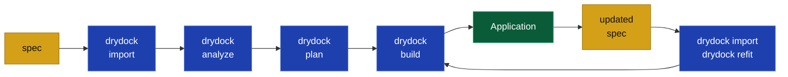
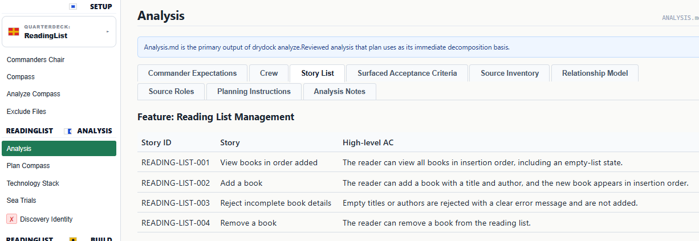
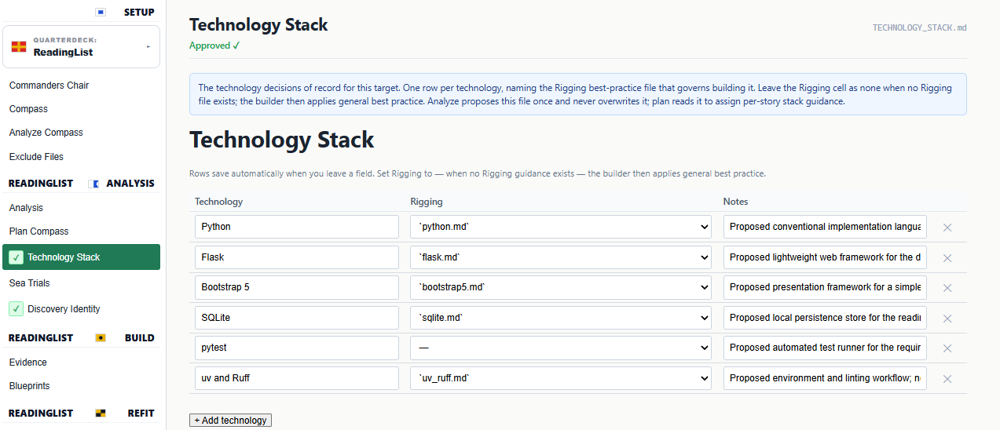
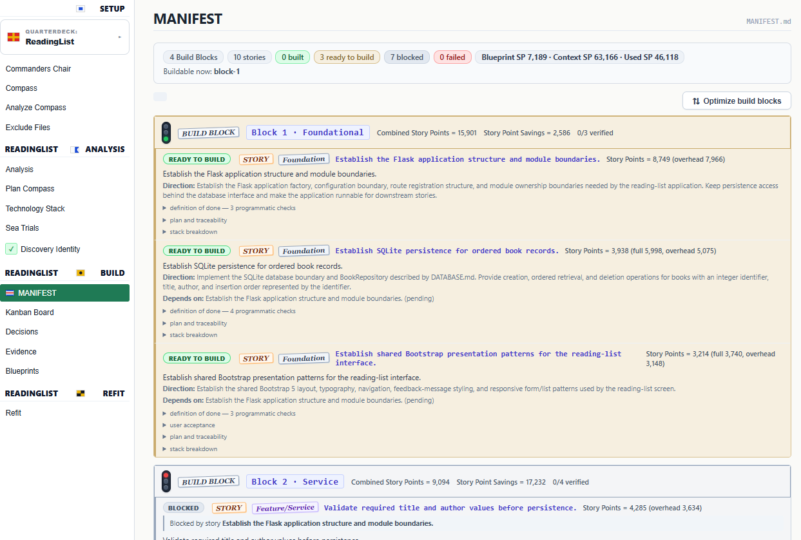
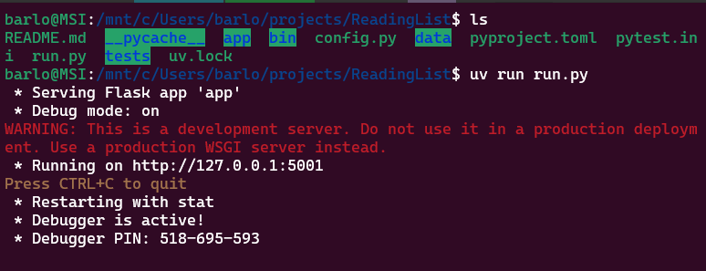
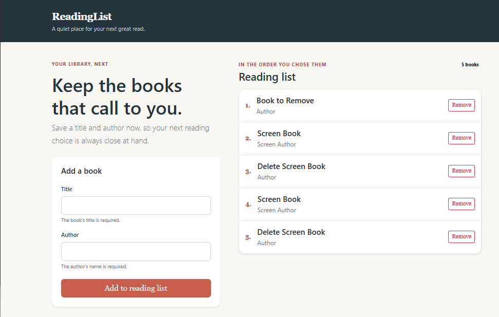
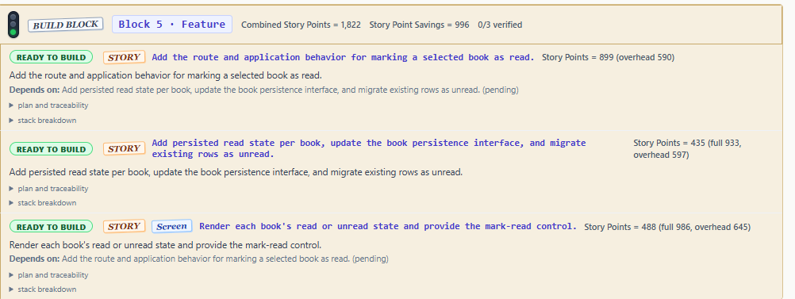
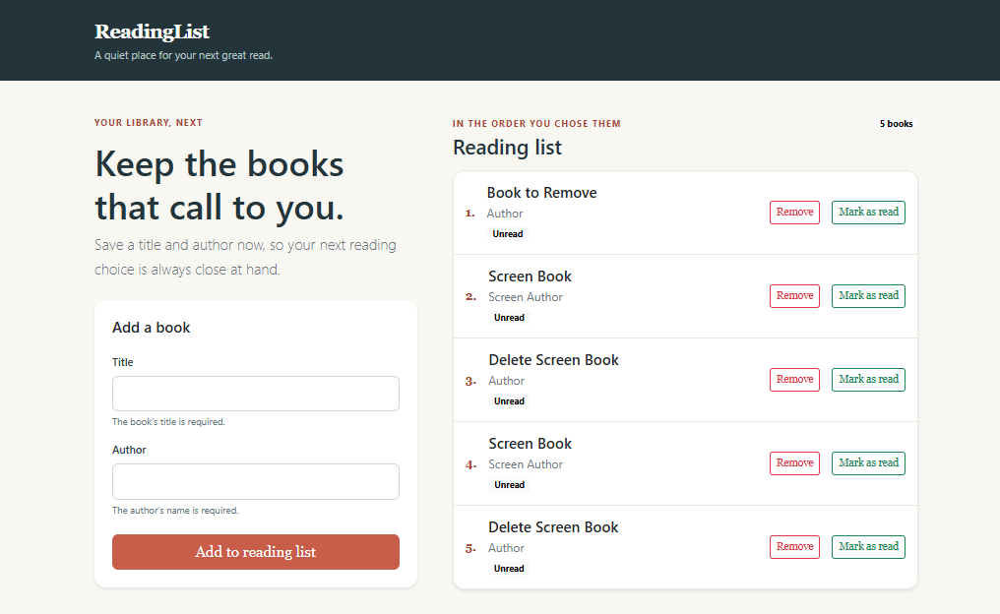

This quick start guide builds a trivial application called ReadingList.



* `import` copies your specification material into a workspace.
* `analyze` decomposes the import/epic into stories.
* `plan` grooms blueprints, ac, and the build graph.
* `build` creates software testing each stp.
* `refit` diffs updated specs into tickets.
* The `quarterdeck` web interface provides control and observability.

## Before you begin

1) Set up the `claude` or `codex` in your `PATH` (subscription API).

2) Install uv (easiest and its so fast.)
```bash
curl -LsSf https://astral.sh/uv/install.sh | sh       # macOS and Linux:
brew install uv                                        # macOS with Homebrew
winget install --id=astral-sh.uv -e                    # Windows with WinGet

# Windows PowerShell:
powershell -ExecutionPolicy ByPass -c "irm https://astral.sh/uv/install.ps1 | iex"
```

3) Install Drydock ([User Installation Guide](USER_INSTALLATION.md)).

```bash
# Recommended — isolated tool install:
uv tool install drydock-sdd

#  Alternative with `pipx`:
pipx install drydock-sdd

# Or if you want to manually setup your path:
python -m pip install drydock-sdd
```

`uv tool` and `pipx` install Drydock in a dedicated environment and put a command wrapper on your `PATH`; they are the right choice for an interactive CLI. `pip` installs Drydock into whatever virtual environment is active and requires you to update your `PATH`.

4) Review your setup with

```bash
drydock --version
drydock config show                          # show your configuration
      # drydock config set drydock_workspace <Workspace for the drydock>
      # drydock config set drydock_build_directory <Your application parent directory>
      # drydock is scoped to work only in these directories.
```


## 1. Create Target Workspace

Create <target> workspace in `drydock_workspace/targets/<target>` and build target in `drydock_build_directory/<target>`.


```bash
# project ReadingList workspace in `drydock_workspace/targets/<target>`
# project ReadingList builds to `<drydock_build_directory>/ReadingList`
drydock init ReadingList             # Initialize project workspace
```

## 2. Import Your Specification

Create source specification material in a file (example: `reading-list.md`)

```markdown
# Reading List

Build a web application that keeps a list of books to read.

The reader can add a book with a title and author, view the books in the order added,
and remove a book. An empty title or author is rejected with a clear error message.

The application includes automated tests for each behavior.
```

Import the file you just created:

```bash
drydock import ReadingList ./reading-list.md
drydock score spec ReadingList                    # Optional
```

## 3. Analyze

The analyze command performs an initial analysis of the source material.  Analyze turns the source material into stories, acceptance criteria, questions, and blockers.

```bash
drydock analyze ReadingList
drydock run quarterdeck ReadingList
```

Navigate to the QuarterDeck web server at the default address, http://127.0.0.1:8080. Review the Target, then press `Ctrl+C` in the terminal to stop the server and continue.

QuarterDeck provides the following screens:

* Commander's Chair - Overview of status
* Compass - Your constitution
* Analysis - The stories and input analysis
* Sea Trials - Project acceptance criteria
* Blockers - **If this exists, you must answer**
* Questionnaires - Discovery identity and stack choices

<figure style="margin: 1.5rem auto; text-align: center;">
  
  <figcaption><em>The Commander's Chair summarizes the analyzed stories, questionnaires, and blockers.</em></figcaption>
</figure>

<figure style="margin: 1.5rem auto; text-align: center;">
  
  <figcaption><em>The Analysis page shows the stories and high-level acceptance criteria created from the source material.</em></figcaption>
</figure>

<figure style="margin: 1.5rem auto; text-align: center;">
  
  <figcaption><em>Review and approve the proposed technology stack in QuarterDeck before planning the build.</em></figcaption>
</figure>

## 4. Plan

```bash
drydock plan ReadingList      # Create the Blueprint and Manifest.
```

The plan or Agile Decomposition stage creates **Blueprint** files which are buildable specifications and the **Manifest** or dependency-aware build plan.  The Blueprints contain test driven development assertions.

```bash
drydock run quarterdeck ReadingList
```

In QuarterDeck you have access to:

* The Manifest or Build Graph
* The Kanban Board
* Decisions - A controllable log of LLM decisions
* Blueprints - Your Blueprints

From QuarterDeck you can see the stages of the build and the details of each stage. Drydock breaks the build into Blocks of similar work: foundational work, persistence work, services, and service consumers such as UI screens.

<figure style="margin: 1.5rem auto; text-align: center;">
  
  <figcaption><em>The Manifest groups related stories into build blocks and shows which work is ready or blocked.</em></figcaption>
</figure>

## 5. Build

```bash
drydock build ReadingList       # Build the app
```

The created application is in `<drydock_build_directory>/ReadingList/`.

Run your project using the project instructions - explicit or set vi the selected technology stack. For ReadingList, run:

```bash
cd <drydock_build_directory>/ReadingList
uv run run.py
```

<figure style="margin: 1.5rem auto; text-align: center;">
  
  <figcaption><em>Follow the generated project instructions to start the application; this example runs it with <code>uv run run.py</code>.</em></figcaption>
</figure>

<figure style="margin: 1.5rem auto; text-align: center;">
  
  <figcaption><em>The generated ReadingList application running after the build.</em></figcaption>
</figure>

## 6. Refit - Changing the Application

Add the following line to `reading-list.md`:

```markdown
The reader can mark a book as read and view whether each book is unread or read.
```

Re-import the source, generate Refit Tickets, and run the incremental build:

```bash
drydock import ReadingList --update  # Re-import your updated specs
drydock refit ReadingList --sources  # Create Refit Tickets, Update the Manifest
drydock build ReadingList            # Incremental Build
```

This is Drydock's development workflow, designed for high-velocity changes to specifications. `drydock refit` uses Git diff to identify source-material changes, maps source changes to Blueprints, and appends work to the build graph, enabling `drydock build` to run normally.

The post-production workflow uses a similar process but treats the internal Blueprints, rather than the user specifications, as canonical. Production change tickets map directly to Blueprints to minimize drift and make replanning mechanical without an LLM.

<figure style="margin: 1.5rem auto; text-align: center;">
  
  <figcaption><em>The updated Manifest with new stories.</em></figcaption>
</figure>

<figure style="margin: 1.5rem auto; text-align: center;">
  
  <figcaption><em>The incrementally rebuilt application lets the reader mark books as read and see their status.</em></figcaption>
</figure>


# Links

* [Project Home Page](https://www.webcloudstudio.com)
* [GitHub](https://github.com/webcloudstudio/Drydock)
* [User Installation Guide](USER_INSTALLATION.md)
* [Drydock Specification](Drydock_Specification.html)

---

Copyright © 2026 Web Cloud Studio.
