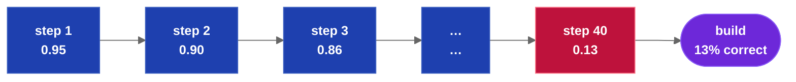

## Abstract

Specification-driven development (SDD) builds software from a written specification by executing
LLM build steps. Two failure modes dominate: error compounds across unverified steps, and model
quality degrades as context grows. This paper applies classical engineering to both. Break the
specification into stories by Agile decomposition. Put executable tests on each story. Relate
the stories, with their prerequisite branding and enterprise stack rules, in a graph database
and let test results gate the graph. Assemble each prompt from delimited specification blocks,
and compress specifications to their contracts to optimize context. Every step is bounded,
every step is verified, and the build repeats: the same specification produces the same working
software. The method also supports change: edited specifications and change tickets enter the
graph, and the correct build context is calculated dynamically.

**Keywords:** specification-driven development, LLM code generation, test-driven development,
Agile decomposition, graph database, prompt stacking, context compression

## 1. The Accuracy Problem

A build is a chain of dependent steps. If each step is correct with probability *p*, the chain
is correct with probability *pⁿ*. At *p* = 0.95, forty steps deliver a correct build less than
13% of the time.


*Unverified error compounds: each step multiplies the survival probability of the build.*

The arithmetic applies to every multi-step form:

- An agent chaining *n* tool calls.
- A pipeline of *n* build prompts.
- One giant prompt. The model still generates the application serially — file after file,
  decision after decision. The steps are internal and invisible, but they are steps, and each
  one can be wrong. Nothing about a single prompt removes the exponent; it only removes the
  ability to verify between steps.

The second failure mode is context growth. A 250,000-token specification fits inside a modern
context window, but fitting is not comprehension. As context grows, measured model behavior
degrades [4]:

- Constraints stated early are missed.
- Similar sections are conflated.
- Material is weighted by position, not relevance.

A step prompted with the full specification starts with a lower *p* than the same step prompted
with only what it needs — before any compounding begins.

Both failure modes yield to classical engineering:

- Break the specification into stories with hard tests, and surface missing information as
  questions instead of guesses.
- Determine prerequisite branding and enterprise stack rules.
- Optimize story grouping for context and quality.
- Build reproducible software.

## 2. Simplification #1: Agile Epic Decomposition

The standard way to break an Epic into stories is Agile. The LLM understands Agile because it
is well documented. The specification is the Epic. Epic → features → stories. Decompose until
each story builds in one bounded step.

Every story specification ends with four sections:

| Section | Contents |
|---|---|
| Programmatic Acceptance | Executable assertions that define done (§3) |
| User Acceptance | Checks only a human can honestly judge |
| Guardrails | What the software must never do |
| Open Questions | Missing information, returned to the product owner |

A story that cannot be given Programmatic Acceptance is not yet a story; decompose further.

Open Questions is the feedback channel. Decomposition exposes what the specification does not
say; those gaps are written as questions and answered by a human before the story builds. The
mechanism for collecting answers varies and is not specified here. Ambiguity is resolved by a
person, never guessed by the model.

## 3. Simplification #2: Test-Driven Development for Story Quality

Test-driven development supplies the per-story discipline: write the test before the code; the
test suite — not the author — decides when the work is done.

- Programmatic Acceptance is written at decomposition time, as Pythonic, executable assertions:
  concrete checks against files, routes, return values, and observable behavior.
- Prose criteria ("the import should work correctly") are not acceptance. An assertion that
  cannot execute cannot gate a build.
- The assertions enter the build prompt as the step's success condition. The task changes from
  interpreting an instruction to satisfying declared assertions.
- After the step, the test suite runs outside the model. The model is never asked whether it
  finished; the suite passes or the story fails.


*Each story builds, then its test suite executes. Failure loops back; a verified story unlocks
the next.*

## 4. Relating Features and Stories in a Graph Database

Stories are not a list; they are a graph. Features and stories are nodes; dependencies are
edges; the graph is stored as plain text alongside the specification.

The graph also carries the build's prerequisites. Branding files (palette, typography, document
standards) and enterprise stack rules (language, framework, and platform conventions) are
determined up front and related to the stories that need them. These are the rules a
reproducible build requires: without them, two builds of the same specification diverge on
every convention the specification does not state.

The graph does four jobs:

1. **Ordering.** The runnable frontier — stories whose dependencies have all passed — is
   computable by inspection. Build order is a property of the data.
2. **Gating.** A story runs only when its dependencies have verified. A failed story blocks its
   dependents; the defect is caught where it was created and repaired locally.
3. **Containment.** With a test suite at every edge, no unverified chain exceeds length one.
   The §1 arithmetic collapses from *pⁿ* to *p* per step.
4. **Enabling build optimization.** The graph carries the token estimates and shared-context
   relationships that make the optimizations of §7 computable.

## 5. How to Assemble a Stack of Prompts

A build prompt is assembled, not written. Each step stacks the exact files the graph relates to
it — story specifications, branding, and stack rules — each wrapped in a unique delimiter
naming the file and its role. The delimiters make each block unambiguous to the LLM.

```xml
<header explaining layout>

<unique_delimiter filename="FEATURE-Import.md" role="implements">
  ...specification content...
</unique_delimiter>

<unique_delimiter filename="python.md" role="stack">
  ...stack rules...
</unique_delimiter>

<prompt instructions>
```

## 6. Compression: Optimizing Context

Many stories do not need the full version of their prerequisites. For example, a user interface
screen needs only a summary of the web routes it calls — not the schemas, migrations, and design
rationale behind them.

This is the Builder/User distinction. The builder of a feature needs its full specification.
Users of the feature need only the contract: routes, class names, method signatures, typed
parameters, one-line summaries. Each specification file gains a compact derivative containing
only that contract; the builder stacks the full file, every user stacks the derivative.

Compression attacks both §1 failure modes: context per step falls, and what remains is exactly
what the step consumes.

## 7. Optimization: Repeatable Quality Builds

The pieces compose:

| Piece | Contribution |
|---|---|
| Decomposition (§2) | Every step is small enough to be accurate |
| Test suites (§3) | Every step proves itself before anything depends on it |
| Graph (§4) | Order is computed; errors are contained at edges |
| Stack assembly (§5) | Every prompt is a deterministic function of declared files |
| Compression (§6) | Every prompt carries contracts, not bulk |

The graph makes this optimizable algorithmically. Example: 30 stories, each prompt 20,000
tokens, half of it shared stack rules and architecture. Built one at a time, the shared
material is injected 30 times: 600,000 tokens total. Group the stories three per step and the
shared material is injected 10 times: 400,000 tokens — a third of the build cost removed by
regrouping alone. The grouping is computed from the graph's token estimates and shared-context
edges, tuned for both cost and build quality.

The method supports change. An edited specification or a change ticket enters the graph,
invalidates only the stories that depend on it, and the correct build context for the rework is
calculated dynamically. The rebuild is the affected subgraph, not the application.

Repeatability is the sum. The specification, the graph, the test suites, and the assembly rules
determine every prompt and every acceptance decision. The same inputs produce the same verified
software.

Drydock [1] is the reference implementation of this method.

## 8. Conclusion

This is classical engineering applied to a new build tool:

- Break the specification into stories small enough to be accurate.
- Put an executable test suite on every story.
- Determine prerequisite branding and enterprise stack rules.
- Relate stories, features, and rules in a graph and let the test suites gate it.
- Optimize story grouping for context and quality; compress what is merely consumed.
- Surface what is missing as questions for a human.
- Build reproducible software.

Error stops compounding, context stops confusing, and the build repeats.

## References

[1] E. Barlow. *Drydock Specification: Agile Specification-Driven Design — The SAIL Methodology
for Governed Software Delivery.* Web Cloud Studio, 2026.
https://github.com/webcloudstudio/Drydock

[2] K. Beck et al. *Manifesto for Agile Software Development.* 2001. https://agilemanifesto.org

[3] K. Beck. *Test-Driven Development: By Example.* Addison-Wesley, 2002.

[4] N. F. Liu, K. Lin, J. Hewitt, A. Paranjape, M. Bevilacqua, F. Petroni, and P. Liang. "Lost
in the Middle: How Language Models Use Long Contexts." *Transactions of the Association for
Computational Linguistics*, 12:157–173, 2024.
