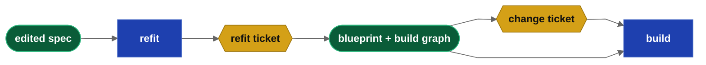

## Abstract

In specification-driven development the specification is the source of truth and the product is generated from it.

This paper investigates best process for modifying enterprise applications built from specifications. There are two business needs.

**Production Workflow:** stable or production enterprise applications require a change tickets approved through the normal business process.  A Buildable change ticket must contains specific, incremental change instructions required for delivery.

**Development Workflow:** Applications in development need a different workflow.  The process should enable the developer to iterate delivered code quickly and at high velocity. Development changes are smaller, more frequent, and must be delivered quickly so the developer can ensure the application conforms to their vision.

In both processes, a major goal is to avoid a full rebuild of the software.  Full rebuilds are non-deterministic so they are both expensive in tokens and require a full test cycle.  A valid design has to optimize for both developer experience and token usage and minimize the blast radius of changes.

**Keywords:** specification-driven development, change tickets, dependency graph, contracts, incremental build, blueprints, git

## Problem Statement

A generalized delivery system for specifications should follow this standard process or delivery pipeline.  An `import` stage imports specifications into a workspace.  An `analyze` stage decomposes the input specifications into buildable steps (stories).  A `plan` stage (grooming) converts stories into buildable specifications (blueprints) and a build graph (database) used as a build plan.  A `build` stage creates the working software.

During project development, the Developers will naturally feel comfortable editing the input specifications they provided the LLM to build.  These input specifications can be in any form and include markdown, images, test scripts and data.  The sepeification builder must handle these inputs in a governed pipeline.  The major benefit of this approach is that, in development, the original specifications are the source of truth and you can always rebuild the application from scratch.

This process will change when the application becomes stable or goes into production.  Building software from specifications (words, notes) is non-deterministic.  Your next build may not resemble your last. State becomes impossible to track. Once
the project moves to production it needs a more rigerous governance framework that ensures the application can be changed correctly and with a minimal impact.

## 1. In Development, Your Specifications are the Source of Truth

The user writes the specification in whatever format the build system can digest — images, markdown, test kits. The format doesn't matter.

The user changes these files to reflect what they want in the next build.

The user will adjust these input specifications until the application passes their usage tests and meets their vision or definition of done.

## 2. Import Your Specifications

It is recommended that the build system copies the user specifications into a workspace.  An import stage defines a clean release boundary: on import, the system commits the import to git and records file checksums and commit ids for later use.  This
implies that the pipeline workspace uses source code control (git) so "what has changed" can be detected trivially with `git diff`.

The import process should record the relationship between user specifications and downstream artifacts like the typed specifications (blueprints) used for the build process.  In drydock, blueprints are agile stories and represent implementations of services, UI screens, foundational setup, and application features.  Blueprints are the buildable version of the input specifications.  They are the nodes of a graph database used to manage the build.

The process should also mechanically record your 'release' by recording release identifier/tag.

The process to import should re-copy all input specifications (other than constitution files).  Constitution files changes impact all build artifacts and necessitate a full system re analysis and build.

## 3. Refit Tickets

Once changed specifications are imported, the system should generate a set of changes to application services (such as routes), service consumers (such screens, pipelines...) and to application features.

A Story or Blueprint is the atomic level of a build and represents these services, service users, or features.  Story/Blueprints can also represent foundational work such as scaffolding, UI framing, and the Persistence/Database layer. Changes to foundational stories have a large blast radius and need separate treatment.

Because we stored the relationship of the imported specifications to the build artifact, we can create refit ticket as change-set stories attached to existing blueprints. After we add explicit ordering, we have a formatted as a list of buildable changes — stored as additions and deletions and tied to a specific blueprint/story.  These refit tickets state what changed and what must now be true in a form an LLM can build.

The use of Refit tickets has has a major benefit in that the build graph only grows by appending nodes. Existing nodes (blueprints) are frozen, so their state is known and there is no complexity to determining what changed.
Because Graph database nodes inherit their parent's attributes, every refit ticket has a known place in the implementation graph, and is therefore buildable.

## 4. Foundational Changes - the Contract

Foundational changes - such as adjusting the Blueprints that create the servers, persistence layer, and user interface have a large impact and if poorly handled will necessitate a full rebuild.

A minor change (example: a column changing from null to not null) can imply a full rebuild.

Our goal is to ensure that foundation edit only force a rebuild if needed. Renaming a config value, adding an index, raising a timeout, changing a log level are minor and limited to the service builder.

The reveal here is that downstream objects only need to be rebuild if the change impacts the contract provided by the object.  A contract defines 'how consumers use the service' not 'how do I build the service'.
These are two different items.  Changes to the contract DO require all downstream objects to be rebuilt as they might invalidate all objects that use the foundational service.  This can not be fixed with tickets as the service has a large blast area.

Determining the contract for foundational specifications needs to be done by the LLM and that may not be byte exact between runs.  A simple solution to this problem is to treat foundational stories as frozen, use change or refit tickets, and to have the build process notify the user of these changes but not to have it not gate on the change.  These changes should require that the user understand the impact and the system should enable the user to defer downstream rebuilds or require a full build.  The user can identify which of these situations exist much more easily than can the llm.

## 5. Service / Feature / Object Addition and Deletion

Detected additions or modifications of services require no process changes (unless the service contract changes).

Deletions are not, however, local. Deleting a web route or service will break dependencies such as ui screens that use that rout.  The build graph should understand the impact of these changes by nature, and if it detects a deletion request that is is consumed by other stories - and the build node must be blocked pending human approval.  That delete will break something.  The user should update the specification to not use the deleted service before proceeding because the build is broken if it proceeds.

## 6. Production Cutover implies a new Source of Truth

Before the application is cut to production, there is great user benefit for the specification to be the source of truth.
These are user authored and by definition the user should feel more comfortable editing their own documents.

These documents are input into the build process and are not production build artifacts.  Developers will change these specifications often and frequently while the proejct is in development. This enables developer velocity.

After the application is released, that argument fails.  The actual build artifacts - the blueprints and build graph must become the new source of truth.  They represent how the existing production application was built. If the
system is to be incrementally changed after it is defiened as "stable", the source of truth must change to be these build artifacts which will be similar to the input specifications but will be defined one feature/service/screen per file and
will contain associated status and needed build information.

The velocity of system changes decreases when the application goes live.  At that point the build artifacts must become the source of truth - because that is what they are.  In production, the user will need to follow their normal enterprise
approval and change workflows.  In production, the blueprints are considered frozen, and change tickets must be provided for incremental work -- the blueprints should not be modified.  Given a solid feature naming convention you should easily
be able to view the complete specification for the story (because it is a story) and modify that story using enterprise change processes.

## 7. Failure Modes

If processing fails for any reason during this process, current work tree and database must be reverted. The system works on differences within the specifications and maps them to blueprints.  If the process to do this fails the system
can become out of order.  Because we import specifications into a git enabled workspace, this is a simple git revert to a known commit id.

## Summary

A graph database is required to build working software from specifications.  The nodes of the graph are the buildable stories or features.  The edges of the graph are the relationships and ordering information for the build.

New nodes (stories, change tickets) can infer their relationships and build order from existing nodes because they are by definition inserted as child nodes.  Their edge information (dependencies, depends on) can be copyied from the parent node.
That usage implies that blueprints be frozen and not change.  This maintains state of the build plan/graph and limits the changes required to build accurate working software that includes the changes.

Story nodes can be appended to the build graph if they have some form of ordering.  The most simple approach is to simply number your change tickets. Simply numbering the filenames of your tickets enables author intent to be reproduced consistently.

The source of truth should be the author's original specification until the code goes live or is deemed stable.  After the application enters production, the system will not normally be rebuilt from scratch so it is recommended that you
redefine the source of truth to be the conformed buildable stories that each contain one application services or service consumers or feature.  These files are marked as frozen and changed using normal tickets from your enterprise systems.
This redefinition of the source of truth to be the 'blueprints' (decomposed/groomed versions of your originial specifications) should be the new source of truth because they define exactly how the system was built, and the original specification no longer exactly matches the build.  This key redefinition enables your production system to be rebuilt from scratch with minimal drift.

A graph database is considered mandatory for build processing of larger systems - it enables rebuild and ongoing software modification because graph edges are inherited by each node's related nodes.

## References

[1] E. Barlow. *Managing Changes in Specification-Driven Development.* Web Cloud Studio, 2026.

[2] E. Barlow. *Drydock Specification: Agile Specification-Driven Design — The SAIL Methodology for Governed Software Delivery.* Web Cloud Studio, 2026.
https://github.com/webcloudstudio/Drydock
