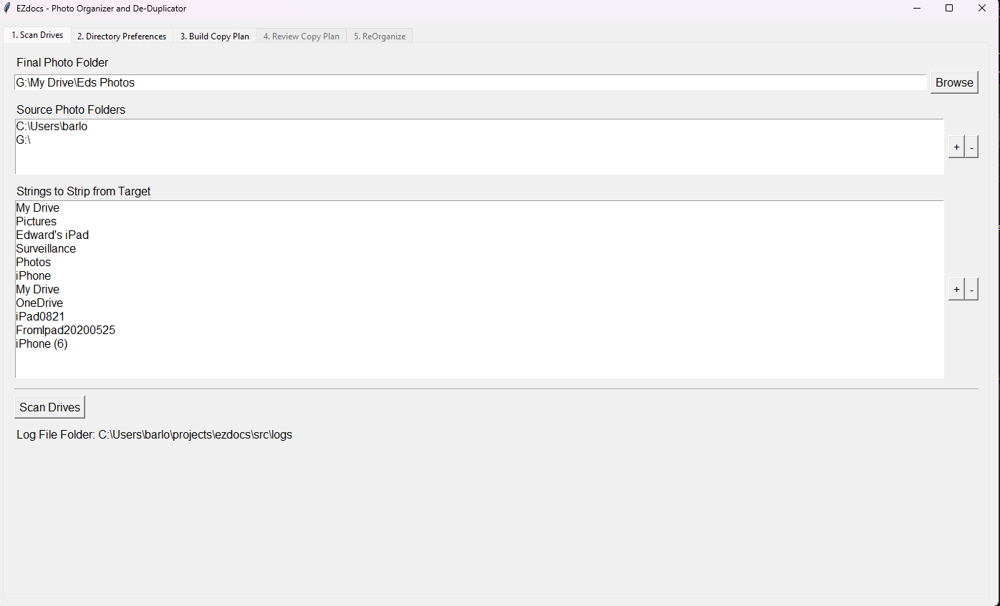
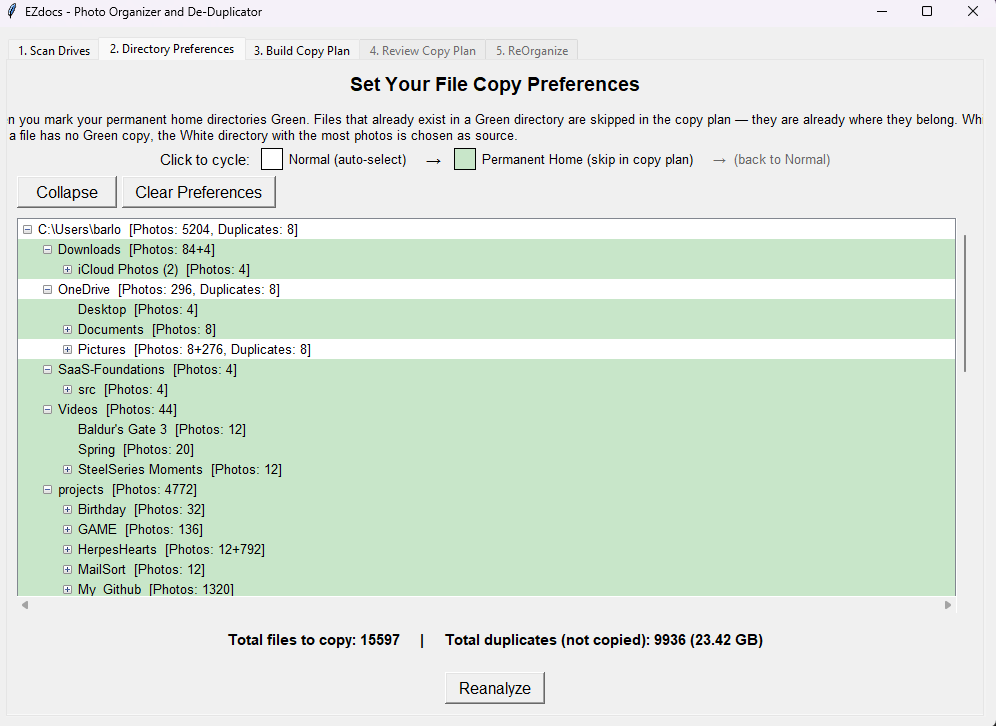
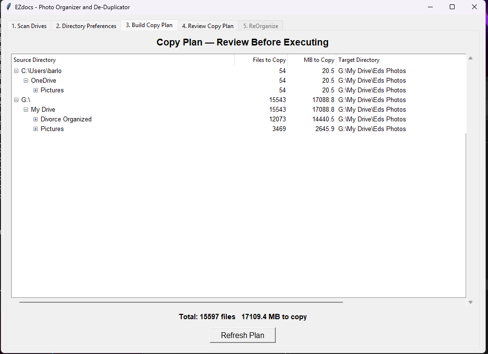
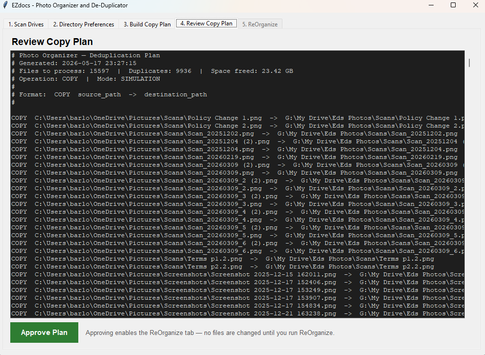
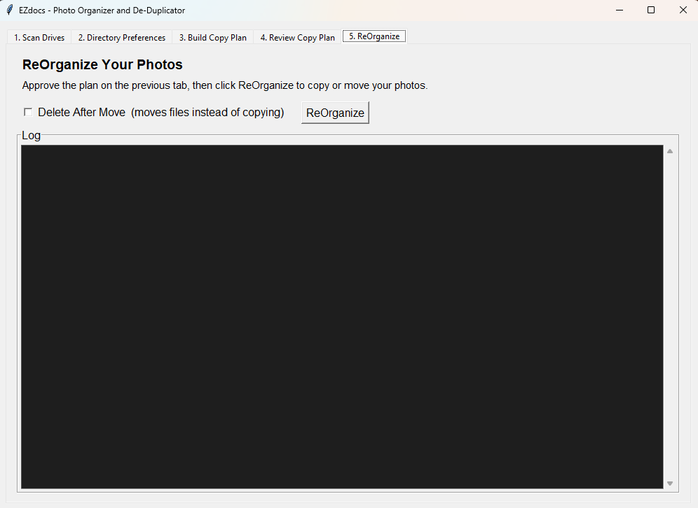

# Photo Organizer/Deduplicator — Features

## The Scan Tab

Triggered by clicking **Scan** in the Tkinter GUI (or running `./bin/photo_scan.sh`). Reads `source_photo_folders` from `config.ini`, recursively walks every folder in a background thread, and builds an in-memory index of all files keyed by `filesignature` (stripped filename + file size). Writes `data/scan_data.pkl` and `data/scan_summary.txt`; updates the GUI with a live directory counter and elapsed time.

## The Preferences / Analyze Tab

Triggered by clicking **Analyze** after a successful scan. Loads the scan pickle and applies the preferred-directory ruleset: files already present in a Green (preferred) folder are excluded from the copy plan entirely; for all other duplicates, the source folder with the highest file count is chosen as the copy source. Writes `data/files_to_copy.txt` with one line per operation (COPY, MOVE, ZIP_MOVE, ZIP_DELETE). The Preferences tab also displays the current `directory_states.txt` so users can toggle folders between Normal and Preferred before re-running.

## The Review Copy Plan Tab

Displays the full contents of `data/files_to_copy.txt` in a scrollable text widget so the user can inspect every planned operation before committing. An **Approve** button gates the ReOrganize step — the final operation cannot run until the plan is explicitly approved here.

## The ReOrganize Tab

Triggered by clicking **ReOrganize** after plan approval. Executes the copy/move operations from `files_to_copy.txt` in a background thread with a live log viewer. Requires `change_source_directory = True` in `config.ini` for live mode; in simulation mode it logs all planned operations without touching any files. Collision handling appends `-2`, `-3` suffixes to filenames when the destination already exists.

## CLI: Photo Scan (`./bin/photo_scan.sh`)

Headless equivalent of the Scan tab. Invokes `src/cli_scan.py` with the project directory as argument; reads `config.ini`, scans all `source_photo_folders`, and writes `data/scan_data.pkl` and `data/scan_summary.txt`. Path translation is automatic — Windows-style paths in `config.ini` are converted to WSL mountpoints when running under Linux.

## CLI: Photo Analyze (`./bin/photo_analyze.sh`)

Headless equivalent of the Analyze tab. Invokes `src/cli_analyze.py`; requires `data/scan_data.pkl` from the scan step. Reads `data/directory_states.txt` for preferred-directory preferences (created automatically on first run; edit to set priorities). Writes `data/files_to_copy.txt`.

## CLI: Photo Dedup (`./bin/photo_dedup.sh`)

Headless execute step. Invokes `src/cli_dedup.py` in dry-run mode by default — prints every COPY/MOVE/ZIP operation without touching files. Pass `--live` to execute; `config.ini` must also have `change_source_directory = True` (double-gating prevents accidental runs).

## Duplicate Detection: Timestamp-Aware Signature

The scanner strips `YYYYMMDD.HHMMSS.` prefixes from filenames before computing the duplicate signature (`stripped_name + "~|~" + file_size`). This ensures photos renamed by camera apps, phone sync tools, or cloud services still match their original copies, dramatically reducing missed duplicates compared to exact-filename matching.

## ZIP Archive Handling

During scanning, the engine inspects ZIP files found in source folders. Archives containing only photo files are added to the plan as ZIP_MOVE or ZIP_DELETE operations. Archives containing a mix of photo and non-photo files are skipped with a logged warning and listed in `skipped_mixed_zips` so they can be reviewed manually.

## Build: Windows EXE (`./bin/build.sh`)

Packages the application as a self-contained `WcsPhotoOrganizer.exe` using PyInstaller (must run Windows Python — WSL Python produces a Linux ELF). Optionally invokes Inno Setup to produce a versioned installer (`WcsPhotoOrganizer_v1.0.0_Setup.exe`) with Start Menu and Desktop shortcuts, license agreement, and a proper uninstaller.

## Safety Features

- **Simulation mode** — default; no files modified, all operations logged to `logs/`
- **Skip existing** — never overwrites a file that already exists at the destination; appends `-2`, `-3` suffixes instead
- **System directory exclusion** — auto-skips Windows system paths during scan
- **Confirmation dialogs** — GUI prompts before major operations (Analyze, ReOrganize)
- **Double-gate for live mode** — both `--live` flag (CLI) and `change_source_directory = True` in `config.ini` must be set before any files are touched
- **Full logging** — every file operation recorded to `logs/`
