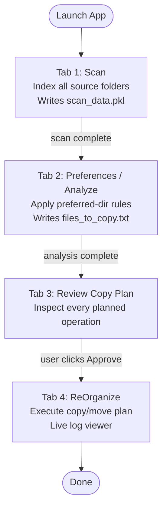
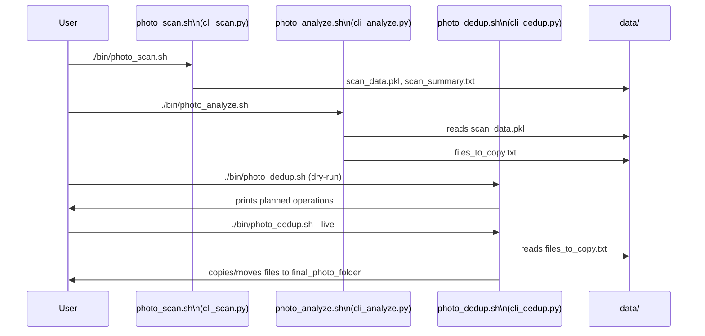
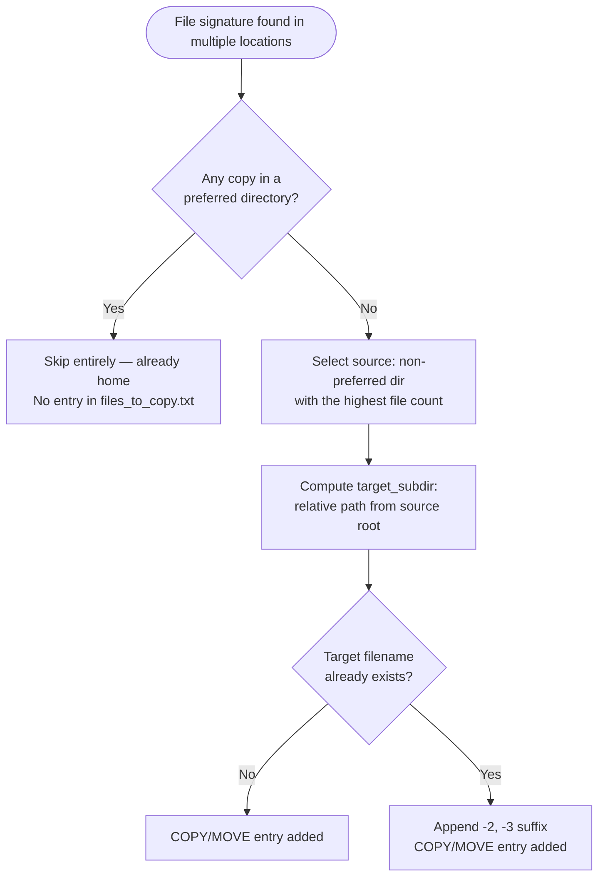

# Photo Organizer/Deduplicator — Flows

## GUI Workflow: Scan → Analyze → Review → ReOrganize

The GUI implements a linear 4-step state machine. Each step must complete successfully before the next button is enabled.

**Trigger:** User launches `WcsPhotoOrganizer.exe` (or `./bin/start.sh`) and clicks through each tab in sequence.

**Reads:** `config.ini` (folder paths, behavior flags), `data/directory_states.txt` (preferred-directory overrides)
**Writes:** `data/scan_data.pkl`, `data/scan_summary.txt`, `data/files_to_copy.txt`; optionally moves/copies files to `final_photo_folder`

Each step runs in a background thread; the GUI remains responsive and displays a live progress counter. State flags (`scan_completed`, `analysis_completed`, `plan_approved`) control which buttons are active.

---

## CLI Pipeline: photo_scan → photo_analyze → photo_dedup

The headless pipeline mirrors the GUI workflow exactly and is designed for WSL or automation use. All three steps share the same `data/` directory as the hand-off point.

**Trigger:** Manual invocation or shell script chaining.

**Reads:** `config.ini`, `data/directory_states.txt`
**Writes:** `data/scan_data.pkl` → `data/files_to_copy.txt` → (live mode) files copied/moved to `final_photo_folder`

`photo_dedup.sh` defaults to dry-run: it prints every operation without touching files. Passing `--live` executes the plan, but only if `config.ini` also has `change_source_directory = True` (double-gating).

---

## Duplicate Resolution Flow

For each unique file signature (`stripped_filename + "~|~" + size`) found in multiple locations, the scanner applies this decision tree to decide what goes into the copy plan:

