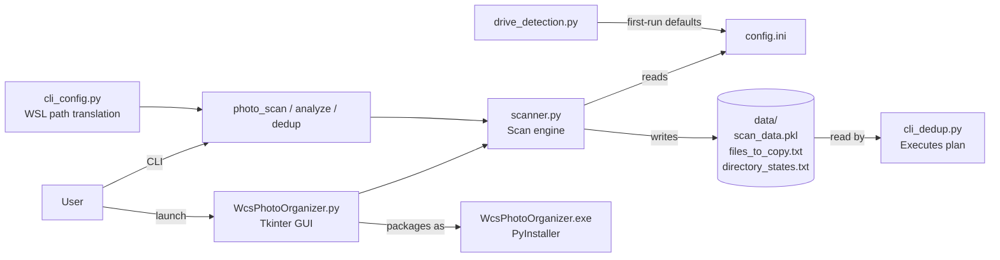

# Photo Organizer/Deduplicator — Overview

## What It Is

Photo Organizer/Deduplicator is a Windows desktop application that solves the chronic problem of scattered, duplicate photos spread across multiple drives, phones, and folders. It scans every source folder you specify, identifies duplicate photos using a filename+size signature (robust enough to catch files renamed with timestamp prefixes), and produces a precise copy plan that consolidates everything into a single Final Photo Folder — all without touching a single file until you explicitly approve the operation. A full simulation mode runs by default, so you can review exactly what will happen before committing.

## What It Can Do

- **Scan multiple drives simultaneously** — accepts any number of source folders (local drives, external drives, mapped network paths) and indexes them in a background thread with live progress reporting
- **Detect duplicates intelligently** — strips `YYYYMMDD.HHMMSS.` timestamp prefixes before comparing, so photos renamed by camera apps, phones, or cloud sync still match their originals
- **Respect preferred directories** — mark any folder as "Green" (permanent home); files already in a preferred folder are skipped entirely from the copy plan, preventing double-imports
- **Generate a reviewable copy plan** — writes `data/files_to_copy.txt` with every COPY, MOVE, and ZIP_DELETE operation before executing anything; the GUI shows the plan on a dedicated Review tab
- **Handle ZIP archives** — detects photo-only zip files and plans them for MOVE or DELETE; skips mixed-content zips with a logged warning
- **Run headless via CLI** — three-stage pipeline (`photo_scan.sh` → `photo_analyze.sh` → `photo_dedup.sh`) enables automation and WSL workflows without launching the GUI
- **Package as a standalone Windows EXE** — ships via PyInstaller + Inno Setup; installs with Start Menu and Desktop shortcuts, no Python required on the target machine
- **Translate Windows paths automatically** — CLI layer converts `C:\Users\foo` to `/mnt/c/Users/foo` when running under WSL

## Quick Start

| Command | Description |
|---------|-------------|
| `./bin/start.sh` | Launch the GUI |
| `python3 src/WcsPhotoOrganizer.py` | Run GUI directly |
| `./bin/photo_scan.sh` | CLI: scan source folders, write `data/scan_data.pkl` |
| `./bin/photo_analyze.sh` | CLI: analyze duplicates, write `data/files_to_copy.txt` |
| `./bin/photo_dedup.sh` | CLI: dry-run dedup (preview only) |
| `./bin/photo_dedup.sh --live` | CLI: execute copy/move operations |
| `./bin/build.sh` | Build Windows EXE via PyInstaller |
| `./bin/build_documentation.sh` | Generate `docs/index.html` |

## Architecture Overview

## Vision

Photo Organizer/Deduplicator is on the path to a v1.0 production release — build, installer, and branding are complete, and the roadmap targets code signing for SmartScreen-free distribution on Windows 10 and 11. Longer-term, direct iPhone integration via `pymobiledevice3` will let the app scan phone photo libraries over USB or Wi-Fi without requiring a manual file copy first, making it the single tool for anyone consolidating a lifetime of photos from phones, cameras, and cloud backups.
