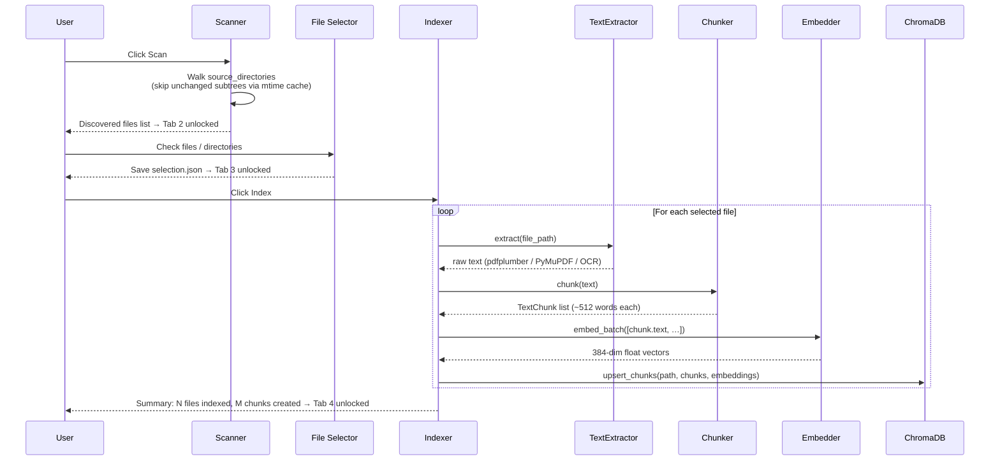
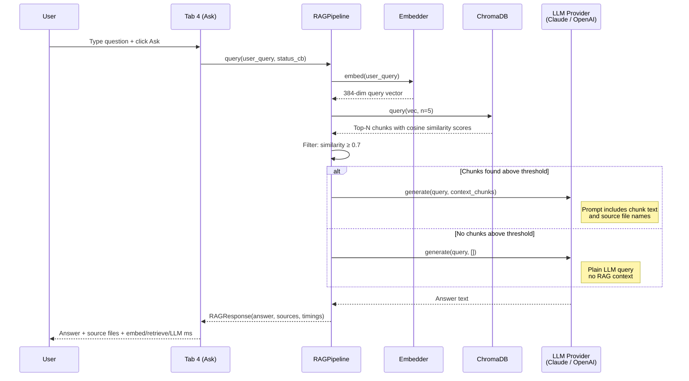

# MyRAG — Flows

## Indexing Flow (Tabs 1–3)

**Trigger:** User launches the app, scans directories, selects files, then clicks Index.

**Reads:** PDF/TXT files from configured source directories.
**Writes:** `data/scan_index.json`, `data/selection.json`, `data/index_manifest.json`, `data/chroma/`.

The indexing path is the one-time (or incremental) pipeline that builds the searchable knowledge base. Scanning is incremental — directory mtimes are compared against `scan_index.json` to skip unchanged subtrees, so rescanning a large library after adding a few files takes seconds. Indexing is also incremental — `index_manifest.json` fingerprints (size + mtime) ensure only new or modified files are re-embedded.

## Query Flow (Tab 4)

**Trigger:** User types a question and presses Enter or clicks Ask.

**Reads:** ChromaDB vector collection.
**Writes:** Nothing — read-only at query time.

The query path runs entirely in a background thread so the UI stays responsive. The pipeline embeds the question, retrieves the top-5 most similar chunks by cosine distance, filters by the similarity threshold (default 0.7), and injects any passing chunks into the LLM prompt. If no chunks pass the threshold, the LLM is called without injected context (plain fallback). The response is displayed alongside per-step timing and source file attribution.

## OCR Sub-flow

**Trigger:** Automatically during indexing when a PDF yields no extractable text.

**Reads:** PDF file (image-based pages).
**Writes:** Extracted text fed back into the normal chunk → embed → store pipeline.

When pdfplumber and PyMuPDF both return empty text for a PDF, the extractor rasterises each page at 200 DPI using PyMuPDF and passes the image to Tesseract OCR. Pages producing fewer than 20 characters are logged as picture/blank pages but don't block the rest. OCR progress (page number, elapsed time, character count) is logged per-page so long scans remain observable.
