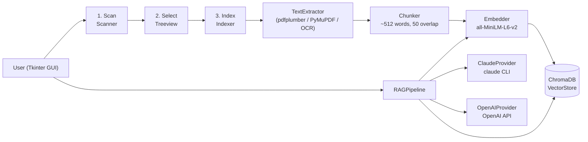

# MyRAG — Overview

## What It Is

MyRAG is a local Retrieval-Augmented Generation desktop application that puts your entire PDF library at the fingertips of an AI. It scans your directories, extracts and chunks document text, embeds every chunk using a local sentence-transformer model, and stores the results in a persistent ChromaDB vector database — all on-device with no data leaving your machine. When you ask a question, MyRAG retrieves the most relevant passages by cosine similarity and injects them directly into your Claude or OpenAI prompt, producing answers grounded in your own documents with full source attribution.

## What It Can Do

- **Incremental directory scanning** — walks configured source directories using mtime caching to skip unchanged subtrees, making repeat scans near-instant on large document libraries.
- **Selective file indexing** — a tree-view UI lets you pick exactly which files and folders to embed; selection is persisted across sessions.
- **Local CPU embeddings** — generates 384-dimensional vectors with `sentence-transformers all-MiniLM-L6-v2` entirely on-device; no embedding API costs.
- **Persistent vector search** — ChromaDB stores chunk embeddings with cosine-similarity search, surviving restarts and supporting idempotent upserts.
- **OCR fallback for scanned PDFs** — automatically detects image-only PDFs and runs Tesseract OCR page-by-page when normal text extraction yields nothing.
- **Dual LLM support** — answers via Claude (using the `claude -p` CLI, no SDK tokens) or OpenAI (via API key); switchable per-query from the UI.
- **Contextual fallback** — when no chunks pass the similarity threshold, the LLM is queried directly rather than fabricating sources.
- **Per-query timing telemetry** — the Ask tab displays embed, retrieve, and LLM latencies separately so bottlenecks are immediately visible.

## Quick Start

| Command (WSL/Linux) | Command (Windows) | Description |
|---------------------|-------------------|-------------|
| `uv sync` | `uv sync` | Install all dependencies |
| `cp config.ini.sample config.ini` | `copy config.ini.sample config.ini` | Create config from template |
| `./bin/start.sh` | `bin\start.bat` | Launch the GUI |
| `./bin/reset_index.sh` | `bin\reset_index.bat` | Wipe ChromaDB and scan index |
| `./bin/inspect_chunks.sh` | `bin\inspect_chunks.bat` | Search raw indexed chunks by keyword |
| `./bin/test.sh` | — | Run test suite |

## Architecture Overview

## Vision

MyRAG is a working prototype for fully local, zero-cloud-cost document intelligence. The natural next step is expanding beyond PDFs to support `.txt`, `.docx`, and EPUB formats while adding a conversational history so follow-up questions carry context from prior turns — making it a genuine research assistant for any personal document archive.
